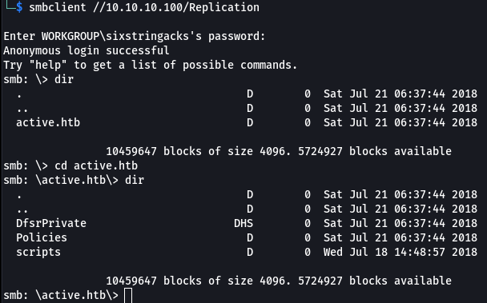
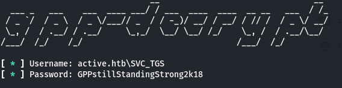
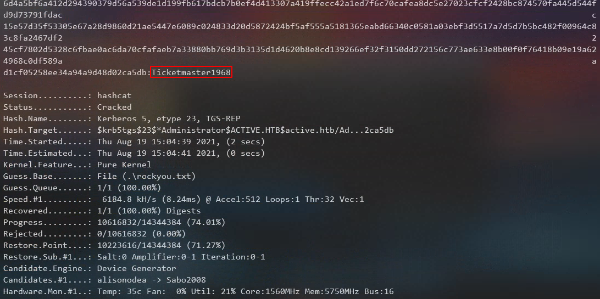
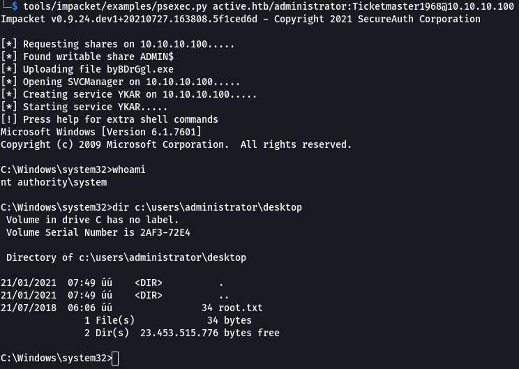

## Overview

Active is a Windows Server 2008 R2 box that allowed anonymous access to a copy of the SYSVOL folder that was storing a Group Policy Preferences (GPP) file. The GPP file contained a password for the SVC_TGS service account which could be decrypted due to the decryption key being disclosed by Microsoft. The SVC_TGS account was used to authenticate to the domain and kerberoast the Administrator account.

## Enumeration

**Software**

* Windows Server 2008 R2

**Open Ports**

```
nmap -vv --reason -Pn -sT -A --osscan-guess -p- -oN results/10.10.10.100/scans/_full_tcp_nmap.txt
```

* 88/tcp  kerberos
* 135/tcp Windows RPC
* 139/tcp Netbios
* 389/tcp Microsoft Windows Active Directory LDAP 
* 464/tcp kpasswd5?
* 593/tcp Windows RPC over HTTP 1.0
* 636/tcp LDAP/s
* 3268/tcp Microsoft Windows Active Directory LDAP 
* 3269/tcp Microsoft Windows Active Directory LDAP/s
* 5722/tcp Windows RPC
* 9389/tcp .NET Message Framing
* 49152-58/tcp Windows RPC
* 49169/tcp Windows RPC

**SMB**

```
smbmap -H 10.10.10.100
```


## Steps (User)

The nmap scan showed a number of different ports available indicating it was likely a domain controller. I started with smb and after running smbmap it showed that the Replication share was accessible anonmyously.  I used smbclient to browse the replication folder.

```
smbclient //10.10.10.100/Replication 
```



This folder looked very SYSVOL-esque. To more easily browse the contents I downloaded everything to a local working directory.  FIrst I had to enable recursion and turn prompts off.

```
mask ""
recurse ON
prompt OFF
cd 'path\to\backups'
lcd '/path/to/local/folder'
mget *
```

I came across a file called Groups.xml, which are used by Group Policy Preferences, that contained an encrypted password for account SVC_TGS. 

> "[Group Policy Preferences](https://docs.microsoft.com/en-us/previous-versions/windows/it-pro/windows-server-2012-r2-and-2012/dn581922(v=ws.11)) is a collection of Group Policy client-side extensions that deliver preference settings to domain-joined computers running Microsoft Windows desktop and server operating systems." 

These settings are stored as an XML in the SYSVOL (or in this case the Replication) folder. I remember hearing about this and how the decryption key was stored one of Microsoft's own [sites](https://docs.microsoft.com/en-us/openspecs/windows_protocols/ms-gppref/2c15cbf0-f086-4c74-8b70-1f2fa45dd4be?redirectedfrom=MSDN).


I did a search and found a tool called [GPP-Decrypt](https://github.com/t0thkr1s/gpp-decrypt.git) that decrypts GPP files. It worked as advertised and provided the decrypted password. active.htb/SVC_TGS:GPPstillStandingStrong2k18

```
gpp-decrypt/gpp-decrypt.py -f active.htb/Policies/\{31B2F340-016D-11D2-945F-00C04FB984F9\}/MACHINE/Preferences/Groups/Groups.xml
```



At this point I had a valid username and password, and I felt like the name of the service account was a hint considering this was a Domain Controller and TGS (as in SVC_TGS) is a Kerberos acronym for Ticket Granting Server. I decided to check SPNs in the domain to see if any accounts were kerberoastable. I ran impacket's GetUserSPNs.py, specifying the credentials for SVC_TGS, and outpu the kerberos ticket as "active.kerberoast"

```
GetUserSPNs.py active.htb/svc_tgs:GPPstillStandingStrong2k18 -outputfile active.kerberoast
```


> Note: As you can see in the screenshot above, I received an error when running GetUserSPNs.py about clock skew being too great. Kerberos will throw errors if the two clocks are more than 5 minutes apart and this can generally cause problems when trying to use Kerberos. This can be fixed by running the command ntpupdate [target] to get the two clocks in sync. In the case of GetUserSPNs.py it was inconsequential as it was able to spit out the SPN anyway. 

How this all works is pretty complicated. Because the administrator account is configured with a Service Principal Name (SPN) I was was able to use GetUserSPNs.py to request a TGS ticket for the administrator account which can then be cracked offline with a tool like Hashcat. This is possible because Kerberos encrypts the TGS with the NTLM hash of the account that's configured for the requested service.  When an authenticated user sends a request for a TGS ticket to a DC for any service that has a registered SPN, the KDC generates the TGS and blindly provides it to the requester. In this case, the ticket was encrypted with the Administrator account's NTLM Hash.

*Shown below are the attributes for the administrator account with servicePrincipalName highlighted*


I copied the active.kerberoast that was output from GetUserSPNs to my physical box and was able to crack it with hashcat. administrator:Ticketmaster1968

```
.\hashcat.exe -m 13100 --force -a 0 .\active.kerberoast .\rockyou.txt
```



## Steps (root/system)

Now that I had the administrator account's password there are a number of different options available. I went with Impacket's psexec.py and was able to successfully get a shell as 'nt authority/system'

```
psexec.py active.htb/administrator:Ticketmaster1968@10.10.10.100
```


