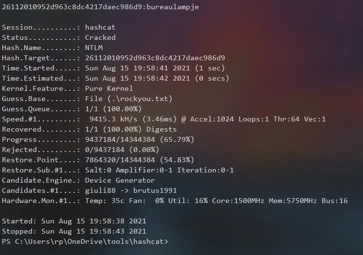

## Overview

Bastion is a Windows Server 2016 box running OpenSSH and SMB. The Backups share was accessible anonymously which allowed access to a Windows backup file where the L4mpje account password was recovered from the SAM database. The account was used to log onto the box via SSH for initial foothold. An older version of mRemoteNG using weak encryption in the confCons.xml file lead to administrator credentials which was used to log on via SSH and own the box.

## Enumeration

**Software**

* Windows 2016 Standard 14393
* OpenSSH 7.9 (Windows)
* mRemoteNG 1.76.11

**Port Scan**

```
nmap -vv --reason -Pn -sT -A --osscan-guess -p- -oN results/10.10.10.134/scans/_full_tcp_nmap.txt 
```

* 22/tcp - OpenSSH for_Windows_7.9
* 135/tcp - Windows RPC
* 139/tcp - Netbios
* 445/tcp - Microsoft-ds
* 5985/tcp - WinRM
* 4700/tcp - Microsoft HTTPAPI httpd 2.0
* 49664-70 - Windows RPC

**SMB**

```
smbclient -L //10.10.10.134
```


## Steps (User)

The scan shows the usual open windows ports with the exception of port 22, which is unusual to see on a Windows box. Since I didn't yet have credentials I took a note of the version and moved on to SMB to see what kind of access I have. Turns out I can access the Backup folder anonymously. 

I poked around on the share and came across notes.txt which contained the message:  

> Sysadmins: please don't transfer the entire backup file locally, the VPN to the subsidiary office is too slow.

Ok interesting... is that a hint that this could be a rabbit hole or do the backups contain useful information. Only one way to find out... I navigated to the WindowsImageBackup folder and worked my way to a folder called "Backup 2019-02-22 124351", which contained some VHD files.


I needed to download all these files, there's a couple ways to do this. I could mount the share to a local folder and copy the files out, or just download them all with smbclient.  I decided to do the latter, and I learned that the following commands allow files to be downloaded recursively.

```bash
mask ""
recurse ON
prompt OFF
cd 'path\to\backups'
lcd '/path/to/local/folder'
mget *
```

Once the files were downloaded, I mounted the VHDs using the guestmount utility. The first VHD (the one that starts with 9b9cfbc3) contained boot loader files so I moved onto the second VHD.

```
sudo guestmount --add 9b9cfbc4-369e-11e9-a17c-806e6f6e6963.vhd --ro /mnt/vhd2/ -m /dev/sda1
```

The first place I went after mounting the VHD was the C:\Users folder but I didn't find anything interesting.  Since I had full access to the virtual disk I decided to take a crack at the SAM database thinking that if I was able to recover the password maybe I could use it to log in. I browsed to Windows\System32\Config, grabbed the SAM and SYSTEM and copied them back to my working directory. Fired up samdump2 and pointed it to the SYSTEM and SAM files.


> I learned that as of Windows NT 4.0 Microsoft added an extra layer of security to the SAM database by encrypting the hashes with a key. The key (called syskey) is stored in the SYSTEM file and is exatracted by samdump2 to decrypt the hashes.

I copied the hash over to my physical box and used hashcat and the rockyou password list to crack the hash. Password: bureaulampje

```
.\hashcat.exe -m 1000 .\hash.txt .\rockyou.txt
```



Another way to do this is by using Impacket's secretsdump.py. This tool has the added benefit of also dumping the password. This requires having the SECURITY hive file in addition to SAM and SYSTEM.

```
~/tools/impacket/examples/secretsdump.py -sam SAM -system SYSTEM -security SECURITY LOCAL
```


The host was listening on port 22, so I tried SSHing in with L4mpje:bureaulampje and it worked. Browsing to the usual location I was able to get the user flag. 

```
ssh L4mpje@10.10.10.134
```


## Steps (root/system)

I typically start by browsing the file system and checking to see which apps are installed. One caught my eye, mRemoteNG...I'm familiar with mRemoteNG from my sysadmin days, it supports logging in with all sorts of protocols (ssh, rdp, etc) and provides a tabbed interface for switching between multiple open connections. Another feature of this application is that it allows for usernames and passwords to be saved. Looking at the C:\Program Files (x86)\mRemoteNG\Changelog.txt, I was able to determine that the version was 1.76.11.


Searchsploit didn't have anything for mRemote so I did an internet search and found some forum posts discussing the weakness of the encryption used for older version of mRemoteNG. With that useful bit of information I decided to try and find the password file to see if any passwords had been saved. There I found a hash for the administrator account.

```
cd %appdata%\mRemoteNG\confCons.xml
```


I did another search to see if there were any tools that could decrypt the hash and found one called mRemote-Decrypt.git

> https://github.com/haseebT/mRemoteNG-Decrypt.git

I cloned the repo to my working folder, pasted in the hash, and succesfully recovered the password: thXLHM96BeKl0ER2

```
./mremoteng_decrypt.py -s aEWNFV5uGcjUHF0uS17QTdT9kVqtKCPeoC0Nw5dmaPFjNQ2kt/zO5xDqE4HdVmHAowVRdC7emf7lWWA10dQKiw==
```


With this information I was now able to authenticate as administrator via SSH and get the root flag. 


