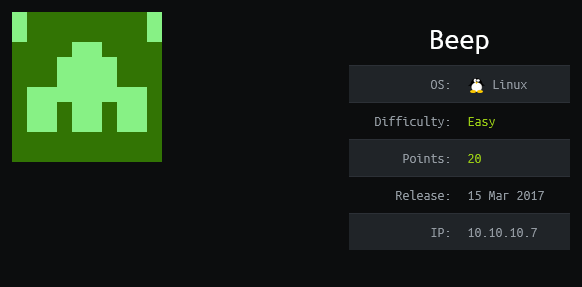

## Overview

Beep is a CentOS box running [Elastix](https://www.elastix.org/) which according to wikipedia "...is an unified communications server software that brings together IP PBX, email, IM, faxing and collaboration functionality. It has a Web interface and includes capabilities such as a call center software with predictive dialing." Elastix is vulnerable to LFI which exposed a password for vTiger CRM. Once logged in a php file was uploaded by bypassing upload restrictions resulting in a reverse shell as user astrisk. The asterisk user is allowed to run nmap as root and was exploited to get a root shell.

## Enumeration

**Software**

* CentOS 5.6 (final)
* Apache 2.2.3
* Elastix 2.5
* FreePBX 2.8.1.4 
* FreePBX 2.5
* fpdf 1.6
* vtigert CRM 5.1.0

**Open Ports**

```
nmap -vv 10.10.10.7 -Pn -sT -A -p- 10.10.10.7 -oN /mnt/data/boxes/beep/_full_tcp_nmap.txt
```

* 22/tcp - OpenSSH 4.3 (protocol 2.0)                                                                                                         
* 25/tcp - Postfix smtpd                                                                                                                      
* 80/tcp - Apache httpd 2.2.3                                                                                                                 
* 110/tcp - pop3d 2.3.7-Invoca-RPM-2.3.7-7.el5_6.4                                                                                       
* 111/tcp - rpcbind (RPC #100000)                                                                                                                    
* 143/tcp - Cyrus imapd 2.3.7-Invoca-RPM-2.3.7-7.el5_6.4                
* 443/tcp - https
* 878/tcp - rpcbind (RPC #100024)                                                                                                                    
* 993/tcp - Cyrus imapd                                                                                                                        
* 995/tcp - Cyrus pop3d
* 3306/tcp - MySQL (unauthorized)
* 4190/tcp - Cyrus timsieved 2.3.7-Invoca-RPM-2.3.7-7.el5_6.4 (included w/cyrus imap)
* 4445/tcp - upnotifyp?
* 4559/tcp - HylaFAX 4.3.10
* 5038/tcp - Asterisk Call Manager 1.1
* 10000/tcp - MiniServ 1.570 (Webmin httpd)

**Directory/File Brute Force**

```
gobuster dir -k --wildcard -s "200,204,301,307,401,403" -u https://10.10.10.7 -w /usr/share/wordlists/dirbuster/directory-list-2.3-medium.txt -x php,html -t 40
```

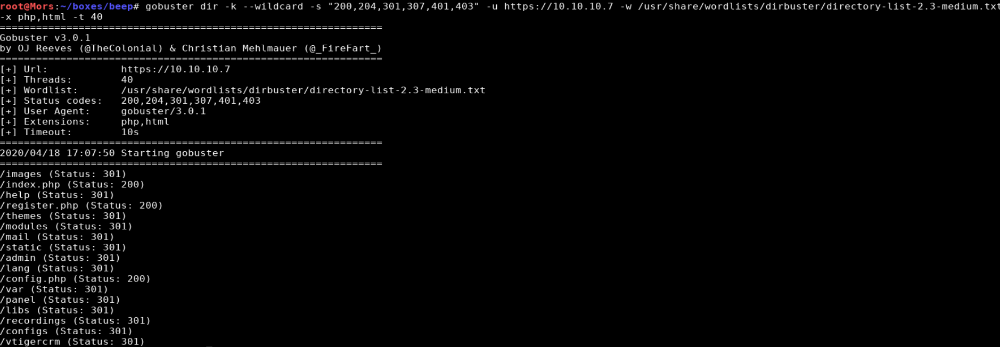

* /images - various image files
* /index.php - Elastic (main page)
* /help - A bunch of help pages 
* /register.php - redirects to the main Elastix page
* /themes - listing of themes for Elastix
* /modules - modules folder 
* /mail - Roundcube webmail logon page
* /static - .htm files, fax, instant messaging, softphones
* /admin - FreePBX 2.8.1.4 administrator site (prompted for username/password)
* /lang - language files
* /config.php - redirects to the main Elastix page
* /var - mostly blank directory listing
* /panel - blank page / source shows Flash Administrator Panel 
* /libs - directory listing. Lots of .php files
  * /libs/fpdf/histo.htm - fpdf v1.6
* /recordings - FreePBX 2.5 logon page
* /configs - a few php files
* /vtigercrm - vTiger CRM 5.1.0 logon page


## Steps (User)

Gobuster generated a lot of results. To avoid going into a rabbit hole I browsed to each and took notes about any software and files and folders were present.

Starting with Elastix, I ran a search against searchsploit and found a handful of vulnerabilities. 

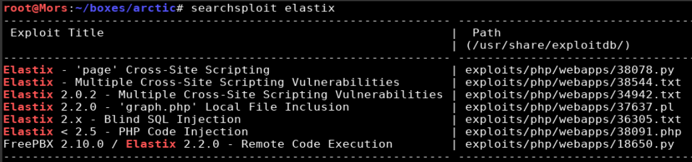

I looked through each of the vulnerabilities and decided to go with 37637 as it referenced vTiger CRM which was interesting because it showed up in the gobuster results.

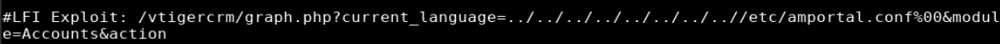

```
searchsploit -x 37637
```

I was able to confirm that the website was vulnerable to LFI by copying the URL, updating it to reflect the target's IP, and plugging it into my web browser. 

https://10.10.10.7/vtigercrm/graph.php?current_language=../../../../../../../..//etc/amportal.conf%00&module=Accounts&action

> Note: viewing the source allows for a more readable format

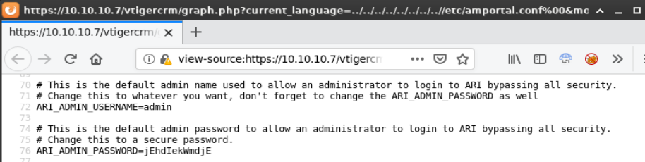

```
admin/jEhdIekWmdjE
```

Using the password found in the LFI, I was able to log into /vtigercrm.

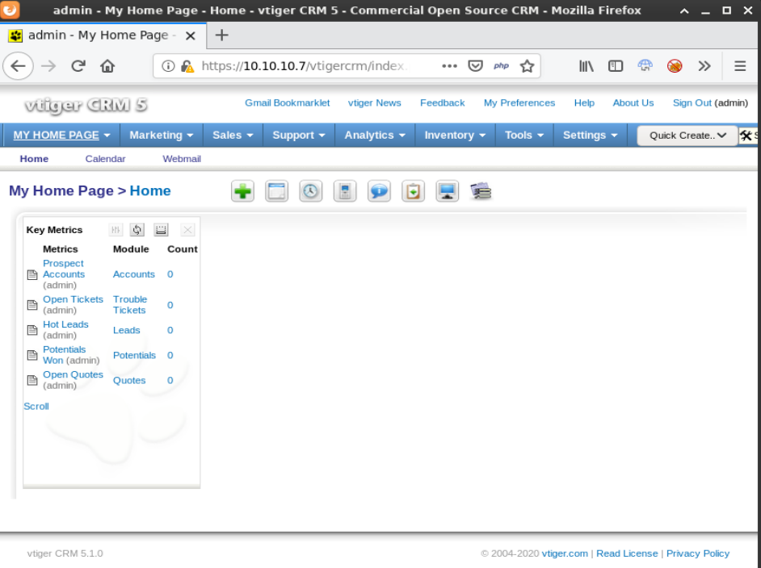

Doing some research on vTiger CRM I determined that it was possible to get [RCE](https://www.rapid7.com/db/modules/exploit/multi/http/vtiger_logo_upload_exec) by abusing the company logo upload functionality. By using burp to bypass upload restrictions I was able to upload a php file and create a reverse shell. 

I started a netcat listener (nc -lvnp 4200) and copied a php reverse shell to my working directory and added ;.jpg

```
cp ~/tools/webshells/php/php-reverse-shell.php 'rshell.php;.jpg' 
```

The following steps were required to upload rshell.php;.jpg:

* open Burp and enable the proxy in your web browser
* On the vtiger website click vTiger click **settings | settings | company details | edit**
* click **browse | select rshell.php;.jpg | save**
* Intercept with burp and rename file to rshell.php in two places | click forward

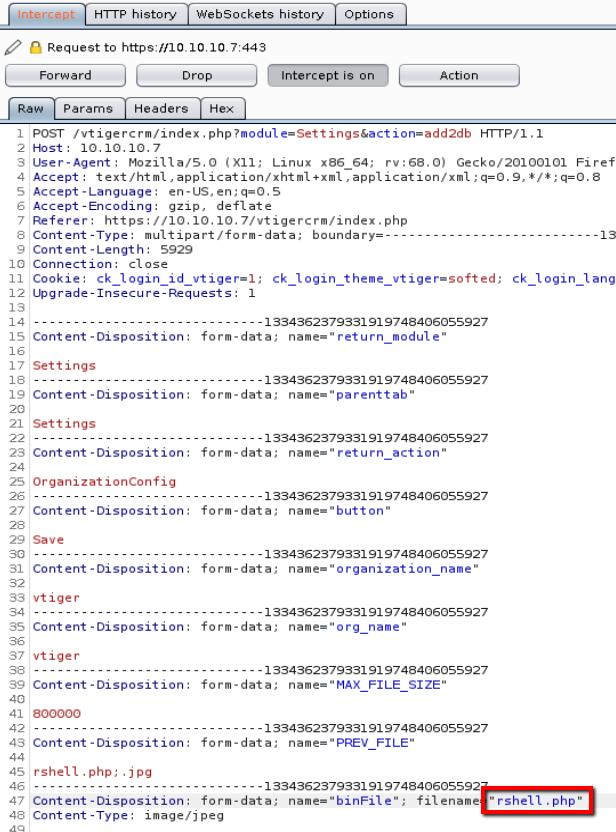

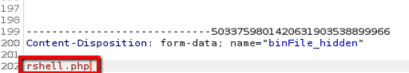

I confirmed that the file was uploaded and then executed rshell.php

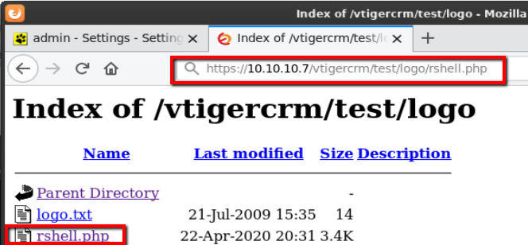

```
https://10.10.10.7/vtigercrm/test/logo/rshell.php
```

I received a callback and now had a shell as user "asterisk"

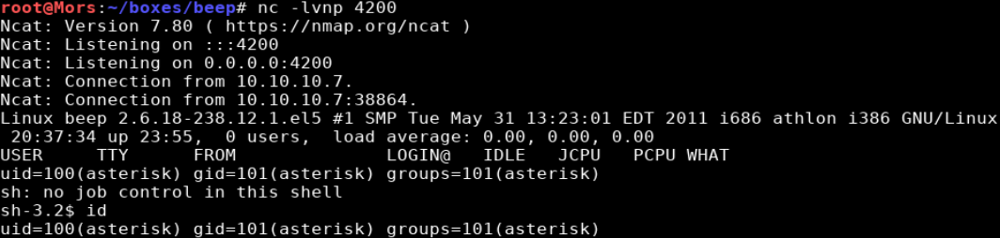

## Steps (root/system)

One of the first things I do is run sudo -l which lists the allowed commands for the user. The output of this command showed that asterisk could run nmap as root

> [sudo](https://linux.die.net/man/8/sudo) allows a permitted user to execute a command as the superuser or another user, as specified by the security policy.

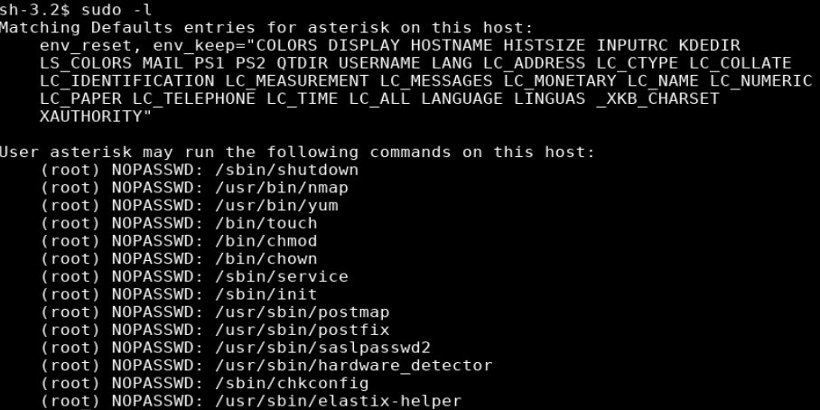

Looking up nmap on GTFObins showed that I can run a shell from within nmap if run with --interactive. Running this command gave me a shell as root.

> [GTFOBins](https://gtfobins.github.io) is a good resource to check for privilege escalation exploits

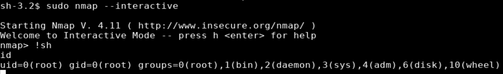


