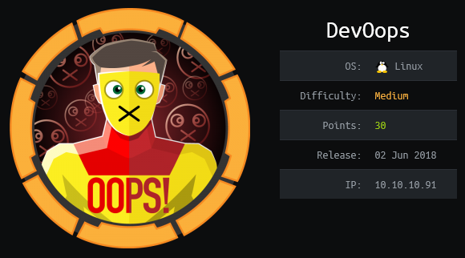
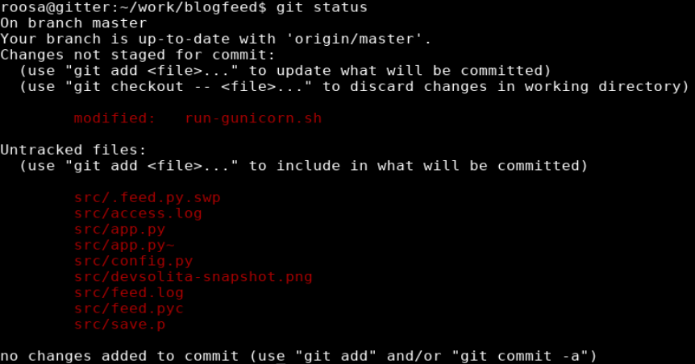

## Overview

Devoops is an Ubuntu box running Gunicorn that was vulnerable to an XXE (XML External Entity) attack which lead to the disclosure of roosa's private ssh key. Using this key I was able to log in via ssh as roosa. While browsing Roosa's home folder I came across a local git repo which contained the ssh private key for root in the commit history which was used to ssh into the box as root.

## Enumeration

**Software**
* Ubuntu 16.04.4 LTS
* OpenSSH 7.2p2 Ubuntu 4ubuntu2.4
* Gunicorn 19.7.1
* git version 2.7.4

**Port Scan**
```
nmap -vv -Pn -sT -A --osscan-guess -p- -oN /mnt/data/boxes/devoops/_full_tcp_nmap.txt
```
* 22/tcp - ssh
* 5000/tcp - http

**Directory/File Brute Force**
```
gobuster dir -u http://10.10.10.91:5000 -w /usr/share/wordlists/dirbuster/directory-list-2.3-small.txt -t 30
```
* /upload
* /feed

## Steps (user)

The nmap results came back with two ports: 22 (ssh) and 5000 which I was not familiar with. The scan listed port 5000 as an http server running Gunicorn. I did a quick search and determined that [Gunicorn](https://gunicorn.org/) "...is a Python WSGI HTTP Server for UNIX" 

Browsing to http://10.10.10.91:5000 shows an Under Construction page and with mention of an application called BlogFeeder.


Browsing to http://10.10.10.91:5000/feed just showed the image from the main page but http://10.10.10.91:5000/upload showed an upload form which was much more useful. 


The title of the page was "Send feed with XML" and referenced the XML Elements "Author, Subject, Content". This hinted that XML files could be uploaded. I did an internet search to confirm the [basic structure of the XML file](https://www.w3schools.com/xml/xml_elements.asp). I created a file with the XML elements mentioned on the page and saved it as test.xml

```
<test>
  <Author>author</Author>
  <Subject>subject</Subject>
  <Content>content</Content>
</test> 
```
After test.xml was uploaded I received a "Processed Blogpost" message which was encouraging.


Doing some research on XML exploits I came across an OWASP article explaining [XML External Entity (XXE) Processing](https://owasp.org/www-community/vulnerabilities/XML_External_Entity_(XXE)_Processing). I updated the test.xml file to include the sample code for disclosing targeted files. 

```
<?xml version="1.0" encoding="ISO-8859-1"?>
<!DOCTYPE foo [
  <!ELEMENT foo ANY >
  <!ENTITY xxe SYSTEM "file:///etc/passwd" >]>

<test>
  <Author>&xxe;</Author>
  <Subject>subject</Subject>
  <Content>content</Content>
</test
```

After uploading the updated test.xml file I was able to successfully read /etc/passwd. This also implied that I could arbitrarily read other files this account had access to.


Reviewing the entries in the /etc/passwd file showed an account named roosa. I also saw this user's home folder path referenced after each successful XML upload.

```
Content: content URL for later reference: /uploads/test.xml File path: /home/roosa/deploy/src
```

I modified test.xml again to check for an ssh private key in Roosa's home folder and she did.

```
<?xml version="1.0" encoding="ISO-8859-1"?>
<!DOCTYPE foo [
  <!ELEMENT foo ANY >
  <!ENTITY xxe SYSTEM "file:///home/roosa/.ssh/id_rsa" >]>

<test>
  <Author>&xxe;</Author>
  <Subject>subject</Subject>
  <Content>content</Content>
</test
```


I copied the part of the output pertaining to the private key, pasted it to a file on my local system called id_rsa, and ran chmod to set the correct permissions.

```
chmod 600 id_rsa
```

I was then able to use the private key to ssh into the system as roosa.

```
ssh -i id_rsa roosa@10.10.10.91
```


## Steps (root/system)

While browsing roosa's home folder I came across /work/blogfeed which caught my attention because the name was referenced on the main page of the website.  Inside this folder was another folder called .git which is the "directory at the root of the working tree" according to the [gitrepository documentation](https://git-scm.com/docs/gitrepository-layout).


As a test I ran 'git status' and recieved the following output:



I then ran git log -p to review previous commits. Reviewing the information shows the comment "reverted accidental commit with proper key" followed by the key that was removed.


Following the same procedure as before; I copied the 'removed' private key to a file called id_rsa2, set the correct permissions, and attempted log in with root using the new private key.

```
ssh -i id_rsa2 root@10.10.10.91
```

login was successful


