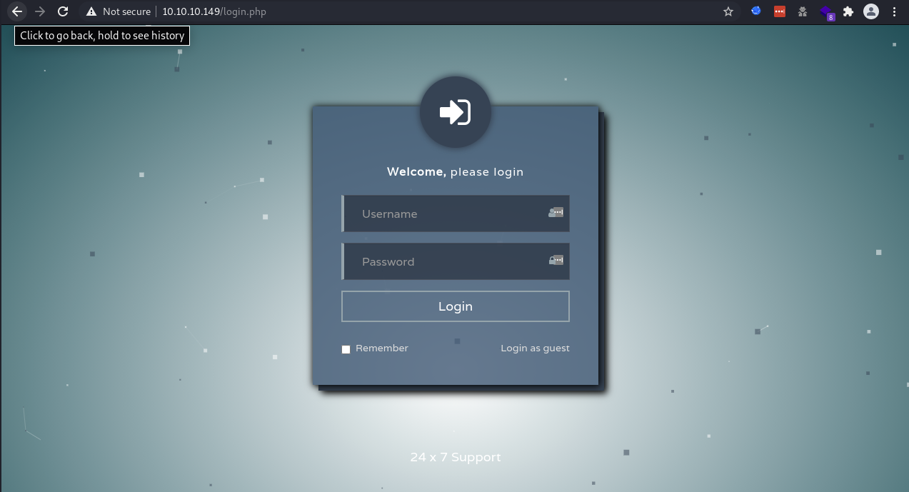
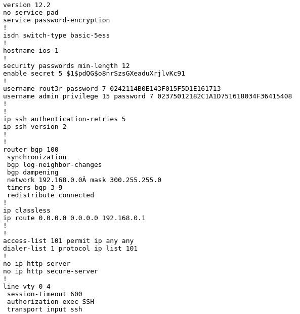
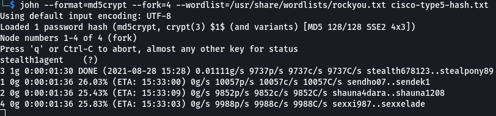
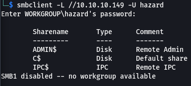
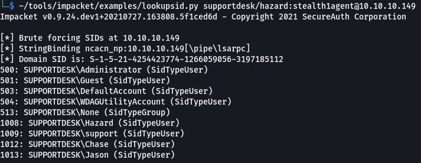
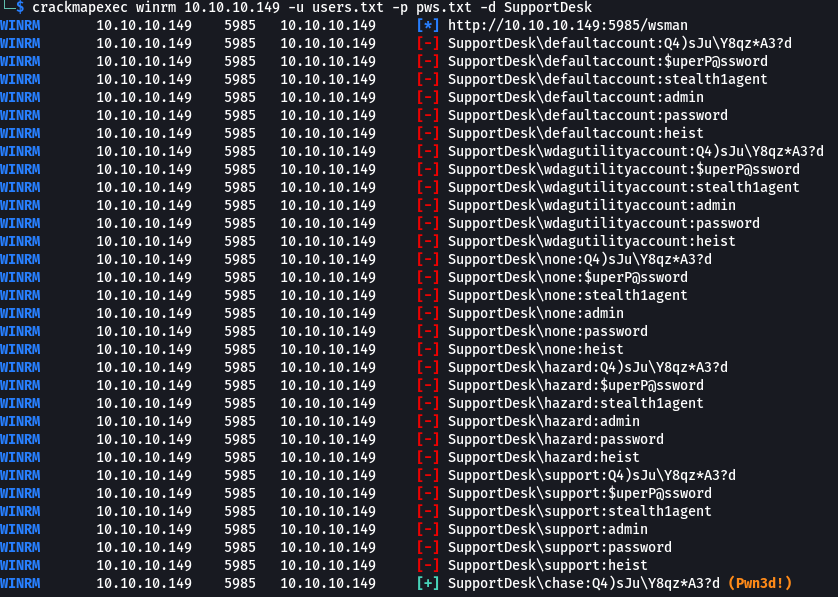
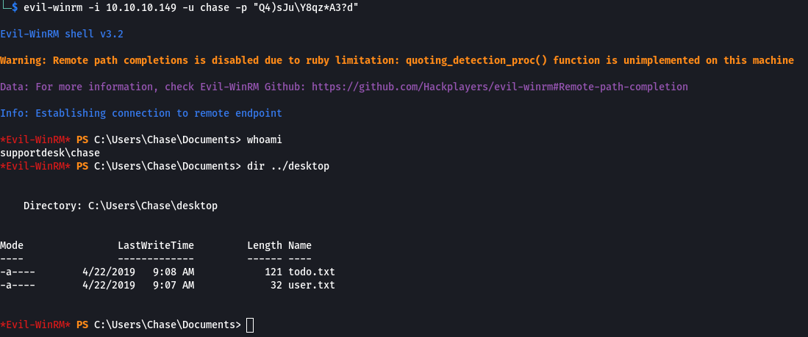
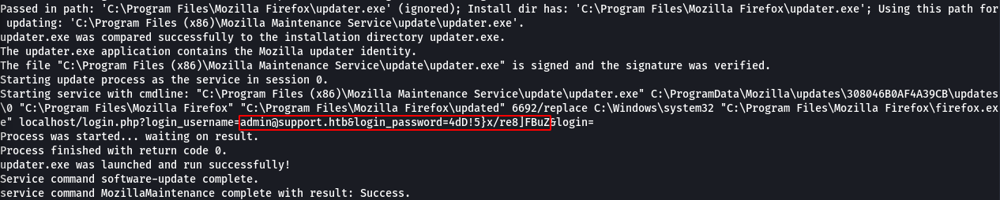
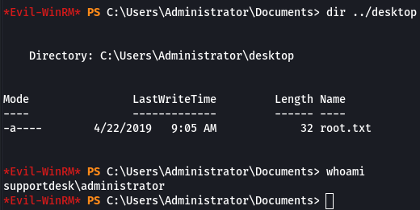

## Overview

Heist is a Windows 10 box running IIS 10.0 hosting a SupportDesk website. The website allowed guests to log in and view issues. Hazard posted an issue with an attached cisco configuration file that had easily crackable passwords. After enumerating the other users on the box using Impacket's lookupsid.py, CrackMapExec was used to try all recovered passwords against all found usernames which lead to the initial foothold (using WinRM) as Chase. Administrator access was gained by finding a log file that exposed the password for admin@support.htb which was reused on the administrator account.

## Enumeration

**Software**

* Windows 10 Build 17763

* IIS 10.0

* PHP 7.3.1

* Mozilla Firefox 72.0.2

**Open Ports**

```
nmap -vv --reason -Pn -sT -A --osscan-guess -p- -oN results/10.10.10.149/scans/_full_tcp_nmap.txt
```

* 80/tcp - http
* 135/tcp - Windows RPC
* 445/tcp - SMB
* 5985/tcp - WinRM
* 49669/tcp Windows RPC

**File/folder brute force**

```
gobuster dir -u http://10.10.10.149 -w /usr/share/wordlists/dirbuster/directory-list-2.3-medium.txt -t 30 -x php,html 
```

* /images
* /index.php
* /login.php
* /issues.php
* /css
* /js
* /attachments

## Steps (User)

After reviewing the nmap results I decided to start with viewing the web page. I loaded it up and was brought to a log in page. I tried a few of the obvious username and password combinations but none of them worked. 



I clicked "Login as guest" and was brougt to an issues page where a user named Hazard was describing an issue with his router and attached his configuration.



There were 3 passwords total in the config; two Cisco Type 7s, and the enable secret password (Cisco Type 5) which is used for restricting access to the global configuration mode of a router. A more in depth description can be found [here](https://www.oreilly.com/library/view/hardening-cisco-routers/0596001665/ch04.html).

* Enable Secret - Cisco Type 5

* rout3r - Cisco Type 7

* admin - Cisco Type 7

I did a search for tools that could decrypt Cisco type 7 and came across ciscot7.py which got the job done.

```
./ciscot7.py -d -p 0242114B0E143F015F5D1E161713                     
Decrypted password: $uperP@ssword

./ciscot7.py -d -p 02375012182C1A1D751618034F36415408
Decrypted password: Q4)sJu\Y8qz*A3?d
```

Next was the enable secret password, this time I used john the ripper which was able to recover the password pretty quickly. stealth1agent

```
john --format=md5crypt --fork=4 --wordlist=/usr/share/wordlists/rockyou.txt cisco-type5-hash.txt
```



I tried a few different combinations with smbclient and found one that was able to authenticate, hazard:stealth1agent, but this account didn't have access to any of the shares. I also tried that username/password combination with WinRM with no success.



I decided to use impacket's lookupsid to see if I could enumerate any other accounts and I found quite a fiew. 



I copied all the new usernames into user.txt, the existing cisco passwords into pass.txt, and used them with CrackMapExec to try different combinations against WinRM. I got a hit on chase's account with the enable secret password. chase:Q4)sJu\Y8qz*A3?d



I was then able to use the credentials with evil-winrm to get a shell and the user flag.

```
evil-winrm -i 10.10.10.149 -u chase -p "Q4)sJu\Y8qz*A3?d"
```



## Steps (root/system)

After a lot of enumeration and a bunch of dead ends, I stumbled across some credentials in C:\Program Files (x86)\Mozilla Maintenance Service\logs\maintenanceservice.log for the admin user. It appears the password was used in the command line used to start the service.



I tried the password on the login page for the website with no luck but did have some success again with WinRM when I used that password in combination with the administrator account which gave me the root flag.

```
evil-winrm -i 10.10.10.149 -u administrator -p '4dD!5}x/re8]FBuZ'
```


