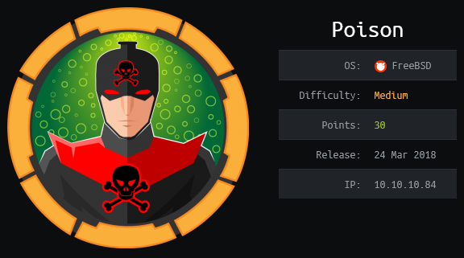

## Overview

Poison is a FreeBSD box running an Apache webserver that allows users to view php files. One of the php files listed the contents of the current directory exposed a base64 encoded password string that was encoded 13 times. The box was also vulnerable to local file inclusion which allowed me to view /etc/passwd to get a list of valid accounts. Once the password was decoded I was able to connect as user charix via ssh. Charix's home folder contained a zip file that was password protected with the same password as his user account. The extracted file was used to authenticate to vnc and log onto the console as root.

## Enumeration

**Software**

* FreeBSD 11.1-RELEASE #0 r321309
* Apache/2.4.29 (FreeBSD) PHP/5.6.32 
* PHP 5.6.32
* TightVNC-1.3.10
* sendmail 8.15.2

**Port Scan**

```
nmap -vv -Pn -sT -A -p- 10.10.10.84 -oN /mnt/data/boxes/poison/_full_tcp_nmap.txt
```

* 22/tcp - ssh
* 80/tcp - http

**Gobuster**

```
gobuster dir -u http://10.10.10.84 -w /usr/share/wordlists/dirbuster/directory-list-2.3-small.txt -t 40 -x php,html,txt
```

* /info.php
* /index.php
* /browse.php

## Steps (user)

I started by browsing to http://10.10.10.84/ which brought me to a website that "tests" local .php scripts.

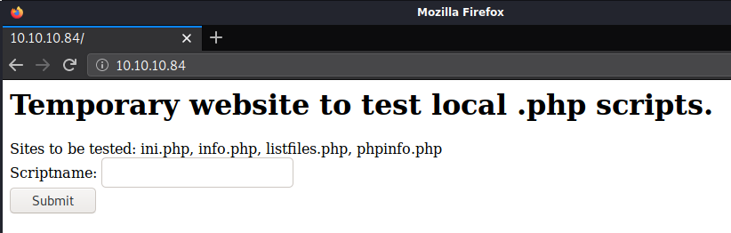

The page listed sites to be tested and had a text box to type in the name of the file to display in the browser. Doing so uses browse.php with a file parameter that includes the specified file.

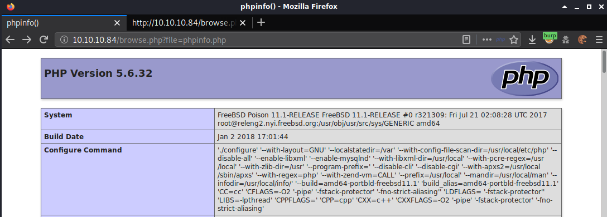

Browsing to http://10.10.10.84/browse.php?file=listfiles.php lists the files in the current directory, of interest is pwdbackup.txt

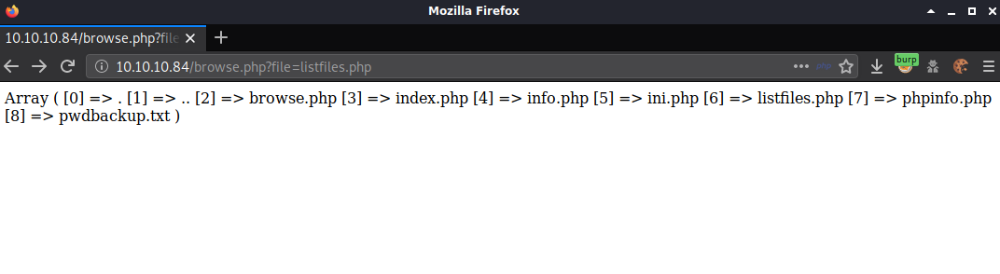

Changing the parameter to pwdbackup.txt shows the message "This password is secure, it's encoded atleast 13 times.. what could go wrong really.." followed by a string of what looked like base64.

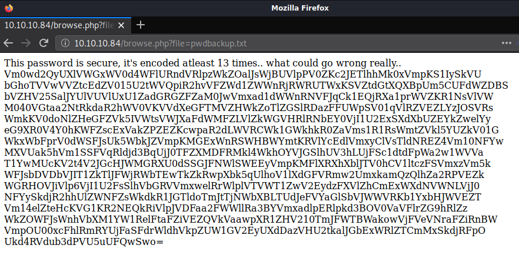

I created a bash script that took the filename and number of iterations as parameters and printed the result.

```sh
#!/bin/bash

## Base64 decodes a string x number of times

if [ "$#" -ne 2 ]; then
    echo "Base64 Decoder"
    echo "Usage:$basename "$0" <filename> <iterations>"
    exit 0
fi

file=`cat $1`

echo "Trying decode $2 times..."

for i in `seq 1 $2`
    do
        file=`echo "$file" | base64 -d`
    done

echo $file
```

I ran the script with string.txt (which contained the base64 string) with 13 iterations and it returned 'Charix!2#4%6&8(0'

```
./decode.sh string.txt 13
```

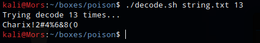

I tested for LFI by trying '/../../../etc/password' for the file parameter and it worked. I could see the list of users on the system and I took note of 'Charix'.

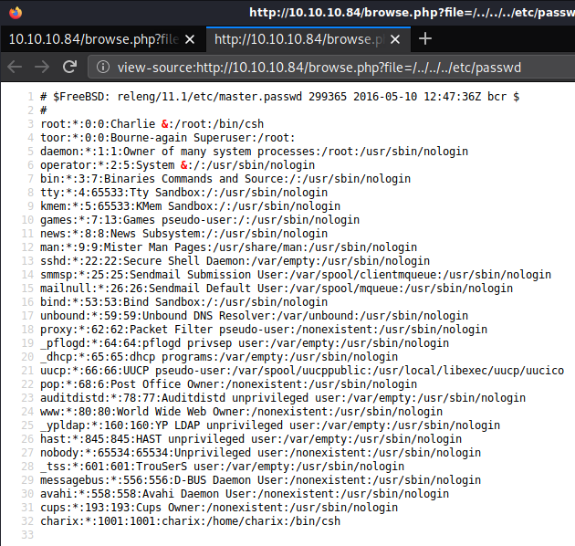

Putting two and two together (the username and the password that contained the username) I was able to log as charix via ssh

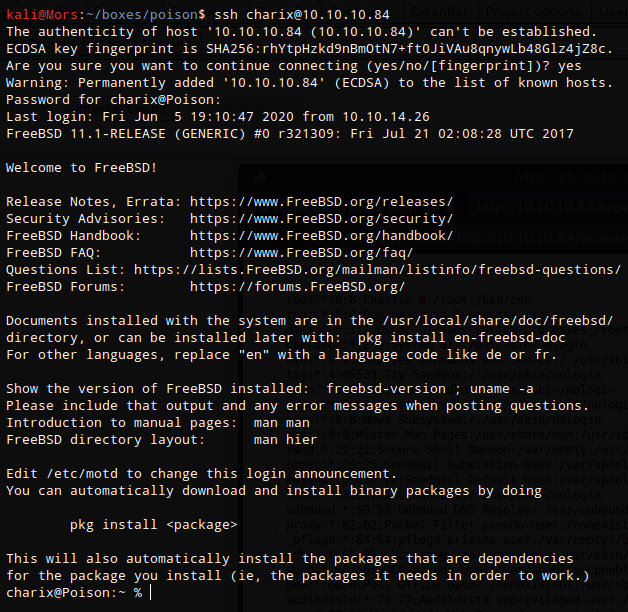

## Steps (root/system)

In charix's home folder there is a file called secrets. I copied it to my local machine to take a look at it.

```
scp charix@10.10.10.84:/home/charix/secret.zip .
```

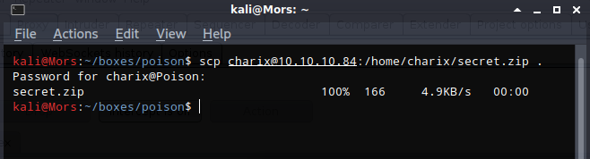

I unzipped with Charix's password

```
7z x secret.zip
```

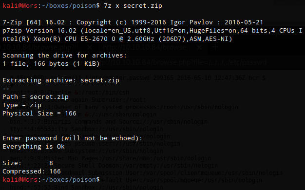

At this point I wasn't sure what the file was other than what the name suggested. Running the file command on 'secret' said it was 'Non-ISO extended-ASCII text, with no line terminators' and running other tools like enca and xxd didn't provide any other useful information so I moved on.

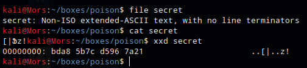

I continued looking around on the box and found an unusual xvnc process. 

> VNC is remote access tool used to view and operate the console of another computer. 

```
ps auxww | grep root
```

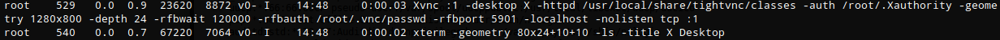

```
Xvnc :1 -desktop X -httpd /usr/local/share/tightvnc/classes -auth /root/.Xauthority -geometry 1280x800 -depth 24 -rfbwait 120000 -rfbauth /root/.vnc/passwd -rfbport 5901 -localhost -nolisten tcp :1
```

Command Breakdown: 
| command| description |
|--------|-------------|
| :1 | Port 5901 (5900+1) 
| -desktop | name of the desktop |
| -httpd | runs a mini-HTTP server which serves files from the given directory |
| -auth | authorization file |
| -rfbwait | time in milliseconds to wait for a viewer which is blocking Xvnc |
| -rfbauth | specifies a file containing the password used to authenticate viewers |
| -rfbport | specifies the TCP port on which Xvnc listens for connections from viewers (the protocol used in VNC is called RFB - "remote framebuffer").|
| -localhost | only allow connections from the same machine |
| -nolisten | dont listen on protocol |

In order to connect to vnc on the remote box I had to set up a local port forward. Because the -localhost parameter is set xvnc will only allow connections from the same machine. To get around this I forwarded the port through ssh to my box where I could connect to it.

```
ssh -L 5901:localhost:5901 charix@10.10.10.84
```

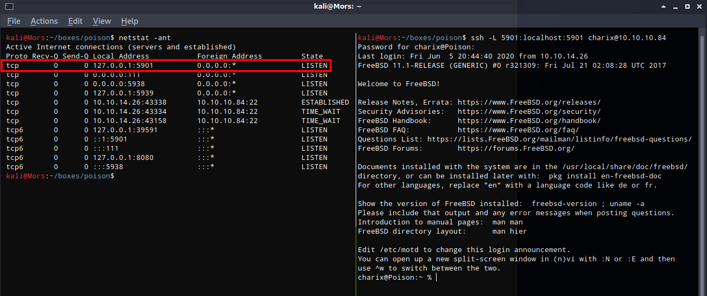

I tried connecting to vncviewer and typing in Charix's password but it didn't work.

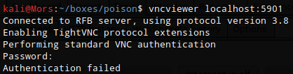

Looking again at the command that was shown in the ps output, I noticed the argument -rfbauth (remote framebuffer auth) was pointing to a file. Looking at the manual for vncviewer (man vncviewer) I found a parameter for a password file

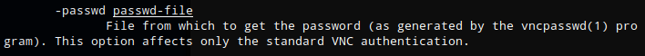

Running the command,specifying localhost and port that was forwarded earlier, and -passwd secret allowed me to successfully connect to the console as the root user.

```
vncviewer localhost:5901 -passwd secret
```

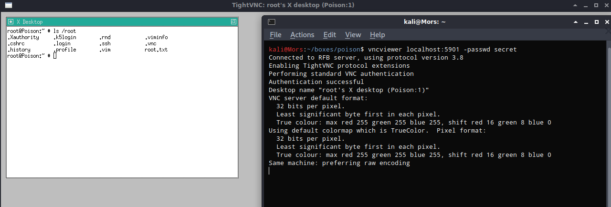
