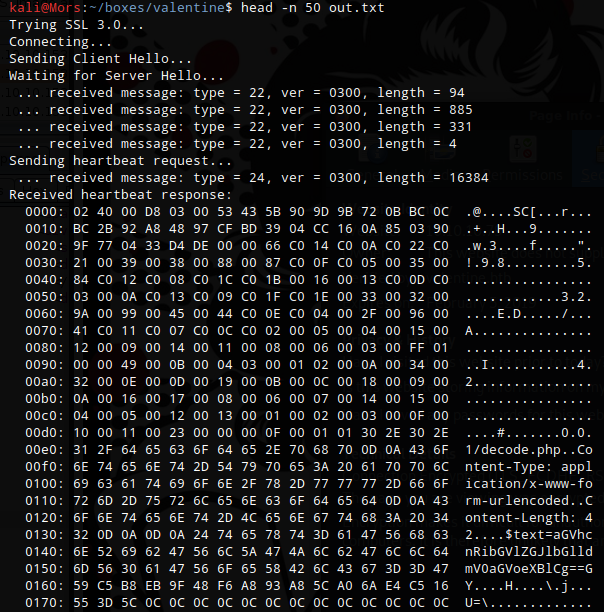

## Overview

Valentine is an ubuntu box that was vulnerable to the heartbleed vulnerability. I found a page full of hex and when converted to ascii ended up being a password protected rsa private key. Leveraging the heartbleed vulnerability I was able to pull a base64 string from the servers memory which when decoded was the password for the private key. With that I was able to log on to the server as user hype and attach to a tmux session to gain root.

## Enumeration

**Software**

* Ubuntu 12.04 LTS
* Openssl 1.0.1
* Apache 2.2.22

**Port Scan**

```
nmap -A -sT -v -p- 10.10.10.79 -oN ~/boxes/valentine/_full_nmap_tcp.txt
```

* 22/tcp - ssh
* 80/tcp - http
* 443/tcp - https

**gobuster**

```
gobuster dir -u http://10.10.10.79 -w /usr/share/wordlists/dirbuster/directory-list-2.3-small.txt -t 40 -x php,html
```

* /index (Status: 200)                                                                                                                                                      
* /index.php (Status: 200)                                                                                                                                                  
* /dev (Status: 301)                                                                                                                                                        
* /encode (Status: 200)                                                                                                                                                     
* /encode.php (Status: 200)                                                                                                                                                 
* /decode (Status: 200)                                                                                                                                                     
* /decode.php (Status: 200)
* /omg (Status: 200)
* /server-status (Status: 403)

## Steps (user)

I started by browsing to http://10.10.10.79 and was brought to page showing a woman and the heartbleed logo.


Browsing to the https version of the site shows the same thing


Browsing to http://10.10.10.19/dev shows two files, a note and a bunch of what looks like hex.


Using wget I downloaded the file 'hype_key'

```
wget http://10.10.10.79/dev/hype_key
```

xxd was used on hype_key to convert hex to ascii. The result was an rsa key. I ran the command again and output to id_sa

```
cat hype_key | xxd -r -p > id_rsa
```

A search in searchsploit for heartbleed showed the following:


I decided to go with 32764.py which exploits the heartbleed flaw to pull data from memory. After a few tries I noticed some base64 in the output. 



Browsing over to decode.php, I copied in the base64 and it very helpfully decoded the text. The result was 'heartbleedbelievethehype'


Now that I had a password I tested it out on the rsa key by using it to try and decrypt the id_rsa file and was successful.

```
openssl rsa -in id_rsa -out id_rsa2
```

I was then able to use the private key to ssh into box using account "hype"


## Steps (root/system)

After some enumeration of Hype's home directory I found that the .bash_history file contained a tmux command. After looking the command up I learned that the -S parameter can be used to specify a full alternative path to the server socket.

```
tmux -S /.devs/dev_sess
```

I was able to attach to the tmux session which was logged on as root.


